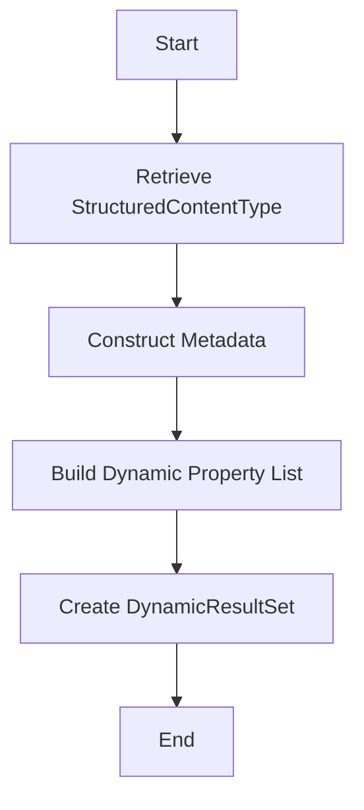

This document will cover the process of inspecting a PersistencePackage, which includes:

1. Retrieving the StructuredContentType
2. Constructing metadata
3. Building a dynamic property list
4. Creating a DynamicResultSet.

Technical document: <SwmLink doc-title="Inspecting a PersistencePackage">[Inspecting a PersistencePackage](/.swm/inspecting-a-persistencepackage.rxqete0y.sw.md)</SwmLink>

# [Retrieving the StructuredContentType](https://app.swimm.io/repos/Z2l0aHViJTNBJTNBQnJvYWRsZWFmQ29tbWVyY2UtZGVtby1uZXclM0ElM0FTd2ltbS1EZW1v/docs/rxqete0y#inspect)

The process begins by retrieving the StructuredContentType based on the provided ID from the PersistencePackage. This step is crucial because the StructuredContentType defines the structure and fields of the content that will be inspected. By obtaining this type, we ensure that the subsequent steps have the necessary context and structure to work with.

# [Constructing Metadata](https://app.swimm.io/repos/Z2l0aHViJTNBJTNBQnJvYWRsZWFmQ29tbWVyY2UtZGVtby1uZXclM0ElM0FTd2ltbS1EZW1v/docs/rxqete0y#inspect)

Once the StructuredContentType is retrieved, the next step is to construct metadata. Metadata provides detailed information about the fields and properties of the StructuredContentType. This includes setting the ceiling type, which indicates the highest-level class in the hierarchy, and defining polymorphic entities, which are different variations of the StructuredContentType. This metadata is essential for understanding the structure and relationships of the content being inspected.

# [Building a Dynamic Property List](https://app.swimm.io/repos/Z2l0aHViJTNBJTNBQnJvYWRsZWFmQ29tbWVyY2UtZGVtby1uZXclM0ElM0FTd2ltbS1EZW1v/docs/rxqete0y#builddynamicpropertylist)

The next step involves building a dynamic property list. This list is constructed based on the field groups defined in the StructuredContentType. Each field group contains multiple field definitions, which are used to create properties. These properties are dynamic because they can change based on the field definitions. The dynamic property list is crucial for creating a flexible and adaptable structure that can accommodate various types of content.

# [Creating a DynamicResultSet](https://app.swimm.io/repos/Z2l0aHViJTNBJTNBQnJvYWRsZWFmQ29tbWVyY2UtZGVtby1uZXclM0ElM0FTd2ltbS1EZW1v/docs/rxqete0y#inspect)

Finally, the dynamic property list is used to create a DynamicResultSet. The DynamicResultSet is the final output of the inspection process and contains all the metadata and properties constructed in the previous steps. This result set provides a comprehensive view of the content structure and can be used for further processing or display in the user interface.

&nbsp;

*This is an auto-generated document by Swimm AI 🌊 and has not yet been verified by a human*

<SwmMeta version="3.0.0" repo-id="Z2l0aHViJTNBJTNBQnJvYWRsZWFmQ29tbWVyY2UtZGVtby1uZXclM0ElM0FTd2ltbS1EZW1v" repo-name="BroadleafCommerce-demo-new" doc-type="product-flows">Powered by [Swimm](/)</SwmMeta>
