In this document, we will explain the process of inspecting a <SwmToken path="admin/broadleaf-contentmanagement-module/src/main/java/org/broadleafcommerce/cms/admin/server/handler/StructuredContentTypeCustomPersistenceHandler.java" pos="118:7:7" line-data="    public DynamicResultSet inspect(PersistencePackage persistencePackage, DynamicEntityDao dynamicEntityDao, InspectHelper helper) throws ServiceException {">`PersistencePackage`</SwmToken> and returning a <SwmToken path="admin/broadleaf-contentmanagement-module/src/main/java/org/broadleafcommerce/cms/admin/server/handler/StructuredContentTypeCustomPersistenceHandler.java" pos="118:3:3" line-data="    public DynamicResultSet inspect(PersistencePackage persistencePackage, DynamicEntityDao dynamicEntityDao, InspectHelper helper) throws ServiceException {">`DynamicResultSet`</SwmToken>. The process involves several steps, including retrieving the <SwmToken path="admin/broadleaf-contentmanagement-module/src/main/java/org/broadleafcommerce/cms/admin/server/handler/StructuredContentTypeCustomPersistenceHandler.java" pos="122:1:1" line-data="            StructuredContentType structuredContentType = structuredContentService.findStructuredContentTypeById(Long.valueOf(structuredContentTypeId));">`StructuredContentType`</SwmToken>, constructing metadata, and building a dynamic property list.

The flow starts with the <SwmToken path="admin/broadleaf-contentmanagement-module/src/main/java/org/broadleafcommerce/cms/admin/server/handler/StructuredContentTypeCustomPersistenceHandler.java" pos="118:5:5" line-data="    public DynamicResultSet inspect(PersistencePackage persistencePackage, DynamicEntityDao dynamicEntityDao, InspectHelper helper) throws ServiceException {">`inspect`</SwmToken> method, which takes a <SwmToken path="admin/broadleaf-contentmanagement-module/src/main/java/org/broadleafcommerce/cms/admin/server/handler/StructuredContentTypeCustomPersistenceHandler.java" pos="118:7:7" line-data="    public DynamicResultSet inspect(PersistencePackage persistencePackage, DynamicEntityDao dynamicEntityDao, InspectHelper helper) throws ServiceException {">`PersistencePackage`</SwmToken> and retrieves the <SwmToken path="admin/broadleaf-contentmanagement-module/src/main/java/org/broadleafcommerce/cms/admin/server/handler/StructuredContentTypeCustomPersistenceHandler.java" pos="122:1:1" line-data="            StructuredContentType structuredContentType = structuredContentService.findStructuredContentTypeById(Long.valueOf(structuredContentTypeId));">`StructuredContentType`</SwmToken> based on the provided ID. It then constructs metadata and builds a dynamic property list using the <SwmToken path="admin/broadleaf-contentmanagement-module/src/main/java/org/broadleafcommerce/cms/admin/server/handler/StructuredContentTypeCustomPersistenceHandler.java" pos="127:9:9" line-data="            Property[] properties = dynamicFieldUtil.buildDynamicPropertyList(structuredContentType.getStructuredContentFieldTemplate().getFieldGroups(), StructuredContentTypeImpl.class);">`dynamicFieldUtil`</SwmToken>. This list is used to create a <SwmToken path="admin/broadleaf-contentmanagement-module/src/main/java/org/broadleafcommerce/cms/admin/server/handler/StructuredContentTypeCustomPersistenceHandler.java" pos="118:3:3" line-data="    public DynamicResultSet inspect(PersistencePackage persistencePackage, DynamicEntityDao dynamicEntityDao, InspectHelper helper) throws ServiceException {">`DynamicResultSet`</SwmToken>, which is returned as the result of the inspection.

# Flow drill down

```mermaid
graph TD;
      subgraph admin/broadleaf-contentmanagement-module/src/main/java/org/broadleafcommerce/cms/admin/server/handler
e92011540b8ef2476000a83efec65922011be99c75692fd4b3e4aebc08263c40(inspect):::mainFlowStyle --> 509fb5de4cc84f221eec2329dcf050fd604dac729f1f281f8f9bd13b26166aa9(getFieldGroups):::mainFlowStyle
end

subgraph admin/broadleaf-contentmanagement-module/src/main/java/org/broadleafcommerce/cms/admin/server/handler
509fb5de4cc84f221eec2329dcf050fd604dac729f1f281f8f9bd13b26166aa9(getFieldGroups):::mainFlowStyle --> 36360b6282409c6ff71efda7ffcf6c5e665a411b5978a733d847845ce294b16c(add):::mainFlowStyle
end

subgraph admin/broadleaf-contentmanagement-module/src/main/java/org/broadleafcommerce/cms/admin/server/handler
36360b6282409c6ff71efda7ffcf6c5e665a411b5978a733d847845ce294b16c(add):::mainFlowStyle --> 73e08a045f29e25989baee4fc7715bdb102a02a6332fae6179b4da2c166813e0(addOrUpdate):::mainFlowStyle
end

subgraph admin/broadleaf-contentmanagement-module/src/main/java/org/broadleafcommerce/cms/admin/server/handler
73e08a045f29e25989baee4fc7715bdb102a02a6332fae6179b4da2c166813e0(addOrUpdate):::mainFlowStyle --> 45e23c2854c375c1383294d3b0b8fc0ef97ada36571a8a9f1755a7629a683568(buildDynamicPropertyList):::mainFlowStyle
end

subgraph admin/broadleaf-contentmanagement-module/src/main/java/org/broadleafcommerce/cms/admin/server/handler
45e23c2854c375c1383294d3b0b8fc0ef97ada36571a8a9f1755a7629a683568(buildDynamicPropertyList):::mainFlowStyle --> b872e3c77f162623bfd004d1aa1263589d0610f379bb291ab688c2c6d42eed49(constructIdProperty)
end

subgraph admin/broadleaf-contentmanagement-module/src/main/java/org/broadleafcommerce/cms/admin/server/handler
45e23c2854c375c1383294d3b0b8fc0ef97ada36571a8a9f1755a7629a683568(buildDynamicPropertyList):::mainFlowStyle --> 689c054fe4559f5e62d9ce806f069d2b9091d841fd2a5fc4de995bcdbc009c5e(constructPropertiesFromFieldGroup):::mainFlowStyle
end

subgraph admin/broadleaf-contentmanagement-module/src/main/java/org/broadleafcommerce/cms/admin/server/handler
689c054fe4559f5e62d9ce806f069d2b9091d841fd2a5fc4de995bcdbc009c5e(constructPropertiesFromFieldGroup):::mainFlowStyle --> 6363b5de56b25687ab9d9d007d70eaca25204239aafb715b799f3f70bbfe0e9b(buildDynamicProperty):::mainFlowStyle
end


      classDef mainFlowStyle color:#000000,fill:#7CB9F4
classDef rootsStyle color:#000000,fill:#00FFF4
classDef Style1 color:#000000,fill:#00FFAA
classDef Style2 color:#000000,fill:#FFFF00
classDef Style3 color:#000000,fill:#AA7CB9

%% Swimm:
%% graph TD;
%%       subgraph <SwmPath>[admin/broadleaf-contentmanagement-module/src/main/java/org/broadleafcommerce/cms/admin/server/handler/](admin/broadleaf-contentmanagement-module/src/main/java/org/broadleafcommerce/cms/admin/server/handler/)</SwmPath>
%% e92011540b8ef2476000a83efec65922011be99c75692fd4b3e4aebc08263c40(inspect):::mainFlowStyle --> 509fb5de4cc84f221eec2329dcf050fd604dac729f1f281f8f9bd13b26166aa9(getFieldGroups):::mainFlowStyle
%% end
%% 
%% subgraph <SwmPath>[admin/broadleaf-contentmanagement-module/src/main/java/org/broadleafcommerce/cms/admin/server/handler/](admin/broadleaf-contentmanagement-module/src/main/java/org/broadleafcommerce/cms/admin/server/handler/)</SwmPath>
%% 509fb5de4cc84f221eec2329dcf050fd604dac729f1f281f8f9bd13b26166aa9(getFieldGroups):::mainFlowStyle --> 36360b6282409c6ff71efda7ffcf6c5e665a411b5978a733d847845ce294b16c(add):::mainFlowStyle
%% end
%% 
%% subgraph <SwmPath>[admin/broadleaf-contentmanagement-module/src/main/java/org/broadleafcommerce/cms/admin/server/handler/](admin/broadleaf-contentmanagement-module/src/main/java/org/broadleafcommerce/cms/admin/server/handler/)</SwmPath>
%% 36360b6282409c6ff71efda7ffcf6c5e665a411b5978a733d847845ce294b16c(add):::mainFlowStyle --> 73e08a045f29e25989baee4fc7715bdb102a02a6332fae6179b4da2c166813e0(addOrUpdate):::mainFlowStyle
%% end
%% 
%% subgraph <SwmPath>[admin/broadleaf-contentmanagement-module/src/main/java/org/broadleafcommerce/cms/admin/server/handler/](admin/broadleaf-contentmanagement-module/src/main/java/org/broadleafcommerce/cms/admin/server/handler/)</SwmPath>
%% 73e08a045f29e25989baee4fc7715bdb102a02a6332fae6179b4da2c166813e0(addOrUpdate):::mainFlowStyle --> 45e23c2854c375c1383294d3b0b8fc0ef97ada36571a8a9f1755a7629a683568(buildDynamicPropertyList):::mainFlowStyle
%% end
%% 
%% subgraph <SwmPath>[admin/broadleaf-contentmanagement-module/src/main/java/org/broadleafcommerce/cms/admin/server/handler/](admin/broadleaf-contentmanagement-module/src/main/java/org/broadleafcommerce/cms/admin/server/handler/)</SwmPath>
%% 45e23c2854c375c1383294d3b0b8fc0ef97ada36571a8a9f1755a7629a683568(buildDynamicPropertyList):::mainFlowStyle --> b872e3c77f162623bfd004d1aa1263589d0610f379bb291ab688c2c6d42eed49(constructIdProperty)
%% end
%% 
%% subgraph <SwmPath>[admin/broadleaf-contentmanagement-module/src/main/java/org/broadleafcommerce/cms/admin/server/handler/](admin/broadleaf-contentmanagement-module/src/main/java/org/broadleafcommerce/cms/admin/server/handler/)</SwmPath>
%% 45e23c2854c375c1383294d3b0b8fc0ef97ada36571a8a9f1755a7629a683568(buildDynamicPropertyList):::mainFlowStyle --> 689c054fe4559f5e62d9ce806f069d2b9091d841fd2a5fc4de995bcdbc009c5e(constructPropertiesFromFieldGroup):::mainFlowStyle
%% end
%% 
%% subgraph <SwmPath>[admin/broadleaf-contentmanagement-module/src/main/java/org/broadleafcommerce/cms/admin/server/handler/](admin/broadleaf-contentmanagement-module/src/main/java/org/broadleafcommerce/cms/admin/server/handler/)</SwmPath>
%% 689c054fe4559f5e62d9ce806f069d2b9091d841fd2a5fc4de995bcdbc009c5e(constructPropertiesFromFieldGroup):::mainFlowStyle --> 6363b5de56b25687ab9d9d007d70eaca25204239aafb715b799f3f70bbfe0e9b(buildDynamicProperty):::mainFlowStyle
%% end
%% 
%% 
%%       classDef mainFlowStyle color:#000000,fill:#7CB9F4
%% classDef rootsStyle color:#000000,fill:#00FFF4
%% classDef Style1 color:#000000,fill:#00FFAA
%% classDef Style2 color:#000000,fill:#FFFF00
%% classDef Style3 color:#000000,fill:#AA7CB9
```



<SwmSnippet path="/admin/broadleaf-contentmanagement-module/src/main/java/org/broadleafcommerce/cms/admin/server/handler/StructuredContentTypeCustomPersistenceHandler.java" line="117">

---

## Inspect

The <SwmToken path="admin/broadleaf-contentmanagement-module/src/main/java/org/broadleafcommerce/cms/admin/server/handler/StructuredContentTypeCustomPersistenceHandler.java" pos="118:5:5" line-data="    public DynamicResultSet inspect(PersistencePackage persistencePackage, DynamicEntityDao dynamicEntityDao, InspectHelper helper) throws ServiceException {">`inspect`</SwmToken> method is responsible for inspecting a given <SwmToken path="admin/broadleaf-contentmanagement-module/src/main/java/org/broadleafcommerce/cms/admin/server/handler/StructuredContentTypeCustomPersistenceHandler.java" pos="118:7:7" line-data="    public DynamicResultSet inspect(PersistencePackage persistencePackage, DynamicEntityDao dynamicEntityDao, InspectHelper helper) throws ServiceException {">`PersistencePackage`</SwmToken> and returning a <SwmToken path="admin/broadleaf-contentmanagement-module/src/main/java/org/broadleafcommerce/cms/admin/server/handler/StructuredContentTypeCustomPersistenceHandler.java" pos="118:3:3" line-data="    public DynamicResultSet inspect(PersistencePackage persistencePackage, DynamicEntityDao dynamicEntityDao, InspectHelper helper) throws ServiceException {">`DynamicResultSet`</SwmToken>. It retrieves the <SwmToken path="admin/broadleaf-contentmanagement-module/src/main/java/org/broadleafcommerce/cms/admin/server/handler/StructuredContentTypeCustomPersistenceHandler.java" pos="122:1:1" line-data="            StructuredContentType structuredContentType = structuredContentService.findStructuredContentTypeById(Long.valueOf(structuredContentTypeId));">`StructuredContentType`</SwmToken> based on the provided ID, constructs metadata, and builds a dynamic property list using the <SwmToken path="admin/broadleaf-contentmanagement-module/src/main/java/org/broadleafcommerce/cms/admin/server/handler/StructuredContentTypeCustomPersistenceHandler.java" pos="127:9:9" line-data="            Property[] properties = dynamicFieldUtil.buildDynamicPropertyList(structuredContentType.getStructuredContentFieldTemplate().getFieldGroups(), StructuredContentTypeImpl.class);">`dynamicFieldUtil`</SwmToken>.

```java
    @Override
    public DynamicResultSet inspect(PersistencePackage persistencePackage, DynamicEntityDao dynamicEntityDao, InspectHelper helper) throws ServiceException {
        String ceilingEntityFullyQualifiedClassname = persistencePackage.getCeilingEntityFullyQualifiedClassname();
        try {
            String structuredContentTypeId = persistencePackage.getCustomCriteria()[3];
            StructuredContentType structuredContentType = structuredContentService.findStructuredContentTypeById(Long.valueOf(structuredContentTypeId));
            ClassMetadata metadata = new ClassMetadata();
            metadata.setCeilingType(StructuredContentType.class.getName());
            ClassTree entities = new ClassTree(StructuredContentTypeImpl.class.getName());
            metadata.setPolymorphicEntities(entities);
            Property[] properties = dynamicFieldUtil.buildDynamicPropertyList(structuredContentType.getStructuredContentFieldTemplate().getFieldGroups(), StructuredContentTypeImpl.class);
            metadata.setProperties(properties);
            DynamicResultSet results = new DynamicResultSet(metadata);

            return results;
        } catch (Exception e) {
            throw new ServiceException("Unable to perform inspect for entity: "+ceilingEntityFullyQualifiedClassname, e);
        }
    }
```

---

</SwmSnippet>

<SwmSnippet path="/admin/broadleaf-contentmanagement-module/src/main/java/org/broadleafcommerce/cms/admin/server/handler/PageTemplateCustomPersistenceHandler.java" line="120">

---

## <SwmToken path="admin/broadleaf-contentmanagement-module/src/main/java/org/broadleafcommerce/cms/admin/server/handler/PageTemplateCustomPersistenceHandler.java" pos="120:8:8" line-data="    protected List&lt;FieldGroup&gt; getFieldGroups(Page page, PageTemplate template) {">`getFieldGroups`</SwmToken>

The <SwmToken path="admin/broadleaf-contentmanagement-module/src/main/java/org/broadleafcommerce/cms/admin/server/handler/PageTemplateCustomPersistenceHandler.java" pos="120:8:8" line-data="    protected List&lt;FieldGroup&gt; getFieldGroups(Page page, PageTemplate template) {">`getFieldGroups`</SwmToken> method retrieves the field groups associated with a given <SwmToken path="admin/broadleaf-contentmanagement-module/src/main/java/org/broadleafcommerce/cms/admin/server/handler/PageTemplateCustomPersistenceHandler.java" pos="120:10:10" line-data="    protected List&lt;FieldGroup&gt; getFieldGroups(Page page, PageTemplate template) {">`Page`</SwmToken> and <SwmToken path="admin/broadleaf-contentmanagement-module/src/main/java/org/broadleafcommerce/cms/admin/server/handler/PageTemplateCustomPersistenceHandler.java" pos="120:15:15" line-data="    protected List&lt;FieldGroup&gt; getFieldGroups(Page page, PageTemplate template) {">`PageTemplate`</SwmToken>. It collects the field groups from the template and page, and returns them as a list.

```java
    protected List<FieldGroup> getFieldGroups(Page page, PageTemplate template) {
        List<PageTemplateFieldGroupXref> fieldGroupXrefs = null;

        List<FieldGroup> fieldGroups = new ArrayList<FieldGroup>();
        if (template != null) {
            fieldGroupXrefs = template.getFieldGroupXrefs();
        }

        if (page.getPageTemplate() != null) {
            fieldGroupXrefs = page.getPageTemplate().getFieldGroupXrefs();
        }

        if (fieldGroupXrefs != null) {
            for (PageTemplateFieldGroupXref xref : fieldGroupXrefs) {
                fieldGroups.add(xref.getFieldGroup());
            }
        }

        return fieldGroups;
    }
```

---

</SwmSnippet>

<SwmSnippet path="/admin/broadleaf-contentmanagement-module/src/main/java/org/broadleafcommerce/cms/admin/server/handler/PageTemplateCustomPersistenceHandler.java" line="294">

---

## Add

The <SwmToken path="admin/broadleaf-contentmanagement-module/src/main/java/org/broadleafcommerce/cms/admin/server/handler/PageTemplateCustomPersistenceHandler.java" pos="295:5:5" line-data="    public Entity add(PersistencePackage persistencePackage, DynamicEntityDao dynamicEntityDao, RecordHelper helper) throws ServiceException {">`add`</SwmToken> method delegates the addition of an entity to the <SwmToken path="admin/broadleaf-contentmanagement-module/src/main/java/org/broadleafcommerce/cms/admin/server/handler/PageTemplateCustomPersistenceHandler.java" pos="296:3:3" line-data="        return addOrUpdate(persistencePackage, dynamicEntityDao, helper);">`addOrUpdate`</SwmToken> method. This method is a simple wrapper to handle the addition process.

```java
    @Override
    public Entity add(PersistencePackage persistencePackage, DynamicEntityDao dynamicEntityDao, RecordHelper helper) throws ServiceException {
        return addOrUpdate(persistencePackage, dynamicEntityDao, helper);
    }
```

---

</SwmSnippet>

<SwmSnippet path="/admin/broadleaf-contentmanagement-module/src/main/java/org/broadleafcommerce/cms/admin/server/handler/PageTemplateCustomPersistenceHandler.java" line="299">

---

## <SwmToken path="admin/broadleaf-contentmanagement-module/src/main/java/org/broadleafcommerce/cms/admin/server/handler/PageTemplateCustomPersistenceHandler.java" pos="299:5:5" line-data="    protected Entity addOrUpdate(PersistencePackage persistencePackage, DynamicEntityDao dynamicEntityDao, RecordHelper helper) throws ServiceException {">`addOrUpdate`</SwmToken>

The <SwmToken path="admin/broadleaf-contentmanagement-module/src/main/java/org/broadleafcommerce/cms/admin/server/handler/PageTemplateCustomPersistenceHandler.java" pos="299:5:5" line-data="    protected Entity addOrUpdate(PersistencePackage persistencePackage, DynamicEntityDao dynamicEntityDao, RecordHelper helper) throws ServiceException {">`addOrUpdate`</SwmToken> method handles both adding and updating entities. It validates the entity, processes dynamic fields, and manages the persistence of <SwmToken path="admin/broadleaf-contentmanagement-module/src/main/java/org/broadleafcommerce/cms/admin/server/handler/PageTemplateCustomPersistenceHandler.java" pos="28:12:12" line-data="import org.broadleafcommerce.cms.page.domain.PageField;">`PageField`</SwmToken> objects. It ensures that the entity's dynamic fields are correctly updated or added.

```java
    protected Entity addOrUpdate(PersistencePackage persistencePackage, DynamicEntityDao dynamicEntityDao, RecordHelper helper) throws ServiceException {
        String ceilingEntityFullyQualifiedClassname = persistencePackage.getCeilingEntityFullyQualifiedClassname();
        try {
            String pageId = persistencePackage.getCustomCriteria()[1];

            if (StringUtils.isBlank(pageId)) {
                return persistencePackage.getEntity();
            }

            Page page = pageService.findPageById(Long.valueOf(pageId));

            Property[] properties = dynamicFieldUtil.buildDynamicPropertyList(getFieldGroups(page, null), PageTemplate.class);
            Map<String, FieldMetadata> md = new HashMap<String, FieldMetadata>();
            for (Property property : properties) {
                md.put(property.getName(), property.getMetadata());
            }

            boolean validated = helper.validate(persistencePackage.getEntity(), new PageTemplateImpl(), md);
            if (!validated) {
                throw new ValidationException(persistencePackage.getEntity(), "Page dynamic fields failed validation");
            }
```

---

</SwmSnippet>

<SwmSnippet path="/admin/broadleaf-contentmanagement-module/src/main/java/org/broadleafcommerce/cms/admin/server/handler/DynamicFieldPersistenceHandlerHelper.java" line="109">

---

## <SwmToken path="admin/broadleaf-contentmanagement-module/src/main/java/org/broadleafcommerce/cms/admin/server/handler/DynamicFieldPersistenceHandlerHelper.java" pos="118:7:7" line-data="    public Property[] buildDynamicPropertyList(List&lt;FieldGroup&gt; fieldGroups, Class&lt;?&gt; inheritedType) {">`buildDynamicPropertyList`</SwmToken>

The <SwmToken path="admin/broadleaf-contentmanagement-module/src/main/java/org/broadleafcommerce/cms/admin/server/handler/DynamicFieldPersistenceHandlerHelper.java" pos="118:7:7" line-data="    public Property[] buildDynamicPropertyList(List&lt;FieldGroup&gt; fieldGroups, Class&lt;?&gt; inheritedType) {">`buildDynamicPropertyList`</SwmToken> method constructs a list of dynamic properties based on the provided field groups. It calls <SwmToken path="admin/broadleaf-contentmanagement-module/src/main/java/org/broadleafcommerce/cms/admin/server/handler/DynamicFieldPersistenceHandlerHelper.java" pos="121:1:1" line-data="            constructPropertiesFromFieldGroup(inheritedType, propertiesList, group, 0l);">`constructPropertiesFromFieldGroup`</SwmToken> for each field group and adds an ID property using <SwmToken path="admin/broadleaf-contentmanagement-module/src/main/java/org/broadleafcommerce/cms/admin/server/handler/DynamicFieldPersistenceHandlerHelper.java" pos="123:7:7" line-data="        Property property = constructIdProperty(inheritedType);">`constructIdProperty`</SwmToken>.

```java
    /**
     * Builds all of the metadata for all of the dynamic properties within a {@link StructuredContentType}, gleaned from
     * the {@link FieldGroup}s and {@link FieldDefinition}s.
     *
     * @param fieldGroups groups that the {@link Property}s are built from
     * @param inheritedType the value that each built {@link FieldMetadata} for each property will use to notate where the
     * dynamic field actually came from (meaning {@link FieldMetadata#setAvailableToTypes(String[])} and {@link FieldMetadata#setInheritedFromType(String)}
     * @return
     */
    public Property[] buildDynamicPropertyList(List<FieldGroup> fieldGroups, Class<?> inheritedType) {
        List<Property> propertiesList = new ArrayList<Property>();
        for (FieldGroup group : fieldGroups) {
            constructPropertiesFromFieldGroup(inheritedType, propertiesList, group, 0l);
        }
        Property property = constructIdProperty(inheritedType);
        propertiesList.add(property);

        Property[] properties = sortProperties(propertiesList);
        return properties;
    }
```

---

</SwmSnippet>

<SwmSnippet path="/admin/broadleaf-contentmanagement-module/src/main/java/org/broadleafcommerce/cms/admin/server/handler/DynamicFieldPersistenceHandlerHelper.java" line="161">

---

## <SwmToken path="admin/broadleaf-contentmanagement-module/src/main/java/org/broadleafcommerce/cms/admin/server/handler/DynamicFieldPersistenceHandlerHelper.java" pos="161:5:5" line-data="    private Property constructIdProperty(Class&lt;?&gt; inheritedType) {">`constructIdProperty`</SwmToken>

The <SwmToken path="admin/broadleaf-contentmanagement-module/src/main/java/org/broadleafcommerce/cms/admin/server/handler/DynamicFieldPersistenceHandlerHelper.java" pos="161:5:5" line-data="    private Property constructIdProperty(Class&lt;?&gt; inheritedType) {">`constructIdProperty`</SwmToken> method creates a property representing the ID field. It sets various metadata attributes for the ID field, such as its type, visibility, and read-only status.

```java
    private Property constructIdProperty(Class<?> inheritedType) {
        Property property = new Property();
        property.setName("id");
        BasicFieldMetadata fieldMetadata = new BasicFieldMetadata();
        property.setMetadata(fieldMetadata);
        fieldMetadata.setFieldType(SupportedFieldType.ID);
        fieldMetadata.setSecondaryType(SupportedFieldType.INTEGER);
        fieldMetadata.setMutable(true);
        fieldMetadata.setInheritedFromType(inheritedType.getName());
        fieldMetadata.setAvailableToTypes(new String[]{inheritedType.getName()});
        fieldMetadata.setForeignKeyCollection(false);
        fieldMetadata.setMergedPropertyType(MergedPropertyType.PRIMARY);
        fieldMetadata.setName("id");
        fieldMetadata.setFriendlyName("ID");
        fieldMetadata.setSecurityLevel("");
        fieldMetadata.setVisibility(VisibilityEnum.HIDDEN_ALL);
        fieldMetadata.setExplicitFieldType(SupportedFieldType.UNKNOWN);
        fieldMetadata.setLargeEntry(false);
        fieldMetadata.setProminent(false);
        fieldMetadata.setColumnWidth("*");
        fieldMetadata.setBroadleafEnumeration("");
```

---

</SwmSnippet>

<SwmSnippet path="/admin/broadleaf-contentmanagement-module/src/main/java/org/broadleafcommerce/cms/admin/server/handler/DynamicFieldPersistenceHandlerHelper.java" line="186">

---

## <SwmToken path="admin/broadleaf-contentmanagement-module/src/main/java/org/broadleafcommerce/cms/admin/server/handler/DynamicFieldPersistenceHandlerHelper.java" pos="186:5:5" line-data="    private void constructPropertiesFromFieldGroup(Class&lt;?&gt; inheritedType, List&lt;Property&gt; propertiesList, FieldGroup group, Long groupOrder) {">`constructPropertiesFromFieldGroup`</SwmToken>

The <SwmToken path="admin/broadleaf-contentmanagement-module/src/main/java/org/broadleafcommerce/cms/admin/server/handler/DynamicFieldPersistenceHandlerHelper.java" pos="186:5:5" line-data="    private void constructPropertiesFromFieldGroup(Class&lt;?&gt; inheritedType, List&lt;Property&gt; propertiesList, FieldGroup group, Long groupOrder) {">`constructPropertiesFromFieldGroup`</SwmToken> method builds properties from a given field group. It iterates over the field definitions in the group, creates properties using <SwmToken path="admin/broadleaf-contentmanagement-module/src/main/java/org/broadleafcommerce/cms/admin/server/handler/DynamicFieldPersistenceHandlerHelper.java" pos="189:7:7" line-data="            Property property = buildDynamicProperty(def, inheritedType);">`buildDynamicProperty`</SwmToken>, and sets group-related metadata.

```java
    private void constructPropertiesFromFieldGroup(Class<?> inheritedType, List<Property> propertiesList, FieldGroup group, Long groupOrder) {
        List<FieldDefinition> definitions = group.getFieldDefinitions();
        for (FieldDefinition def : definitions) {
            Property property = buildDynamicProperty(def, inheritedType);
            BasicFieldMetadata fieldMetadata = (BasicFieldMetadata) property.getMetadata();
            fieldMetadata.setGroup(group.getName());
            fieldMetadata.setGroupCollapsed(group.getInitCollapsedFlag());
            fieldMetadata.setGroupOrder(groupOrder.intValue());
            propertiesList.add(property);
        }
    }
```

---

</SwmSnippet>

<SwmSnippet path="/admin/broadleaf-contentmanagement-module/src/main/java/org/broadleafcommerce/cms/admin/server/handler/DynamicFieldPersistenceHandlerHelper.java" line="50">

---

## <SwmToken path="admin/broadleaf-contentmanagement-module/src/main/java/org/broadleafcommerce/cms/admin/server/handler/DynamicFieldPersistenceHandlerHelper.java" pos="50:5:5" line-data="    public Property buildDynamicProperty(FieldDefinition definition, Class&lt;?&gt; inheritedType) {">`buildDynamicProperty`</SwmToken>

The <SwmToken path="admin/broadleaf-contentmanagement-module/src/main/java/org/broadleafcommerce/cms/admin/server/handler/DynamicFieldPersistenceHandlerHelper.java" pos="50:5:5" line-data="    public Property buildDynamicProperty(FieldDefinition definition, Class&lt;?&gt; inheritedType) {">`buildDynamicProperty`</SwmToken> method constructs a dynamic property based on a field definition. It sets various metadata attributes for the property, such as its type, visibility, and validation configurations.

```java
    public Property buildDynamicProperty(FieldDefinition definition, Class<?> inheritedType) {
        Property property = new Property();
        property.setName(definition.getName());
        BasicFieldMetadata fieldMetadata = new BasicFieldMetadata();
        property.setMetadata(fieldMetadata);
        fieldMetadata.setFieldType(definition.getFieldType());

        fieldMetadata.setMutable(true);
        fieldMetadata.setInheritedFromType(inheritedType.getName());
        fieldMetadata.setAvailableToTypes(new String[]{inheritedType.getName()});
        fieldMetadata.setForeignKeyCollection(false);
        fieldMetadata.setMergedPropertyType(MergedPropertyType.PRIMARY);
        fieldMetadata.setLength(definition.getMaxLength());
        if (definition.getDataDrivenEnumeration() != null && !CollectionUtils.isEmpty(definition.getDataDrivenEnumeration().getEnumValues())) {
            int count = definition.getDataDrivenEnumeration().getEnumValues().size();
            String[][] enumItems = new String[count][2];
            for (int j = 0; j < count; j++) {
                DataDrivenEnumerationValue item = definition.getDataDrivenEnumeration().getEnumValues().get(j);
                enumItems[j][0] = item.getKey();
                enumItems[j][1] = item.getDisplay();
            }
```

---

</SwmSnippet>

&nbsp;

*This is an auto-generated document by Swimm AI 🌊 and has not yet been verified by a human*

<SwmMeta version="3.0.0" repo-id="Z2l0aHViJTNBJTNBQnJvYWRsZWFmQ29tbWVyY2UtZGVtby1uZXclM0ElM0FTd2ltbS1EZW1v" repo-name="BroadleafCommerce-demo-new" doc-type="flows"><sup>Powered by [Swimm](/)</sup></SwmMeta>
