In this document, we will explain the process of inspecting page templates and dynamically generating metadata for them. The process involves several steps, including retrieving field groups, adding or updating entities, and constructing dynamic properties.

The flow starts with the inspection of a page template, where field groups are retrieved. These field groups are then used to build a list of dynamic properties. The process continues with adding or updating entities, ensuring that all dynamic fields are correctly managed and persisted. Finally, properties are constructed from the field groups, and an ID property is created to ensure proper identification of the dynamic fields.

# Flow drill down

```mermaid
graph TD;
      subgraph admin/broadleaf-contentmanagement-module/src/main/java/org/broadleafcommerce/cms/admin/server/handler
0e4822fff78aa611aeca59093bed13b00b86a9bc723db8b992738730986755dc(inspect):::mainFlowStyle --> 509fb5de4cc84f221eec2329dcf050fd604dac729f1f281f8f9bd13b26166aa9(getFieldGroups):::mainFlowStyle
end

subgraph admin/broadleaf-contentmanagement-module/src/main/java/org/broadleafcommerce/cms/admin/server/handler
509fb5de4cc84f221eec2329dcf050fd604dac729f1f281f8f9bd13b26166aa9(getFieldGroups):::mainFlowStyle --> 36360b6282409c6ff71efda7ffcf6c5e665a411b5978a733d847845ce294b16c(add):::mainFlowStyle
end

subgraph admin/broadleaf-contentmanagement-module/src/main/java/org/broadleafcommerce/cms/admin/server/handler
36360b6282409c6ff71efda7ffcf6c5e665a411b5978a733d847845ce294b16c(add):::mainFlowStyle --> 73e08a045f29e25989baee4fc7715bdb102a02a6332fae6179b4da2c166813e0(addOrUpdate):::mainFlowStyle
end

subgraph admin/broadleaf-contentmanagement-module/src/main/java/org/broadleafcommerce/cms/admin/server/handler
73e08a045f29e25989baee4fc7715bdb102a02a6332fae6179b4da2c166813e0(addOrUpdate):::mainFlowStyle --> 45e23c2854c375c1383294d3b0b8fc0ef97ada36571a8a9f1755a7629a683568(buildDynamicPropertyList):::mainFlowStyle
end

subgraph admin/broadleaf-contentmanagement-module/src/main/java/org/broadleafcommerce/cms/admin/server/handler
45e23c2854c375c1383294d3b0b8fc0ef97ada36571a8a9f1755a7629a683568(buildDynamicPropertyList):::mainFlowStyle --> b872e3c77f162623bfd004d1aa1263589d0610f379bb291ab688c2c6d42eed49(constructIdProperty)
end

subgraph admin/broadleaf-contentmanagement-module/src/main/java/org/broadleafcommerce/cms/admin/server/handler
45e23c2854c375c1383294d3b0b8fc0ef97ada36571a8a9f1755a7629a683568(buildDynamicPropertyList):::mainFlowStyle --> 689c054fe4559f5e62d9ce806f069d2b9091d841fd2a5fc4de995bcdbc009c5e(constructPropertiesFromFieldGroup):::mainFlowStyle
end

subgraph admin/broadleaf-contentmanagement-module/src/main/java/org/broadleafcommerce/cms/admin/server/handler
689c054fe4559f5e62d9ce806f069d2b9091d841fd2a5fc4de995bcdbc009c5e(constructPropertiesFromFieldGroup):::mainFlowStyle --> 6363b5de56b25687ab9d9d007d70eaca25204239aafb715b799f3f70bbfe0e9b(buildDynamicProperty):::mainFlowStyle
end


      classDef mainFlowStyle color:#000000,fill:#7CB9F4
classDef rootsStyle color:#000000,fill:#00FFF4
classDef Style1 color:#000000,fill:#00FFAA
classDef Style2 color:#000000,fill:#FFFF00
classDef Style3 color:#000000,fill:#AA7CB9

%% Swimm:
%% graph TD;
%%       subgraph <SwmPath>[admin/broadleaf-contentmanagement-module/src/main/java/org/broadleafcommerce/cms/admin/server/handler/](admin/broadleaf-contentmanagement-module/src/main/java/org/broadleafcommerce/cms/admin/server/handler/)</SwmPath>
%% 0e4822fff78aa611aeca59093bed13b00b86a9bc723db8b992738730986755dc(inspect):::mainFlowStyle --> 509fb5de4cc84f221eec2329dcf050fd604dac729f1f281f8f9bd13b26166aa9(getFieldGroups):::mainFlowStyle
%% end
%% 
%% subgraph <SwmPath>[admin/broadleaf-contentmanagement-module/src/main/java/org/broadleafcommerce/cms/admin/server/handler/](admin/broadleaf-contentmanagement-module/src/main/java/org/broadleafcommerce/cms/admin/server/handler/)</SwmPath>
%% 509fb5de4cc84f221eec2329dcf050fd604dac729f1f281f8f9bd13b26166aa9(getFieldGroups):::mainFlowStyle --> 36360b6282409c6ff71efda7ffcf6c5e665a411b5978a733d847845ce294b16c(add):::mainFlowStyle
%% end
%% 
%% subgraph <SwmPath>[admin/broadleaf-contentmanagement-module/src/main/java/org/broadleafcommerce/cms/admin/server/handler/](admin/broadleaf-contentmanagement-module/src/main/java/org/broadleafcommerce/cms/admin/server/handler/)</SwmPath>
%% 36360b6282409c6ff71efda7ffcf6c5e665a411b5978a733d847845ce294b16c(add):::mainFlowStyle --> 73e08a045f29e25989baee4fc7715bdb102a02a6332fae6179b4da2c166813e0(addOrUpdate):::mainFlowStyle
%% end
%% 
%% subgraph <SwmPath>[admin/broadleaf-contentmanagement-module/src/main/java/org/broadleafcommerce/cms/admin/server/handler/](admin/broadleaf-contentmanagement-module/src/main/java/org/broadleafcommerce/cms/admin/server/handler/)</SwmPath>
%% 73e08a045f29e25989baee4fc7715bdb102a02a6332fae6179b4da2c166813e0(addOrUpdate):::mainFlowStyle --> 45e23c2854c375c1383294d3b0b8fc0ef97ada36571a8a9f1755a7629a683568(buildDynamicPropertyList):::mainFlowStyle
%% end
%% 
%% subgraph <SwmPath>[admin/broadleaf-contentmanagement-module/src/main/java/org/broadleafcommerce/cms/admin/server/handler/](admin/broadleaf-contentmanagement-module/src/main/java/org/broadleafcommerce/cms/admin/server/handler/)</SwmPath>
%% 45e23c2854c375c1383294d3b0b8fc0ef97ada36571a8a9f1755a7629a683568(buildDynamicPropertyList):::mainFlowStyle --> b872e3c77f162623bfd004d1aa1263589d0610f379bb291ab688c2c6d42eed49(constructIdProperty)
%% end
%% 
%% subgraph <SwmPath>[admin/broadleaf-contentmanagement-module/src/main/java/org/broadleafcommerce/cms/admin/server/handler/](admin/broadleaf-contentmanagement-module/src/main/java/org/broadleafcommerce/cms/admin/server/handler/)</SwmPath>
%% 45e23c2854c375c1383294d3b0b8fc0ef97ada36571a8a9f1755a7629a683568(buildDynamicPropertyList):::mainFlowStyle --> 689c054fe4559f5e62d9ce806f069d2b9091d841fd2a5fc4de995bcdbc009c5e(constructPropertiesFromFieldGroup):::mainFlowStyle
%% end
%% 
%% subgraph <SwmPath>[admin/broadleaf-contentmanagement-module/src/main/java/org/broadleafcommerce/cms/admin/server/handler/](admin/broadleaf-contentmanagement-module/src/main/java/org/broadleafcommerce/cms/admin/server/handler/)</SwmPath>
%% 689c054fe4559f5e62d9ce806f069d2b9091d841fd2a5fc4de995bcdbc009c5e(constructPropertiesFromFieldGroup):::mainFlowStyle --> 6363b5de56b25687ab9d9d007d70eaca25204239aafb715b799f3f70bbfe0e9b(buildDynamicProperty):::mainFlowStyle
%% end
%% 
%% 
%%       classDef mainFlowStyle color:#000000,fill:#7CB9F4
%% classDef rootsStyle color:#000000,fill:#00FFF4
%% classDef Style1 color:#000000,fill:#00FFAA
%% classDef Style2 color:#000000,fill:#FFFF00
%% classDef Style3 color:#000000,fill:#AA7CB9
```



<SwmSnippet path="/admin/broadleaf-contentmanagement-module/src/main/java/org/broadleafcommerce/cms/admin/server/handler/PageTemplateCustomPersistenceHandler.java" line="158">

---

## Inspect

The <SwmToken path="admin/broadleaf-contentmanagement-module/src/main/java/org/broadleafcommerce/cms/admin/server/handler/PageTemplateCustomPersistenceHandler.java" pos="159:5:5" line-data="    public DynamicResultSet inspect(PersistencePackage persistencePackage, DynamicEntityDao dynamicEntityDao, InspectHelper helper) throws ServiceException {">`inspect`</SwmToken> method initiates the inspection process by retrieving the field groups associated with a page template and building a dynamic property list. This method is crucial for dynamically generating metadata for page templates.

```java
    @Override
    public DynamicResultSet inspect(PersistencePackage persistencePackage, DynamicEntityDao dynamicEntityDao, InspectHelper helper) throws ServiceException {
        String ceilingEntityFullyQualifiedClassname = persistencePackage.getCeilingEntityFullyQualifiedClassname();
        try {
            List<FieldGroup> fieldGroups = getFieldGroups(persistencePackage, dynamicEntityDao);

            ClassMetadata metadata = new ClassMetadata();
            metadata.setCeilingType(PageTemplate.class.getName());
            ClassTree entities = new ClassTree(PageTemplateImpl.class.getName());
            metadata.setPolymorphicEntities(entities);
            Property[] properties = dynamicFieldUtil.buildDynamicPropertyList(fieldGroups, PageTemplate.class);
            metadata.setProperties(properties);
            DynamicResultSet results = new DynamicResultSet(metadata);

            return results;
        } catch (Exception e) {
            throw new ServiceException("Unable to perform inspect for entity: "+ceilingEntityFullyQualifiedClassname, e);
        }
    }
```

---

</SwmSnippet>

<SwmSnippet path="/admin/broadleaf-contentmanagement-module/src/main/java/org/broadleafcommerce/cms/admin/server/handler/PageTemplateCustomPersistenceHandler.java" line="120">

---

## <SwmToken path="admin/broadleaf-contentmanagement-module/src/main/java/org/broadleafcommerce/cms/admin/server/handler/PageTemplateCustomPersistenceHandler.java" pos="120:8:8" line-data="    protected List&lt;FieldGroup&gt; getFieldGroups(Page page, PageTemplate template) {">`getFieldGroups`</SwmToken>

The <SwmToken path="admin/broadleaf-contentmanagement-module/src/main/java/org/broadleafcommerce/cms/admin/server/handler/PageTemplateCustomPersistenceHandler.java" pos="120:8:8" line-data="    protected List&lt;FieldGroup&gt; getFieldGroups(Page page, PageTemplate template) {">`getFieldGroups`</SwmToken> method retrieves the field groups associated with a given page or page template. This method is essential for organizing fields into groups, which are later used to build dynamic properties.

```java
    protected List<FieldGroup> getFieldGroups(Page page, PageTemplate template) {
        List<PageTemplateFieldGroupXref> fieldGroupXrefs = null;

        List<FieldGroup> fieldGroups = new ArrayList<FieldGroup>();
        if (template != null) {
            fieldGroupXrefs = template.getFieldGroupXrefs();
        }

        if (page.getPageTemplate() != null) {
            fieldGroupXrefs = page.getPageTemplate().getFieldGroupXrefs();
        }

        if (fieldGroupXrefs != null) {
            for (PageTemplateFieldGroupXref xref : fieldGroupXrefs) {
                fieldGroups.add(xref.getFieldGroup());
            }
        }

        return fieldGroups;
    }
```

---

</SwmSnippet>

<SwmSnippet path="/admin/broadleaf-contentmanagement-module/src/main/java/org/broadleafcommerce/cms/admin/server/handler/PageTemplateCustomPersistenceHandler.java" line="294">

---

## Add

The <SwmToken path="admin/broadleaf-contentmanagement-module/src/main/java/org/broadleafcommerce/cms/admin/server/handler/PageTemplateCustomPersistenceHandler.java" pos="295:5:5" line-data="    public Entity add(PersistencePackage persistencePackage, DynamicEntityDao dynamicEntityDao, RecordHelper helper) throws ServiceException {">`add`</SwmToken> method delegates the addition of a new entity to the <SwmToken path="admin/broadleaf-contentmanagement-module/src/main/java/org/broadleafcommerce/cms/admin/server/handler/PageTemplateCustomPersistenceHandler.java" pos="296:3:3" line-data="        return addOrUpdate(persistencePackage, dynamicEntityDao, helper);">`addOrUpdate`</SwmToken> method. This method simplifies the process of adding new entities by reusing the logic for updating entities.

```java
    @Override
    public Entity add(PersistencePackage persistencePackage, DynamicEntityDao dynamicEntityDao, RecordHelper helper) throws ServiceException {
        return addOrUpdate(persistencePackage, dynamicEntityDao, helper);
    }
```

---

</SwmSnippet>

<SwmSnippet path="/admin/broadleaf-contentmanagement-module/src/main/java/org/broadleafcommerce/cms/admin/server/handler/PageTemplateCustomPersistenceHandler.java" line="299">

---

## <SwmToken path="admin/broadleaf-contentmanagement-module/src/main/java/org/broadleafcommerce/cms/admin/server/handler/PageTemplateCustomPersistenceHandler.java" pos="299:5:5" line-data="    protected Entity addOrUpdate(PersistencePackage persistencePackage, DynamicEntityDao dynamicEntityDao, RecordHelper helper) throws ServiceException {">`addOrUpdate`</SwmToken>

The <SwmToken path="admin/broadleaf-contentmanagement-module/src/main/java/org/broadleafcommerce/cms/admin/server/handler/PageTemplateCustomPersistenceHandler.java" pos="299:5:5" line-data="    protected Entity addOrUpdate(PersistencePackage persistencePackage, DynamicEntityDao dynamicEntityDao, RecordHelper helper) throws ServiceException {">`addOrUpdate`</SwmToken> method handles both the addition and updating of page templates. It validates the entity, updates the page fields, and returns the updated entity. This method ensures that dynamic fields are correctly managed and persisted.

```java
    protected Entity addOrUpdate(PersistencePackage persistencePackage, DynamicEntityDao dynamicEntityDao, RecordHelper helper) throws ServiceException {
        String ceilingEntityFullyQualifiedClassname = persistencePackage.getCeilingEntityFullyQualifiedClassname();
        try {
            String pageId = persistencePackage.getCustomCriteria()[1];

            if (StringUtils.isBlank(pageId)) {
                return persistencePackage.getEntity();
            }

            Page page = pageService.findPageById(Long.valueOf(pageId));

            Property[] properties = dynamicFieldUtil.buildDynamicPropertyList(getFieldGroups(page, null), PageTemplate.class);
            Map<String, FieldMetadata> md = new HashMap<String, FieldMetadata>();
            for (Property property : properties) {
                md.put(property.getName(), property.getMetadata());
            }

            boolean validated = helper.validate(persistencePackage.getEntity(), new PageTemplateImpl(), md);
            if (!validated) {
                throw new ValidationException(persistencePackage.getEntity(), "Page dynamic fields failed validation");
            }
```

---

</SwmSnippet>

<SwmSnippet path="/admin/broadleaf-contentmanagement-module/src/main/java/org/broadleafcommerce/cms/admin/server/handler/DynamicFieldPersistenceHandlerHelper.java" line="109">

---

## <SwmToken path="admin/broadleaf-contentmanagement-module/src/main/java/org/broadleafcommerce/cms/admin/server/handler/DynamicFieldPersistenceHandlerHelper.java" pos="118:7:7" line-data="    public Property[] buildDynamicPropertyList(List&lt;FieldGroup&gt; fieldGroups, Class&lt;?&gt; inheritedType) {">`buildDynamicPropertyList`</SwmToken>

The <SwmToken path="admin/broadleaf-contentmanagement-module/src/main/java/org/broadleafcommerce/cms/admin/server/handler/DynamicFieldPersistenceHandlerHelper.java" pos="118:7:7" line-data="    public Property[] buildDynamicPropertyList(List&lt;FieldGroup&gt; fieldGroups, Class&lt;?&gt; inheritedType) {">`buildDynamicPropertyList`</SwmToken> method constructs a list of dynamic properties from the provided field groups. This method is key to dynamically generating metadata for fields within a page template.

```java
    /**
     * Builds all of the metadata for all of the dynamic properties within a {@link StructuredContentType}, gleaned from
     * the {@link FieldGroup}s and {@link FieldDefinition}s.
     *
     * @param fieldGroups groups that the {@link Property}s are built from
     * @param inheritedType the value that each built {@link FieldMetadata} for each property will use to notate where the
     * dynamic field actually came from (meaning {@link FieldMetadata#setAvailableToTypes(String[])} and {@link FieldMetadata#setInheritedFromType(String)}
     * @return
     */
    public Property[] buildDynamicPropertyList(List<FieldGroup> fieldGroups, Class<?> inheritedType) {
        List<Property> propertiesList = new ArrayList<Property>();
        for (FieldGroup group : fieldGroups) {
            constructPropertiesFromFieldGroup(inheritedType, propertiesList, group, 0l);
        }
        Property property = constructIdProperty(inheritedType);
        propertiesList.add(property);

        Property[] properties = sortProperties(propertiesList);
        return properties;
    }
```

---

</SwmSnippet>

<SwmSnippet path="/admin/broadleaf-contentmanagement-module/src/main/java/org/broadleafcommerce/cms/admin/server/handler/DynamicFieldPersistenceHandlerHelper.java" line="161">

---

## <SwmToken path="admin/broadleaf-contentmanagement-module/src/main/java/org/broadleafcommerce/cms/admin/server/handler/DynamicFieldPersistenceHandlerHelper.java" pos="161:5:5" line-data="    private Property constructIdProperty(Class&lt;?&gt; inheritedType) {">`constructIdProperty`</SwmToken>

The <SwmToken path="admin/broadleaf-contentmanagement-module/src/main/java/org/broadleafcommerce/cms/admin/server/handler/DynamicFieldPersistenceHandlerHelper.java" pos="161:5:5" line-data="    private Property constructIdProperty(Class&lt;?&gt; inheritedType) {">`constructIdProperty`</SwmToken> method creates a property for the ID field. This method ensures that the ID field is correctly defined and included in the list of dynamic properties.

```java
    private Property constructIdProperty(Class<?> inheritedType) {
        Property property = new Property();
        property.setName("id");
        BasicFieldMetadata fieldMetadata = new BasicFieldMetadata();
        property.setMetadata(fieldMetadata);
        fieldMetadata.setFieldType(SupportedFieldType.ID);
        fieldMetadata.setSecondaryType(SupportedFieldType.INTEGER);
        fieldMetadata.setMutable(true);
        fieldMetadata.setInheritedFromType(inheritedType.getName());
        fieldMetadata.setAvailableToTypes(new String[]{inheritedType.getName()});
        fieldMetadata.setForeignKeyCollection(false);
        fieldMetadata.setMergedPropertyType(MergedPropertyType.PRIMARY);
        fieldMetadata.setName("id");
        fieldMetadata.setFriendlyName("ID");
        fieldMetadata.setSecurityLevel("");
        fieldMetadata.setVisibility(VisibilityEnum.HIDDEN_ALL);
        fieldMetadata.setExplicitFieldType(SupportedFieldType.UNKNOWN);
        fieldMetadata.setLargeEntry(false);
        fieldMetadata.setProminent(false);
        fieldMetadata.setColumnWidth("*");
        fieldMetadata.setBroadleafEnumeration("");
```

---

</SwmSnippet>

<SwmSnippet path="/admin/broadleaf-contentmanagement-module/src/main/java/org/broadleafcommerce/cms/admin/server/handler/DynamicFieldPersistenceHandlerHelper.java" line="186">

---

## <SwmToken path="admin/broadleaf-contentmanagement-module/src/main/java/org/broadleafcommerce/cms/admin/server/handler/DynamicFieldPersistenceHandlerHelper.java" pos="186:5:5" line-data="    private void constructPropertiesFromFieldGroup(Class&lt;?&gt; inheritedType, List&lt;Property&gt; propertiesList, FieldGroup group, Long groupOrder) {">`constructPropertiesFromFieldGroup`</SwmToken>

The <SwmToken path="admin/broadleaf-contentmanagement-module/src/main/java/org/broadleafcommerce/cms/admin/server/handler/DynamicFieldPersistenceHandlerHelper.java" pos="186:5:5" line-data="    private void constructPropertiesFromFieldGroup(Class&lt;?&gt; inheritedType, List&lt;Property&gt; propertiesList, FieldGroup group, Long groupOrder) {">`constructPropertiesFromFieldGroup`</SwmToken> method builds properties from a given field group and adds them to the properties list. This method organizes fields into groups and sets their metadata.

```java
    private void constructPropertiesFromFieldGroup(Class<?> inheritedType, List<Property> propertiesList, FieldGroup group, Long groupOrder) {
        List<FieldDefinition> definitions = group.getFieldDefinitions();
        for (FieldDefinition def : definitions) {
            Property property = buildDynamicProperty(def, inheritedType);
            BasicFieldMetadata fieldMetadata = (BasicFieldMetadata) property.getMetadata();
            fieldMetadata.setGroup(group.getName());
            fieldMetadata.setGroupCollapsed(group.getInitCollapsedFlag());
            fieldMetadata.setGroupOrder(groupOrder.intValue());
            propertiesList.add(property);
        }
    }
```

---

</SwmSnippet>

<SwmSnippet path="/admin/broadleaf-contentmanagement-module/src/main/java/org/broadleafcommerce/cms/admin/server/handler/DynamicFieldPersistenceHandlerHelper.java" line="50">

---

## <SwmToken path="admin/broadleaf-contentmanagement-module/src/main/java/org/broadleafcommerce/cms/admin/server/handler/DynamicFieldPersistenceHandlerHelper.java" pos="50:5:5" line-data="    public Property buildDynamicProperty(FieldDefinition definition, Class&lt;?&gt; inheritedType) {">`buildDynamicProperty`</SwmToken>

The <SwmToken path="admin/broadleaf-contentmanagement-module/src/main/java/org/broadleafcommerce/cms/admin/server/handler/DynamicFieldPersistenceHandlerHelper.java" pos="50:5:5" line-data="    public Property buildDynamicProperty(FieldDefinition definition, Class&lt;?&gt; inheritedType) {">`buildDynamicProperty`</SwmToken> method constructs a dynamic property from a field definition. This method sets various metadata attributes for the property, ensuring it is correctly defined and usable within the page template.

```java
    public Property buildDynamicProperty(FieldDefinition definition, Class<?> inheritedType) {
        Property property = new Property();
        property.setName(definition.getName());
        BasicFieldMetadata fieldMetadata = new BasicFieldMetadata();
        property.setMetadata(fieldMetadata);
        fieldMetadata.setFieldType(definition.getFieldType());

        fieldMetadata.setMutable(true);
        fieldMetadata.setInheritedFromType(inheritedType.getName());
        fieldMetadata.setAvailableToTypes(new String[]{inheritedType.getName()});
        fieldMetadata.setForeignKeyCollection(false);
        fieldMetadata.setMergedPropertyType(MergedPropertyType.PRIMARY);
        fieldMetadata.setLength(definition.getMaxLength());
        if (definition.getDataDrivenEnumeration() != null && !CollectionUtils.isEmpty(definition.getDataDrivenEnumeration().getEnumValues())) {
            int count = definition.getDataDrivenEnumeration().getEnumValues().size();
            String[][] enumItems = new String[count][2];
            for (int j = 0; j < count; j++) {
                DataDrivenEnumerationValue item = definition.getDataDrivenEnumeration().getEnumValues().get(j);
                enumItems[j][0] = item.getKey();
                enumItems[j][1] = item.getDisplay();
            }
```

---

</SwmSnippet>

&nbsp;

*This is an auto-generated document by Swimm AI 🌊 and has not yet been verified by a human*

<SwmMeta version="3.0.0" repo-id="Z2l0aHViJTNBJTNBQnJvYWRsZWFmQ29tbWVyY2UtZGVtby1uZXclM0ElM0FTd2ltbS1EZW1v" repo-name="BroadleafCommerce-demo-new" doc-type="flows"><sup>Powered by [Swimm](/)</sup></SwmMeta>
