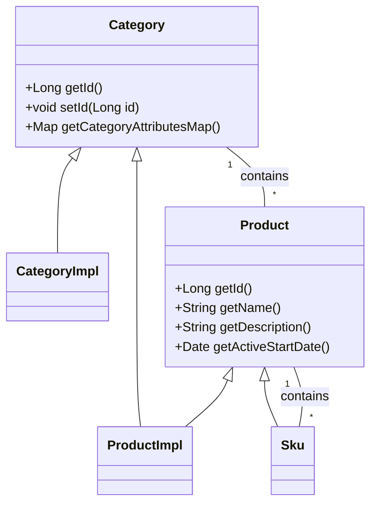

# Introduction to Catalog Domain

The Catalog Domain in Broadleaf Commerce refers to the core entities and their relationships that define the structure and behavior of the catalog system. These entities include <SwmToken path="core/broadleaf-framework/src/main/java/org/broadleafcommerce/core/catalog/domain/Product.java" pos="36:25:25" line-data=" * Implementations of this interface are used to hold data for a Product.  A product is a general description">`Product`</SwmToken>, <SwmToken path="core/broadleaf-framework/src/main/java/org/broadleafcommerce/core/catalog/domain/Product.java" pos="45:25:25" line-data=" * @see {@link ProductImpl},{@link Sku}, {@link Category}">`Category`</SwmToken>, <SwmToken path="core/broadleaf-framework/src/main/java/org/broadleafcommerce/core/catalog/domain/Product.java" pos="37:52:52" line-data=" * of an item that can be sold (for example: a hat).  Products are not sold or added to a cart.  {@link Sku}s">`Sku`</SwmToken>, and various other related classes and interfaces.

## Product Interface

The <SwmToken path="core/broadleaf-framework/src/main/java/org/broadleafcommerce/core/catalog/domain/Product.java" pos="36:25:25" line-data=" * Implementations of this interface are used to hold data for a Product.  A product is a general description">`Product`</SwmToken> interface represents a general description of an item that can be sold, such as a hat. Products are not sold directly; instead, <SwmToken path="core/broadleaf-framework/src/main/java/org/broadleafcommerce/core/catalog/domain/Product.java" pos="37:52:52" line-data=" * of an item that can be sold (for example: a hat).  Products are not sold or added to a cart.  {@link Sku}s">`Sku`</SwmToken>s, which are specific items like an XL Blue Hat, are sold or added to a cart. The <SwmToken path="core/broadleaf-framework/src/main/java/org/broadleafcommerce/core/catalog/domain/Product.java" pos="36:25:25" line-data=" * Implementations of this interface are used to hold data for a Product.  A product is a general description">`Product`</SwmToken> interface includes methods to get and set the product's ID, name, description, and active start date.

<SwmSnippet path="/core/broadleaf-framework/src/main/java/org/broadleafcommerce/core/catalog/domain/Product.java" line="35">

---

The <SwmToken path="core/broadleaf-framework/src/main/java/org/broadleafcommerce/core/catalog/domain/Product.java" pos="36:25:25" line-data=" * Implementations of this interface are used to hold data for a Product.  A product is a general description">`Product`</SwmToken> interface holds data for a Product, which is a general description of an item that can be sold. It includes methods to get and set the product's ID, name, description, and active start date.

```java
/**
 * Implementations of this interface are used to hold data for a Product.  A product is a general description
 * of an item that can be sold (for example: a hat).  Products are not sold or added to a cart.  {@link Sku}s
 * which are specific items (for example: a XL Blue Hat) are sold or added to a cart.
 * <br>
 * <br>
 * You should implement this class if you want to make significant changes to how the
 * Product is persisted.  If you just want to add additional fields then you should extend {@link ProductImpl}.
 *
 * @author btaylor
 * @see {@link ProductImpl},{@link Sku}, {@link Category}
 */
public interface Product extends Serializable, MultiTenantCloneable<Product>, Indexable {

    /**
     * The id of the Product.
     *
     * @return the id of the Product
     */
    @Override
    public Long getId();
```

---

</SwmSnippet>

## Category Interface

The <SwmToken path="core/broadleaf-framework/src/main/java/org/broadleafcommerce/core/catalog/domain/Product.java" pos="45:25:25" line-data=" * @see {@link ProductImpl},{@link Sku}, {@link Category}">`Category`</SwmToken> interface is used to hold data about a Category, which is a group of products. It includes methods to get and set the primary key, name, URL, and parent category, among other attributes.

<SwmSnippet path="/core/broadleaf-framework/src/main/java/org/broadleafcommerce/core/catalog/domain/Category.java" line="36">

---

The <SwmToken path="core/broadleaf-framework/src/main/java/org/broadleafcommerce/core/catalog/domain/Category.java" pos="37:25:25" line-data=" * Implementations of this interface are used to hold data about a Category.  A category is a group of products.">`Category`</SwmToken> interface holds data about a Category, which is a group of products. It includes methods to get and set the primary key, name, URL, and parent category, among other attributes.

```java
/**
 * Implementations of this interface are used to hold data about a Category.  A category is a group of products.
 * <br>
 * <br>
 * You should implement this class if you want to make significant changes to how the
 * Category is persisted.  If you just want to add additional fields then you should extend {@link CategoryImpl}.
 *
 * @see {@link CategoryImpl}
 * @author btaylor
 * @author Jeff Fischer
 * 
 */
public interface Category extends Serializable, MultiTenantCloneable<Category> {

    /**
     * Gets the primary key.
     * 
     * @return the primary key
     */
    @Nullable
    public Long getId();
```

---

</SwmSnippet>

## Sku Class

The <SwmToken path="core/broadleaf-framework/src/main/java/org/broadleafcommerce/core/catalog/domain/Product.java" pos="37:52:52" line-data=" * of an item that can be sold (for example: a hat).  Products are not sold or added to a cart.  {@link Sku}s">`Sku`</SwmToken> class represents the stock-keeping unit, which is the actual item available for sale, including its attributes like price and inventory.

## Category Usage in <SwmToken path="core/broadleaf-framework/src/main/java/org/broadleafcommerce/core/catalog/domain/Product.java" pos="42:38:38" line-data=" * Product is persisted.  If you just want to add additional fields then you should extend {@link ProductImpl}.">`ProductImpl`</SwmToken>

The <SwmToken path="core/broadleaf-framework/src/main/java/org/broadleafcommerce/core/catalog/domain/Product.java" pos="45:25:25" line-data=" * @see {@link ProductImpl},{@link Sku}, {@link Category}">`Category`</SwmToken> interface is used in <SwmToken path="core/broadleaf-framework/src/main/java/org/broadleafcommerce/core/catalog/domain/Product.java" pos="42:38:38" line-data=" * Product is persisted.  If you just want to add additional fields then you should extend {@link ProductImpl}.">`ProductImpl`</SwmToken> to manage the default category and other category-related attributes for a product.

<SwmSnippet path="/core/broadleaf-framework/src/main/java/org/broadleafcommerce/core/catalog/domain/ProductImpl.java" line="324">

---

The <SwmToken path="core/broadleaf-framework/src/main/java/org/broadleafcommerce/core/catalog/domain/ProductImpl.java" pos="325:3:3" line-data="    protected Category defaultCategory;">`Category`</SwmToken> interface is used in <SwmToken path="core/broadleaf-framework/src/main/java/org/broadleafcommerce/core/catalog/domain/Product.java" pos="42:38:38" line-data=" * Product is persisted.  If you just want to add additional fields then you should extend {@link ProductImpl}.">`ProductImpl`</SwmToken> to manage the default category and other category-related attributes for a product.

```java
    @Deprecated
    protected Category defaultCategory;

    @OneToMany(targetEntity = CategoryProductXrefImpl.class, mappedBy = "product",
            cascade = {CascadeType.MERGE, CascadeType.PERSIST, CascadeType.REFRESH})
    @OrderBy(value = "displayOrder")
    @Cache(usage = CacheConcurrencyStrategy.READ_WRITE, region = "blCategoryProduct")
    @BatchSize(size = 50)
    @AdminPresentationAdornedTargetCollection(friendlyName = "allParentCategoriesTitle",
            tab = TabName.Marketing, order = 3000,
            targetObjectProperty = "category",
            parentObjectProperty = "product",
            gridVisibleFields = {"name"})
    protected List<CategoryProductXref> allParentCategoryXrefs = new ArrayList<CategoryProductXref>();

    @OneToMany(mappedBy = "product", targetEntity = ProductAttributeImpl.class, cascade = {CascadeType.ALL})
    @Cache(usage = CacheConcurrencyStrategy.READ_WRITE, region = "blProductAttributes")
    @BatchSize(size = 50)
    @AdminPresentationCollection(friendlyName = "productAttributesTitle",
            tab = TabName.General, order = 6000)
    protected List<ProductAttribute> productAttributes = new ArrayList<ProductAttribute>();
```

---

</SwmSnippet>

## Category Attributes Map

The <SwmToken path="core/broadleaf-framework/src/main/java/org/broadleafcommerce/core/catalog/domain/Category.java" pos="546:11:11" line-data="    public Map&lt;String, CategoryAttribute&gt; getCategoryAttributesMap();">`getCategoryAttributesMap`</SwmToken> method in the <SwmToken path="core/broadleaf-framework/src/main/java/org/broadleafcommerce/core/catalog/domain/Product.java" pos="45:25:25" line-data=" * @see {@link ProductImpl},{@link Sku}, {@link Category}">`Category`</SwmToken> interface is used to get the attributes for a category. This is useful for smaller sites where using these attributes might be preferred to extending the domain object itself.

<SwmSnippet path="/core/broadleaf-framework/src/main/java/org/broadleafcommerce/core/catalog/domain/Category.java" line="539">

---

The <SwmToken path="core/broadleaf-framework/src/main/java/org/broadleafcommerce/core/catalog/domain/Category.java" pos="546:11:11" line-data="    public Map&lt;String, CategoryAttribute&gt; getCategoryAttributesMap();">`getCategoryAttributesMap`</SwmToken> method in the <SwmToken path="core/broadleaf-framework/src/main/java/org/broadleafcommerce/core/catalog/domain/Category.java" pos="540:17:17" line-data="     * Gets the attributes for this {@link Category}. In smaller sites, using these attributes might be preferred to">`Category`</SwmToken> interface is used to get the attributes for a category. This is useful for smaller sites where using these attributes might be preferred to extending the domain object itself.

```java
    /**
     * Gets the attributes for this {@link Category}. In smaller sites, using these attributes might be preferred to
     * extending the domain object itself.
     * 
     * @return
     * @see {@link #getMappedCategoryAttributes()}
     */
    public Map<String, CategoryAttribute> getCategoryAttributesMap();
```

---

</SwmSnippet>

## Main Functions

The main functions in the catalog domain include <SwmToken path="core/broadleaf-framework/src/main/java/org/broadleafcommerce/core/catalog/domain/Product.java" pos="55:5:5" line-data="    public Long getId();">`getId`</SwmToken> and <SwmToken path="core/broadleaf-framework/src/main/java/org/broadleafcommerce/core/catalog/domain/Product.java" pos="73:5:5" line-data="    public String getName();">`getName`</SwmToken>.

### <SwmToken path="core/broadleaf-framework/src/main/java/org/broadleafcommerce/core/catalog/domain/Product.java" pos="55:5:5" line-data="    public Long getId();">`getId`</SwmToken>

The <SwmToken path="core/broadleaf-framework/src/main/java/org/broadleafcommerce/core/catalog/domain/Product.java" pos="55:5:5" line-data="    public Long getId();">`getId`</SwmToken> function returns the unique identifier of the product. This is crucial for distinguishing between different products in the catalog.

### <SwmToken path="core/broadleaf-framework/src/main/java/org/broadleafcommerce/core/catalog/domain/Product.java" pos="73:5:5" line-data="    public String getName();">`getName`</SwmToken>

The <SwmToken path="core/broadleaf-framework/src/main/java/org/broadleafcommerce/core/catalog/domain/Product.java" pos="73:5:5" line-data="    public String getName();">`getName`</SwmToken> function returns the name of the product used for display purposes. This is important for presenting the product to the end-users.

<SwmSnippet path="/core/broadleaf-framework/src/main/java/org/broadleafcommerce/core/catalog/domain/Product.java" line="65">

---

The <SwmToken path="core/broadleaf-framework/src/main/java/org/broadleafcommerce/core/catalog/domain/Product.java" pos="73:5:5" line-data="    public String getName();">`getName`</SwmToken> function returns the name of the product used for display purposes. This is important for presenting the product to the end-users.

```java
     * Returns the name of the product that is used for display purposes.
     * <br />
     * <br />
     * <b>Note:</b> this is a convenience method that merely serves as
     * a pass-through to the same method via {@link getDefaultSku()}
     *
     * @return the name of the product
     */
    public String getName();
```

---

</SwmSnippet>

## Domain Endpoints

The domain endpoints include methods like <SwmToken path="core/broadleaf-framework/src/main/java/org/broadleafcommerce/core/catalog/domain/Product.java" pos="55:5:5" line-data="    public Long getId();">`getId`</SwmToken> and <SwmToken path="core/broadleaf-framework/src/main/java/org/broadleafcommerce/core/catalog/domain/Category.java" pos="63:5:5" line-data="    public void setId(@Nullable Long id);">`setId`</SwmToken> for the <SwmToken path="core/broadleaf-framework/src/main/java/org/broadleafcommerce/core/catalog/domain/Product.java" pos="45:25:25" line-data=" * @see {@link ProductImpl},{@link Sku}, {@link Category}">`Category`</SwmToken> interface.

### <SwmToken path="core/broadleaf-framework/src/main/java/org/broadleafcommerce/core/catalog/domain/Category.java" pos="63:5:5" line-data="    public void setId(@Nullable Long id);">`setId`</SwmToken>

The <SwmToken path="core/broadleaf-framework/src/main/java/org/broadleafcommerce/core/catalog/domain/Category.java" pos="63:5:5" line-data="    public void setId(@Nullable Long id);">`setId`</SwmToken> method is an endpoint used to set the unique identifier of a <SwmToken path="core/broadleaf-framework/src/main/java/org/broadleafcommerce/core/catalog/domain/Product.java" pos="45:25:25" line-data=" * @see {@link ProductImpl},{@link Sku}, {@link Category}">`Category`</SwmToken>.

<SwmSnippet path="/core/broadleaf-framework/src/main/java/org/broadleafcommerce/core/catalog/domain/Category.java" line="63">

---

The <SwmToken path="core/broadleaf-framework/src/main/java/org/broadleafcommerce/core/catalog/domain/Category.java" pos="63:5:5" line-data="    public void setId(@Nullable Long id);">`setId`</SwmToken> method is an endpoint used to set the unique identifier of a <SwmToken path="core/broadleaf-framework/src/main/java/org/broadleafcommerce/core/catalog/domain/Product.java" pos="45:25:25" line-data=" * @see {@link ProductImpl},{@link Sku}, {@link Category}">`Category`</SwmToken>.

```java
    public void setId(@Nullable Long id);
```

---

</SwmSnippet>

&nbsp;

*This is an auto-generated document by Swimm AI 🌊 and has not yet been verified by a human*

<SwmMeta version="3.0.0" repo-id="Z2l0aHViJTNBJTNBQnJvYWRsZWFmQ29tbWVyY2UtZGVtby1uZXclM0ElM0FTd2ltbS1EZW1v" repo-name="BroadleafCommerce-demo-new" doc-type="overview"><sup>Powered by [Swimm](/)</sup></SwmMeta>
