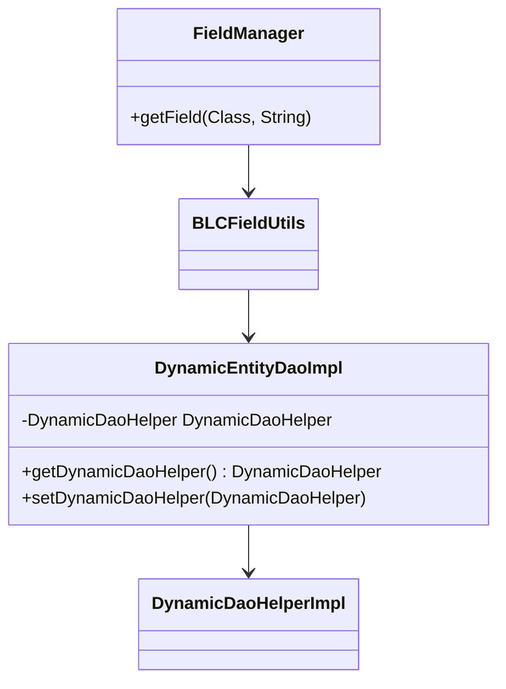

# Introduction

Dao stands for Data Access Object and is a design pattern used to abstract and encapsulate all access to the data source. In the Server, Dao is responsible for handling the interaction with the database, providing a layer of abstraction over the actual data operations.

# Dao Layer

The Dao layer ensures that the business logic is decoupled from the data access logic, promoting a cleaner and more maintainable codebase. The <SwmToken path="admin/broadleaf-open-admin-platform/src/main/java/org/broadleafcommerce/openadmin/server/dao/DynamicEntityDaoImpl.java" pos="18:2:10" line-data="package org.broadleafcommerce.openadmin.server.dao;">`org.broadleafcommerce.openadmin.server.dao`</SwmToken> package contains various classes and interfaces that define the Dao layer, such as <SwmToken path="admin/broadleaf-open-admin-platform/src/main/java/org/broadleafcommerce/openadmin/server/service/persistence/module/FieldManager.java" pos="74:14:14" line-data="        BLCFieldUtils fieldUtils = new BLCFieldUtils(true, dynamicEntityDao.useCache(),">`dynamicEntityDao`</SwmToken> and <SwmToken path="admin/broadleaf-open-admin-platform/src/main/java/org/broadleafcommerce/openadmin/server/dao/DynamicEntityDaoImpl.java" pos="105:4:4" line-data="public class DynamicEntityDaoImpl implements DynamicEntityDao, ApplicationContextAware {">`DynamicEntityDaoImpl`</SwmToken>. These classes are used to perform CRUD (Create, Read, Update, Delete) operations on the entities within the application.

# <SwmToken path="admin/broadleaf-open-admin-platform/src/main/java/org/broadleafcommerce/openadmin/server/dao/DynamicEntityDaoImpl.java" pos="105:4:4" line-data="public class DynamicEntityDaoImpl implements DynamicEntityDao, ApplicationContextAware {">`DynamicEntityDaoImpl`</SwmToken> Class

The <SwmToken path="admin/broadleaf-open-admin-platform/src/main/java/org/broadleafcommerce/openadmin/server/dao/DynamicEntityDaoImpl.java" pos="105:4:4" line-data="public class DynamicEntityDaoImpl implements DynamicEntityDao, ApplicationContextAware {">`DynamicEntityDaoImpl`</SwmToken> class initializes the <SwmToken path="admin/broadleaf-open-admin-platform/src/main/java/org/broadleafcommerce/openadmin/server/dao/DynamicEntityDaoImpl.java" pos="143:3:3" line-data="    protected DynamicDaoHelper dynamicDaoHelper = new DynamicDaoHelperImpl();">`DynamicDaoHelper`</SwmToken> field, which is an instance of <SwmToken path="admin/broadleaf-open-admin-platform/src/main/java/org/broadleafcommerce/openadmin/server/dao/DynamicEntityDaoImpl.java" pos="143:11:11" line-data="    protected DynamicDaoHelper dynamicDaoHelper = new DynamicDaoHelperImpl();">`DynamicDaoHelperImpl`</SwmToken>. This helper class aids in managing dynamic entities.

<SwmSnippet path="/admin/broadleaf-open-admin-platform/src/main/java/org/broadleafcommerce/openadmin/server/dao/DynamicEntityDaoImpl.java" line="143">

---

The <SwmToken path="admin/broadleaf-open-admin-platform/src/main/java/org/broadleafcommerce/openadmin/server/dao/DynamicEntityDaoImpl.java" pos="143:3:3" line-data="    protected DynamicDaoHelper dynamicDaoHelper = new DynamicDaoHelperImpl();">`DynamicDaoHelper`</SwmToken> field is initialized as an instance of <SwmToken path="admin/broadleaf-open-admin-platform/src/main/java/org/broadleafcommerce/openadmin/server/dao/DynamicEntityDaoImpl.java" pos="143:11:11" line-data="    protected DynamicDaoHelper dynamicDaoHelper = new DynamicDaoHelperImpl();">`DynamicDaoHelperImpl`</SwmToken>.

```java
    protected DynamicDaoHelper dynamicDaoHelper = new DynamicDaoHelperImpl();

    @Value("${cache.entity.dao.metadata.ttl}")
```

---

</SwmSnippet>

# Methods in <SwmToken path="admin/broadleaf-open-admin-platform/src/main/java/org/broadleafcommerce/openadmin/server/dao/DynamicEntityDaoImpl.java" pos="105:4:4" line-data="public class DynamicEntityDaoImpl implements DynamicEntityDao, ApplicationContextAware {">`DynamicEntityDaoImpl`</SwmToken>

The <SwmToken path="admin/broadleaf-open-admin-platform/src/main/java/org/broadleafcommerce/openadmin/server/dao/DynamicEntityDaoImpl.java" pos="1660:5:5" line-data="    public DynamicDaoHelper getDynamicDaoHelper() {">`getDynamicDaoHelper`</SwmToken> method returns the <SwmToken path="admin/broadleaf-open-admin-platform/src/main/java/org/broadleafcommerce/openadmin/server/dao/DynamicEntityDaoImpl.java" pos="143:3:3" line-data="    protected DynamicDaoHelper dynamicDaoHelper = new DynamicDaoHelperImpl();">`DynamicDaoHelper`</SwmToken> instance, while the <SwmToken path="admin/broadleaf-open-admin-platform/src/main/java/org/broadleafcommerce/openadmin/server/dao/DynamicEntityDaoImpl.java" pos="1664:5:5" line-data="    public void setDynamicDaoHelper(DynamicDaoHelper dynamicDaoHelper) {">`setDynamicDaoHelper`</SwmToken> method allows setting a new <SwmToken path="admin/broadleaf-open-admin-platform/src/main/java/org/broadleafcommerce/openadmin/server/dao/DynamicEntityDaoImpl.java" pos="143:3:3" line-data="    protected DynamicDaoHelper dynamicDaoHelper = new DynamicDaoHelperImpl();">`DynamicDaoHelper`</SwmToken> instance.

<SwmSnippet path="/admin/broadleaf-open-admin-platform/src/main/java/org/broadleafcommerce/openadmin/server/dao/DynamicEntityDaoImpl.java" line="1660">

---

The <SwmToken path="admin/broadleaf-open-admin-platform/src/main/java/org/broadleafcommerce/openadmin/server/dao/DynamicEntityDaoImpl.java" pos="1660:5:5" line-data="    public DynamicDaoHelper getDynamicDaoHelper() {">`getDynamicDaoHelper`</SwmToken> and <SwmToken path="admin/broadleaf-open-admin-platform/src/main/java/org/broadleafcommerce/openadmin/server/dao/DynamicEntityDaoImpl.java" pos="1664:5:5" line-data="    public void setDynamicDaoHelper(DynamicDaoHelper dynamicDaoHelper) {">`setDynamicDaoHelper`</SwmToken> methods in <SwmToken path="admin/broadleaf-open-admin-platform/src/main/java/org/broadleafcommerce/openadmin/server/dao/DynamicEntityDaoImpl.java" pos="105:4:4" line-data="public class DynamicEntityDaoImpl implements DynamicEntityDao, ApplicationContextAware {">`DynamicEntityDaoImpl`</SwmToken>.

```java
    public DynamicDaoHelper getDynamicDaoHelper() {
        return dynamicDaoHelper;
    }

    public void setDynamicDaoHelper(DynamicDaoHelper dynamicDaoHelper) {
        this.dynamicDaoHelper = dynamicDaoHelper;
    }
```

---

</SwmSnippet>

# Usage in <SwmToken path="admin/broadleaf-open-admin-platform/src/main/java/org/broadleafcommerce/openadmin/server/dao/DynamicEntityDaoImpl.java" pos="50:16:16" line-data="import org.broadleafcommerce.openadmin.server.service.persistence.module.FieldManager;">`FieldManager`</SwmToken>

The <SwmToken path="admin/broadleaf-open-admin-platform/src/main/java/org/broadleafcommerce/openadmin/server/dao/DynamicEntityDaoImpl.java" pos="1660:5:5" line-data="    public DynamicDaoHelper getDynamicDaoHelper() {">`getDynamicDaoHelper`</SwmToken> method is used within the <SwmToken path="admin/broadleaf-open-admin-platform/src/main/java/org/broadleafcommerce/openadmin/server/service/persistence/module/FieldManager.java" pos="76:5:5" line-data="        return fieldUtils.getField(clazz, fieldName);">`getField`</SwmToken> method of the <SwmToken path="admin/broadleaf-open-admin-platform/src/main/java/org/broadleafcommerce/openadmin/server/dao/DynamicEntityDaoImpl.java" pos="50:16:16" line-data="import org.broadleafcommerce.openadmin.server.service.persistence.module.FieldManager;">`FieldManager`</SwmToken> class to retrieve the <SwmToken path="admin/broadleaf-open-admin-platform/src/main/java/org/broadleafcommerce/openadmin/server/dao/DynamicEntityDaoImpl.java" pos="143:3:3" line-data="    protected DynamicDaoHelper dynamicDaoHelper = new DynamicDaoHelperImpl();">`DynamicDaoHelper`</SwmToken> instance and utilize it for field operations.

<SwmSnippet path="/admin/broadleaf-open-admin-platform/src/main/java/org/broadleafcommerce/openadmin/server/service/persistence/module/FieldManager.java" line="74">

---

The <SwmToken path="admin/broadleaf-open-admin-platform/src/main/java/org/broadleafcommerce/openadmin/server/service/persistence/module/FieldManager.java" pos="75:6:6" line-data="                entityConfiguration, dynamicEntityDao.getDynamicDaoHelper());">`getDynamicDaoHelper`</SwmToken> method is used in the <SwmToken path="admin/broadleaf-open-admin-platform/src/main/java/org/broadleafcommerce/openadmin/server/service/persistence/module/FieldManager.java" pos="76:5:5" line-data="        return fieldUtils.getField(clazz, fieldName);">`getField`</SwmToken> method of the <SwmToken path="admin/broadleaf-open-admin-platform/src/main/java/org/broadleafcommerce/openadmin/server/dao/DynamicEntityDaoImpl.java" pos="50:16:16" line-data="import org.broadleafcommerce.openadmin.server.service.persistence.module.FieldManager;">`FieldManager`</SwmToken> class.

```java
        BLCFieldUtils fieldUtils = new BLCFieldUtils(true, dynamicEntityDao.useCache(),
                entityConfiguration, dynamicEntityDao.getDynamicDaoHelper());
        return fieldUtils.getField(clazz, fieldName);
```

---

</SwmSnippet>

&nbsp;

*This is an auto-generated document by Swimm AI 🌊 and has not yet been verified by a human*

<SwmMeta version="3.0.0" repo-id="Z2l0aHViJTNBJTNBQnJvYWRsZWFmQ29tbWVyY2UtZGVtby1uZXclM0ElM0FTd2ltbS1EZW1v" repo-name="BroadleafCommerce-demo-new" doc-type="overview"><sup>Powered by [Swimm](/)</sup></SwmMeta>
