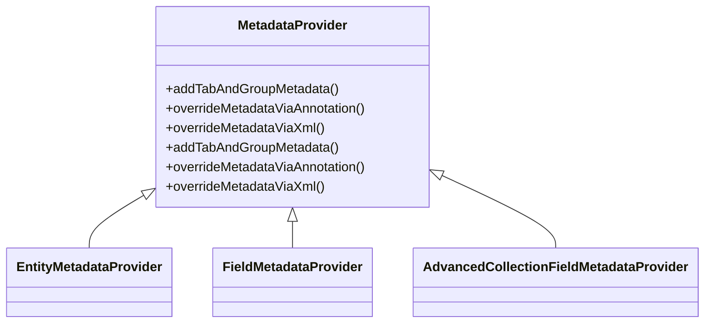

# Introduction to Metadata Providers

Metadata Providers are components responsible for supplying metadata information about entities and fields. They adapt and extend the metadata handling capabilities of the `DynamicEntityDao`. Providers can override metadata via annotations or XML requests, ensuring flexibility and customization. They play a crucial role in the metadata management system, allowing for dynamic and configurable entity definitions.

# <SwmToken path="admin/broadleaf-open-admin-platform/src/main/java/org/broadleafcommerce/openadmin/server/dao/provider/metadata/EntityMetadataProvider.java" pos="39:4:4" line-data="public interface EntityMetadataProvider extends Ordered {">`EntityMetadataProvider`</SwmToken>

The <SwmToken path="admin/broadleaf-open-admin-platform/src/main/java/org/broadleafcommerce/openadmin/server/dao/provider/metadata/EntityMetadataProvider.java" pos="39:4:4" line-data="public interface EntityMetadataProvider extends Ordered {">`EntityMetadataProvider`</SwmToken> class is responsible for providing metadata about entities. It can be customized to handle specific entity metadata requirements.

<SwmSnippet path="/admin/broadleaf-open-admin-platform/src/main/java/org/broadleafcommerce/openadmin/server/dao/provider/metadata/EntityMetadataProvider.java" line="9">

---

The <SwmToken path="admin/broadleaf-open-admin-platform/src/main/java/org/broadleafcommerce/openadmin/server/dao/provider/metadata/EntityMetadataProvider.java" pos="39:4:4" line-data="public interface EntityMetadataProvider extends Ordered {">`EntityMetadataProvider`</SwmToken> class is defined in this file and is responsible for handling entity-specific metadata.

```java
 * unless the restrictions on use therein are violated and require payment to Broadleaf in which case
 * the Broadleaf End User License Agreement (EULA), Version 1.1
 * (the "Commercial License" located at http://license.broadleafcommerce.org/commercial_license-1.1.txt)
 * shall apply.
 * 
 * Alternatively, the Commercial License may be replaced with a mutually agreed upon license (the "Custom License")
 * between you and Broadleaf Commerce. You may not use this file except in compliance with the applicable license.
```

---

</SwmSnippet>

<SwmSnippet path="/admin/broadleaf-open-admin-platform/src/main/java/org/broadleafcommerce/openadmin/server/dao/provider/metadata/FieldMetadataProvider.java" line="9">

---

The <SwmToken path="admin/broadleaf-open-admin-platform/src/main/java/org/broadleafcommerce/openadmin/server/dao/provider/metadata/FieldMetadataProvider.java" pos="39:4:4" line-data="public interface FieldMetadataProvider extends Ordered {">`FieldMetadataProvider`</SwmToken> class is defined in this file and is responsible for handling field-specific metadata.

```java
 * unless the restrictions on use therein are violated and require payment to Broadleaf in which case
 * the Broadleaf End User License Agreement (EULA), Version 1.1
 * (the "Commercial License" located at http://license.broadleafcommerce.org/commercial_license-1.1.txt)
 * shall apply.
 * 
 * Alternatively, the Commercial License may be replaced with a mutually agreed upon license (the "Custom License")
 * between you and Broadleaf Commerce. You may not use this file except in compliance with the applicable license.
```

---

</SwmSnippet>

<SwmSnippet path="/admin/broadleaf-open-admin-platform/src/main/java/org/broadleafcommerce/openadmin/server/dao/provider/metadata/AdvancedCollectionFieldMetadataProvider.java" line="9">

---

The <SwmToken path="admin/broadleaf-open-admin-platform/src/main/java/org/broadleafcommerce/openadmin/server/dao/provider/metadata/AdvancedCollectionFieldMetadataProvider.java" pos="41:4:4" line-data="public class AdvancedCollectionFieldMetadataProvider extends FieldMetadataProviderAdapter {">`AdvancedCollectionFieldMetadataProvider`</SwmToken> class is defined in this file and is responsible for handling metadata for advanced collection fields.

```java
 * unless the restrictions on use therein are violated and require payment to Broadleaf in which case
 * the Broadleaf End User License Agreement (EULA), Version 1.1
 * (the "Commercial License" located at http://license.broadleafcommerce.org/commercial_license-1.1.txt)
 * shall apply.
 * 
 * Alternatively, the Commercial License may be replaced with a mutually agreed upon license (the "Custom License")
 * between you and Broadleaf Commerce. You may not use this file except in compliance with the applicable license.
```

---

</SwmSnippet>

# Main Functions

There are several main functions in the metadata provider classes. Some of them are <SwmToken path="admin/broadleaf-open-admin-platform/src/main/java/org/broadleafcommerce/openadmin/server/dao/provider/metadata/BasicEntityMetadataProvider.java" pos="59:5:5" line-data="    public MetadataProviderResponse addTabAndGroupMetadata(AddMetadataRequest addMetadataRequest, Map&lt;String, TabMetadata&gt; metadata) {">`addTabAndGroupMetadata`</SwmToken>, <SwmToken path="admin/broadleaf-open-admin-platform/src/main/java/org/broadleafcommerce/openadmin/server/dao/provider/metadata/BasicEntityMetadataProvider.java" pos="74:5:5" line-data="    public MetadataProviderResponse overrideMetadataViaAnnotation(OverrideViaAnnotationRequest overrideViaAnnotationRequest, Map&lt;String, TabMetadata&gt; metadata) {">`overrideMetadataViaAnnotation`</SwmToken>, and <SwmToken path="admin/broadleaf-open-admin-platform/src/main/java/org/broadleafcommerce/openadmin/server/dao/provider/metadata/BasicEntityMetadataProvider.java" pos="98:5:5" line-data="    public MetadataProviderResponse overrideMetadataViaXml(OverrideViaXmlRequest overrideViaXmlRequest, Map&lt;String, TabMetadata&gt; metadata) {">`overrideMetadataViaXml`</SwmToken>. We will dive a little into each of these functions.

## <SwmToken path="admin/broadleaf-open-admin-platform/src/main/java/org/broadleafcommerce/openadmin/server/dao/provider/metadata/BasicEntityMetadataProvider.java" pos="59:5:5" line-data="    public MetadataProviderResponse addTabAndGroupMetadata(AddMetadataRequest addMetadataRequest, Map&lt;String, TabMetadata&gt; metadata) {">`addTabAndGroupMetadata`</SwmToken>

The <SwmToken path="admin/broadleaf-open-admin-platform/src/main/java/org/broadleafcommerce/openadmin/server/dao/provider/metadata/BasicEntityMetadataProvider.java" pos="59:5:5" line-data="    public MetadataProviderResponse addTabAndGroupMetadata(AddMetadataRequest addMetadataRequest, Map&lt;String, TabMetadata&gt; metadata) {">`addTabAndGroupMetadata`</SwmToken> function is responsible for adding tab and group metadata to the provided metadata map. It uses annotations to find the relevant metadata and adds it to the map.

<SwmSnippet path="/admin/broadleaf-open-admin-platform/src/main/java/org/broadleafcommerce/openadmin/server/dao/provider/metadata/BasicEntityMetadataProvider.java" line="58">

---

The <SwmToken path="admin/broadleaf-open-admin-platform/src/main/java/org/broadleafcommerce/openadmin/server/dao/provider/metadata/BasicEntityMetadataProvider.java" pos="59:5:5" line-data="    public MetadataProviderResponse addTabAndGroupMetadata(AddMetadataRequest addMetadataRequest, Map&lt;String, TabMetadata&gt; metadata) {">`addTabAndGroupMetadata`</SwmToken> function is implemented in this file. It uses annotations to find and add tab and group metadata to the metadata map.

```java
    @Override
    public MetadataProviderResponse addTabAndGroupMetadata(AddMetadataRequest addMetadataRequest, Map<String, TabMetadata> metadata) {
        AdminPresentationClass annot = AnnotationUtils.findAnnotation(addMetadataRequest.getTargetClass(), AdminPresentationClass.class);

        if (annot == null) {
            return MetadataProviderResponse.NOT_HANDLED;
        }

        for (AdminTabPresentation tabPresentation : annot.tabs()) {
            metadata.put(tabPresentation.name(), buildTabMetadata(tabPresentation, addMetadataRequest.getTargetClass(), metadata));
        }

        return MetadataProviderResponse.HANDLED;
    }
```

---

</SwmSnippet>

## <SwmToken path="admin/broadleaf-open-admin-platform/src/main/java/org/broadleafcommerce/openadmin/server/dao/provider/metadata/BasicEntityMetadataProvider.java" pos="74:5:5" line-data="    public MetadataProviderResponse overrideMetadataViaAnnotation(OverrideViaAnnotationRequest overrideViaAnnotationRequest, Map&lt;String, TabMetadata&gt; metadata) {">`overrideMetadataViaAnnotation`</SwmToken>

The <SwmToken path="admin/broadleaf-open-admin-platform/src/main/java/org/broadleafcommerce/openadmin/server/dao/provider/metadata/BasicEntityMetadataProvider.java" pos="74:5:5" line-data="    public MetadataProviderResponse overrideMetadataViaAnnotation(OverrideViaAnnotationRequest overrideViaAnnotationRequest, Map&lt;String, TabMetadata&gt; metadata) {">`overrideMetadataViaAnnotation`</SwmToken> function overrides existing metadata using annotations. It checks for specific annotations and applies the overrides to the metadata map.

<SwmSnippet path="/admin/broadleaf-open-admin-platform/src/main/java/org/broadleafcommerce/openadmin/server/dao/provider/metadata/BasicEntityMetadataProvider.java" line="73">

---

The <SwmToken path="admin/broadleaf-open-admin-platform/src/main/java/org/broadleafcommerce/openadmin/server/dao/provider/metadata/BasicEntityMetadataProvider.java" pos="74:5:5" line-data="    public MetadataProviderResponse overrideMetadataViaAnnotation(OverrideViaAnnotationRequest overrideViaAnnotationRequest, Map&lt;String, TabMetadata&gt; metadata) {">`overrideMetadataViaAnnotation`</SwmToken> function is implemented in this file. It checks for specific annotations and applies the overrides to the metadata map.

```java
    @Override
    public MetadataProviderResponse overrideMetadataViaAnnotation(OverrideViaAnnotationRequest overrideViaAnnotationRequest, Map<String, TabMetadata> metadata) {
        AdminPresentationClass annot = AnnotationUtils.findAnnotation(overrideViaAnnotationRequest.getRequestedEntity(), AdminPresentationClass.class);

        if (annot == null) {
            return MetadataProviderResponse.NOT_HANDLED;
        }

        for (AdminTabPresentationOverride tabOverride : annot.tabOverrides()) {
            TabMetadata tab = getTabFromMetadata(tabOverride.tabName(), metadata);
            if (tab != null) {
                applyTabMetadataOverrideViaAnnotation(tab, tabOverride);
            }
        }
        for (AdminGroupPresentationOverride groupOverride : annot.groupOverrides()) {
            GroupMetadata group = getGroupFromMetadata(groupOverride.groupName(), metadata);
            if (group != null) {
                applyGroupMetadataOverrideViaAnnotation(group, groupOverride);
            }
        }
```

---

</SwmSnippet>

## <SwmToken path="admin/broadleaf-open-admin-platform/src/main/java/org/broadleafcommerce/openadmin/server/dao/provider/metadata/BasicEntityMetadataProvider.java" pos="98:5:5" line-data="    public MetadataProviderResponse overrideMetadataViaXml(OverrideViaXmlRequest overrideViaXmlRequest, Map&lt;String, TabMetadata&gt; metadata) {">`overrideMetadataViaXml`</SwmToken>

The <SwmToken path="admin/broadleaf-open-admin-platform/src/main/java/org/broadleafcommerce/openadmin/server/dao/provider/metadata/BasicEntityMetadataProvider.java" pos="98:5:5" line-data="    public MetadataProviderResponse overrideMetadataViaXml(OverrideViaXmlRequest overrideViaXmlRequest, Map&lt;String, TabMetadata&gt; metadata) {">`overrideMetadataViaXml`</SwmToken> function overrides existing metadata using XML configurations. It retrieves the targeted overrides and applies them to the metadata map.

<SwmSnippet path="/admin/broadleaf-open-admin-platform/src/main/java/org/broadleafcommerce/openadmin/server/dao/provider/metadata/BasicEntityMetadataProvider.java" line="97">

---

The <SwmToken path="admin/broadleaf-open-admin-platform/src/main/java/org/broadleafcommerce/openadmin/server/dao/provider/metadata/BasicEntityMetadataProvider.java" pos="98:5:5" line-data="    public MetadataProviderResponse overrideMetadataViaXml(OverrideViaXmlRequest overrideViaXmlRequest, Map&lt;String, TabMetadata&gt; metadata) {">`overrideMetadataViaXml`</SwmToken> function is implemented in this file. It retrieves the targeted overrides from XML configurations and applies them to the metadata map.

```java
    @Override
    public MetadataProviderResponse overrideMetadataViaXml(OverrideViaXmlRequest overrideViaXmlRequest, Map<String, TabMetadata> metadata) {
        Map<String, MetadataOverride> overrides = getTargetedOverride(overrideViaXmlRequest.getDynamicEntityDao(), overrideViaXmlRequest.getRequestedConfigKey(), overrideViaXmlRequest.getRequestedCeilingEntity());
        if (overrides != null) {
            for (String overrideKey : overrides.keySet()) {
                MetadataOverride overrideMetadata = overrides.get(overrideKey);
                if (overrideMetadata instanceof GroupMetadataOverride) {
                    GroupMetadataOverride groupOverrideMetadata = (GroupMetadataOverride) overrideMetadata;
                    applyGroupMetadataOverrideViaXml(overrideKey, groupOverrideMetadata, metadata);
                } else if (!(overrideMetadata instanceof FieldMetadataOverride)) {
                    // Strictly applies to a Tab
                    applyTabMetadataOverrideViaXml(overrideKey, overrideMetadata, metadata);
                }
```

---

</SwmSnippet>

&nbsp;

*This is an auto-generated document by Swimm AI 🌊 and has not yet been verified by a human*

<SwmMeta version="3.0.0" repo-id="Z2l0aHViJTNBJTNBQnJvYWRsZWFmQ29tbWVyY2UtZGVtby1uZXclM0ElM0FTd2ltbS1EZW1v" repo-name="BroadleafCommerce-demo-new" doc-type="overview"><sup>Powered by [Swimm](/)</sup></SwmMeta>
