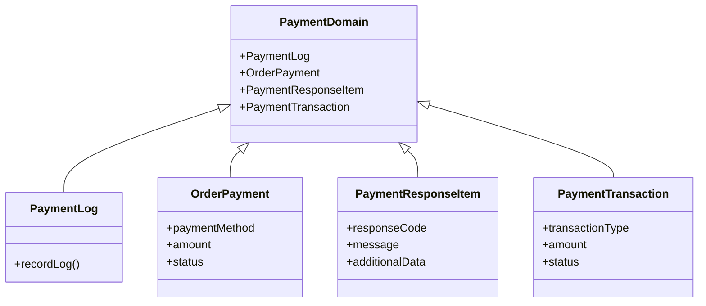

# Introduction to Payment Domain

The payment domain in the Broadleaf Commerce framework encompasses a set of classes and interfaces that represent the core entities and their relationships within the payment processing system. These domain classes are essential for handling various aspects of payment processing, ensuring secure and efficient transactions.

# Domain Classes

The primary domain classes include `PaymentLog`, <SwmToken path="core/broadleaf-framework/src/main/java/org/broadleafcommerce/core/payment/domain/secure/Referenced.java" pos="21:12:12" line-data="import org.broadleafcommerce.core.payment.domain.OrderPayment;">`OrderPayment`</SwmToken>, `PaymentResponseItem`, and `PaymentTransaction`. Each of these classes plays a specific role in the payment processing workflow.

<SwmSnippet path="/core/broadleaf-framework/src/main/java/org/broadleafcommerce/core/payment/domain/secure/Referenced.java" line="28">

---

The <SwmToken path="core/broadleaf-framework/src/main/java/org/broadleafcommerce/core/payment/domain/secure/Referenced.java" pos="33:18:18" line-data=" * &lt;p&gt;Entities that implement this {@link Referenced} interface should not be instantiated directly but rather be instaniated">`Referenced`</SwmToken> interface is used to store <SwmToken path="core/broadleaf-framework/src/main/java/org/broadleafcommerce/core/payment/domain/secure/Referenced.java" pos="29:18:20" line-data=" * &lt;p&gt;The main interface used to store extra-secure data such as credit card, bank accounts and gift card data. All entities">`extra-secure`</SwmToken> data such as credit card, bank accounts, and gift card data. It ensures that sensitive information is stored in a separate database under strict PCI compliance.

```java
/**
 * <p>The main interface used to store extra-secure data such as credit card, bank accounts and gift card data. All entities
 * that implement this interface should be stored in a completely separate database under strict PCI compliance. Broadleaf
 * provides the ability for this in the blSecurePU persistence unit, which all implementing entities are members of.</p>
 *
 * <p>Entities that implement this {@link Referenced} interface should not be instantiated directly but rather be instaniated
 * via {@link SecureOrderPaymentService#create(org.broadleafcommerce.core.payment.service.type.PaymentType)}</p>
 * 
 * <p>In the common case, this is rarely used as most implementors will NOT want to deal with the liability and extra PCI
 * requirements associated with storing sensitive payment data. Consider integrating with a payment provider that takes
 * care of PCI-sensitive data instead.</p>
 *
 * @see {@link CreditCardPayment}
 * @see {@link GiftCardPayment}
 * @see {@link BankAccountPayment}
 * @author Phillip Verheyden (phillipuniverse)
 */
public interface Referenced extends Serializable {

    public Long getId();
```

---

</SwmSnippet>

## PaymentLog

The `PaymentLog` class is used to record and store logs related to payment transactions. It helps in tracking the history and status of payments, providing a detailed audit trail for payment activities.

## PaymentResponseItem

The `PaymentResponseItem` class encapsulates the response received from a payment gateway or processor. It includes information such as the response code, message, and any additional data returned by the payment processor.

## PaymentTransaction

The `PaymentTransaction` class represents a single transaction within the payment processing system. It includes details such as the transaction type, amount, and status, and is used to track the progress and outcome of individual payment transactions.

# Secure Handling of Sensitive Information

Domain classes often utilize encryption modules to securely handle sensitive information, such as credit card numbers. This ensures that data is encrypted and decrypted appropriately, maintaining data security and compliance.

# JPA Annotations

Domain entities are typically annotated with JPA annotations to map them to database tables. This allows for the persistence and retrieval of payment-related data, ensuring that the system can effectively manage and store payment information.

&nbsp;

*This is an auto-generated document by Swimm AI 🌊 and has not yet been verified by a human*

<SwmMeta version="3.0.0" repo-id="Z2l0aHViJTNBJTNBQnJvYWRsZWFmQ29tbWVyY2UtZGVtby1uZXclM0ElM0FTd2ltbS1EZW1v" repo-name="BroadleafCommerce-demo-new" doc-type="overview"><sup>Powered by [Swimm](/)</sup></SwmMeta>
