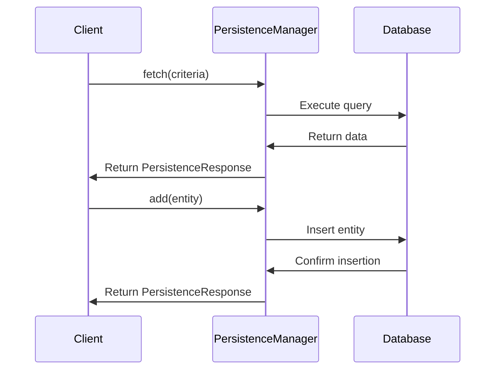

# Introduction to Persistence in Service

Persistence refers to the mechanism of storing and retrieving data in a database. It ensures that data remains available and consistent across different sessions and transactions.

# Components of Persistence

In the service layer, persistence is managed by various components such as <SwmToken path="admin/broadleaf-open-admin-platform/src/main/java/org/broadleafcommerce/openadmin/server/service/persistence/PersistenceManager.java" pos="35:4:4" line-data="public interface PersistenceManager {">`PersistenceManager`</SwmToken>, <SwmToken path="admin/broadleaf-open-admin-platform/src/main/java/org/broadleafcommerce/openadmin/server/service/persistence/module/PersistenceModule.java" pos="39:4:4" line-data="public interface PersistenceModule {">`PersistenceModule`</SwmToken>, and <SwmToken path="admin/broadleaf-open-admin-platform/src/main/java/org/broadleafcommerce/openadmin/server/service/persistence/PersistenceManagerImpl.java" pos="38:10:10" line-data="import org.broadleafcommerce.common.service.PersistenceService;">`PersistenceService`</SwmToken>. These components work together to handle CRUD (Create, Read, Update, Delete) operations on entities.

<SwmSnippet path="/admin/broadleaf-open-admin-platform/src/main/java/org/broadleafcommerce/openadmin/server/service/persistence/PersistenceManager.java" line="35">

---

## <SwmToken path="admin/broadleaf-open-admin-platform/src/main/java/org/broadleafcommerce/openadmin/server/service/persistence/PersistenceManager.java" pos="35:4:4" line-data="public interface PersistenceManager {">`PersistenceManager`</SwmToken>

The <SwmToken path="admin/broadleaf-open-admin-platform/src/main/java/org/broadleafcommerce/openadmin/server/service/persistence/PersistenceManager.java" pos="35:4:4" line-data="public interface PersistenceManager {">`PersistenceManager`</SwmToken> interface defines methods for inspecting, fetching, adding, updating, and removing entities. It also provides methods for managing entity metadata and inheritance.

```java
public interface PersistenceManager {

    Class<?>[] getAllPolymorphicEntitiesFromCeiling(Class<?> ceilingClass);

    Class<?>[] getPolymorphicEntities(String ceilingEntityFullyQualifiedClassname) throws ClassNotFoundException;

    Map<String, FieldMetadata> getSimpleMergedProperties(String entityName, PersistencePerspective persistencePerspective) throws ClassNotFoundException, SecurityException, IllegalArgumentException, NoSuchMethodException, IllegalAccessException, InvocationTargetException, NoSuchFieldException;

    ClassMetadata buildClassMetadata(Class<?>[] entities, PersistencePackage persistencePackage, Map<MergedPropertyType, Map<String, FieldMetadata>> mergedProperties) throws IllegalArgumentException;

    PersistenceResponse inspect(PersistencePackage persistencePackage) throws ServiceException, ClassNotFoundException;

    PersistenceResponse fetch(PersistencePackage persistencePackage, CriteriaTransferObject cto) throws ServiceException;

    PersistenceResponse add(PersistencePackage persistencePackage) throws ServiceException;

    PersistenceResponse update(PersistencePackage persistencePackage) throws ServiceException;

    PersistenceResponse remove(PersistencePackage persistencePackage) throws ServiceException;

    void configureDynamicEntityDao(Class entityClass, TargetModeType targetMode);
```

---

</SwmSnippet>

<SwmSnippet path="/admin/broadleaf-open-admin-platform/src/main/java/org/broadleafcommerce/openadmin/server/service/persistence/module/PersistenceModule.java" line="39">

---

## <SwmToken path="admin/broadleaf-open-admin-platform/src/main/java/org/broadleafcommerce/openadmin/server/service/persistence/module/PersistenceModule.java" pos="39:4:4" line-data="public interface PersistenceModule {">`PersistenceModule`</SwmToken>

The <SwmToken path="admin/broadleaf-open-admin-platform/src/main/java/org/broadleafcommerce/openadmin/server/service/persistence/module/PersistenceModule.java" pos="39:4:4" line-data="public interface PersistenceModule {">`PersistenceModule`</SwmToken> interface provides methods for adding, updating, removing, and fetching entities. It also includes methods for extracting and updating merged properties of entities.

```java
public interface PersistenceModule {

    public boolean isCompatible(OperationType operationType);
    
    public Entity add(PersistencePackage persistencePackage) throws ServiceException;
    
    public void updateMergedProperties(PersistencePackage persistencePackage, Map<MergedPropertyType, Map<String, FieldMetadata>> allMergedProperties) throws ServiceException;
    
    public void extractProperties(Class<?>[] inheritanceLine, Map<MergedPropertyType, Map<String, FieldMetadata>> mergedProperties, List<Property> properties);
    
    public Entity update(PersistencePackage persistencePackage) throws ServiceException;
    
    public void remove(PersistencePackage persistencePackage) throws ServiceException;
    
    public DynamicResultSet fetch(PersistencePackage persistencePackage, CriteriaTransferObject cto) throws ServiceException;
    
    public void setPersistenceManager(PersistenceManager persistenceManager);
    
}
```

---

</SwmSnippet>

## <SwmToken path="admin/broadleaf-open-admin-platform/src/main/java/org/broadleafcommerce/openadmin/server/service/persistence/PersistenceManagerImpl.java" pos="38:10:10" line-data="import org.broadleafcommerce.common.service.PersistenceService;">`PersistenceService`</SwmToken>

The <SwmToken path="admin/broadleaf-open-admin-platform/src/main/java/org/broadleafcommerce/openadmin/server/service/persistence/PersistenceManagerImpl.java" pos="38:10:10" line-data="import org.broadleafcommerce.common.service.PersistenceService;">`PersistenceService`</SwmToken> is a service layer component that interacts with the database to perform persistence operations. It is used by the <SwmToken path="admin/broadleaf-open-admin-platform/src/main/java/org/broadleafcommerce/openadmin/server/service/persistence/PersistenceManager.java" pos="35:4:4" line-data="public interface PersistenceManager {">`PersistenceManager`</SwmToken> to execute these operations.

<SwmSnippet path="/admin/broadleaf-open-admin-platform/src/main/java/org/broadleafcommerce/openadmin/server/service/persistence/PersistenceResponse.java" line="29">

---

## <SwmToken path="admin/broadleaf-open-admin-platform/src/main/java/org/broadleafcommerce/openadmin/server/service/persistence/PersistenceResponse.java" pos="29:4:4" line-data="public class PersistenceResponse {">`PersistenceResponse`</SwmToken>

The <SwmToken path="admin/broadleaf-open-admin-platform/src/main/java/org/broadleafcommerce/openadmin/server/service/persistence/PersistenceResponse.java" pos="29:4:4" line-data="public class PersistenceResponse {">`PersistenceResponse`</SwmToken> class encapsulates the result of a persistence operation, including the entity involved and any additional data.

```java
public class PersistenceResponse {

    protected DynamicResultSet dynamicResultSet;
    protected Entity entity;
    protected Map<String, Object> additionalData = new HashMap<String, Object>();

    public PersistenceResponse withDynamicResultSet(DynamicResultSet dynamicResultSet) {
        setDynamicResultSet(dynamicResultSet);
        return this;
    }

    public PersistenceResponse withEntity(Entity entity) {
        setEntity(entity);
        return this;
    }

    public PersistenceResponse withAdditionalData(Map<String, Object> additionalData) {
        setAdditionalData(additionalData);
        return this;
    }
```

---

</SwmSnippet>

# Persistence Endpoints

The <SwmToken path="admin/broadleaf-open-admin-platform/src/main/java/org/broadleafcommerce/openadmin/server/service/persistence/PersistenceManagerImpl.java" pos="90:4:4" line-data="public class PersistenceManagerImpl implements InspectHelper, PersistenceManager, ApplicationContextAware {">`PersistenceManagerImpl`</SwmToken> class provides several endpoints for performing persistence operations. Two key methods are <SwmToken path="admin/broadleaf-open-admin-platform/src/main/java/org/broadleafcommerce/openadmin/server/service/persistence/PersistenceManager.java" pos="47:3:3" line-data="    PersistenceResponse fetch(PersistencePackage persistencePackage, CriteriaTransferObject cto) throws ServiceException;">`fetch`</SwmToken> and <SwmToken path="admin/broadleaf-open-admin-platform/src/main/java/org/broadleafcommerce/openadmin/server/service/persistence/PersistenceManager.java" pos="49:3:3" line-data="    PersistenceResponse add(PersistencePackage persistencePackage) throws ServiceException;">`add`</SwmToken>.

<SwmSnippet path="/admin/broadleaf-open-admin-platform/src/main/java/org/broadleafcommerce/openadmin/server/service/persistence/PersistenceManagerImpl.java" line="303">

---

## fetch

The <SwmToken path="admin/broadleaf-open-admin-platform/src/main/java/org/broadleafcommerce/openadmin/server/service/persistence/PersistenceManagerImpl.java" pos="304:5:5" line-data="    public PersistenceResponse fetch(PersistencePackage persistencePackage, CriteriaTransferObject cto) throws ServiceException {">`fetch`</SwmToken> method in the <SwmToken path="admin/broadleaf-open-admin-platform/src/main/java/org/broadleafcommerce/openadmin/server/service/persistence/PersistenceManagerImpl.java" pos="90:4:4" line-data="public class PersistenceManagerImpl implements InspectHelper, PersistenceManager, ApplicationContextAware {">`PersistenceManagerImpl`</SwmToken> class is responsible for retrieving data from the database based on the criteria specified in the <SwmToken path="admin/broadleaf-open-admin-platform/src/main/java/org/broadleafcommerce/openadmin/server/service/persistence/PersistenceManagerImpl.java" pos="304:12:12" line-data="    public PersistenceResponse fetch(PersistencePackage persistencePackage, CriteriaTransferObject cto) throws ServiceException {">`CriteriaTransferObject`</SwmToken>. It returns a <SwmToken path="admin/broadleaf-open-admin-platform/src/main/java/org/broadleafcommerce/openadmin/server/service/persistence/PersistenceManagerImpl.java" pos="304:3:3" line-data="    public PersistenceResponse fetch(PersistencePackage persistencePackage, CriteriaTransferObject cto) throws ServiceException {">`PersistenceResponse`</SwmToken> object that encapsulates the result of the fetch operation.

```java
    @Override
    public PersistenceResponse fetch(PersistencePackage persistencePackage, CriteriaTransferObject cto) throws ServiceException {
        for (PersistenceManagerEventHandler handler : persistenceManagerEventHandlers) {
            PersistenceManagerEventHandlerResponse response = handler.preFetch(this, persistencePackage, cto);
            if (PersistenceManagerEventHandlerResponse.PersistenceManagerEventHandlerResponseStatus.HANDLED_BREAK==response.getStatus()) {
                break;
            }
        }
        //check to see if there is a custom handler registered
        for (CustomPersistenceHandler handler : getCustomPersistenceHandlers()) {
            if (handler.canHandleFetch(persistencePackage)) {
                if (!handler.willHandleSecurity(persistencePackage)) {
                    adminRemoteSecurityService.securityCheck(persistencePackage, EntityOperationType.FETCH);
                }
                DynamicResultSet results = handler.fetch(persistencePackage, cto, dynamicEntityDao, (RecordHelper) getCompatibleModule(OperationType.BASIC));
                return executePostFetchHandlers(persistencePackage, cto, new PersistenceResponse().withDynamicResultSet(results));
            }
        }
        adminRemoteSecurityService.securityCheck(persistencePackage, EntityOperationType.FETCH);
        PersistenceModule myModule = getCompatibleModule(persistencePackage.getPersistencePerspective().getOperationTypes().getFetchType());
```

---

</SwmSnippet>

<SwmSnippet path="/admin/broadleaf-open-admin-platform/src/main/java/org/broadleafcommerce/openadmin/server/service/persistence/PersistenceManagerImpl.java" line="475">

---

## add

The <SwmToken path="admin/broadleaf-open-admin-platform/src/main/java/org/broadleafcommerce/openadmin/server/service/persistence/PersistenceManagerImpl.java" pos="476:5:5" line-data="    public PersistenceResponse add(PersistencePackage persistencePackage) throws ServiceException {">`add`</SwmToken> method in the <SwmToken path="admin/broadleaf-open-admin-platform/src/main/java/org/broadleafcommerce/openadmin/server/service/persistence/PersistenceManagerImpl.java" pos="90:4:4" line-data="public class PersistenceManagerImpl implements InspectHelper, PersistenceManager, ApplicationContextAware {">`PersistenceManagerImpl`</SwmToken> class handles the creation of new entities in the database. It takes a <SwmToken path="admin/broadleaf-open-admin-platform/src/main/java/org/broadleafcommerce/openadmin/server/service/persistence/PersistenceManagerImpl.java" pos="476:7:7" line-data="    public PersistenceResponse add(PersistencePackage persistencePackage) throws ServiceException {">`PersistencePackage`</SwmToken> object as input and returns a <SwmToken path="admin/broadleaf-open-admin-platform/src/main/java/org/broadleafcommerce/openadmin/server/service/persistence/PersistenceManagerImpl.java" pos="476:3:3" line-data="    public PersistenceResponse add(PersistencePackage persistencePackage) throws ServiceException {">`PersistenceResponse`</SwmToken> object that contains the result of the add operation.

```java
    @Override
    public PersistenceResponse add(PersistencePackage persistencePackage) throws ServiceException {
        for (PersistenceManagerEventHandler handler : persistenceManagerEventHandlers) {
            PersistenceManagerEventHandlerResponse response = handler.preAdd(this, persistencePackage);
            if (PersistenceManagerEventHandlerResponse.PersistenceManagerEventHandlerResponseStatus.HANDLED_BREAK==response.getStatus()) {
                break;
            }
        }
        //check to see if there is a custom handler registered
        //execute the root PersistencePackage
        Entity response;
        try {
            checkRoot: {
                //if there is a validation exception in the root check, let it bubble, as we need a valid, persisted
                //entity to execute the subPackage code later
                for (CustomPersistenceHandler handler : getCustomPersistenceHandlers()) {
                    if (handler.canHandleAdd(persistencePackage)) {
                        if (!handler.willHandleSecurity(persistencePackage)) {
                            adminRemoteSecurityService.securityCheck(persistencePackage, EntityOperationType.ADD);
                        }
                        response = handler.add(persistencePackage, dynamicEntityDao, (RecordHelper) getCompatibleModule(OperationType.BASIC));
```

---

</SwmSnippet>

&nbsp;

*This is an auto-generated document by Swimm AI 🌊 and has not yet been verified by a human*

<SwmMeta version="3.0.0" repo-id="Z2l0aHViJTNBJTNBQnJvYWRsZWFmQ29tbWVyY2UtZGVtby1uZXclM0ElM0FTd2ltbS1EZW1v" repo-name="BroadleafCommerce-demo-new" doc-type="overview"><sup>Powered by [Swimm](/)</sup></SwmMeta>
