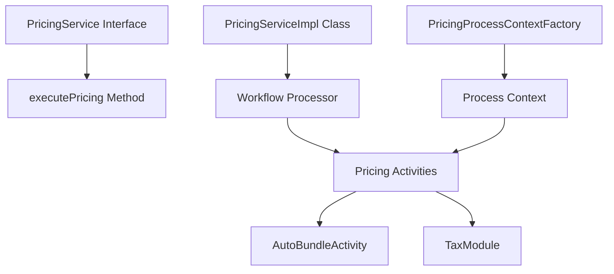

# Introduction to Pricing in Core Module

Pricing refers to the functionality that handles the calculation of prices for orders. It ensures that the correct prices are applied to the items in an order, taking into account various factors such as discounts, taxes, and shipping costs.

# <SwmToken path="core/broadleaf-framework/src/main/java/org/broadleafcommerce/core/pricing/service/PricingServiceImpl.java" pos="31:8:8" line-data="public class PricingServiceImpl implements PricingService {">`PricingService`</SwmToken> Interface

The <SwmToken path="core/broadleaf-framework/src/main/java/org/broadleafcommerce/core/pricing/service/PricingServiceImpl.java" pos="31:8:8" line-data="public class PricingServiceImpl implements PricingService {">`PricingService`</SwmToken> interface defines the contract for executing pricing on an order. It includes the method <SwmToken path="core/broadleaf-framework/src/main/java/org/broadleafcommerce/core/pricing/service/PricingServiceImpl.java" pos="37:5:5" line-data="    public Order executePricing(Order order) throws PricingException {">`executePricing`</SwmToken> which takes an order and applies the necessary pricing logic, potentially throwing a <SwmToken path="core/broadleaf-framework/src/main/java/org/broadleafcommerce/core/pricing/service/PricingServiceImpl.java" pos="21:14:14" line-data="import org.broadleafcommerce.core.pricing.service.exception.PricingException;">`PricingException`</SwmToken> if an error occurs.

# <SwmToken path="core/broadleaf-framework/src/main/java/org/broadleafcommerce/core/pricing/service/PricingServiceImpl.java" pos="31:4:4" line-data="public class PricingServiceImpl implements PricingService {">`PricingServiceImpl`</SwmToken> Class

The <SwmToken path="core/broadleaf-framework/src/main/java/org/broadleafcommerce/core/pricing/service/PricingServiceImpl.java" pos="31:4:4" line-data="public class PricingServiceImpl implements PricingService {">`PricingServiceImpl`</SwmToken> class is the implementation of the <SwmToken path="core/broadleaf-framework/src/main/java/org/broadleafcommerce/core/pricing/service/PricingServiceImpl.java" pos="31:8:8" line-data="public class PricingServiceImpl implements PricingService {">`PricingService`</SwmToken> interface. It uses a workflow processor to execute a series of pricing activities on the order. The result is an updated order with all pricing calculations applied.

<SwmSnippet path="/core/broadleaf-framework/src/main/java/org/broadleafcommerce/core/pricing/service/PricingServiceImpl.java" line="30">

---

The <SwmToken path="core/broadleaf-framework/src/main/java/org/broadleafcommerce/core/pricing/service/PricingServiceImpl.java" pos="31:4:4" line-data="public class PricingServiceImpl implements PricingService {">`PricingServiceImpl`</SwmToken> class is annotated with <SwmToken path="core/broadleaf-framework/src/main/java/org/broadleafcommerce/core/pricing/service/PricingServiceImpl.java" pos="30:0:1" line-data="@Service(&quot;blPricingService&quot;)">`@Service`</SwmToken> and implements the <SwmToken path="core/broadleaf-framework/src/main/java/org/broadleafcommerce/core/pricing/service/PricingServiceImpl.java" pos="31:8:8" line-data="public class PricingServiceImpl implements PricingService {">`PricingService`</SwmToken> interface.

```java
@Service("blPricingService")
public class PricingServiceImpl implements PricingService {
```

---

</SwmSnippet>

# Pricing Workflow

The pricing workflow is composed of various modules and activities that handle specific aspects of pricing. For example, the <SwmToken path="core/broadleaf-framework/src/main/java/org/broadleafcommerce/core/pricing/service/workflow/AutoBundleActivity.java" pos="58:4:4" line-data="public class AutoBundleActivity extends BaseActivity&lt;ProcessContext&lt;Order&gt;&gt; {">`AutoBundleActivity`</SwmToken> automatically bundles items in the cart if they match certain criteria, and the `TaxModule` calculates the applicable taxes for the order.

# <SwmToken path="core/broadleaf-framework/src/main/java/org/broadleafcommerce/core/pricing/service/workflow/AutoBundleActivity.java" pos="58:4:4" line-data="public class AutoBundleActivity extends BaseActivity&lt;ProcessContext&lt;Order&gt;&gt; {">`AutoBundleActivity`</SwmToken> Class

The <SwmToken path="core/broadleaf-framework/src/main/java/org/broadleafcommerce/core/pricing/service/workflow/AutoBundleActivity.java" pos="58:4:4" line-data="public class AutoBundleActivity extends BaseActivity&lt;ProcessContext&lt;Order&gt;&gt; {">`AutoBundleActivity`</SwmToken> class automatically bundles items in the cart if they match certain criteria.

<SwmSnippet path="/core/broadleaf-framework/src/main/java/org/broadleafcommerce/core/pricing/service/workflow/AutoBundleActivity.java" line="48">

---

The <SwmToken path="core/broadleaf-framework/src/main/java/org/broadleafcommerce/core/pricing/service/workflow/AutoBundleActivity.java" pos="58:4:4" line-data="public class AutoBundleActivity extends BaseActivity&lt;ProcessContext&lt;Order&gt;&gt; {">`AutoBundleActivity`</SwmToken> class description and its dependencies are defined here.

```java
/**
 * This pricing workflow step will automatically bundle items in the cart.
 *
 * For example, if a ProductBundle exists of two items and the user has
 * one of the items in their cart.   If they then add the second item,
 * this activity will replace the two items with the ProductBundle.
 *
 * This only occurs if the ProductBundle is set to "automatically" bundle.
 *
 */
public class AutoBundleActivity extends BaseActivity<ProcessContext<Order>> {
    @Resource(name="blCatalogService")
    protected CatalogService catalogService;

    @Resource(name="blOrderService")
    protected OrderService orderService;

    @Resource(name="blOrderItemDao")
    protected OrderItemDao orderItemDao;

    @Resource(name="blFulfillmentGroupItemDao")
```

---

</SwmSnippet>

# <SwmToken path="core/broadleaf-framework/src/main/java/org/broadleafcommerce/core/pricing/service/workflow/PricingProcessContextFactory.java" pos="26:4:4" line-data="public class PricingProcessContextFactory implements ProcessContextFactory&lt;Order, Order&gt; {">`PricingProcessContextFactory`</SwmToken> Class

The <SwmToken path="core/broadleaf-framework/src/main/java/org/broadleafcommerce/core/pricing/service/workflow/PricingProcessContextFactory.java" pos="26:4:4" line-data="public class PricingProcessContextFactory implements ProcessContextFactory&lt;Order, Order&gt; {">`PricingProcessContextFactory`</SwmToken> is responsible for creating the process context used in the pricing workflow. It initializes the context with the order data, which is then passed through the various pricing activities.

<SwmSnippet path="/core/broadleaf-framework/src/main/java/org/broadleafcommerce/core/pricing/service/workflow/PricingProcessContextFactory.java" line="1">

---

The <SwmToken path="core/broadleaf-framework/src/main/java/org/broadleafcommerce/core/pricing/service/workflow/PricingProcessContextFactory.java" pos="26:4:4" line-data="public class PricingProcessContextFactory implements ProcessContextFactory&lt;Order, Order&gt; {">`PricingProcessContextFactory`</SwmToken> class initializes the process context with the order data.

```java
/*-
 * #%L
 * BroadleafCommerce Framework
 * %%
 * Copyright (C) 2009 - 2024 Broadleaf Commerce
 * %%
 * Licensed under the Broadleaf Fair Use License Agreement, Version 1.0
 * (the "Fair Use License" located  at http://license.broadleafcommerce.org/fair_use_license-1.0.txt)
 * unless the restrictions on use therein are violated and require payment to Broadleaf in which case
 * the Broadleaf End User License Agreement (EULA), Version 1.1
 * (the "Commercial License" located at http://license.broadleafcommerce.org/commercial_license-1.1.txt)
 * shall apply.
 * 
 * Alternatively, the Commercial License may be replaced with a mutually agreed upon license (the "Custom License")
 * between you and Broadleaf Commerce. You may not use this file except in compliance with the applicable license.
 * #L%
 */
package org.broadleafcommerce.core.pricing.service.workflow;

import org.broadleafcommerce.core.order.domain.Order;
```

---

</SwmSnippet>

# Pricing Endpoints

Pricing endpoints are methods that handle specific pricing calculations during the workflow.

## <SwmToken path="core/broadleaf-framework/src/main/java/org/broadleafcommerce/core/pricing/service/fulfillment/provider/FulfillmentPricingProvider.java" pos="47:5:5" line-data="    public FulfillmentGroup calculateCostForFulfillmentGroup(FulfillmentGroup fulfillmentGroup) throws FulfillmentPriceException;">`calculateCostForFulfillmentGroup`</SwmToken>

The <SwmToken path="core/broadleaf-framework/src/main/java/org/broadleafcommerce/core/pricing/service/fulfillment/provider/FulfillmentPricingProvider.java" pos="47:5:5" line-data="    public FulfillmentGroup calculateCostForFulfillmentGroup(FulfillmentGroup fulfillmentGroup) throws FulfillmentPriceException;">`calculateCostForFulfillmentGroup`</SwmToken> method calculates the total cost for a given <SwmToken path="core/broadleaf-framework/src/main/java/org/broadleafcommerce/core/pricing/service/fulfillment/provider/FulfillmentPricingProvider.java" pos="37:15:15" line-data="     * Calculates the total cost for this FulfillmentGroup. Specific configurations for calculating">`FulfillmentGroup`</SwmToken>. It is invoked during the pricing workflow and sets the shipping price on the <SwmToken path="core/broadleaf-framework/src/main/java/org/broadleafcommerce/core/pricing/service/fulfillment/provider/FulfillmentPricingProvider.java" pos="37:15:15" line-data="     * Calculates the total cost for this FulfillmentGroup. Specific configurations for calculating">`FulfillmentGroup`</SwmToken>.

<SwmSnippet path="/core/broadleaf-framework/src/main/java/org/broadleafcommerce/core/pricing/service/fulfillment/provider/FulfillmentPricingProvider.java" line="37">

---

The <SwmToken path="core/broadleaf-framework/src/main/java/org/broadleafcommerce/core/pricing/service/fulfillment/provider/FulfillmentPricingProvider.java" pos="47:5:5" line-data="    public FulfillmentGroup calculateCostForFulfillmentGroup(FulfillmentGroup fulfillmentGroup) throws FulfillmentPriceException;">`calculateCostForFulfillmentGroup`</SwmToken> method calculates the total cost for a given <SwmToken path="core/broadleaf-framework/src/main/java/org/broadleafcommerce/core/pricing/service/fulfillment/provider/FulfillmentPricingProvider.java" pos="37:15:15" line-data="     * Calculates the total cost for this FulfillmentGroup. Specific configurations for calculating">`FulfillmentGroup`</SwmToken>.

```java
     * Calculates the total cost for this FulfillmentGroup. Specific configurations for calculating
     * this cost can come from {@link FulfillmentGroup#getFulfillmentOption()}. This method is invoked
     * during the pricing workflow and will only be called if {@link #canCalculateCostForFulfillmentGroup(FulfillmentGroup, FulfillmentOption)}
     * returns true. This should call {@link FulfillmentGroup#setShippingPrice(org.broadleafcommerce.common.money.Money)} to
     * set the shipping price on <b>fulfillmentGroup</b>
     * 
     * @param fulfillmentGroup - the {@link FulfillmentGroup} to calculate costs for
     * @return the modified {@link FulfillmentGroup} with correct pricing. This is typically <b>fulfillmentGroup</b> after it
     * has been modified
     */
    public FulfillmentGroup calculateCostForFulfillmentGroup(FulfillmentGroup fulfillmentGroup) throws FulfillmentPriceException;
```

---

</SwmSnippet>

## <SwmToken path="core/broadleaf-framework/src/main/java/org/broadleafcommerce/core/pricing/service/fulfillment/provider/FulfillmentPricingProvider.java" pos="77:5:5" line-data="    public FulfillmentEstimationResponse estimateCostForFulfillmentGroup(FulfillmentGroup fulfillmentGroup, Set&lt;FulfillmentOption&gt; options) throws FulfillmentPriceException;">`estimateCostForFulfillmentGroup`</SwmToken>

The <SwmToken path="core/broadleaf-framework/src/main/java/org/broadleafcommerce/core/pricing/service/fulfillment/provider/FulfillmentPricingProvider.java" pos="77:5:5" line-data="    public FulfillmentEstimationResponse estimateCostForFulfillmentGroup(FulfillmentGroup fulfillmentGroup, Set&lt;FulfillmentOption&gt; options) throws FulfillmentPriceException;">`estimateCostForFulfillmentGroup`</SwmToken> method estimates the cost for fulfilling a given <SwmToken path="core/broadleaf-framework/src/main/java/org/broadleafcommerce/core/pricing/service/fulfillment/provider/FulfillmentPricingProvider.java" pos="37:15:15" line-data="     * Calculates the total cost for this FulfillmentGroup. Specific configurations for calculating">`FulfillmentGroup`</SwmToken> with the provided options. It returns a DTO representing pricing information that might be added to the fulfillment cost.

<SwmSnippet path="/core/broadleaf-framework/src/main/java/org/broadleafcommerce/core/pricing/service/fulfillment/provider/FulfillmentPricingProvider.java" line="63">

---

The <SwmToken path="core/broadleaf-framework/src/main/java/org/broadleafcommerce/core/pricing/service/fulfillment/provider/FulfillmentPricingProvider.java" pos="77:5:5" line-data="    public FulfillmentEstimationResponse estimateCostForFulfillmentGroup(FulfillmentGroup fulfillmentGroup, Set&lt;FulfillmentOption&gt; options) throws FulfillmentPriceException;">`estimateCostForFulfillmentGroup`</SwmToken> method estimates the cost for fulfilling a given <SwmToken path="core/broadleaf-framework/src/main/java/org/broadleafcommerce/core/pricing/service/fulfillment/provider/FulfillmentPricingProvider.java" pos="67:20:20" line-data="     * {@link #canCalculateCostForFulfillmentGroup(org.broadleafcommerce.core.order.domain.FulfillmentGroup, org.broadleafcommerce.core.order.domain.FulfillmentOption)}">`FulfillmentGroup`</SwmToken> with the provided options.

```java
     * Estimates the cost for the fulfilling the given fulfillment group
     * Estimates the cost for the fulfilling the given fulfillment group with the given options. The response should not include prices that the implementor of this interface
     * cannot respond to.  So, if the invoker of this method passes in several types of fulfillment options, the response should only contain prices for the fulfillment options
     * that will would cause a call to
     * {@link #canCalculateCostForFulfillmentGroup(org.broadleafcommerce.core.order.domain.FulfillmentGroup, org.broadleafcommerce.core.order.domain.FulfillmentOption)}
     * to return true.  This method may return null or it may return a non-null response with an empty map, indicating that no price estimate was available for the options given. This
     * method SHOULD NOT throw an exception if it encounters a FulfillmentOption that it can not price. It should simply ignore that option.
     * 
     * @param fulfillmentGroup - the group to estimate fulfillment costs for
     * @param options - the candidate options that a user might select
     * @return a DTO that represents pricing information that might be added to the fulfillment cost of <b>fulfillmentGroup</b> when
     * {@link #calculateCostForFulfillmentGroup(FulfillmentGroup)} is invoked during the pricing workflow
     * @see {@link FulfillmentPricingService}, {@link FulfillmentOption}
     */
    public FulfillmentEstimationResponse estimateCostForFulfillmentGroup(FulfillmentGroup fulfillmentGroup, Set<FulfillmentOption> options) throws FulfillmentPriceException;
```

---

</SwmSnippet>

&nbsp;

*This is an auto-generated document by Swimm AI 🌊 and has not yet been verified by a human*

<SwmMeta version="3.0.0" repo-id="Z2l0aHViJTNBJTNBQnJvYWRsZWFmQ29tbWVyY2UtZGVtby1uZXclM0ElM0FTd2ltbS1EZW1v" repo-name="BroadleafCommerce-demo-new" doc-type="overview"><sup>Powered by [Swimm](/)</sup></SwmMeta>
