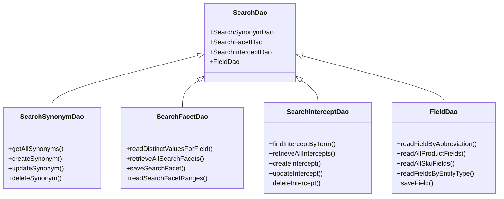

# Introduction

The Data Access Object (DAO) pattern is used to abstract and encapsulate all access to the data source. In the context of search functionalities, DAOs like <SwmToken path="core/broadleaf-framework/src/main/java/org/broadleafcommerce/core/search/dao/SearchSynonymDao.java" pos="24:4:4" line-data="public interface SearchSynonymDao {">`SearchSynonymDao`</SwmToken>, <SwmToken path="core/broadleaf-framework/src/main/java/org/broadleafcommerce/core/search/service/DatabaseSearchServiceImpl.java" pos="26:12:12" line-data="import org.broadleafcommerce.core.search.dao.SearchFacetDao;">`SearchFacetDao`</SwmToken>, and `SearchInterceptDao` define methods for interacting with search-related data entities.

# <SwmToken path="core/broadleaf-framework/src/main/java/org/broadleafcommerce/core/search/dao/SearchSynonymDao.java" pos="24:4:4" line-data="public interface SearchSynonymDao {">`SearchSynonymDao`</SwmToken>

<SwmToken path="core/broadleaf-framework/src/main/java/org/broadleafcommerce/core/search/dao/SearchSynonymDao.java" pos="24:4:4" line-data="public interface SearchSynonymDao {">`SearchSynonymDao`</SwmToken> provides methods to manage search synonyms, including retrieving all synonyms, creating, updating, and deleting them.

<SwmSnippet path="/core/broadleaf-framework/src/main/java/org/broadleafcommerce/core/search/dao/SearchSynonymDao.java" line="24">

---

The interface <SwmToken path="core/broadleaf-framework/src/main/java/org/broadleafcommerce/core/search/dao/SearchSynonymDao.java" pos="24:4:4" line-data="public interface SearchSynonymDao {">`SearchSynonymDao`</SwmToken> defines methods for managing search synonyms.

```java
public interface SearchSynonymDao {
    public List<SearchSynonym> getAllSynonyms();
    public void createSynonym(SearchSynonym synonym);
    public void updateSynonym(SearchSynonym synonym);
    public void deleteSynonym(SearchSynonym synonym);
}
```

---

</SwmSnippet>

# <SwmToken path="core/broadleaf-framework/src/main/java/org/broadleafcommerce/core/search/service/DatabaseSearchServiceImpl.java" pos="26:12:12" line-data="import org.broadleafcommerce.core.search.dao.SearchFacetDao;">`SearchFacetDao`</SwmToken>

<SwmToken path="core/broadleaf-framework/src/main/java/org/broadleafcommerce/core/search/service/DatabaseSearchServiceImpl.java" pos="26:12:12" line-data="import org.broadleafcommerce.core.search.dao.SearchFacetDao;">`SearchFacetDao`</SwmToken> offers methods to handle search facets, such as reading distinct values for a field, retrieving all search facets for an entity type, saving a search facet, and reading search facet ranges.

# SearchInterceptDao

`SearchInterceptDao` (deprecated) defines methods for managing search intercepts, including finding intercepts by term, retrieving all intercepts, and CRUD operations on intercepts.

# <SwmToken path="core/broadleaf-framework/src/main/java/org/broadleafcommerce/core/search/service/DatabaseSearchServiceImpl.java" pos="25:12:12" line-data="import org.broadleafcommerce.core.search.dao.FieldDao;">`FieldDao`</SwmToken>

<SwmToken path="core/broadleaf-framework/src/main/java/org/broadleafcommerce/core/search/service/DatabaseSearchServiceImpl.java" pos="25:12:12" line-data="import org.broadleafcommerce.core.search.dao.FieldDao;">`FieldDao`</SwmToken> defines methods for interacting with Broadleaf fields, such as reading fields by abbreviation, reading all product or SKU fields, reading fields by entity type, and saving a field.

# <SwmToken path="core/broadleaf-framework/src/main/java/org/broadleafcommerce/core/search/service/DatabaseSearchServiceImpl.java" pos="25:12:12" line-data="import org.broadleafcommerce.core.search.dao.FieldDao;">`FieldDao`</SwmToken> Usage

<SwmToken path="core/broadleaf-framework/src/main/java/org/broadleafcommerce/core/search/service/DatabaseSearchServiceImpl.java" pos="25:12:12" line-data="import org.broadleafcommerce.core.search.dao.FieldDao;">`FieldDao`</SwmToken> is used in <SwmToken path="core/broadleaf-framework/src/main/java/org/broadleafcommerce/core/search/service/DatabaseSearchServiceImpl.java" pos="56:4:4" line-data="public class DatabaseSearchServiceImpl implements SearchService {">`DatabaseSearchServiceImpl`</SwmToken> to interact with field data. It is injected as a resource named <SwmToken path="core/broadleaf-framework/src/main/java/org/broadleafcommerce/core/search/dao/FieldDaoImpl.java" pos="37:4:4" line-data="@Repository(&quot;blFieldDao&quot;)">`blFieldDao`</SwmToken>.

<SwmSnippet path="/core/broadleaf-framework/src/main/java/org/broadleafcommerce/core/search/service/DatabaseSearchServiceImpl.java" line="24">

---

The <SwmToken path="core/broadleaf-framework/src/main/java/org/broadleafcommerce/core/search/service/DatabaseSearchServiceImpl.java" pos="25:12:12" line-data="import org.broadleafcommerce.core.search.dao.FieldDao;">`FieldDao`</SwmToken> is injected into <SwmToken path="core/broadleaf-framework/src/main/java/org/broadleafcommerce/core/search/service/DatabaseSearchServiceImpl.java" pos="56:4:4" line-data="public class DatabaseSearchServiceImpl implements SearchService {">`DatabaseSearchServiceImpl`</SwmToken> to interact with field data.

```java
import org.broadleafcommerce.core.catalog.service.CatalogService;
import org.broadleafcommerce.core.search.dao.FieldDao;
import org.broadleafcommerce.core.search.dao.SearchFacetDao;
import org.broadleafcommerce.core.search.domain.CategorySearchFacet;
import org.broadleafcommerce.core.search.domain.Field;
import org.broadleafcommerce.core.search.domain.FieldEntity;
import org.broadleafcommerce.core.search.domain.SearchCriteria;
import org.broadleafcommerce.core.search.domain.SearchFacet;
import org.broadleafcommerce.core.search.domain.SearchFacetDTO;
import org.broadleafcommerce.core.search.domain.SearchFacetRange;
import org.broadleafcommerce.core.search.domain.SearchFacetResultDTO;
import org.broadleafcommerce.core.search.domain.SearchResult;
import org.broadleafcommerce.core.search.service.solr.SolrSearchServiceImpl;
import org.springframework.stereotype.Service;

import java.util.ArrayList;
import java.util.Collections;
import java.util.Comparator;
import java.util.HashMap;
import java.util.List;
import java.util.Map;
```

---

</SwmSnippet>

# <SwmToken path="core/broadleaf-framework/src/main/java/org/broadleafcommerce/core/search/service/DatabaseSearchServiceImpl.java" pos="25:12:12" line-data="import org.broadleafcommerce.core.search.dao.FieldDao;">`FieldDao`</SwmToken> Implementation

<SwmToken path="core/broadleaf-framework/src/main/java/org/broadleafcommerce/core/search/dao/FieldDaoImpl.java" pos="38:4:4" line-data="public class FieldDaoImpl implements FieldDao {">`FieldDaoImpl`</SwmToken> provides the actual implementation of the <SwmToken path="core/broadleaf-framework/src/main/java/org/broadleafcommerce/core/search/service/DatabaseSearchServiceImpl.java" pos="25:12:12" line-data="import org.broadleafcommerce.core.search.dao.FieldDao;">`FieldDao`</SwmToken> interface, using JPA to interact with the database.

<SwmSnippet path="/core/broadleaf-framework/src/main/java/org/broadleafcommerce/core/search/dao/FieldDaoImpl.java" line="37">

---

The class <SwmToken path="core/broadleaf-framework/src/main/java/org/broadleafcommerce/core/search/dao/FieldDaoImpl.java" pos="38:4:4" line-data="public class FieldDaoImpl implements FieldDao {">`FieldDaoImpl`</SwmToken> implements the <SwmToken path="core/broadleaf-framework/src/main/java/org/broadleafcommerce/core/search/dao/FieldDaoImpl.java" pos="38:8:8" line-data="public class FieldDaoImpl implements FieldDao {">`FieldDao`</SwmToken> interface using JPA.

```java
@Repository("blFieldDao")
public class FieldDaoImpl implements FieldDao {

    @PersistenceContext(unitName = "blPU")
    protected EntityManager em;
    
    @Resource(name="blEntityConfiguration")
    protected EntityConfiguration entityConfiguration;
    
    @Override
    public Field readFieldByAbbreviation(String abbreviation) {
        CriteriaBuilder builder = em.getCriteriaBuilder();
        CriteriaQuery<Field> criteria = builder.createQuery(Field.class);
        
        Root<FieldImpl> root = criteria.from(FieldImpl.class);
        
        criteria.select(root);
        criteria.where(
            builder.equal(root.get("abbreviation").as(String.class), abbreviation)
        );
```

---

</SwmSnippet>

# Main Functions

There are several main functions in this folder. Some of them are <SwmToken path="core/broadleaf-framework/src/main/java/org/broadleafcommerce/core/search/dao/FieldDaoImpl.java" pos="47:5:5" line-data="    public Field readFieldByAbbreviation(String abbreviation) {">`readFieldByAbbreviation`</SwmToken>, <SwmToken path="core/broadleaf-framework/src/main/java/org/broadleafcommerce/core/search/dao/FieldDaoImpl.java" pos="71:8:8" line-data="    public List&lt;Field&gt; readAllProductFields() {">`readAllProductFields`</SwmToken>, <SwmToken path="core/broadleaf-framework/src/main/java/org/broadleafcommerce/core/search/dao/FieldDaoImpl.java" pos="77:8:8" line-data="    public List&lt;Field&gt; readAllSkuFields() {">`readAllSkuFields`</SwmToken>, <SwmToken path="core/broadleaf-framework/src/main/java/org/broadleafcommerce/core/search/dao/FieldDaoImpl.java" pos="72:3:3" line-data="        return readFieldsByEntityType(FieldEntity.PRODUCT);">`readFieldsByEntityType`</SwmToken>, <SwmToken path="core/broadleaf-framework/src/main/java/org/broadleafcommerce/core/search/dao/SearchSynonymDao.java" pos="25:8:8" line-data="    public List&lt;SearchSynonym&gt; getAllSynonyms();">`getAllSynonyms`</SwmToken>, <SwmToken path="core/broadleaf-framework/src/main/java/org/broadleafcommerce/core/search/dao/SearchSynonymDao.java" pos="26:5:5" line-data="    public void createSynonym(SearchSynonym synonym);">`createSynonym`</SwmToken>, <SwmToken path="core/broadleaf-framework/src/main/java/org/broadleafcommerce/core/search/dao/SearchSynonymDao.java" pos="28:5:5" line-data="    public void deleteSynonym(SearchSynonym synonym);">`deleteSynonym`</SwmToken>, and <SwmToken path="core/broadleaf-framework/src/main/java/org/broadleafcommerce/core/search/dao/SearchSynonymDao.java" pos="27:5:5" line-data="    public void updateSynonym(SearchSynonym synonym);">`updateSynonym`</SwmToken>. We will dive a little into <SwmToken path="core/broadleaf-framework/src/main/java/org/broadleafcommerce/core/search/dao/FieldDaoImpl.java" pos="47:5:5" line-data="    public Field readFieldByAbbreviation(String abbreviation) {">`readFieldByAbbreviation`</SwmToken> and <SwmToken path="core/broadleaf-framework/src/main/java/org/broadleafcommerce/core/search/dao/SearchSynonymDao.java" pos="25:8:8" line-data="    public List&lt;SearchSynonym&gt; getAllSynonyms();">`getAllSynonyms`</SwmToken>.

## <SwmToken path="core/broadleaf-framework/src/main/java/org/broadleafcommerce/core/search/dao/FieldDaoImpl.java" pos="47:5:5" line-data="    public Field readFieldByAbbreviation(String abbreviation) {">`readFieldByAbbreviation`</SwmToken>

The <SwmToken path="core/broadleaf-framework/src/main/java/org/broadleafcommerce/core/search/dao/FieldDaoImpl.java" pos="47:5:5" line-data="    public Field readFieldByAbbreviation(String abbreviation) {">`readFieldByAbbreviation`</SwmToken> function retrieves a <SwmToken path="core/broadleaf-framework/src/main/java/org/broadleafcommerce/core/search/service/DatabaseSearchServiceImpl.java" pos="28:12:12" line-data="import org.broadleafcommerce.core.search.domain.Field;">`Field`</SwmToken> object based on its abbreviation. It uses the <SwmToken path="core/broadleaf-framework/src/main/java/org/broadleafcommerce/core/search/dao/FieldDaoImpl.java" pos="48:1:1" line-data="        CriteriaBuilder builder = em.getCriteriaBuilder();">`CriteriaBuilder`</SwmToken> to create a query that searches for the field with the specified abbreviation.

<SwmSnippet path="/core/broadleaf-framework/src/main/java/org/broadleafcommerce/core/search/dao/FieldDaoImpl.java" line="46">

---

The <SwmToken path="core/broadleaf-framework/src/main/java/org/broadleafcommerce/core/search/dao/FieldDaoImpl.java" pos="47:5:5" line-data="    public Field readFieldByAbbreviation(String abbreviation) {">`readFieldByAbbreviation`</SwmToken> function in <SwmToken path="core/broadleaf-framework/src/main/java/org/broadleafcommerce/core/search/dao/FieldDaoImpl.java" pos="38:4:4" line-data="public class FieldDaoImpl implements FieldDao {">`FieldDaoImpl`</SwmToken> retrieves a <SwmToken path="core/broadleaf-framework/src/main/java/org/broadleafcommerce/core/search/dao/FieldDaoImpl.java" pos="47:3:3" line-data="    public Field readFieldByAbbreviation(String abbreviation) {">`Field`</SwmToken> object based on its abbreviation.

```java
    @Override
    public Field readFieldByAbbreviation(String abbreviation) {
        CriteriaBuilder builder = em.getCriteriaBuilder();
        CriteriaQuery<Field> criteria = builder.createQuery(Field.class);
        
        Root<FieldImpl> root = criteria.from(FieldImpl.class);
        
        criteria.select(root);
        criteria.where(
            builder.equal(root.get("abbreviation").as(String.class), abbreviation)
        );

        TypedQuery<Field> query = em.createQuery(criteria);
        query.setHint(QueryHints.HINT_CACHEABLE, true);
        query.setHint(QueryHints.HINT_CACHE_REGION, "query.Catalog");

        try {
            return query.getSingleResult();
        } catch (javax.persistence.NoResultException e) {
            //must not be an abbreviation
            return null;
```

---

</SwmSnippet>

## <SwmToken path="core/broadleaf-framework/src/main/java/org/broadleafcommerce/core/search/dao/SearchSynonymDao.java" pos="25:8:8" line-data="    public List&lt;SearchSynonym&gt; getAllSynonyms();">`getAllSynonyms`</SwmToken>

The <SwmToken path="core/broadleaf-framework/src/main/java/org/broadleafcommerce/core/search/dao/SearchSynonymDao.java" pos="25:8:8" line-data="    public List&lt;SearchSynonym&gt; getAllSynonyms();">`getAllSynonyms`</SwmToken> function retrieves all search synonyms from the database. It executes a named query <SwmToken path="core/broadleaf-framework/src/main/java/org/broadleafcommerce/core/search/dao/SearchSynonymDaoImpl.java" pos="37:12:12" line-data="        Query query = em.createNamedQuery(&quot;BC_READ_SEARCH_SYNONYMS&quot;);">`BC_READ_SEARCH_SYNONYMS`</SwmToken> and returns the result list.

<SwmSnippet path="/core/broadleaf-framework/src/main/java/org/broadleafcommerce/core/search/dao/SearchSynonymDaoImpl.java" line="36">

---

The <SwmToken path="core/broadleaf-framework/src/main/java/org/broadleafcommerce/core/search/dao/SearchSynonymDaoImpl.java" pos="36:8:8" line-data="    public List&lt;SearchSynonym&gt; getAllSynonyms() {">`getAllSynonyms`</SwmToken> function in <SwmToken path="core/broadleaf-framework/src/main/java/org/broadleafcommerce/core/search/dao/SearchSynonymDaoImpl.java" pos="30:4:4" line-data="public class SearchSynonymDaoImpl implements SearchSynonymDao {">`SearchSynonymDaoImpl`</SwmToken> retrieves all search synonyms from the database.

```java
    public List<SearchSynonym> getAllSynonyms() {
        Query query = em.createNamedQuery("BC_READ_SEARCH_SYNONYMS");
        List<SearchSynonym> result;
        try {
            result = (List<SearchSynonym>) query.getResultList();
        } catch (NoResultException e) {
            result = null;
        }
        return result;
    }
```

---

</SwmSnippet>

&nbsp;

*This is an auto-generated document by Swimm AI 🌊 and has not yet been verified by a human*

<SwmMeta version="3.0.0" repo-id="Z2l0aHViJTNBJTNBQnJvYWRsZWFmQ29tbWVyY2UtZGVtby1uZXclM0ElM0FTd2ltbS1EZW1v" repo-name="BroadleafCommerce-demo-new" doc-type="overview"><sup>Powered by [Swimm](/)</sup></SwmMeta>
