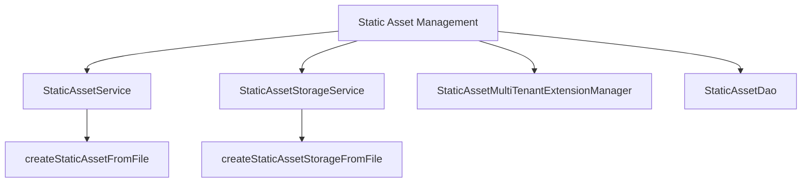

# Introduction to Static Asset Management

Static asset management in Broadleaf Commerce involves handling files such as images, videos, and other media used throughout the e-commerce platform. This process includes creating, reading, updating, and deleting these assets, as well as storing them either in the database or the file system.

# <SwmToken path="admin/broadleaf-contentmanagement-module/src/main/java/org/broadleafcommerce/cms/file/service/StaticAssetService.java" pos="32:4:4" line-data="public interface StaticAssetService {">`StaticAssetService`</SwmToken> Interface

The <SwmToken path="admin/broadleaf-contentmanagement-module/src/main/java/org/broadleafcommerce/cms/file/service/StaticAssetService.java" pos="32:4:4" line-data="public interface StaticAssetService {">`StaticAssetService`</SwmToken> interface provides methods for managing static assets. These methods include creating, reading, updating, and deleting static assets. The <SwmToken path="admin/broadleaf-contentmanagement-module/src/main/java/org/broadleafcommerce/cms/file/service/StaticAssetStorageService.java" pos="117:15:15" line-data="     * usually created from {@link StaticAssetService#createStaticAssetFromFile(MultipartFile, Map)}">`createStaticAssetFromFile`</SwmToken> method is particularly important as it handles the uploading of files and the creation of corresponding assets.

<SwmSnippet path="/admin/broadleaf-contentmanagement-module/src/main/java/org/broadleafcommerce/cms/file/service/StaticAssetService.java" line="29">

---

The <SwmToken path="admin/broadleaf-contentmanagement-module/src/main/java/org/broadleafcommerce/cms/file/service/StaticAssetService.java" pos="32:4:4" line-data="public interface StaticAssetService {">`StaticAssetService`</SwmToken> interface defines methods for managing static assets, including finding assets by ID or URL, reading all assets, and counting total assets.

```java
/**
 * Created by bpolster.
 */
public interface StaticAssetService {


    public StaticAsset findStaticAssetById(Long id);
    
    public List<StaticAsset> readAllStaticAssets();

    public StaticAsset findStaticAssetByFullUrl(String fullUrl);

    Long findTotalStaticAssetCount();

```

---

</SwmSnippet>

# <SwmToken path="admin/broadleaf-contentmanagement-module/src/main/java/org/broadleafcommerce/cms/file/service/StaticAssetStorageService.java" pos="117:15:15" line-data="     * usually created from {@link StaticAssetService#createStaticAssetFromFile(MultipartFile, Map)}">`createStaticAssetFromFile`</SwmToken> Method

The <SwmToken path="admin/broadleaf-contentmanagement-module/src/main/java/org/broadleafcommerce/cms/file/service/StaticAssetStorageService.java" pos="117:15:15" line-data="     * usually created from {@link StaticAssetService#createStaticAssetFromFile(MultipartFile, Map)}">`createStaticAssetFromFile`</SwmToken> method is used to upload a file and create the corresponding asset. Depending on the implementation, the asset may be saved to the database or the file system. This method also allows for additional metadata properties to be specified.

# <SwmToken path="admin/broadleaf-contentmanagement-module/src/main/java/org/broadleafcommerce/cms/file/service/StaticAssetStorageService.java" pos="33:4:4" line-data="public interface StaticAssetStorageService {">`StaticAssetStorageService`</SwmToken> Interface

The <SwmToken path="admin/broadleaf-contentmanagement-module/src/main/java/org/broadleafcommerce/cms/file/service/StaticAssetStorageService.java" pos="33:4:4" line-data="public interface StaticAssetStorageService {">`StaticAssetStorageService`</SwmToken> is responsible for the actual storage of static assets, whether on the file system or in the database. This service ensures that the physical files are correctly stored and retrieved.

<SwmSnippet path="/admin/broadleaf-contentmanagement-module/src/main/java/org/broadleafcommerce/cms/file/service/StaticAssetStorageService.java" line="29">

---

The <SwmToken path="admin/broadleaf-contentmanagement-module/src/main/java/org/broadleafcommerce/cms/file/service/StaticAssetStorageService.java" pos="33:4:4" line-data="public interface StaticAssetStorageService {">`StaticAssetStorageService`</SwmToken> interface defines methods for storing static assets, including finding storage by ID and creating storage from a file.

```java
/**
 * @author Jeff Fischer
 *
 */
public interface StaticAssetStorageService {

    /**
     * Returns a StaticAssetStorage object.   Assumes that the asset is stored in the Database.
     * 
     * Storing Assets in the DB is not the preferred mechanism for Broadleaf as of 3.0 so in most cases, this 
     * method would not be used by Broadleaf implementations.
     * 
     * @param id
     * @return
     */
    StaticAssetStorage findStaticAssetStorageById(Long id);

    /**
     * @deprecated   Use createStaticAssetStorageFromFile instead.
     * @return
     */
```

---

</SwmSnippet>

# <SwmToken path="admin/broadleaf-contentmanagement-module/src/main/java/org/broadleafcommerce/cms/file/service/StaticAssetStorageService.java" pos="47:8:8" line-data="     * @deprecated   Use createStaticAssetStorageFromFile instead.">`createStaticAssetStorageFromFile`</SwmToken> Method

The <SwmToken path="admin/broadleaf-contentmanagement-module/src/main/java/org/broadleafcommerce/cms/file/service/StaticAssetStorageService.java" pos="47:8:8" line-data="     * @deprecated   Use createStaticAssetStorageFromFile instead.">`createStaticAssetStorageFromFile`</SwmToken> method persists the file to the database or file system according to the static asset's storage type. This method is typically called from a controller like the <SwmToken path="admin/broadleaf-contentmanagement-module/src/main/java/org/broadleafcommerce/cms/file/service/StaticAssetStorageService.java" pos="113:21:21" line-data="     * MultipartFile is passed in from a Controller like the AdminAssetUploadController ">`AdminAssetUploadController`</SwmToken>.

<SwmSnippet path="/admin/broadleaf-contentmanagement-module/src/main/java/org/broadleafcommerce/cms/file/service/StaticAssetStorageService.java" line="112">

---

The <SwmToken path="admin/broadleaf-contentmanagement-module/src/main/java/org/broadleafcommerce/cms/file/service/StaticAssetStorageService.java" pos="121:3:3" line-data="    void createStaticAssetStorageFromFile(MultipartFile file, StaticAsset staticAsset) throws IOException;">`createStaticAssetStorageFromFile`</SwmToken> method handles the actual storage of files, ensuring they are saved according to the specified storage type.

```java
     * Persists the file to the DB or FileSystem according to the staticAsset's StorageType. Typically, the 
     * MultipartFile is passed in from a Controller like the AdminAssetUploadController 
     *  
     * @param file the uploaded file from the Spring controller
     * @param staticAsset the {@link StaticAsset} entity to obtain storage information from like file size and the file name,
     * usually created from {@link StaticAssetService#createStaticAssetFromFile(MultipartFile, Map)}
     * @throws IOException
     * @see {@link StaticAssetService#createStaticAssetFromFile(MultipartFile, Map)}
     */
    void createStaticAssetStorageFromFile(MultipartFile file, StaticAsset staticAsset) throws IOException;
```

---

</SwmSnippet>

# <SwmToken path="admin/broadleaf-contentmanagement-module/src/main/java/org/broadleafcommerce/cms/file/service/StaticAssetServiceImpl.java" pos="86:3:3" line-data="    protected StaticAssetMultiTenantExtensionManager staticAssetExtensionManager;">`StaticAssetMultiTenantExtensionManager`</SwmToken>

The <SwmToken path="admin/broadleaf-contentmanagement-module/src/main/java/org/broadleafcommerce/cms/file/service/StaticAssetServiceImpl.java" pos="86:3:3" line-data="    protected StaticAssetMultiTenantExtensionManager staticAssetExtensionManager;">`StaticAssetMultiTenantExtensionManager`</SwmToken> allows for multi-tenant extensions, enabling different tenants to manage their static assets independently. This is crucial for platforms that support multiple tenants with separate asset management needs.

<SwmSnippet path="/admin/broadleaf-contentmanagement-module/src/main/java/org/broadleafcommerce/cms/file/service/StaticAssetServiceImpl.java" line="85">

---

The <SwmToken path="admin/broadleaf-contentmanagement-module/src/main/java/org/broadleafcommerce/cms/file/service/StaticAssetServiceImpl.java" pos="86:3:3" line-data="    protected StaticAssetMultiTenantExtensionManager staticAssetExtensionManager;">`StaticAssetMultiTenantExtensionManager`</SwmToken> is used to manage static assets for different tenants independently.

```java
    @Resource(name = "blStaticAssetMultiTenantExtensionManager")
    protected StaticAssetMultiTenantExtensionManager staticAssetExtensionManager;
```

---

</SwmSnippet>

# <SwmToken path="admin/broadleaf-contentmanagement-module/src/main/java/org/broadleafcommerce/cms/file/service/StaticAssetServiceImpl.java" pos="77:3:3" line-data="    protected StaticAssetDao staticAssetDao;">`StaticAssetDao`</SwmToken>

The <SwmToken path="admin/broadleaf-contentmanagement-module/src/main/java/org/broadleafcommerce/cms/file/service/StaticAssetServiceImpl.java" pos="77:3:3" line-data="    protected StaticAssetDao staticAssetDao;">`StaticAssetDao`</SwmToken> and its implementations handle the data access operations for static assets, ensuring they are correctly stored and retrieved from the database.

<SwmSnippet path="/admin/broadleaf-contentmanagement-module/src/main/java/org/broadleafcommerce/cms/file/service/StaticAssetServiceImpl.java" line="76">

---

The <SwmToken path="admin/broadleaf-contentmanagement-module/src/main/java/org/broadleafcommerce/cms/file/service/StaticAssetServiceImpl.java" pos="77:3:3" line-data="    protected StaticAssetDao staticAssetDao;">`StaticAssetDao`</SwmToken> is responsible for data access operations related to static assets, ensuring proper storage and retrieval from the database.

```java
    @Resource(name = "blStaticAssetDao")
    protected StaticAssetDao staticAssetDao;
```

---

</SwmSnippet>

&nbsp;

*This is an auto-generated document by Swimm AI 🌊 and has not yet been verified by a human*

<SwmMeta version="3.0.0" repo-id="Z2l0aHViJTNBJTNBQnJvYWRsZWFmQ29tbWVyY2UtZGVtby1uZXclM0ElM0FTd2ltbS1EZW1v" repo-name="BroadleafCommerce-demo-new" doc-type="overview"><sup>Powered by [Swimm](/)</sup></SwmMeta>
