```mermaid
classDiagram
    InventoryService <|-- ContextualInventoryService
    ContextualInventoryService <|-- InventoryServiceImpl
    InventoryService : +checkBasicAvailability(Sku sku)
    InventoryService : +retrieveQuantityAvailable(Sku sku)
    InventoryService : +decrementInventory(Sku sku, int quantity)
    InventoryService : +incrementInventory(Sku sku, int quantity)
    InventoryServiceImpl : +checkBasicAvailability(Sku sku)
    InventoryServiceImpl : +retrieveQuantityAvailable(Sku sku)
    InventoryServiceImpl : +decrementInventory(Sku sku, int quantity)
    InventoryServiceImpl : +incrementInventory(Sku sku, int quantity)
    InventoryType : +ALWAYS_AVAILABLE
    InventoryType : +UNAVAILABLE
    InventoryType : +CHECK_QUANTITY

%% Swimm:
%% classDiagram
%%     <SwmToken path="core/broadleaf-framework/src/main/java/org/broadleafcommerce/core/inventory/service/InventoryService.java" pos="45:4:4" line-data="public interface InventoryService {">`InventoryService`</SwmToken> <|-- <SwmToken path="core/broadleaf-framework/src/main/java/org/broadleafcommerce/core/inventory/service/InventoryService.java" pos="38:45:45" line-data=" * &lt;p&gt;For most implementations outside of the very basic inventory case, you will actually want to use the {@link ContextualInventoryService}.">`ContextualInventoryService`</SwmToken>
%%     <SwmToken path="core/broadleaf-framework/src/main/java/org/broadleafcommerce/core/inventory/service/InventoryService.java" pos="38:45:45" line-data=" * &lt;p&gt;For most implementations outside of the very basic inventory case, you will actually want to use the {@link ContextualInventoryService}.">`ContextualInventoryService`</SwmToken> <|-- InventoryServiceImpl
%%     <SwmToken path="core/broadleaf-framework/src/main/java/org/broadleafcommerce/core/inventory/service/InventoryService.java" pos="45:4:4" line-data="public interface InventoryService {">`InventoryService`</SwmToken> : +checkBasicAvailability(Sku sku)
%%     <SwmToken path="core/broadleaf-framework/src/main/java/org/broadleafcommerce/core/inventory/service/InventoryService.java" pos="45:4:4" line-data="public interface InventoryService {">`InventoryService`</SwmToken> : +retrieveQuantityAvailable(Sku sku)
%%     <SwmToken path="core/broadleaf-framework/src/main/java/org/broadleafcommerce/core/inventory/service/InventoryService.java" pos="45:4:4" line-data="public interface InventoryService {">`InventoryService`</SwmToken> : +decrementInventory(Sku sku, int quantity)
%%     <SwmToken path="core/broadleaf-framework/src/main/java/org/broadleafcommerce/core/inventory/service/InventoryService.java" pos="45:4:4" line-data="public interface InventoryService {">`InventoryService`</SwmToken> : +incrementInventory(Sku sku, int quantity)
%%     InventoryServiceImpl : +checkBasicAvailability(Sku sku)
%%     InventoryServiceImpl : +retrieveQuantityAvailable(Sku sku)
%%     InventoryServiceImpl : +decrementInventory(Sku sku, int quantity)
%%     InventoryServiceImpl : +incrementInventory(Sku sku, int quantity)
%%     <SwmToken path="core/broadleaf-framework/src/main/java/org/broadleafcommerce/core/inventory/service/InventoryService.java" pos="34:12:12" line-data=" * &lt;p&gt;Skus with an InventoryType of null or &#39;ALWAYS_AVAILABLE&#39; will be considered undefined from an inventory perspective, and will generally ">`InventoryType`</SwmToken> : +ALWAYS_AVAILABLE
%%     <SwmToken path="core/broadleaf-framework/src/main/java/org/broadleafcommerce/core/inventory/service/InventoryService.java" pos="34:12:12" line-data=" * &lt;p&gt;Skus with an InventoryType of null or &#39;ALWAYS_AVAILABLE&#39; will be considered undefined from an inventory perspective, and will generally ">`InventoryType`</SwmToken> : +UNAVAILABLE
%%     <SwmToken path="core/broadleaf-framework/src/main/java/org/broadleafcommerce/core/inventory/service/InventoryService.java" pos="34:12:12" line-data=" * &lt;p&gt;Skus with an InventoryType of null or &#39;ALWAYS_AVAILABLE&#39; will be considered undefined from an inventory perspective, and will generally ">`InventoryType`</SwmToken> : +CHECK_QUANTITY
```

# Overview of Inventory in Core Module

Inventory refers to the management of stock levels for products, represented by <SwmToken path="core/broadleaf-framework/src/main/java/org/broadleafcommerce/core/inventory/service/InventoryService.java" pos="30:35:35" line-data=" * &lt;p&gt;This basic inventory service checks and adjusts the current inventory of a sku. All Skus will be considered ">`Skus`</SwmToken> (Stock Keeping Units). The core module provides a robust framework for handling inventory operations, ensuring that stock levels are accurately maintained and updated.

## <SwmToken path="core/broadleaf-framework/src/main/java/org/broadleafcommerce/core/inventory/service/InventoryService.java" pos="45:4:4" line-data="public interface InventoryService {">`InventoryService`</SwmToken> Interface

The <SwmToken path="core/broadleaf-framework/src/main/java/org/broadleafcommerce/core/inventory/service/InventoryService.java" pos="45:4:4" line-data="public interface InventoryService {">`InventoryService`</SwmToken> interface provides methods to check and adjust the current inventory of a SKU. <SwmToken path="core/broadleaf-framework/src/main/java/org/broadleafcommerce/core/inventory/service/InventoryService.java" pos="30:35:35" line-data=" * &lt;p&gt;This basic inventory service checks and adjusts the current inventory of a sku. All Skus will be considered ">`Skus`</SwmToken> are considered unavailable if their <SwmToken path="core/broadleaf-framework/src/main/java/org/broadleafcommerce/core/inventory/service/InventoryService.java" pos="101:24:24" line-data="     *  &lt;li&gt;Does not consider the now-deprecated {@link Sku#isAvailable()}&lt;/li&gt;">`isAvailable`</SwmToken> or <SwmToken path="core/broadleaf-framework/src/main/java/org/broadleafcommerce/core/inventory/service/InventoryService.java" pos="31:42:42" line-data=" * generally unavailable from an inventory perspective if {@link Sku#isAvaliable()} returns false or if {@link Sku#isActive()}">`isActive`</SwmToken> methods return false. <SwmToken path="core/broadleaf-framework/src/main/java/org/broadleafcommerce/core/inventory/service/InventoryService.java" pos="30:35:35" line-data=" * &lt;p&gt;This basic inventory service checks and adjusts the current inventory of a sku. All Skus will be considered ">`Skus`</SwmToken> with an <SwmToken path="core/broadleaf-framework/src/main/java/org/broadleafcommerce/core/inventory/service/InventoryService.java" pos="34:12:12" line-data=" * &lt;p&gt;Skus with an InventoryType of null or &#39;ALWAYS_AVAILABLE&#39; will be considered undefined from an inventory perspective, and will generally ">`InventoryType`</SwmToken> of null or <SwmToken path="core/broadleaf-framework/src/main/java/org/broadleafcommerce/core/inventory/service/InventoryService.java" pos="34:21:21" line-data=" * &lt;p&gt;Skus with an InventoryType of null or &#39;ALWAYS_AVAILABLE&#39; will be considered undefined from an inventory perspective, and will generally ">`ALWAYS_AVAILABLE`</SwmToken> are generally considered available, but their available quantities will return null.

<SwmSnippet path="/core/broadleaf-framework/src/main/java/org/broadleafcommerce/core/inventory/service/InventoryService.java" line="29">

---

The <SwmToken path="core/broadleaf-framework/src/main/java/org/broadleafcommerce/core/inventory/service/InventoryService.java" pos="45:4:4" line-data="public interface InventoryService {">`InventoryService`</SwmToken> interface defines the basic methods for checking and adjusting the inventory of <SwmToken path="core/broadleaf-framework/src/main/java/org/broadleafcommerce/core/inventory/service/InventoryService.java" pos="30:35:35" line-data=" * &lt;p&gt;This basic inventory service checks and adjusts the current inventory of a sku. All Skus will be considered ">`Skus`</SwmToken>. It is the foundational interface for inventory management.

```java
/**
 * <p>This basic inventory service checks and adjusts the current inventory of a sku. All Skus will be considered 
 * generally unavailable from an inventory perspective if {@link Sku#isAvaliable()} returns false or if {@link Sku#isActive()}
 * returns false.</p>
 * 
 * <p>Skus with an InventoryType of null or 'ALWAYS_AVAILABLE' will be considered undefined from an inventory perspective, and will generally 
 * be considered available.  However, a request for available quantities of Skus with a null or 'ALWAYS_AVAILABLE' inventory type will 
 * return null (as the {@link Sku} is available but no inventory strategy is defined).</p>
 * 
 * <p>For most implementations outside of the very basic inventory case, you will actually want to use the {@link ContextualInventoryService}.
 * This is the version of the service that is invoked from the checkout workflow in {@link DecrementInventoryActivity} and
 * where the main checks for inventory are in the {@link CheckAddAvailabilityActivity}</p>
```

---

</SwmSnippet>

## <SwmToken path="core/broadleaf-framework/src/main/java/org/broadleafcommerce/core/inventory/service/InventoryService.java" pos="38:45:45" line-data=" * &lt;p&gt;For most implementations outside of the very basic inventory case, you will actually want to use the {@link ContextualInventoryService}.">`ContextualInventoryService`</SwmToken>

The <SwmToken path="core/broadleaf-framework/src/main/java/org/broadleafcommerce/core/inventory/service/InventoryService.java" pos="38:45:45" line-data=" * &lt;p&gt;For most implementations outside of the very basic inventory case, you will actually want to use the {@link ContextualInventoryService}.">`ContextualInventoryService`</SwmToken> extends <SwmToken path="core/broadleaf-framework/src/main/java/org/broadleafcommerce/core/inventory/service/InventoryService.java" pos="45:4:4" line-data="public interface InventoryService {">`InventoryService`</SwmToken> and adds context information, which is used during the checkout workflow. This service is invoked from the checkout workflow in <SwmToken path="core/broadleaf-framework/src/main/java/org/broadleafcommerce/core/inventory/service/InventoryService.java" pos="39:37:37" line-data=" * This is the version of the service that is invoked from the checkout workflow in {@link DecrementInventoryActivity} and">`DecrementInventoryActivity`</SwmToken> and <SwmToken path="core/broadleaf-framework/src/main/java/org/broadleafcommerce/core/inventory/service/InventoryService.java" pos="40:25:25" line-data=" * where the main checks for inventory are in the {@link CheckAddAvailabilityActivity}&lt;/p&gt;">`CheckAddAvailabilityActivity`</SwmToken>.

## InventoryServiceImpl

The `InventoryServiceImpl` class implements the <SwmToken path="core/broadleaf-framework/src/main/java/org/broadleafcommerce/core/inventory/service/InventoryService.java" pos="38:45:45" line-data=" * &lt;p&gt;For most implementations outside of the very basic inventory case, you will actually want to use the {@link ContextualInventoryService}.">`ContextualInventoryService`</SwmToken> and provides concrete implementations for inventory management methods. It ensures that the inventory operations are executed correctly within the context of the application.

## <SwmToken path="core/broadleaf-framework/src/main/java/org/broadleafcommerce/core/inventory/service/InventoryService.java" pos="34:12:12" line-data=" * &lt;p&gt;Skus with an InventoryType of null or &#39;ALWAYS_AVAILABLE&#39; will be considered undefined from an inventory perspective, and will generally ">`InventoryType`</SwmToken> Class

The <SwmToken path="core/broadleaf-framework/src/main/java/org/broadleafcommerce/core/inventory/service/InventoryService.java" pos="34:12:12" line-data=" * &lt;p&gt;Skus with an InventoryType of null or &#39;ALWAYS_AVAILABLE&#39; will be considered undefined from an inventory perspective, and will generally ">`InventoryType`</SwmToken> class defines different types of inventory states, such as <SwmToken path="core/broadleaf-framework/src/main/java/org/broadleafcommerce/core/inventory/service/InventoryService.java" pos="34:21:21" line-data=" * &lt;p&gt;Skus with an InventoryType of null or &#39;ALWAYS_AVAILABLE&#39; will be considered undefined from an inventory perspective, and will generally ">`ALWAYS_AVAILABLE`</SwmToken>, 'UNAVAILABLE', and <SwmToken path="core/broadleaf-framework/src/main/java/org/broadleafcommerce/core/inventory/service/InventoryService.java" pos="128:44:44" line-data="     * &lt;p&gt;If any of the given {@link Sku}s inventory type is &lt;b&gt;not&lt;/b&gt; {@link InventoryType#CHECK_QUANTITY} then this">`CHECK_QUANTITY`</SwmToken>. These states help in determining the availability and management strategy for <SwmToken path="core/broadleaf-framework/src/main/java/org/broadleafcommerce/core/inventory/service/InventoryService.java" pos="30:35:35" line-data=" * &lt;p&gt;This basic inventory service checks and adjusts the current inventory of a sku. All Skus will be considered ">`Skus`</SwmToken>.

<SwmSnippet path="/core/broadleaf-framework/src/main/java/org/broadleafcommerce/core/inventory/service/type/InventoryType.java" line="26">

---

The <SwmToken path="core/broadleaf-framework/src/main/java/org/broadleafcommerce/core/inventory/service/InventoryService.java" pos="34:12:12" line-data=" * &lt;p&gt;Skus with an InventoryType of null or &#39;ALWAYS_AVAILABLE&#39; will be considered undefined from an inventory perspective, and will generally ">`InventoryType`</SwmToken> class enumerates the different states of inventory, providing a clear definition of each state.

```java
/**
 * Enumeration to specify whether inventory should be checked or not.
 * 
 * @author Kelly Tisdell
 */
```

---

</SwmSnippet>

## Main Functions

Several main functions are provided in the <SwmToken path="core/broadleaf-framework/src/main/java/org/broadleafcommerce/core/inventory/service/InventoryService.java" pos="45:4:4" line-data="public interface InventoryService {">`InventoryService`</SwmToken> interface to manage inventory levels. These include <SwmToken path="core/broadleaf-framework/src/main/java/org/broadleafcommerce/core/inventory/service/InventoryService.java" pos="60:9:9" line-data="     * {@see ContextualInventoryService#retrieveQuantityAvailable(Sku, Map)}">`retrieveQuantityAvailable`</SwmToken>, `checkBasicAvailability`, <SwmToken path="core/broadleaf-framework/src/main/java/org/broadleafcommerce/core/inventory/service/InventoryService.java" pos="113:27:27" line-data="     * &lt;p&gt;This method is a convenience method to wrap {@link #decrementInventory(Map)}&lt;/p&gt;">`decrementInventory`</SwmToken>, and <SwmToken path="core/broadleaf-framework/src/main/java/org/broadleafcommerce/core/inventory/service/InventoryService.java" pos="142:25:25" line-data="     * &lt;p&gt;This is a convenience method to wrap {@link #incrementInventory(Map)}&lt;/p&gt;">`incrementInventory`</SwmToken>.

### <SwmToken path="core/broadleaf-framework/src/main/java/org/broadleafcommerce/core/inventory/service/InventoryService.java" pos="60:9:9" line-data="     * {@see ContextualInventoryService#retrieveQuantityAvailable(Sku, Map)}">`retrieveQuantityAvailable`</SwmToken>

The <SwmToken path="core/broadleaf-framework/src/main/java/org/broadleafcommerce/core/inventory/service/InventoryService.java" pos="60:9:9" line-data="     * {@see ContextualInventoryService#retrieveQuantityAvailable(Sku, Map)}">`retrieveQuantityAvailable`</SwmToken> method retrieves the available quantity for a given SKU. It may return null if no inventory strategy is defined, meaning the SKU is either always available or has no defined inventory type.

### <SwmToken path="core/broadleaf-framework/src/main/java/org/broadleafcommerce/core/inventory/service/InventoryService.java" pos="113:27:27" line-data="     * &lt;p&gt;This method is a convenience method to wrap {@link #decrementInventory(Map)}&lt;/p&gt;">`decrementInventory`</SwmToken>

The <SwmToken path="core/broadleaf-framework/src/main/java/org/broadleafcommerce/core/inventory/service/InventoryService.java" pos="113:27:27" line-data="     * &lt;p&gt;This method is a convenience method to wrap {@link #decrementInventory(Map)}&lt;/p&gt;">`decrementInventory`</SwmToken> method attempts to decrement inventory if it is available. If the SKU is marked as <SwmToken path="core/broadleaf-framework/src/main/java/org/broadleafcommerce/core/inventory/service/InventoryService.java" pos="34:21:21" line-data=" * &lt;p&gt;Skus with an InventoryType of null or &#39;ALWAYS_AVAILABLE&#39; will be considered undefined from an inventory perspective, and will generally ">`ALWAYS_AVAILABLE`</SwmToken>, this will be a <SwmToken path="core/broadleaf-framework/src/main/java/org/broadleafcommerce/core/inventory/service/InventoryService.java" pos="111:13:15" line-data="     * then this will be a no-op.&lt;/p&gt;">`no-op`</SwmToken>. This method ensures that inventory levels are adjusted correctly during operations like checkout.

<SwmSnippet path="/core/broadleaf-framework/src/main/java/org/broadleafcommerce/core/inventory/service/InventoryService.java" line="109">

---

The <SwmToken path="core/broadleaf-framework/src/main/java/org/broadleafcommerce/core/inventory/service/InventoryService.java" pos="113:27:27" line-data="     * &lt;p&gt;This method is a convenience method to wrap {@link #decrementInventory(Map)}&lt;/p&gt;">`decrementInventory`</SwmToken> method is crucial for reducing the stock levels of <SwmToken path="core/broadleaf-framework/src/main/java/org/broadleafcommerce/core/inventory/service/InventoryService.java" pos="30:35:35" line-data=" * &lt;p&gt;This basic inventory service checks and adjusts the current inventory of a sku. All Skus will be considered ">`Skus`</SwmToken> during transactions, ensuring that inventory is accurately tracked.

```java
    /**
     * <p>Attempts to decrement inventory if it is available. If the Sku is marked as {@link InventoryType#ALWAYS_AVAILABLE}
     * then this will be a no-op.</p>
     * 
     * <p>This method is a convenience method to wrap {@link #decrementInventory(Map)}</p>
     * 
     * @param sku the {@link Sku} to decrement inventory from
     * @param quantity the quantity to take inventory from
     * @throws InventoryUnavailableException if there is not enough of the given <b>quantity</b> for the given <b>sku</b>
     * @throws IllegalArgumentException if the given quantity is not greater than zero
     * @see {@link ContextualInventoryService#decrementInventory(Sku, int, Map)}
     */
    public void decrementInventory(Sku sku, int quantity) throws InventoryUnavailableException;
```

---

</SwmSnippet>

<SwmSnippet path="/core/broadleaf-framework/src/main/java/org/broadleafcommerce/core/inventory/service/InventoryService.java" line="94">

---

The `checkBasicAvailability` method provides a simple way to check if a SKU is available based on its inventory type and active status.

```java
    /**
     * Without worrying about quantities, just checks to see if the given <b>Sku</b> is available. A {@link Sku} is
     * generally available if any of these is true:
     * <ol>
     *  <li>{@link Sku#getInventoryType()} is <b>null</b></li>
     *  <li>{@link Sku#getInventoryType()} is anything but {@link InventoryType#UNAVAILABLE}</b></li>
     *  <li>{@link Sku#isActive()} is is <b>true</b> or <b>null</b> </li>
     *  <li>Does not consider the now-deprecated {@link Sku#isAvailable()}</li>
     * </ol>
     *
     * * @param sku the {@link Sku} whose availability is being checked
     * @return <b>true</b> or <b>false</b> according to the rules above
     */
    public boolean checkBasicAvailablility(Sku sku);
```

---

</SwmSnippet>

&nbsp;

*This is an auto-generated document by Swimm AI 🌊 and has not yet been verified by a human*

<SwmMeta version="3.0.0" repo-id="Z2l0aHViJTNBJTNBQnJvYWRsZWFmQ29tbWVyY2UtZGVtby1uZXclM0ElM0FTd2ltbS1EZW1v" repo-name="BroadleafCommerce-demo-new" doc-type="overview"><sup>Powered by [Swimm](/)</sup></SwmMeta>
