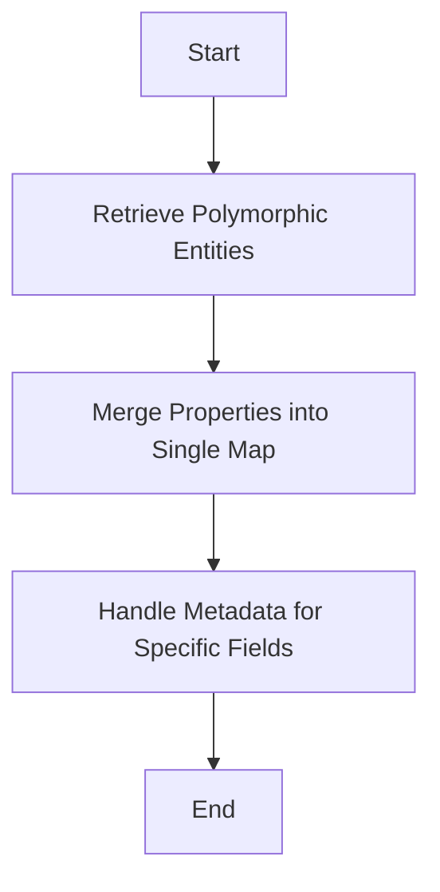

This document will cover the process of merging and adding metadata, which includes:

1. Retrieving polymorphic entities
2. Merging properties into a single map
3. Handling metadata for specific fields

Technical document: <SwmLink doc-title="Merging and Adding Metadata">[Merging and Adding Metadata](/.swm/merging-and-adding-metadata.ysqb54lw.sw.md)</SwmLink>

# [Retrieving Polymorphic Entities](https://app.swimm.io/repos/Z2l0aHViJTNBJTNBQnJvYWRsZWFmQ29tbWVyY2UtZGVtby1uZXclM0ElM0FTd2ltbS1EZW1v/docs/ysqb54lw#getsimplemergedproperties)

The process begins by retrieving all polymorphic entities for a given entity name. Polymorphic entities are different versions or variations of a base entity. For example, if the base entity is 'Product', polymorphic entities could be 'Electronics', 'Clothing', etc. This step ensures that all relevant variations of the entity are considered for merging.

# [Merging Properties into Single Map](https://app.swimm.io/repos/Z2l0aHViJTNBJTNBQnJvYWRsZWFmQ29tbWVyY2UtZGVtby1uZXclM0ElM0FTd2ltbS1EZW1v/docs/ysqb54lw#getsimplemergedproperties)

Once the polymorphic entities are retrieved, their properties are merged into a single map. This map consolidates all the attributes and characteristics of the different entity variations into one unified structure. This is crucial for ensuring that all relevant data is available in a single, accessible format.

# [Handling Metadata for Specific Fields](https://app.swimm.io/repos/Z2l0aHViJTNBJTNBQnJvYWRsZWFmQ29tbWVyY2UtZGVtby1uZXclM0ElM0FTd2ltbS1EZW1v/docs/ysqb54lw#getfieldmetadatafortargetclass)

If no polymorphic entities are found, the system retrieves metadata for the target class. Metadata includes information about the fields of the class, such as data types, validation rules, and display properties. This metadata is then processed and added to the map, ensuring that all necessary information is included. This step is essential for maintaining data integrity and providing a comprehensive view of the entity's attributes.

# [Adding Metadata for Adorned Target Collections](https://app.swimm.io/repos/Z2l0aHViJTNBJTNBQnJvYWRsZWFmQ29tbWVyY2UtZGVtby1uZXclM0ElM0FTd2ltbS1EZW1v/docs/ysqb54lw#addmetadata)

For adorned target collections, which are specialized collections with additional properties, metadata is added by first checking if the field can be handled. If it can, metadata overrides are constructed, and the adorned target collection metadata is built. This includes setting properties like grid visibility, sorting, and security levels. This step ensures that adorned target collections are properly configured and displayed according to the specified rules.

&nbsp;

*This is an auto-generated document by Swimm AI 🌊 and has not yet been verified by a human*

<SwmMeta version="3.0.0" repo-id="Z2l0aHViJTNBJTNBQnJvYWRsZWFmQ29tbWVyY2UtZGVtby1uZXclM0ElM0FTd2ltbS1EZW1v" repo-name="BroadleafCommerce-demo-new" doc-type="product-flows">Powered by [Swimm](/)</SwmMeta>
