In this document, we will explain the process of merging and adding metadata. This involves retrieving polymorphic entities, combining their properties, and handling metadata for specific fields.

The flow starts with retrieving all polymorphic entities for a given entity name. If entities are found, their properties are merged into a single map. If no entities are found, metadata for the target class is retrieved. This metadata is then processed and added to the map, ensuring all necessary information is included.

# Flow drill down

```mermaid
graph TD;
      subgraph admin/broadleaf-open-admin-platform/src/main/java/org/broadleafcommerce/openadmin/server/dao
cb7f0760adec30a617e588988911a9a1b65afb7828ae80e45c1bf662565d7d0c(getSimpleMergedProperties):::mainFlowStyle --> 9cd1ffc10ce9d9e887bb72ded2730123eb936a6466a47626db49e01509a5b3b8(getFieldMetadataForTargetClass):::mainFlowStyle
end

subgraph admin/broadleaf-open-admin-platform/src/main/java/org/broadleafcommerce/openadmin/server/dao
9cd1ffc10ce9d9e887bb72ded2730123eb936a6466a47626db49e01509a5b3b8(getFieldMetadataForTargetClass):::mainFlowStyle --> 8a7206ad69318ca4e6fe5b5f90a765ab98f66ee117dc8323ac1c2548bd1db9c7(addMetadata):::mainFlowStyle
end

subgraph admin/broadleaf-open-admin-platform/src/main/java/org/broadleafcommerce/openadmin/server/dao
8a7206ad69318ca4e6fe5b5f90a765ab98f66ee117dc8323ac1c2548bd1db9c7(addMetadata):::mainFlowStyle --> 7da1a07e36c4fccbaf56feadb7a8a413ae9cd35f756052801d37aa5d396eb603(constructAdornedTargetCollectionMetadataOverride)
end

subgraph admin/broadleaf-open-admin-platform/src/main/java/org/broadleafcommerce/openadmin/server/dao
8a7206ad69318ca4e6fe5b5f90a765ab98f66ee117dc8323ac1c2548bd1db9c7(addMetadata):::mainFlowStyle --> 1e90bcbdd50ee72f00fed0ca1cf69c80a89faddca43649497d97d6625a8e26dc(buildAdornedTargetCollectionMetadata):::mainFlowStyle
end


      classDef mainFlowStyle color:#000000,fill:#7CB9F4
classDef rootsStyle color:#000000,fill:#00FFF4
classDef Style1 color:#000000,fill:#00FFAA
classDef Style2 color:#000000,fill:#FFFF00
classDef Style3 color:#000000,fill:#AA7CB9

%% Swimm:
%% graph TD;
%%       subgraph <SwmPath>[admin/broadleaf-open-admin-platform/src/main/java/org/broadleafcommerce/openadmin/server/dao/](admin/broadleaf-open-admin-platform/src/main/java/org/broadleafcommerce/openadmin/server/dao/)</SwmPath>
%% cb7f0760adec30a617e588988911a9a1b65afb7828ae80e45c1bf662565d7d0c(getSimpleMergedProperties):::mainFlowStyle --> 9cd1ffc10ce9d9e887bb72ded2730123eb936a6466a47626db49e01509a5b3b8(getFieldMetadataForTargetClass):::mainFlowStyle
%% end
%% 
%% subgraph <SwmPath>[admin/broadleaf-open-admin-platform/src/main/java/org/broadleafcommerce/openadmin/server/dao/](admin/broadleaf-open-admin-platform/src/main/java/org/broadleafcommerce/openadmin/server/dao/)</SwmPath>
%% 9cd1ffc10ce9d9e887bb72ded2730123eb936a6466a47626db49e01509a5b3b8(getFieldMetadataForTargetClass):::mainFlowStyle --> 8a7206ad69318ca4e6fe5b5f90a765ab98f66ee117dc8323ac1c2548bd1db9c7(addMetadata):::mainFlowStyle
%% end
%% 
%% subgraph <SwmPath>[admin/broadleaf-open-admin-platform/src/main/java/org/broadleafcommerce/openadmin/server/dao/](admin/broadleaf-open-admin-platform/src/main/java/org/broadleafcommerce/openadmin/server/dao/)</SwmPath>
%% 8a7206ad69318ca4e6fe5b5f90a765ab98f66ee117dc8323ac1c2548bd1db9c7(addMetadata):::mainFlowStyle --> 7da1a07e36c4fccbaf56feadb7a8a413ae9cd35f756052801d37aa5d396eb603(constructAdornedTargetCollectionMetadataOverride)
%% end
%% 
%% subgraph <SwmPath>[admin/broadleaf-open-admin-platform/src/main/java/org/broadleafcommerce/openadmin/server/dao/](admin/broadleaf-open-admin-platform/src/main/java/org/broadleafcommerce/openadmin/server/dao/)</SwmPath>
%% 8a7206ad69318ca4e6fe5b5f90a765ab98f66ee117dc8323ac1c2548bd1db9c7(addMetadata):::mainFlowStyle --> 1e90bcbdd50ee72f00fed0ca1cf69c80a89faddca43649497d97d6625a8e26dc(buildAdornedTargetCollectionMetadata):::mainFlowStyle
%% end
%% 
%% 
%%       classDef mainFlowStyle color:#000000,fill:#7CB9F4
%% classDef rootsStyle color:#000000,fill:#00FFF4
%% classDef Style1 color:#000000,fill:#00FFAA
%% classDef Style2 color:#000000,fill:#FFFF00
%% classDef Style3 color:#000000,fill:#AA7CB9
```



<SwmSnippet path="/admin/broadleaf-open-admin-platform/src/main/java/org/broadleafcommerce/openadmin/server/dao/DynamicEntityDaoImpl.java" line="434">

---

## Merging and Adding Metadata

The <SwmToken path="admin/broadleaf-open-admin-platform/src/main/java/org/broadleafcommerce/openadmin/server/dao/DynamicEntityDaoImpl.java" pos="435:11:11" line-data="    public Map&lt;String, FieldMetadata&gt; getSimpleMergedProperties(String entityName, PersistencePerspective persistencePerspective) {">`getSimpleMergedProperties`</SwmToken> function is responsible for merging properties from various sources into a single map of <SwmToken path="admin/broadleaf-open-admin-platform/src/main/java/org/broadleafcommerce/openadmin/server/dao/DynamicEntityDaoImpl.java" pos="435:8:8" line-data="    public Map&lt;String, FieldMetadata&gt; getSimpleMergedProperties(String entityName, PersistencePerspective persistencePerspective) {">`FieldMetadata`</SwmToken>. It first retrieves all polymorphic entities from the given entity name and then calls <SwmToken path="admin/broadleaf-open-admin-platform/src/main/java/org/broadleafcommerce/openadmin/server/dao/DynamicEntityDaoImpl.java" pos="443:3:3" line-data="            return getMergedProperties(">`getMergedProperties`</SwmToken> to combine them. If no polymorphic entities are found, it falls back to retrieving metadata for the target class using <SwmToken path="admin/broadleaf-open-admin-platform/src/main/java/org/broadleafcommerce/openadmin/server/dao/Metadata.java" pos="70:11:11" line-data="    public Map&lt;String, FieldMetadata&gt; getFieldMetadataForTargetClass(Class&lt;?&gt; parentClass, Class&lt;?&gt; targetClass, DynamicEntityDao dynamicEntityDao, String prefix) {">`getFieldMetadataForTargetClass`</SwmToken>.

```java
    @Override
    public Map<String, FieldMetadata> getSimpleMergedProperties(String entityName, PersistencePerspective persistencePerspective) {
        Class<?>[] entityClasses;
        try {
            entityClasses = getAllPolymorphicEntitiesFromCeiling(Class.forName(entityName));
        } catch (ClassNotFoundException e) {
            throw new RuntimeException(e);
        }
        if (!ArrayUtils.isEmpty(entityClasses)) {
            return getMergedProperties(
                    entityName,
                    entityClasses,
                    (ForeignKey) persistencePerspective.getPersistencePerspectiveItems().get(PersistencePerspectiveItemType.FOREIGNKEY),
                    persistencePerspective.getAdditionalNonPersistentProperties(),
                    persistencePerspective.getAdditionalForeignKeys(),
                    MergedPropertyType.PRIMARY,
                    persistencePerspective.getPopulateToOneFields(),
                    persistencePerspective.getIncludeFields(),
                    persistencePerspective.getExcludeFields(),
                    persistencePerspective.getConfigurationKey(),
                    ""
```

---

</SwmSnippet>

<SwmSnippet path="/admin/broadleaf-open-admin-platform/src/main/java/org/broadleafcommerce/openadmin/server/dao/Metadata.java" line="70">

---

The <SwmToken path="admin/broadleaf-open-admin-platform/src/main/java/org/broadleafcommerce/openadmin/server/dao/Metadata.java" pos="70:11:11" line-data="    public Map&lt;String, FieldMetadata&gt; getFieldMetadataForTargetClass(Class&lt;?&gt; parentClass, Class&lt;?&gt; targetClass, DynamicEntityDao dynamicEntityDao, String prefix) {">`getFieldMetadataForTargetClass`</SwmToken> function retrieves metadata for all fields in the target class. It iterates over each field and uses various <SwmToken path="admin/broadleaf-open-admin-platform/src/main/java/org/broadleafcommerce/openadmin/server/dao/Metadata.java" pos="75:4:4" line-data="            for (FieldMetadataProvider fieldMetadataProvider : fieldMetadataProviders) {">`FieldMetadataProvider`</SwmToken> instances to add metadata to the map. If no provider handles a field, the default provider is used.

```java
    public Map<String, FieldMetadata> getFieldMetadataForTargetClass(Class<?> parentClass, Class<?> targetClass, DynamicEntityDao dynamicEntityDao, String prefix) {
        Map<String, FieldMetadata> metadata = new HashMap<>();
        Field[] fields = dynamicEntityDao.getAllFields(targetClass);
        for (Field field : fields) {
            boolean foundOneOrMoreHandlers = false;
            for (FieldMetadataProvider fieldMetadataProvider : fieldMetadataProviders) {
                MetadataProviderResponse response = fieldMetadataProvider.addMetadata(new AddFieldMetadataRequest(field, parentClass, targetClass,
                        dynamicEntityDao, prefix), metadata);
                if (MetadataProviderResponse.NOT_HANDLED != response) {
                    foundOneOrMoreHandlers = true;
                }
                if (MetadataProviderResponse.HANDLED_BREAK == response) {
                    break;
                }
            }
            if (!foundOneOrMoreHandlers) {
                defaultFieldMetadataProvider.addMetadata(new AddFieldMetadataRequest(field, parentClass, targetClass,
                        dynamicEntityDao, prefix), metadata);
            }
        }
        return metadata;
```

---

</SwmSnippet>

<SwmSnippet path="/admin/broadleaf-open-admin-platform/src/main/java/org/broadleafcommerce/openadmin/server/dao/provider/metadata/AdornedTargetCollectionFieldMetadataProvider.java" line="84">

---

The <SwmToken path="admin/broadleaf-open-admin-platform/src/main/java/org/broadleafcommerce/openadmin/server/dao/provider/metadata/AdornedTargetCollectionFieldMetadataProvider.java" pos="85:5:5" line-data="    public MetadataProviderResponse addMetadata(AddFieldMetadataRequest addMetadataRequest, Map&lt;String, FieldMetadata&gt; metadata) {">`addMetadata`</SwmToken> function in <SwmToken path="admin/broadleaf-open-admin-platform/src/main/java/org/broadleafcommerce/openadmin/server/dao/provider/metadata/AdornedTargetCollectionFieldMetadataProvider.java" pos="65:4:4" line-data="public class AdornedTargetCollectionFieldMetadataProvider extends AdvancedCollectionFieldMetadataProvider {">`AdornedTargetCollectionFieldMetadataProvider`</SwmToken> adds metadata for adorned target collections. It first checks if the field can be handled, then constructs metadata overrides and builds the adorned target collection metadata.

```java
    @Override
    public MetadataProviderResponse addMetadata(AddFieldMetadataRequest addMetadataRequest, Map<String, FieldMetadata> metadata) {
        if (!canHandleFieldForConfiguredMetadata(addMetadataRequest, metadata)) {
            return MetadataProviderResponse.NOT_HANDLED;
        }
        AdminPresentationAdornedTargetCollection annot = addMetadataRequest.getRequestedField().getAnnotation(AdminPresentationAdornedTargetCollection.class);
        FieldInfo info = buildFieldInfo(addMetadataRequest.getRequestedField());
        FieldMetadataOverride override = constructAdornedTargetCollectionMetadataOverride(annot);
        buildAdornedTargetCollectionMetadata(addMetadataRequest.getParentClass(), addMetadataRequest.getTargetClass(), metadata, info, override, addMetadataRequest.getDynamicEntityDao());
        setClassOwnership(addMetadataRequest.getParentClass(), addMetadataRequest.getTargetClass(), metadata, info);
        return MetadataProviderResponse.HANDLED;
    }
```

---

</SwmSnippet>

<SwmSnippet path="/admin/broadleaf-open-admin-platform/src/main/java/org/broadleafcommerce/openadmin/server/dao/provider/metadata/AdornedTargetCollectionFieldMetadataProvider.java" line="293">

---

The <SwmToken path="admin/broadleaf-open-admin-platform/src/main/java/org/broadleafcommerce/openadmin/server/dao/provider/metadata/AdornedTargetCollectionFieldMetadataProvider.java" pos="293:5:5" line-data="    protected FieldMetadataOverride constructAdornedTargetCollectionMetadataOverride(AdminPresentationAdornedTargetCollection adornedTargetCollection) {">`constructAdornedTargetCollectionMetadataOverride`</SwmToken> function constructs metadata overrides based on the <SwmToken path="admin/broadleaf-open-admin-platform/src/main/java/org/broadleafcommerce/openadmin/server/dao/provider/metadata/AdornedTargetCollectionFieldMetadataProvider.java" pos="293:7:7" line-data="    protected FieldMetadataOverride constructAdornedTargetCollectionMetadataOverride(AdminPresentationAdornedTargetCollection adornedTargetCollection) {">`AdminPresentationAdornedTargetCollection`</SwmToken> annotation. It sets various properties like grid visibility, sorting, and security levels.

```java
    protected FieldMetadataOverride constructAdornedTargetCollectionMetadataOverride(AdminPresentationAdornedTargetCollection adornedTargetCollection) {
        if (adornedTargetCollection != null) {
            FieldMetadataOverride override = new FieldMetadataOverride();
            override.setGridVisibleFields(adornedTargetCollection.gridVisibleFields());
            override.setSelectizeVisibleField(adornedTargetCollection.selectizeVisibleField());
            override.setIgnoreAdornedProperties(adornedTargetCollection.ignoreAdornedProperties());
            override.setMaintainedAdornedTargetFields(adornedTargetCollection.maintainedAdornedTargetFields());
            override.setParentObjectIdProperty(adornedTargetCollection.parentObjectIdProperty());
            override.setParentObjectProperty(adornedTargetCollection.parentObjectProperty());
            override.setSortAscending(adornedTargetCollection.sortAscending());
            override.setSortProperty(adornedTargetCollection.sortProperty());
            override.setTargetObjectIdProperty(adornedTargetCollection.targetObjectIdProperty());
            override.setTargetObjectProperty(adornedTargetCollection.targetObjectProperty());
            override.setJoinEntityClass(adornedTargetCollection.joinEntityClass());
            override.setCustomCriteria(adornedTargetCollection.customCriteria());
            override.setUseServerSideInspectionCache(adornedTargetCollection.useServerSideInspectionCache());
            override.setExcluded(adornedTargetCollection.excluded());
            override.setFriendlyName(adornedTargetCollection.friendlyName());
            override.setReadOnly(adornedTargetCollection.readOnly());
            override.setOrder(adornedTargetCollection.order());
            override.setTab(adornedTargetCollection.tab());
```

---

</SwmSnippet>

<SwmSnippet path="/admin/broadleaf-open-admin-platform/src/main/java/org/broadleafcommerce/openadmin/server/dao/provider/metadata/AdornedTargetCollectionFieldMetadataProvider.java" line="335">

---

The <SwmToken path="admin/broadleaf-open-admin-platform/src/main/java/org/broadleafcommerce/openadmin/server/dao/provider/metadata/AdornedTargetCollectionFieldMetadataProvider.java" pos="335:5:5" line-data="    protected void buildAdornedTargetCollectionMetadata(Class&lt;?&gt; parentClass, Class&lt;?&gt; targetClass, Map&lt;String, FieldMetadata&gt; attributes, FieldInfo field, FieldMetadataOverride adornedTargetCollectionMetadata, DynamicEntityDao dynamicEntityDao) {">`buildAdornedTargetCollectionMetadata`</SwmToken> function builds the actual metadata for adorned target collections. It sets properties like target class, field name, and various other attributes based on the metadata overrides.

```java
    protected void buildAdornedTargetCollectionMetadata(Class<?> parentClass, Class<?> targetClass, Map<String, FieldMetadata> attributes, FieldInfo field, FieldMetadataOverride adornedTargetCollectionMetadata, DynamicEntityDao dynamicEntityDao) {
        AdornedTargetCollectionMetadata serverMetadata = (AdornedTargetCollectionMetadata) attributes.get(field.getName());

        Class<?> resolvedClass = parentClass == null ? targetClass : parentClass;
        AdornedTargetCollectionMetadata metadata;
        if (serverMetadata != null) {
            metadata = serverMetadata;
        } else {
            metadata = new AdornedTargetCollectionMetadata();
        }
        metadata.setTargetClass(targetClass.getName());
        metadata.setFieldName(field.getName());

        if (adornedTargetCollectionMetadata.getReadOnly() != null) {
            metadata.setMutable(!adornedTargetCollectionMetadata.getReadOnly());
        }
        if (adornedTargetCollectionMetadata.getShowIfProperty() != null) {
            metadata.setShowIfProperty(adornedTargetCollectionMetadata.getShowIfProperty());
        }
        if (adornedTargetCollectionMetadata.getShowIfFieldEquals() != null) {
            metadata.setShowIfFieldEquals(adornedTargetCollectionMetadata.getShowIfFieldEquals());
```

---

</SwmSnippet>

&nbsp;

*This is an auto-generated document by Swimm AI 🌊 and has not yet been verified by a human*

<SwmMeta version="3.0.0" repo-id="Z2l0aHViJTNBJTNBQnJvYWRsZWFmQ29tbWVyY2UtZGVtby1uZXclM0ElM0FTd2ltbS1EZW1v" repo-name="BroadleafCommerce-demo-new" doc-type="flows"><sup>Powered by [Swimm](/)</sup></SwmMeta>
