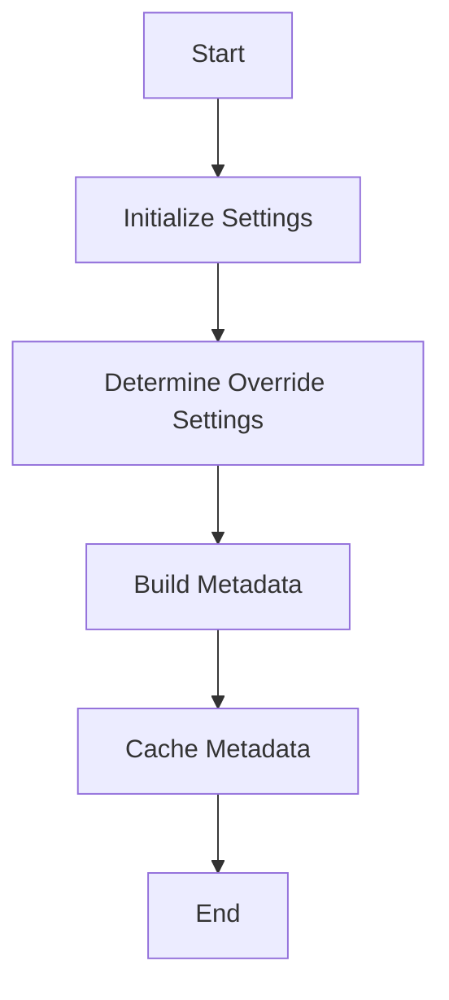

This document will cover the Merging Properties Flow, which includes:

1. Initializing and determining settings
2. Building and caching metadata for entity properties.

Technical document: <SwmLink doc-title="Merging Properties Flow">[Merging Properties Flow](/.swm/merging-properties-flow.huvfp7oz.sw.md)</SwmLink>

# [Initializing and Determining Settings](https://app.swimm.io/repos/Z2l0aHViJTNBJTNBQnJvYWRsZWFmQ29tbWVyY2UtZGVtby1uZXclM0ElM0FTd2ltbS1EZW1v/docs/huvfp7oz#the-execute-method)

The process begins with initializing and determining whether to override certain settings. This step ensures that the system knows whether to use default settings or custom ones provided by the user. For example, if a user has specified custom settings for how properties should be merged, these settings will be used instead of the default ones. This is crucial for providing flexibility and customization to the end user, allowing them to tailor the behavior of the system to their specific needs.

# [Building and Caching Metadata](https://app.swimm.io/repos/Z2l0aHViJTNBJTNBQnJvYWRsZWFmQ29tbWVyY2UtZGVtby1uZXclM0ElM0FTd2ltbS1EZW1v/docs/huvfp7oz#the-buildpropertiesfrompolymorphicentities-method)

Once the settings are determined, the next step is to build and cache metadata for entity properties. This involves iterating over the provided entities and generating a cache key for each one. If the metadata is already cached, it is retrieved; otherwise, it is computed and then cached. This step ensures that metadata is correctly inherited and available to the appropriate entity types. For example, if an entity type has specific properties that need to be inherited by its subtypes, this process ensures that the inheritance is handled correctly. Additionally, it handles special cases such as data-driven enums and locale-specific formatting, which are important for providing a seamless and localized user experience.

&nbsp;

*This is an auto-generated document by Swimm AI 🌊 and has not yet been verified by a human*

<SwmMeta version="3.0.0" repo-id="Z2l0aHViJTNBJTNBQnJvYWRsZWFmQ29tbWVyY2UtZGVtby1uZXclM0ElM0FTd2ltbS1EZW1v" repo-name="BroadleafCommerce-demo-new" doc-type="product-flows">Powered by [Swimm](/)</SwmMeta>
