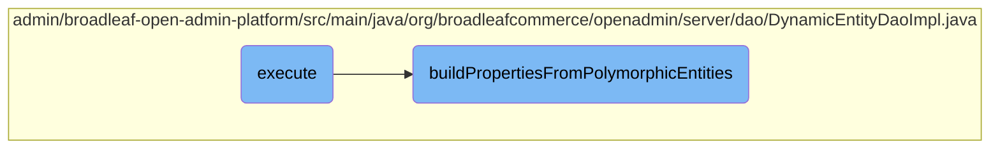

In this document, we will explain the process of merging properties from polymorphic entities. The process involves initializing and determining settings, followed by building and caching metadata for entity properties.

The flow starts with initializing and determining whether to override certain settings. Then, it proceeds to build and cache metadata for entity properties, ensuring that the metadata is correctly inherited and available to the appropriate entity types.

# Flow drill down



<SwmSnippet path="/admin/broadleaf-open-admin-platform/src/main/java/org/broadleafcommerce/openadmin/server/dao/DynamicEntityDaoImpl.java" line="604">

---

## The execute Method

The <SwmToken path="admin/broadleaf-open-admin-platform/src/main/java/org/broadleafcommerce/openadmin/server/dao/DynamicEntityDaoImpl.java" pos="605:11:11" line-data="            public Map&lt;String, FieldMetadata&gt; execute(Boolean overridePopulateManyToOne) {">`execute`</SwmToken> method is responsible for initializing and merging properties from polymorphic entities. It determines whether to override the <SwmToken path="admin/broadleaf-open-admin-platform/src/main/java/org/broadleafcommerce/openadmin/server/dao/DynamicEntityDaoImpl.java" pos="611:5:5" line-data="                    classAnnotatedPopulateManyToOneFields = populateManyToOneFields;">`populateManyToOneFields`</SwmToken> setting and then calls <SwmToken path="admin/broadleaf-open-admin-platform/src/main/java/org/broadleafcommerce/openadmin/server/dao/DynamicEntityDaoImpl.java" pos="614:1:1" line-data="                buildPropertiesFromPolymorphicEntities(">`buildPropertiesFromPolymorphicEntities`</SwmToken> to perform the actual property merging.

```java
            @Override
            public Map<String, FieldMetadata> execute(Boolean overridePopulateManyToOne) {
                Map<String, FieldMetadata> mergedProperties = new HashMap<>();
                Boolean classAnnotatedPopulateManyToOneFields;
                if (overridePopulateManyToOne != null) {
                    classAnnotatedPopulateManyToOneFields = overridePopulateManyToOne;
                } else {
                    classAnnotatedPopulateManyToOneFields = populateManyToOneFields;
                }

                buildPropertiesFromPolymorphicEntities(
                        entities,
                        foreignField,
                        additionalNonPersistentProperties,
                        additionalForeignFields,
                        mergedPropertyType,
                        classAnnotatedPopulateManyToOneFields,
                        includeFields,
                        excludeFields,
                        configurationKey,
                        ceilingEntityFullyQualifiedClassname,
```

---

</SwmSnippet>

<SwmSnippet path="/admin/broadleaf-open-admin-platform/src/main/java/org/broadleafcommerce/openadmin/server/dao/DynamicEntityDaoImpl.java" line="749">

---

## The <SwmToken path="admin/broadleaf-open-admin-platform/src/main/java/org/broadleafcommerce/openadmin/server/dao/DynamicEntityDaoImpl.java" pos="749:5:5" line-data="    protected void buildPropertiesFromPolymorphicEntities(">`buildPropertiesFromPolymorphicEntities`</SwmToken> Method

The <SwmToken path="admin/broadleaf-open-admin-platform/src/main/java/org/broadleafcommerce/openadmin/server/dao/DynamicEntityDaoImpl.java" pos="749:5:5" line-data="    protected void buildPropertiesFromPolymorphicEntities(">`buildPropertiesFromPolymorphicEntities`</SwmToken> method is tasked with constructing and caching metadata for entity properties. It iterates over the provided entities, generates a cache key, and either retrieves cached metadata or computes it if not already cached. The method ensures that metadata is correctly inherited and available to the appropriate entity types, and it handles special cases such as data-driven enums and locale-specific formatting.

```java
    protected void buildPropertiesFromPolymorphicEntities(
            Class<?>[] entities,
            ForeignKey foreignField,
            String[] additionalNonPersistentProperties,
            ForeignKey[] additionalForeignFields,
            MergedPropertyType mergedPropertyType,
            Boolean populateManyToOneFields,
            String[] includeFields,
            String[] excludeFields,
            String configurationKey,
            String ceilingEntityFullyQualifiedClassname,
            Map<String, FieldMetadata> mergedProperties,
            List<Class<?>> parentClasses,
            String prefix,
            Boolean isParentExcluded,
            String parentPrefix) {
        for (Class<?> clazz : entities) {
            String cacheKey = getCacheKey(ceilingEntityFullyQualifiedClassname, foreignField, additionalNonPersistentProperties, additionalForeignFields, mergedPropertyType, populateManyToOneFields, clazz, configurationKey, isParentExcluded);

            Map<String, FieldMetadata> cacheData = null;
            synchronized (DynamicDaoHelperImpl.LOCK_OBJECT) {
```

---

</SwmSnippet>

&nbsp;

*This is an auto-generated document by Swimm AI 🌊 and has not yet been verified by a human*

<SwmMeta version="3.0.0" repo-id="Z2l0aHViJTNBJTNBQnJvYWRsZWFmQ29tbWVyY2UtZGVtby1uZXclM0ElM0FTd2ltbS1EZW1v" repo-name="BroadleafCommerce-demo-new" doc-type="flows"><sup>Powered by [Swimm](/)</sup></SwmMeta>
