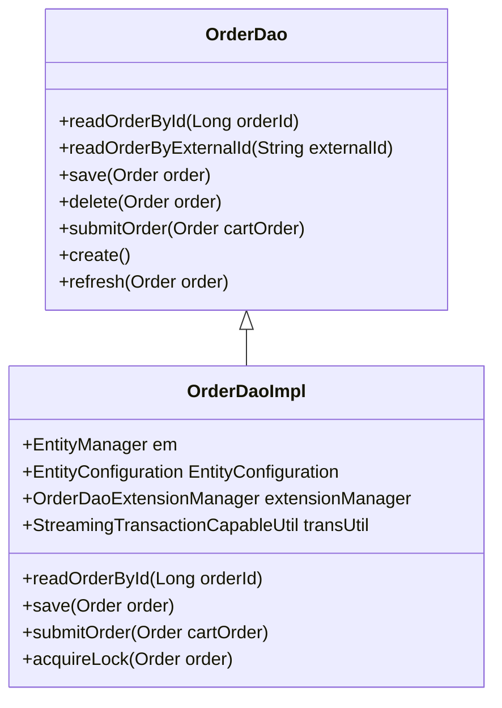

<SwmSnippet path="/core/broadleaf-framework/src/main/java/org/broadleafcommerce/core/order/dao/OrderDao.java" line="28">

---

# <SwmToken path="core/broadleaf-framework/src/main/java/org/broadleafcommerce/core/order/dao/OrderDao.java" pos="28:4:4" line-data="public interface OrderDao {">`OrderDao`</SwmToken> Interface

The <SwmToken path="core/broadleaf-framework/src/main/java/org/broadleafcommerce/core/order/dao/OrderDao.java" pos="28:4:4" line-data="public interface OrderDao {">`OrderDao`</SwmToken> interface defines methods for reading, saving, deleting, and managing orders in the database. It includes methods like <SwmToken path="core/broadleaf-framework/src/main/java/org/broadleafcommerce/core/order/dao/OrderDao.java" pos="30:3:3" line-data="    Order readOrderById(Long orderId);">`readOrderById`</SwmToken>, <SwmToken path="core/broadleaf-framework/src/main/java/org/broadleafcommerce/core/order/dao/OrderDaoImpl.java" pos="215:5:5" line-data="    public Order save(final Order order) {">`save`</SwmToken>, and <SwmToken path="core/broadleaf-framework/src/main/java/org/broadleafcommerce/core/order/dao/OrderDao.java" pos="71:3:3" line-data="    void delete(Order order);">`delete`</SwmToken>.

```java
public interface OrderDao {

    Order readOrderById(Long orderId);

    Order readOrderByIdIgnoreCache(Long orderId);
    
    List<Order> readOrdersByIds(List<Long> orderIds);

    /**
     * Reads a batch list of orders from the DB.  The status is optional and can be null.  If no status 
     * is provided, then all order will be read.  Otherwise, only orders with that status will be read.
     * @param start
     * @param pageSize
     * @param statuses
     * @return
     */
    List<Order> readBatchOrders(int start, int pageSize, List<OrderStatus> statuses);
```

---

</SwmSnippet>

<SwmSnippet path="/core/broadleaf-framework/src/main/java/org/broadleafcommerce/core/order/dao/OrderDaoImpl.java" line="67">

---

# <SwmToken path="core/broadleaf-framework/src/main/java/org/broadleafcommerce/core/order/dao/OrderDaoImpl.java" pos="68:4:4" line-data="public class OrderDaoImpl implements OrderDao {">`OrderDaoImpl`</SwmToken> Class

The <SwmToken path="core/broadleaf-framework/src/main/java/org/broadleafcommerce/core/order/dao/OrderDaoImpl.java" pos="68:4:4" line-data="public class OrderDaoImpl implements OrderDao {">`OrderDaoImpl`</SwmToken> class implements the <SwmToken path="core/broadleaf-framework/src/main/java/org/broadleafcommerce/core/order/dao/OrderDaoImpl.java" pos="68:8:8" line-data="public class OrderDaoImpl implements OrderDao {">`OrderDao`</SwmToken> interface and is annotated with <SwmToken path="core/broadleaf-framework/src/main/java/org/broadleafcommerce/core/order/dao/OrderDaoImpl.java" pos="67:0:1" line-data="@Repository(&quot;blOrderDao&quot;)">`@Repository`</SwmToken> to indicate its role in data access. It uses JPA's <SwmToken path="core/broadleaf-framework/src/main/java/org/broadleafcommerce/core/order/dao/OrderDaoImpl.java" pos="74:3:3" line-data="    protected EntityManager em;">`EntityManager`</SwmToken> to perform database operations.

```java
@Repository("blOrderDao")
public class OrderDaoImpl implements OrderDao {

    private static final Log LOG = LogFactory.getLog(OrderDaoImpl.class);
    private static final String ORDER_LOCK_KEY = UUID.randomUUID().toString();

    @PersistenceContext(unitName = "blPU")
    protected EntityManager em;

    @Resource(name = "blEntityConfiguration")
    protected EntityConfiguration entityConfiguration;

    @Resource(name = "blOrderDaoExtensionManager")
    protected OrderDaoExtensionManager extensionManager;

    @Resource(name = "blStreamingTransactionCapableUtil")
    protected StreamingTransactionCapableUtil transUtil;

    @Override
    public Order readOrderById(final Long orderId) {
        TypedQuery<Order> query = em.createQuery("SELECT o FROM OrderImpl o WHERE o.id= :orderId", Order.class);
```

---

</SwmSnippet>

<SwmSnippet path="/core/broadleaf-framework/src/main/java/org/broadleafcommerce/core/order/service/OrderServiceImpl.java" line="111">

---

# Usage in Services

The <SwmToken path="core/broadleaf-framework/src/main/java/org/broadleafcommerce/core/order/service/OrderServiceImpl.java" pos="112:3:3" line-data="    protected OrderDao orderDao;">`OrderDao`</SwmToken> is injected into service classes like <SwmToken path="core/broadleaf-framework/src/main/java/org/broadleafcommerce/core/order/service/OrderServiceImpl.java" pos="104:4:4" line-data="public class OrderServiceImpl implements OrderService {">`OrderServiceImpl`</SwmToken> using the <SwmToken path="core/broadleaf-framework/src/main/java/org/broadleafcommerce/core/order/service/OrderServiceImpl.java" pos="111:1:2" line-data="    @Resource(name = &quot;blOrderDao&quot;)">`@Resource`</SwmToken> annotation, allowing the service layer to perform data access operations.

```java
    @Resource(name = "blOrderDao")
    protected OrderDao orderDao;
```

---

</SwmSnippet>

# Main Functions

The main functions of the <SwmToken path="core/broadleaf-framework/src/main/java/org/broadleafcommerce/core/order/dao/OrderDao.java" pos="28:4:4" line-data="public interface OrderDao {">`OrderDao`</SwmToken> interface and its implementation include <SwmToken path="core/broadleaf-framework/src/main/java/org/broadleafcommerce/core/order/dao/OrderDao.java" pos="30:3:3" line-data="    Order readOrderById(Long orderId);">`readOrderById`</SwmToken>, <SwmToken path="core/broadleaf-framework/src/main/java/org/broadleafcommerce/core/order/dao/OrderDaoImpl.java" pos="215:5:5" line-data="    public Order save(final Order order) {">`save`</SwmToken>, <SwmToken path="core/broadleaf-framework/src/main/java/org/broadleafcommerce/core/order/dao/OrderDaoImpl.java" pos="303:5:5" line-data="    public Order submitOrder(final Order cartOrder) {">`submitOrder`</SwmToken>, and <SwmToken path="core/broadleaf-framework/src/main/java/org/broadleafcommerce/core/order/dao/OrderDaoImpl.java" pos="425:5:5" line-data="    public boolean acquireLock(Order order) {">`acquireLock`</SwmToken>.

<SwmSnippet path="/core/broadleaf-framework/src/main/java/org/broadleafcommerce/core/order/dao/OrderDaoImpl.java" line="85">

---

## <SwmToken path="core/broadleaf-framework/src/main/java/org/broadleafcommerce/core/order/dao/OrderDaoImpl.java" pos="86:5:5" line-data="    public Order readOrderById(final Long orderId) {">`readOrderById`</SwmToken>

The <SwmToken path="core/broadleaf-framework/src/main/java/org/broadleafcommerce/core/order/dao/OrderDaoImpl.java" pos="86:5:5" line-data="    public Order readOrderById(final Long orderId) {">`readOrderById`</SwmToken> function retrieves an order by its ID. It uses a JPA <SwmToken path="core/broadleaf-framework/src/main/java/org/broadleafcommerce/core/order/dao/OrderDaoImpl.java" pos="87:1:1" line-data="        TypedQuery&lt;Order&gt; query = em.createQuery(&quot;SELECT o FROM OrderImpl o WHERE o.id= :orderId&quot;, Order.class);">`TypedQuery`</SwmToken> to fetch the order from the database and includes caching hints to optimize performance.

```java
    @Override
    public Order readOrderById(final Long orderId) {
        TypedQuery<Order> query = em.createQuery("SELECT o FROM OrderImpl o WHERE o.id= :orderId", Order.class);
        query.setParameter("orderId", orderId);
        query.setHint(QueryHints.HINT_CACHEABLE, true);
        query.setHint(QueryHints.HINT_CACHE_REGION, "query.Order");
        Order order = null;
        try {
            order = query.getSingleResult();
        } catch (NoResultException e) {
            LOG.warn(String.format("Could not find order by ID %s", orderId));
        }
        return order;
    }
```

---

</SwmSnippet>

<SwmSnippet path="/core/broadleaf-framework/src/main/java/org/broadleafcommerce/core/order/dao/OrderDaoImpl.java" line="214">

---

## save

The <SwmToken path="core/broadleaf-framework/src/main/java/org/broadleafcommerce/core/order/dao/OrderDaoImpl.java" pos="215:5:5" line-data="    public Order save(final Order order) {">`save`</SwmToken> function persists an order to the database. It uses the JPA <SwmToken path="core/broadleaf-framework/src/main/java/org/broadleafcommerce/core/order/dao/OrderDaoImpl.java" pos="216:9:9" line-data="        Order response = em.merge(order);">`merge`</SwmToken> method to either insert or update the order entity.

```java
    @Override
    public Order save(final Order order) {
        Order response = em.merge(order);
        //em.flush();
        return response;
    }
```

---

</SwmSnippet>

<SwmSnippet path="/core/broadleaf-framework/src/main/java/org/broadleafcommerce/core/order/dao/OrderDaoImpl.java" line="302">

---

## <SwmToken path="core/broadleaf-framework/src/main/java/org/broadleafcommerce/core/order/dao/OrderDaoImpl.java" pos="303:5:5" line-data="    public Order submitOrder(final Order cartOrder) {">`submitOrder`</SwmToken>

The <SwmToken path="core/broadleaf-framework/src/main/java/org/broadleafcommerce/core/order/dao/OrderDaoImpl.java" pos="303:5:5" line-data="    public Order submitOrder(final Order cartOrder) {">`submitOrder`</SwmToken> function finalizes and submits a cart order. It changes the order status to <SwmToken path="core/broadleaf-framework/src/main/java/org/broadleafcommerce/core/order/dao/OrderDaoImpl.java" pos="304:7:7" line-data="        cartOrder.setStatus(OrderStatus.SUBMITTED);">`SUBMITTED`</SwmToken> and then saves the order.

```java
    @Override
    public Order submitOrder(final Order cartOrder) {
        cartOrder.setStatus(OrderStatus.SUBMITTED);
        return save(cartOrder);
    }
```

---

</SwmSnippet>

<SwmSnippet path="/core/broadleaf-framework/src/main/java/org/broadleafcommerce/core/order/dao/OrderDaoImpl.java" line="424">

---

## <SwmToken path="core/broadleaf-framework/src/main/java/org/broadleafcommerce/core/order/dao/OrderDaoImpl.java" pos="425:5:5" line-data="    public boolean acquireLock(Order order) {">`acquireLock`</SwmToken>

The <SwmToken path="core/broadleaf-framework/src/main/java/org/broadleafcommerce/core/order/dao/OrderDaoImpl.java" pos="425:5:5" line-data="    public boolean acquireLock(Order order) {">`acquireLock`</SwmToken> function attempts to acquire a lock on an order to ensure exclusive access. It first checks for an existing lock and, if none is found, tries to create one. If a lock already exists, it attempts to update the lock status.

```java
    @Override
    public boolean acquireLock(Order order) {
        String orderLockKey = getOrderLockKey();
        // First, we'll see if there's a record of a lock for this order
        Query q = em.createNamedQuery("BC_ORDER_LOCK_READ");
        q.setParameter("orderId", order.getId());
        q.setParameter("key", orderLockKey);
        q.setHint(QueryHints.HINT_CACHEABLE, false);
        Long count = (Long) q.getSingleResult();

        if (count == 0L) {
            // If there wasn't a lock, we'll try to create one. It's possible that another thread is attempting the
            // same thing at the same time, so we might get a constraint violation exception here. That's ok. If we 
            // successfully inserted a record, that means that we are the owner of the lock right now.
            try {
                OrderLock ol = (OrderLock) entityConfiguration.createEntityInstance(OrderLock.class.getName());
                ol.setOrderId(order.getId());
                ol.setLocked(true);
                ol.setKey(orderLockKey);
                ol.setLastUpdated(System.currentTimeMillis());
                em.persist(ol);
```

---

</SwmSnippet>

&nbsp;

*This is an auto-generated document by Swimm AI 🌊 and has not yet been verified by a human*

<SwmMeta version="3.0.0" repo-id="Z2l0aHViJTNBJTNBQnJvYWRsZWFmQ29tbWVyY2UtZGVtby1uZXclM0ElM0FTd2ltbS1EZW1v" repo-name="BroadleafCommerce-demo-new" doc-type="overview"><sup>Powered by [Swimm](/)</sup></SwmMeta>
