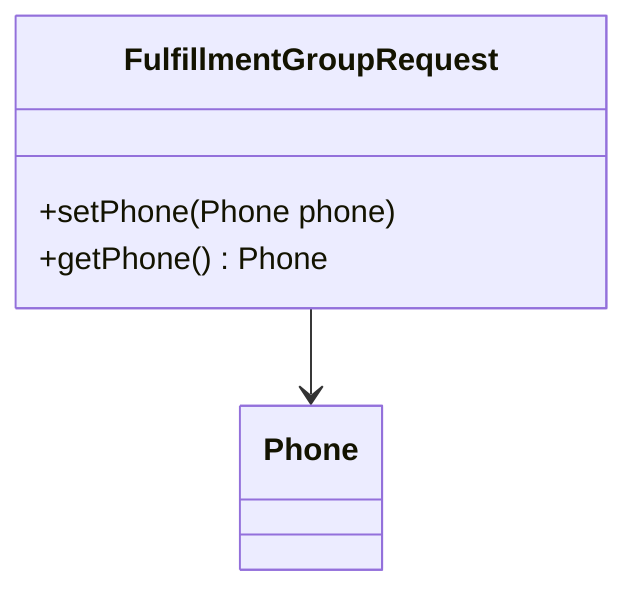

# Overview

The package <SwmToken path="core/broadleaf-framework/src/main/java/org/broadleafcommerce/core/order/service/call/FulfillmentGroupRequest.java" pos="18:2:12" line-data="package org.broadleafcommerce.core.order.service.call;">`org.broadleafcommerce.core.order.service.call`</SwmToken> contains various classes and methods that facilitate the handling of order-related service calls. These classes are essential for managing different aspects of orders, such as fulfillment groups, cart reconstruction, and adding items to the cart.

# <SwmToken path="core/broadleaf-framework/src/main/java/org/broadleafcommerce/core/order/service/call/FulfillmentGroupRequest.java" pos="29:4:4" line-data="public class FulfillmentGroupRequest {">`FulfillmentGroupRequest`</SwmToken>

The <SwmToken path="core/broadleaf-framework/src/main/java/org/broadleafcommerce/core/order/service/call/FulfillmentGroupRequest.java" pos="29:4:4" line-data="public class FulfillmentGroupRequest {">`FulfillmentGroupRequest`</SwmToken> class includes methods like <SwmToken path="core/broadleaf-framework/src/main/java/org/broadleafcommerce/core/order/service/call/FulfillmentGroupRequest.java" pos="69:5:5" line-data="    public void setPhone(Phone phone) {">`setPhone`</SwmToken> and <SwmToken path="core/broadleaf-framework/src/main/java/org/broadleafcommerce/core/order/service/call/FulfillmentGroupRequest.java" pos="65:5:5" line-data="    public Phone getPhone() {">`getPhone`</SwmToken>, which are used to manage phone information associated with fulfillment groups. These methods are utilized in service implementations such as `FulfillmentGroupServiceImpl` and `LegacyOrderServiceImpl` to add fulfillment groups to orders, ensuring that phone information is correctly set and retrieved during the process.

<SwmSnippet path="/core/broadleaf-framework/src/main/java/org/broadleafcommerce/core/order/service/call/FulfillmentGroupRequest.java" line="1">

---

The <SwmToken path="core/broadleaf-framework/src/main/java/org/broadleafcommerce/core/order/service/call/FulfillmentGroupRequest.java" pos="69:5:5" line-data="    public void setPhone(Phone phone) {">`setPhone`</SwmToken> method assigns a <SwmToken path="core/broadleaf-framework/src/main/java/org/broadleafcommerce/core/order/service/call/FulfillmentGroupRequest.java" pos="24:12:12" line-data="import org.broadleafcommerce.profile.core.domain.Phone;">`Phone`</SwmToken> object to the fulfillment group request. This is used to set the phone information for a fulfillment group.

```java
/*-
 * #%L
 * BroadleafCommerce Framework
 * %%
 * Copyright (C) 2009 - 2024 Broadleaf Commerce
 * %%
 * Licensed under the Broadleaf Fair Use License Agreement, Version 1.0
 * (the "Fair Use License" located  at http://license.broadleafcommerce.org/fair_use_license-1.0.txt)
 * unless the restrictions on use therein are violated and require payment to Broadleaf in which case
 * the Broadleaf End User License Agreement (EULA), Version 1.1
 * (the "Commercial License" located at http://license.broadleafcommerce.org/commercial_license-1.1.txt)
 * shall apply.
 * 
 * Alternatively, the Commercial License may be replaced with a mutually agreed upon license (the "Custom License")
 * between you and Broadleaf Commerce. You may not use this file except in compliance with the applicable license.
 * #L%
 */
package org.broadleafcommerce.core.order.service.call;

import org.broadleafcommerce.core.order.domain.FulfillmentOption;
```

---

</SwmSnippet>

# <SwmToken path="core/broadleaf-framework/src/main/java/org/broadleafcommerce/core/order/service/call/ReconstructCartResponse.java" pos="26:4:4" line-data="public class ReconstructCartResponse {">`ReconstructCartResponse`</SwmToken>

The <SwmToken path="core/broadleaf-framework/src/main/java/org/broadleafcommerce/core/order/service/call/ReconstructCartResponse.java" pos="26:4:4" line-data="public class ReconstructCartResponse {">`ReconstructCartResponse`</SwmToken> class is used to handle the response when reconstructing a cart. This class ensures that the cart is accurately reconstructed with all necessary details.

<SwmSnippet path="/core/broadleaf-framework/src/main/java/org/broadleafcommerce/core/order/service/call/ReconstructCartResponse.java" line="1">

---

The <SwmToken path="core/broadleaf-framework/src/main/java/org/broadleafcommerce/core/order/service/call/ReconstructCartResponse.java" pos="26:4:4" line-data="public class ReconstructCartResponse {">`ReconstructCartResponse`</SwmToken> class handles the response for cart reconstruction, ensuring all details are accurately restored.

```java
/*-
 * #%L
 * BroadleafCommerce Framework
 * %%
 * Copyright (C) 2009 - 2024 Broadleaf Commerce
 * %%
 * Licensed under the Broadleaf Fair Use License Agreement, Version 1.0
 * (the "Fair Use License" located  at http://license.broadleafcommerce.org/fair_use_license-1.0.txt)
 * unless the restrictions on use therein are violated and require payment to Broadleaf in which case
 * the Broadleaf End User License Agreement (EULA), Version 1.1
 * (the "Commercial License" located at http://license.broadleafcommerce.org/commercial_license-1.1.txt)
 * shall apply.
 * 
 * Alternatively, the Commercial License may be replaced with a mutually agreed upon license (the "Custom License")
 * between you and Broadleaf Commerce. You may not use this file except in compliance with the applicable license.
 * #L%
 */
package org.broadleafcommerce.core.order.service.call;

import org.broadleafcommerce.core.order.domain.Order;
```

---

</SwmSnippet>

# <SwmToken path="core/broadleaf-framework/src/main/java/org/broadleafcommerce/core/order/service/call/AbstractOrderItemRequest.java" pos="41:6:6" line-data="public abstract class AbstractOrderItemRequest {">`AbstractOrderItemRequest`</SwmToken>

The <SwmToken path="core/broadleaf-framework/src/main/java/org/broadleafcommerce/core/order/service/call/AbstractOrderItemRequest.java" pos="41:6:6" line-data="public abstract class AbstractOrderItemRequest {">`AbstractOrderItemRequest`</SwmToken> class serves as a base class for various order item request types, providing common functionality and structure. This class is extended by other classes to handle specific types of order item requests.

<SwmSnippet path="/core/broadleaf-framework/src/main/java/org/broadleafcommerce/core/order/service/call/AbstractOrderItemRequest.java" line="1">

---

The <SwmToken path="core/broadleaf-framework/src/main/java/org/broadleafcommerce/core/order/service/call/AbstractOrderItemRequest.java" pos="41:6:6" line-data="public abstract class AbstractOrderItemRequest {">`AbstractOrderItemRequest`</SwmToken> class provides a base structure for different order item request types, offering common functionalities.

```java
/*-
 * #%L
 * BroadleafCommerce Framework
 * %%
 * Copyright (C) 2009 - 2024 Broadleaf Commerce
 * %%
 * Licensed under the Broadleaf Fair Use License Agreement, Version 1.0
 * (the "Fair Use License" located  at http://license.broadleafcommerce.org/fair_use_license-1.0.txt)
 * unless the restrictions on use therein are violated and require payment to Broadleaf in which case
 * the Broadleaf End User License Agreement (EULA), Version 1.1
 * (the "Commercial License" located at http://license.broadleafcommerce.org/commercial_license-1.1.txt)
 * shall apply.
 * 
 * Alternatively, the Commercial License may be replaced with a mutually agreed upon license (the "Custom License")
 * between you and Broadleaf Commerce. You may not use this file except in compliance with the applicable license.
 * #L%
 */
package org.broadleafcommerce.core.order.service.call;

import org.broadleafcommerce.common.money.Money;
```

---

</SwmSnippet>

# <SwmToken path="core/broadleaf-framework/src/main/java/org/broadleafcommerce/core/order/service/call/AddToCartItems.java" pos="26:4:4" line-data="public class AddToCartItems {">`AddToCartItems`</SwmToken>

The <SwmToken path="core/broadleaf-framework/src/main/java/org/broadleafcommerce/core/order/service/call/AddToCartItems.java" pos="26:4:4" line-data="public class AddToCartItems {">`AddToCartItems`</SwmToken> class is used to handle requests for adding multiple items to a cart. It encapsulates the necessary data for this operation, ensuring that all items are added correctly.

<SwmSnippet path="/core/broadleaf-framework/src/main/java/org/broadleafcommerce/core/order/service/call/AddToCartItems.java" line="1">

---

The <SwmToken path="core/broadleaf-framework/src/main/java/org/broadleafcommerce/core/order/service/call/AddToCartItems.java" pos="26:4:4" line-data="public class AddToCartItems {">`AddToCartItems`</SwmToken> class handles requests for adding multiple items to a cart, encapsulating all necessary data.

```java
/*-
 * #%L
 * BroadleafCommerce Framework
 * %%
 * Copyright (C) 2009 - 2024 Broadleaf Commerce
 * %%
 * Licensed under the Broadleaf Fair Use License Agreement, Version 1.0
 * (the "Fair Use License" located  at http://license.broadleafcommerce.org/fair_use_license-1.0.txt)
 * unless the restrictions on use therein are violated and require payment to Broadleaf in which case
 * the Broadleaf End User License Agreement (EULA), Version 1.1
 * (the "Commercial License" located at http://license.broadleafcommerce.org/commercial_license-1.1.txt)
 * shall apply.
 * 
 * Alternatively, the Commercial License may be replaced with a mutually agreed upon license (the "Custom License")
 * between you and Broadleaf Commerce. You may not use this file except in compliance with the applicable license.
 * #L%
 */
package org.broadleafcommerce.core.order.service.call;

import org.apache.commons.collections.FactoryUtils;
```

---

</SwmSnippet>

&nbsp;

*This is an auto-generated document by Swimm AI 🌊 and has not yet been verified by a human*

<SwmMeta version="3.0.0" repo-id="Z2l0aHViJTNBJTNBQnJvYWRsZWFmQ29tbWVyY2UtZGVtby1uZXclM0ElM0FTd2ltbS1EZW1v" repo-name="BroadleafCommerce-demo-new" doc-type="overview"><sup>Powered by [Swimm](/)</sup></SwmMeta>
