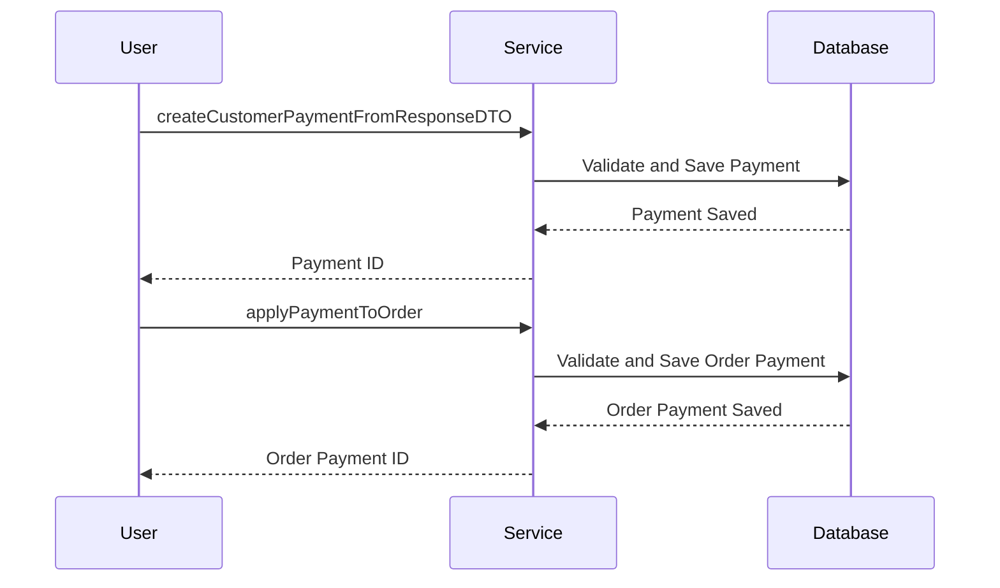

# Overview

The <SwmToken path="core/broadleaf-framework/src/main/java/org/broadleafcommerce/core/payment/service/DefaultPaymentGatewayCheckoutService.java" pos="79:3:3" line-data="    protected OrderPaymentService orderPaymentService;">`OrderPaymentService`</SwmToken> interface defines various methods for handling payment-related operations within the system. It includes methods for saving and reading payment entities such as <SwmToken path="core/broadleaf-framework/src/main/java/org/broadleafcommerce/core/payment/service/OrderPaymentStatusServiceImpl.java" pos="22:12:12" line-data="import org.broadleafcommerce.core.payment.domain.OrderPayment;">`OrderPayment`</SwmToken>, <SwmToken path="core/broadleaf-framework/src/main/java/org/broadleafcommerce/core/payment/service/OrderToPaymentRequestDTOServiceImpl.java" pos="50:19:19" line-data=" * - {@link org.broadleafcommerce.core.payment.domain.PaymentTransaction}">`PaymentTransaction`</SwmToken>, and <SwmToken path="core/broadleaf-framework/src/main/java/org/broadleafcommerce/core/payment/service/OrderPaymentServiceImpl.java" pos="31:12:12" line-data="import org.broadleafcommerce.core.payment.domain.PaymentLog;">`PaymentLog`</SwmToken>. The service also provides methods for creating new payment entities and transactions, as well as populating customer payment tokens. Additionally, it supports operations like soft-deleting payments, creating order payments from customer payments, and handling payment transactions during the checkout flow.

# Service Annotations

The <SwmToken path="core/broadleaf-framework/src/main/java/org/broadleafcommerce/core/payment/service/OrderPaymentStatusServiceImpl.java" pos="29:0:1" line-data="@Service(&quot;blOrderPaymentStatusService&quot;)">`@Service`</SwmToken> annotation is used to define various service classes as service components, making them available for dependency injection.

<SwmSnippet path="/core/broadleaf-framework/src/main/java/org/broadleafcommerce/core/payment/service/OrderPaymentStatusServiceImpl.java" line="25">

---

The <SwmToken path="core/broadleaf-framework/src/main/java/org/broadleafcommerce/core/payment/service/OrderPaymentStatusServiceImpl.java" pos="30:4:4" line-data="public class OrderPaymentStatusServiceImpl implements OrderPaymentStatusService {">`OrderPaymentStatusServiceImpl`</SwmToken> class is defined as a service component using the <SwmToken path="core/broadleaf-framework/src/main/java/org/broadleafcommerce/core/payment/service/OrderPaymentStatusServiceImpl.java" pos="29:0:1" line-data="@Service(&quot;blOrderPaymentStatusService&quot;)">`@Service`</SwmToken> annotation.

```java
import org.springframework.stereotype.Service;
import java.util.ArrayList;
import java.util.List;

@Service("blOrderPaymentStatusService")
```

---

</SwmSnippet>

<SwmSnippet path="/core/broadleaf-framework/src/main/java/org/broadleafcommerce/core/payment/service/PaymentResponseDTOToEntityServiceImpl.java" line="43">

---

The <SwmToken path="core/broadleaf-framework/src/main/java/org/broadleafcommerce/core/payment/service/PaymentResponseDTOToEntityServiceImpl.java" pos="50:4:4" line-data="public class PaymentResponseDTOToEntityServiceImpl implements PaymentResponseDTOToEntityService {">`PaymentResponseDTOToEntityServiceImpl`</SwmToken> class is defined as a service component using the <SwmToken path="core/broadleaf-framework/src/main/java/org/broadleafcommerce/core/payment/service/PaymentResponseDTOToEntityServiceImpl.java" pos="49:0:1" line-data="@Service(&quot;blPaymentResponseDTOToEntityService&quot;)">`@Service`</SwmToken> annotation.

```java
import org.springframework.stereotype.Service;
import javax.annotation.Resource;

/**
 * @author Elbert Bautista (elbertbautista)
 */
@Service("blPaymentResponseDTOToEntityService")
```

---

</SwmSnippet>

<SwmSnippet path="/core/broadleaf-framework/src/main/java/org/broadleafcommerce/core/payment/service/DefaultPaymentGatewayCheckoutService.java" line="55">

---

The <SwmToken path="core/broadleaf-framework/src/main/java/org/broadleafcommerce/core/payment/service/DefaultPaymentGatewayCheckoutService.java" pos="71:4:4" line-data="public class DefaultPaymentGatewayCheckoutService implements PaymentGatewayCheckoutService {">`DefaultPaymentGatewayCheckoutService`</SwmToken> class is defined as a service component using the <SwmToken path="core/broadleaf-framework/src/main/java/org/broadleafcommerce/core/payment/service/DefaultPaymentGatewayCheckoutService.java" pos="70:0:1" line-data="@Service(&quot;blPaymentGatewayCheckoutService&quot;)">`@Service`</SwmToken> annotation.

```java
import org.springframework.stereotype.Service;

import java.util.ArrayList;
import java.util.List;
import java.util.Map.Entry;

import javax.annotation.Resource;


/**
 * Core framework implementation of the {@link PaymentGatewayCheckoutService}.
 * 
 * @see {@link PaymentGatewayAbstractController}
 * @author Phillip Verheyden (phillipuniverse)
 */
@Service("blPaymentGatewayCheckoutService")
```

---

</SwmSnippet>

<SwmSnippet path="/core/broadleaf-framework/src/main/java/org/broadleafcommerce/core/payment/service/OrderToPaymentRequestDTOServiceImpl.java" line="43">

---

The <SwmToken path="core/broadleaf-framework/src/main/java/org/broadleafcommerce/core/payment/service/OrderToPaymentRequestDTOServiceImpl.java" pos="57:4:4" line-data="public class OrderToPaymentRequestDTOServiceImpl implements OrderToPaymentRequestDTOService {">`OrderToPaymentRequestDTOServiceImpl`</SwmToken> class is defined as a service component using the <SwmToken path="core/broadleaf-framework/src/main/java/org/broadleafcommerce/core/payment/service/OrderToPaymentRequestDTOServiceImpl.java" pos="56:0:1" line-data="@Service(&quot;blOrderToPaymentRequestDTOService&quot;)">`@Service`</SwmToken> annotation.

```java
import org.springframework.stereotype.Service;

import lombok.Data;

/**
 * Service that translates various pieces of information such as:
 * - {@link org.broadleafcommerce.core.order.domain.Order}
 * - {@link org.broadleafcommerce.core.payment.domain.PaymentTransaction}
 * into a {@link org.broadleafcommerce.common.payment.dto.PaymentRequestDTO} so that the gateway can create
 * the appropriate request for a specific transaction.
 *
 * @author Elbert Bautista (elbertbautista)
 */
@Service("blOrderToPaymentRequestDTOService")
```

---

</SwmSnippet>

<SwmSnippet path="/core/broadleaf-framework/src/main/java/org/broadleafcommerce/core/payment/service/OrderPaymentServiceImpl.java" line="36">

---

The <SwmToken path="core/broadleaf-framework/src/main/java/org/broadleafcommerce/core/payment/service/OrderPaymentServiceImpl.java" pos="46:4:4" line-data="public class OrderPaymentServiceImpl implements OrderPaymentService {">`OrderPaymentServiceImpl`</SwmToken> class is defined as a service component using the <SwmToken path="core/broadleaf-framework/src/main/java/org/broadleafcommerce/core/payment/service/OrderPaymentServiceImpl.java" pos="45:0:1" line-data="@Service(&quot;blOrderPaymentService&quot;)">`@Service`</SwmToken> annotation.

```java
import org.springframework.stereotype.Service;
import org.springframework.transaction.annotation.Transactional;

import java.util.HashMap;
import java.util.List;
import java.util.Map;

import javax.annotation.Resource;

@Service("blOrderPaymentService")
```

---

</SwmSnippet>

# Service Endpoints

The <SwmToken path="core/broadleaf-framework/src/main/java/org/broadleafcommerce/core/payment/service/DefaultPaymentGatewayCheckoutService.java" pos="79:3:3" line-data="    protected OrderPaymentService orderPaymentService;">`OrderPaymentService`</SwmToken> interface provides several key service endpoints for handling payment operations.

## <SwmToken path="core/broadleaf-framework/src/main/java/org/broadleafcommerce/core/payment/service/DefaultCustomerPaymentGatewayService.java" pos="63:5:5" line-data="    public Long createCustomerPaymentFromResponseDTO(PaymentResponseDTO responseDTO, PaymentGatewayConfiguration config)">`createCustomerPaymentFromResponseDTO`</SwmToken>

The <SwmToken path="core/broadleaf-framework/src/main/java/org/broadleafcommerce/core/payment/service/DefaultCustomerPaymentGatewayService.java" pos="63:5:5" line-data="    public Long createCustomerPaymentFromResponseDTO(PaymentResponseDTO responseDTO, PaymentGatewayConfiguration config)">`createCustomerPaymentFromResponseDTO`</SwmToken> method is responsible for creating a customer payment from a <SwmToken path="core/broadleaf-framework/src/main/java/org/broadleafcommerce/core/payment/service/DefaultPaymentGatewayCheckoutService.java" pos="91:7:7" line-data="    public Long applyPaymentToOrder(PaymentResponseDTO responseDTO, PaymentGatewayConfiguration config) {">`PaymentResponseDTO`</SwmToken> object. It validates the response and configuration, retrieves the customer by ID, and populates the customer payment details before saving it.

<SwmSnippet path="/core/broadleaf-framework/src/main/java/org/broadleafcommerce/core/payment/service/DefaultCustomerPaymentGatewayService.java" line="63">

---

The <SwmToken path="core/broadleaf-framework/src/main/java/org/broadleafcommerce/core/payment/service/DefaultCustomerPaymentGatewayService.java" pos="63:5:5" line-data="    public Long createCustomerPaymentFromResponseDTO(PaymentResponseDTO responseDTO, PaymentGatewayConfiguration config)">`createCustomerPaymentFromResponseDTO`</SwmToken> method validates the response and configuration, retrieves the customer by ID, and populates the customer payment details before saving it.

```java
    public Long createCustomerPaymentFromResponseDTO(PaymentResponseDTO responseDTO, PaymentGatewayConfiguration config)
            throws IllegalArgumentException {
        validateResponseAndConfig(responseDTO, config);

        Long customerId = Long.parseLong(responseDTO.getCustomer().getCustomerId());
        Customer customer = customerService.readCustomerById(customerId);

        if (customer != null) {
            if (isNewDefaultPaymentMethod(responseDTO)) {
                customerPaymentService.clearDefaultPaymentStatus(customer);
            }

            CustomerPayment customerPayment = customerPaymentService.create();
            populateCustomerPayment(customerPayment, responseDTO, config);
            customerPayment.setCustomer(customer);

            customerPayment = customerPaymentService.saveCustomerPayment(customerPayment);
            customer.getCustomerPayments().add(customerPayment);
            return customerPayment.getId();
        }
```

---

</SwmSnippet>

## <SwmToken path="core/broadleaf-framework/src/main/java/org/broadleafcommerce/core/payment/service/DefaultPaymentGatewayCheckoutService.java" pos="91:5:5" line-data="    public Long applyPaymentToOrder(PaymentResponseDTO responseDTO, PaymentGatewayConfiguration config) {">`applyPaymentToOrder`</SwmToken>

The <SwmToken path="core/broadleaf-framework/src/main/java/org/broadleafcommerce/core/payment/service/DefaultPaymentGatewayCheckoutService.java" pos="91:5:5" line-data="    public Long applyPaymentToOrder(PaymentResponseDTO responseDTO, PaymentGatewayConfiguration config) {">`applyPaymentToOrder`</SwmToken> method applies a payment to an order based on the <SwmToken path="core/broadleaf-framework/src/main/java/org/broadleafcommerce/core/payment/service/DefaultPaymentGatewayCheckoutService.java" pos="91:7:7" line-data="    public Long applyPaymentToOrder(PaymentResponseDTO responseDTO, PaymentGatewayConfiguration config) {">`PaymentResponseDTO`</SwmToken> object. It validates the response, retrieves the order by ID, and populates the order payment details, including billing and shipping information, before saving the payment and its transaction.

<SwmSnippet path="/core/broadleaf-framework/src/main/java/org/broadleafcommerce/core/payment/service/DefaultPaymentGatewayCheckoutService.java" line="91">

---

The <SwmToken path="core/broadleaf-framework/src/main/java/org/broadleafcommerce/core/payment/service/DefaultPaymentGatewayCheckoutService.java" pos="91:5:5" line-data="    public Long applyPaymentToOrder(PaymentResponseDTO responseDTO, PaymentGatewayConfiguration config) {">`applyPaymentToOrder`</SwmToken> method validates the response, retrieves the order by ID, and populates the order payment details before saving the payment and its transaction.

```java
    public Long applyPaymentToOrder(PaymentResponseDTO responseDTO, PaymentGatewayConfiguration config) {
        
        //Payments can ONLY be parsed into Order Payments if they are 'valid'
        if (!responseDTO.isValid()) {
            throw new IllegalArgumentException("Invalid payment responses cannot be parsed into the order payment domain");
        }
        
        if (config == null) {
            throw new IllegalArgumentException("Config service cannot be null");
        }
        
        Long orderId = Long.parseLong(responseDTO.getOrderId());
        Order order = orderService.findOrderById(orderId);
        
        if (!OrderStatus.IN_PROCESS.equals(order.getStatus()) && !OrderStatus.CSR_OWNED.equals(order.getStatus()) && !OrderStatus.QUOTE.equals(order.getStatus())) {
            throw new IllegalArgumentException("Cannot apply another payment to an Order that is not IN_PROCESS or CSR_OWNED");
        }
        
        Customer customer = order.getCustomer();
        if (customer.isAnonymous()) {
            GatewayCustomerDTO<PaymentResponseDTO> gatewayCustomer = responseDTO.getCustomer();
```

---

</SwmSnippet>

&nbsp;

*This is an auto-generated document by Swimm AI 🌊 and has not yet been verified by a human*

<SwmMeta version="3.0.0" repo-id="Z2l0aHViJTNBJTNBQnJvYWRsZWFmQ29tbWVyY2UtZGVtby1uZXclM0ElM0FTd2ltbS1EZW1v" repo-name="BroadleafCommerce-demo-new" doc-type="overview"><sup>Powered by [Swimm](/)</sup></SwmMeta>
