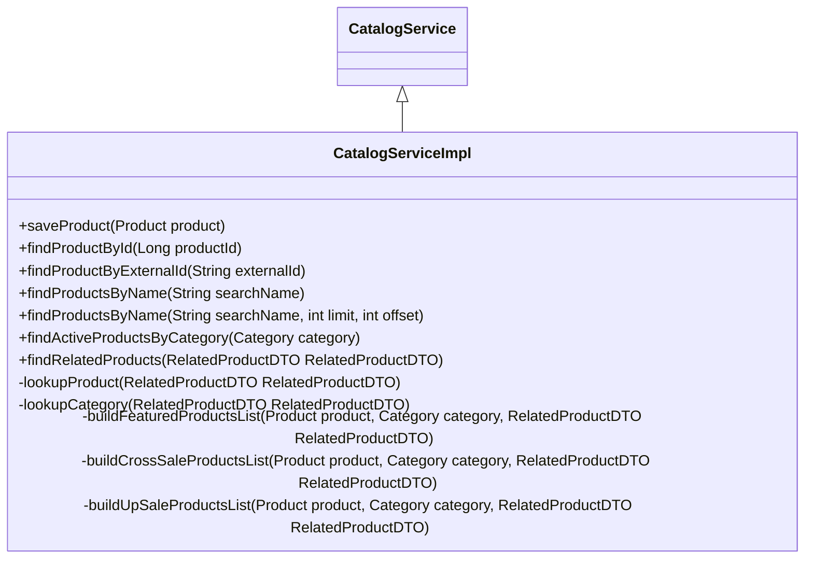

# What is Catalog Service

The <SwmToken path="core/broadleaf-framework/src/main/java/org/broadleafcommerce/core/catalog/service/RelatedProductsServiceImpl.java" pos="50:3:3" line-data="    protected CatalogService catalogService;">`CatalogService`</SwmToken> interface defines the contract for catalog-related operations, such as managing products, categories, and SKUs. It includes methods for saving and retrieving products and categories, finding products by various criteria, and managing product bundles.

The `CatalogServiceImpl` class implements the <SwmToken path="core/broadleaf-framework/src/main/java/org/broadleafcommerce/core/catalog/service/RelatedProductsServiceImpl.java" pos="50:3:3" line-data="    protected CatalogService catalogService;">`CatalogService`</SwmToken> interface and provides the actual logic for these operations, interacting with DAOs to perform database operations. The service is annotated with <SwmToken path="core/broadleaf-framework/src/main/java/org/broadleafcommerce/core/catalog/service/RelatedProductsServiceImpl.java" pos="37:0:1" line-data="@Service(&quot;blRelatedProductsService&quot;)">`@Service`</SwmToken> and is injected into various components across the application using the <SwmToken path="core/broadleaf-framework/src/main/java/org/broadleafcommerce/core/catalog/service/RelatedProductsServiceImpl.java" pos="43:1:2" line-data="    @Resource(name=&quot;blCategoryDao&quot;)">`@Resource`</SwmToken> annotation.

This allows different parts of the application to interact with the catalog data in a consistent manner, ensuring that all catalog-related operations are centralized and reusable.

## Service Annotation

The <SwmToken path="core/broadleaf-framework/src/main/java/org/broadleafcommerce/core/catalog/service/RelatedProductsServiceImpl.java" pos="37:0:1" line-data="@Service(&quot;blRelatedProductsService&quot;)">`@Service`</SwmToken> annotation is used to define a service class. In this case, <SwmToken path="core/broadleaf-framework/src/main/java/org/broadleafcommerce/core/catalog/service/RelatedProductsServiceImpl.java" pos="41:4:4" line-data="public class RelatedProductsServiceImpl implements RelatedProductsService {">`RelatedProductsServiceImpl`</SwmToken> is a service that provides methods for finding a product's related products.

<SwmSnippet path="/core/broadleaf-framework/src/main/java/org/broadleafcommerce/core/catalog/service/RelatedProductsServiceImpl.java" line="37">

---

The <SwmToken path="core/broadleaf-framework/src/main/java/org/broadleafcommerce/core/catalog/service/RelatedProductsServiceImpl.java" pos="37:0:1" line-data="@Service(&quot;blRelatedProductsService&quot;)">`@Service`</SwmToken> annotation marks the <SwmToken path="core/broadleaf-framework/src/main/java/org/broadleafcommerce/core/catalog/service/RelatedProductsServiceImpl.java" pos="41:4:4" line-data="public class RelatedProductsServiceImpl implements RelatedProductsService {">`RelatedProductsServiceImpl`</SwmToken> class as a service, making it available for dependency injection.

```java
@Service("blRelatedProductsService")
/*
 * Service that provides method for finding a product's related products.   
 */
public class RelatedProductsServiceImpl implements RelatedProductsService {
```

---

</SwmSnippet>

## Dependency Injection

Dependencies like <SwmToken path="core/broadleaf-framework/src/main/java/org/broadleafcommerce/core/catalog/service/RelatedProductsServiceImpl.java" pos="44:3:3" line-data="    protected CategoryDao categoryDao;">`CategoryDao`</SwmToken>, <SwmToken path="core/broadleaf-framework/src/main/java/org/broadleafcommerce/core/catalog/service/RelatedProductsServiceImpl.java" pos="47:3:3" line-data="    protected ProductDao productDao;">`ProductDao`</SwmToken>, and <SwmToken path="core/broadleaf-framework/src/main/java/org/broadleafcommerce/core/catalog/service/RelatedProductsServiceImpl.java" pos="50:3:3" line-data="    protected CatalogService catalogService;">`CatalogService`</SwmToken> are injected into the service class using the <SwmToken path="core/broadleaf-framework/src/main/java/org/broadleafcommerce/core/catalog/service/RelatedProductsServiceImpl.java" pos="43:1:2" line-data="    @Resource(name=&quot;blCategoryDao&quot;)">`@Resource`</SwmToken> annotation. This allows the service to interact with the data access layer.

<SwmSnippet path="/core/broadleaf-framework/src/main/java/org/broadleafcommerce/core/catalog/service/RelatedProductsServiceImpl.java" line="43">

---

The <SwmToken path="core/broadleaf-framework/src/main/java/org/broadleafcommerce/core/catalog/service/RelatedProductsServiceImpl.java" pos="43:1:2" line-data="    @Resource(name=&quot;blCategoryDao&quot;)">`@Resource`</SwmToken> annotation is used to inject dependencies like <SwmToken path="core/broadleaf-framework/src/main/java/org/broadleafcommerce/core/catalog/service/RelatedProductsServiceImpl.java" pos="44:3:3" line-data="    protected CategoryDao categoryDao;">`CategoryDao`</SwmToken>, <SwmToken path="core/broadleaf-framework/src/main/java/org/broadleafcommerce/core/catalog/service/RelatedProductsServiceImpl.java" pos="47:3:3" line-data="    protected ProductDao productDao;">`ProductDao`</SwmToken>, and <SwmToken path="core/broadleaf-framework/src/main/java/org/broadleafcommerce/core/catalog/service/RelatedProductsServiceImpl.java" pos="50:3:3" line-data="    protected CatalogService catalogService;">`CatalogService`</SwmToken> into the <SwmToken path="core/broadleaf-framework/src/main/java/org/broadleafcommerce/core/catalog/service/RelatedProductsServiceImpl.java" pos="41:4:4" line-data="public class RelatedProductsServiceImpl implements RelatedProductsService {">`RelatedProductsServiceImpl`</SwmToken> class.

```java
    @Resource(name="blCategoryDao")
    protected CategoryDao categoryDao;

    @Resource(name="blProductDao")
    protected ProductDao productDao;
    
    @Resource(name="blCatalogService")
    protected CatalogService catalogService;
```

---

</SwmSnippet>

## Service Methods

Service methods, such as <SwmToken path="core/broadleaf-framework/src/main/java/org/broadleafcommerce/core/catalog/service/RelatedProductsServiceImpl.java" pos="53:11:11" line-data="    public List&lt;? extends PromotableProduct&gt; findRelatedProducts(RelatedProductDTO relatedProductDTO) {">`findRelatedProducts`</SwmToken>, implement the business logic. They use the injected DAOs to perform database operations and return the results.

<SwmSnippet path="/core/broadleaf-framework/src/main/java/org/broadleafcommerce/core/catalog/service/RelatedProductsServiceImpl.java" line="52">

---

The <SwmToken path="core/broadleaf-framework/src/main/java/org/broadleafcommerce/core/catalog/service/RelatedProductsServiceImpl.java" pos="53:11:11" line-data="    public List&lt;? extends PromotableProduct&gt; findRelatedProducts(RelatedProductDTO relatedProductDTO) {">`findRelatedProducts`</SwmToken> method in <SwmToken path="core/broadleaf-framework/src/main/java/org/broadleafcommerce/core/catalog/service/RelatedProductsServiceImpl.java" pos="41:4:4" line-data="public class RelatedProductsServiceImpl implements RelatedProductsService {">`RelatedProductsServiceImpl`</SwmToken> uses the injected DAOs to perform database operations and return related products based on the criteria provided in <SwmToken path="core/broadleaf-framework/src/main/java/org/broadleafcommerce/core/catalog/service/RelatedProductsServiceImpl.java" pos="53:13:13" line-data="    public List&lt;? extends PromotableProduct&gt; findRelatedProducts(RelatedProductDTO relatedProductDTO) {">`RelatedProductDTO`</SwmToken>.

```java
    @Override
    public List<? extends PromotableProduct> findRelatedProducts(RelatedProductDTO relatedProductDTO) {
        Product product = lookupProduct(relatedProductDTO);
        Category category = lookupCategory(relatedProductDTO);      
        
        if (RelatedProductTypeEnum.FEATURED.equals(relatedProductDTO.getType())) {
            return buildFeaturedProductsList(product, category, relatedProductDTO);
        } else if (RelatedProductTypeEnum.CROSS_SALE.equals(relatedProductDTO.getType())) {
            return buildCrossSaleProductsList(product, category, relatedProductDTO);
        } else if (RelatedProductTypeEnum.UP_SALE.equals(relatedProductDTO.getType())) {
            return buildUpSaleProductsList(product, category, relatedProductDTO);
        } else {
            throw new IllegalArgumentException("RelatedProductType " + relatedProductDTO.getType() + " not supported.");
        }       
    }
```

---

</SwmSnippet>

<SwmSnippet path="/core/broadleaf-framework/src/main/java/org/broadleafcommerce/core/catalog/service/CatalogService.java" line="36">

---

The <SwmToken path="core/broadleaf-framework/src/main/java/org/broadleafcommerce/core/catalog/service/CatalogService.java" pos="36:4:4" line-data="public interface CatalogService {">`CatalogService`</SwmToken> interface includes methods for saving and retrieving products, finding products by various criteria, and managing product bundles.

```java
public interface CatalogService {

    Product saveProduct(Product product);

    Product findProductById(Long productId);
    
    Product findProductByExternalId(String externalId);

    List<Product> findProductsByName(String searchName);

    /**
     * Find a subset of {@code Product} instances whose name starts with
     * or is equal to the passed in search parameter.  Res
     * @param searchName
     * @param limit the maximum number of results
     * @param offset the starting point in the record set
     * @return the list of product instances that fit the search criteria
     */
    List<Product> findProductsByName(String searchName, int limit, int offset);

    List<Product> findActiveProductsByCategory(Category category);
```

---

</SwmSnippet>

&nbsp;

*This is an auto-generated document by Swimm AI 🌊 and has not yet been verified by a human*

<SwmMeta version="3.0.0" repo-id="Z2l0aHViJTNBJTNBQnJvYWRsZWFmQ29tbWVyY2UtZGVtby1uZXclM0ElM0FTd2ltbS1EZW1v" repo-name="BroadleafCommerce-demo-new" doc-type="overview"><sup>Powered by [Swimm](/)</sup></SwmMeta>
