```mermaid
classDiagram
    class Domain {
        +StructuredContent StructuredContent
        +StructuredContentField StructuredContentField
        +StructuredContentType StructuredContentType
    }
    class StructuredContent {
        +Map<String, StructuredContentField> getStructuredContentFields()
        +void setStructuredContentFields(Map<String, StructuredContentField> fields)
    }
    class StructuredContentField {
        +Long getId()
        +String getFieldKey()
        +void setFieldKey(String fieldKey)
    }
    class StructuredContentFieldImpl {
        +Long id
        +String fieldKey
    }
    class StructuredContentFieldXrefImpl {
        +StructuredContentField StructuredContentField
        +String key
    }
    Domain --> StructuredContent
    Domain --> StructuredContentField
    Domain --> StructuredContentType
    StructuredContent --> StructuredContentField
    StructuredContentField <|-- StructuredContentFieldImpl
    StructuredContentFieldXrefImpl --> StructuredContentField

%% Swimm:
%% classDiagram
%%     class Domain {
%%         +StructuredContent <SwmToken path="admin/broadleaf-contentmanagement-module/src/main/java/org/broadleafcommerce/cms/structure/domain/StructuredContentField.java" pos="28:28:28" line-data=" * Holds the values for custom fields that are part of a &lt;code&gt;StructuredContent&lt;/code&gt; item.">`StructuredContent`</SwmToken>
%%         +StructuredContentField <SwmToken path="admin/broadleaf-contentmanagement-module/src/main/java/org/broadleafcommerce/cms/structure/domain/StructuredContentField.java" pos="39:4:4" line-data="public interface StructuredContentField extends Serializable, Cloneable,MultiTenantCloneable&lt;StructuredContentField&gt; {">`StructuredContentField`</SwmToken>
%%         +StructuredContentType <SwmToken path="admin/broadleaf-contentmanagement-module/src/main/java/org/broadleafcommerce/cms/structure/domain/StructuredContentField.java" pos="32:11:11" line-data=" * with the {@link StructuredContentType}.">`StructuredContentType`</SwmToken>
%%     }
%%     class <SwmToken path="admin/broadleaf-contentmanagement-module/src/main/java/org/broadleafcommerce/cms/structure/domain/StructuredContentField.java" pos="28:28:28" line-data=" * Holds the values for custom fields that are part of a &lt;code&gt;StructuredContent&lt;/code&gt; item.">`StructuredContent`</SwmToken> {
%%         +Map<String, <SwmToken path="admin/broadleaf-contentmanagement-module/src/main/java/org/broadleafcommerce/cms/structure/domain/StructuredContentField.java" pos="39:15:16" line-data="public interface StructuredContentField extends Serializable, Cloneable,MultiTenantCloneable&lt;StructuredContentField&gt; {">`StructuredContentField>`</SwmToken> <SwmToken path="admin/broadleaf-contentmanagement-module/src/main/java/org/broadleafcommerce/cms/structure/domain/StructuredContent.java" pos="124:11:13" line-data="    public Map&lt;String, StructuredContentField&gt; getStructuredContentFields();">`getStructuredContentFields()`</SwmToken>
%%         +void setStructuredContentFields(Map<String, <SwmToken path="admin/broadleaf-contentmanagement-module/src/main/java/org/broadleafcommerce/cms/structure/domain/StructuredContentField.java" pos="39:15:16" line-data="public interface StructuredContentField extends Serializable, Cloneable,MultiTenantCloneable&lt;StructuredContentField&gt; {">`StructuredContentField>`</SwmToken> fields)
%%     }
%%     class <SwmToken path="admin/broadleaf-contentmanagement-module/src/main/java/org/broadleafcommerce/cms/structure/domain/StructuredContentField.java" pos="39:4:4" line-data="public interface StructuredContentField extends Serializable, Cloneable,MultiTenantCloneable&lt;StructuredContentField&gt; {">`StructuredContentField`</SwmToken> {
%%         +Long <SwmToken path="admin/broadleaf-contentmanagement-module/src/main/java/org/broadleafcommerce/cms/structure/domain/StructuredContentField.java" pos="47:5:7" line-data="    public Long getId();">`getId()`</SwmToken>
%%         +String <SwmToken path="admin/broadleaf-contentmanagement-module/src/main/java/org/broadleafcommerce/cms/structure/domain/StructuredContentField.java" pos="70:5:7" line-data="    public String getFieldKey();">`getFieldKey()`</SwmToken>
%%         +void setFieldKey(String <SwmToken path="admin/broadleaf-contentmanagement-module/src/main/java/org/broadleafcommerce/cms/structure/domain/StructuredContentField.java" pos="58:7:7" line-data="     * Returns the fieldKey associated with this field.   The key used for a">`fieldKey`</SwmToken>)
%%     }
%%     class <SwmToken path="admin/broadleaf-contentmanagement-module/src/main/java/org/broadleafcommerce/cms/structure/domain/StructuredContentFieldXrefImpl.java" pos="79:8:8" line-data="    @ManyToOne(targetEntity = StructuredContentFieldImpl.class, cascade = { CascadeType.ALL })">`StructuredContentFieldImpl`</SwmToken> {
%%         +Long id
%%         +String <SwmToken path="admin/broadleaf-contentmanagement-module/src/main/java/org/broadleafcommerce/cms/structure/domain/StructuredContentField.java" pos="58:7:7" line-data="     * Returns the fieldKey associated with this field.   The key used for a">`fieldKey`</SwmToken>
%%     }
%%     class <SwmToken path="admin/broadleaf-contentmanagement-module/src/main/java/org/broadleafcommerce/cms/structure/domain/StructuredContentFieldXrefImpl.java" pos="89:3:3" line-data="    public StructuredContentFieldXrefImpl() {">`StructuredContentFieldXrefImpl`</SwmToken> {
%%         +StructuredContentField <SwmToken path="admin/broadleaf-contentmanagement-module/src/main/java/org/broadleafcommerce/cms/structure/domain/StructuredContentField.java" pos="39:4:4" line-data="public interface StructuredContentField extends Serializable, Cloneable,MultiTenantCloneable&lt;StructuredContentField&gt; {">`StructuredContentField`</SwmToken>
%%         +String key
%%     }
%%     Domain --> <SwmToken path="admin/broadleaf-contentmanagement-module/src/main/java/org/broadleafcommerce/cms/structure/domain/StructuredContentField.java" pos="28:28:28" line-data=" * Holds the values for custom fields that are part of a &lt;code&gt;StructuredContent&lt;/code&gt; item.">`StructuredContent`</SwmToken>
%%     Domain --> <SwmToken path="admin/broadleaf-contentmanagement-module/src/main/java/org/broadleafcommerce/cms/structure/domain/StructuredContentField.java" pos="39:4:4" line-data="public interface StructuredContentField extends Serializable, Cloneable,MultiTenantCloneable&lt;StructuredContentField&gt; {">`StructuredContentField`</SwmToken>
%%     Domain --> <SwmToken path="admin/broadleaf-contentmanagement-module/src/main/java/org/broadleafcommerce/cms/structure/domain/StructuredContentField.java" pos="32:11:11" line-data=" * with the {@link StructuredContentType}.">`StructuredContentType`</SwmToken>
%%     <SwmToken path="admin/broadleaf-contentmanagement-module/src/main/java/org/broadleafcommerce/cms/structure/domain/StructuredContentField.java" pos="28:28:28" line-data=" * Holds the values for custom fields that are part of a &lt;code&gt;StructuredContent&lt;/code&gt; item.">`StructuredContent`</SwmToken> --> <SwmToken path="admin/broadleaf-contentmanagement-module/src/main/java/org/broadleafcommerce/cms/structure/domain/StructuredContentField.java" pos="39:4:4" line-data="public interface StructuredContentField extends Serializable, Cloneable,MultiTenantCloneable&lt;StructuredContentField&gt; {">`StructuredContentField`</SwmToken>
%%     <SwmToken path="admin/broadleaf-contentmanagement-module/src/main/java/org/broadleafcommerce/cms/structure/domain/StructuredContentField.java" pos="39:4:4" line-data="public interface StructuredContentField extends Serializable, Cloneable,MultiTenantCloneable&lt;StructuredContentField&gt; {">`StructuredContentField`</SwmToken> <|-- <SwmToken path="admin/broadleaf-contentmanagement-module/src/main/java/org/broadleafcommerce/cms/structure/domain/StructuredContentFieldXrefImpl.java" pos="79:8:8" line-data="    @ManyToOne(targetEntity = StructuredContentFieldImpl.class, cascade = { CascadeType.ALL })">`StructuredContentFieldImpl`</SwmToken>
%%     <SwmToken path="admin/broadleaf-contentmanagement-module/src/main/java/org/broadleafcommerce/cms/structure/domain/StructuredContentFieldXrefImpl.java" pos="89:3:3" line-data="    public StructuredContentFieldXrefImpl() {">`StructuredContentFieldXrefImpl`</SwmToken> --> <SwmToken path="admin/broadleaf-contentmanagement-module/src/main/java/org/broadleafcommerce/cms/structure/domain/StructuredContentField.java" pos="39:4:4" line-data="public interface StructuredContentField extends Serializable, Cloneable,MultiTenantCloneable&lt;StructuredContentField&gt; {">`StructuredContentField`</SwmToken>
```

# What is Domain Structure

The domain structure refers to the package organization that encapsulates the core business entities and logic within the Broadleaf Commerce framework. It includes classes and interfaces that define the structure and behavior of structured content within the content management system.

## Key Components

The domain package contains various classes such as <SwmToken path="admin/broadleaf-contentmanagement-module/src/main/java/org/broadleafcommerce/cms/structure/domain/StructuredContentField.java" pos="28:28:28" line-data=" * Holds the values for custom fields that are part of a &lt;code&gt;StructuredContent&lt;/code&gt; item.">`StructuredContent`</SwmToken>, <SwmToken path="admin/broadleaf-contentmanagement-module/src/main/java/org/broadleafcommerce/cms/structure/domain/StructuredContentField.java" pos="39:4:4" line-data="public interface StructuredContentField extends Serializable, Cloneable,MultiTenantCloneable&lt;StructuredContentField&gt; {">`StructuredContentField`</SwmToken>, and <SwmToken path="admin/broadleaf-contentmanagement-module/src/main/java/org/broadleafcommerce/cms/structure/domain/StructuredContentField.java" pos="32:11:11" line-data=" * with the {@link StructuredContentType}.">`StructuredContentType`</SwmToken>, which represent different aspects of structured content. These classes are used to manage and manipulate structured content, including defining custom fields, setting field values, and handling content rules.

## <SwmToken path="admin/broadleaf-contentmanagement-module/src/main/java/org/broadleafcommerce/cms/structure/domain/StructuredContentField.java" pos="39:4:4" line-data="public interface StructuredContentField extends Serializable, Cloneable,MultiTenantCloneable&lt;StructuredContentField&gt; {">`StructuredContentField`</SwmToken>

<SwmToken path="admin/broadleaf-contentmanagement-module/src/main/java/org/broadleafcommerce/cms/structure/domain/StructuredContentField.java" pos="39:4:4" line-data="public interface StructuredContentField extends Serializable, Cloneable,MultiTenantCloneable&lt;StructuredContentField&gt; {">`StructuredContentField`</SwmToken> holds the values for custom fields that are part of a <SwmToken path="admin/broadleaf-contentmanagement-module/src/main/java/org/broadleafcommerce/cms/structure/domain/StructuredContentField.java" pos="28:28:28" line-data=" * Holds the values for custom fields that are part of a &lt;code&gt;StructuredContent&lt;/code&gt; item.">`StructuredContent`</SwmToken> item. It includes methods to get and set the primary key, field key, and value of the custom field.

<SwmSnippet path="/admin/broadleaf-contentmanagement-module/src/main/java/org/broadleafcommerce/cms/structure/domain/StructuredContentField.java" line="27">

---

The <SwmToken path="admin/broadleaf-contentmanagement-module/src/main/java/org/broadleafcommerce/cms/structure/domain/StructuredContentField.java" pos="39:4:4" line-data="public interface StructuredContentField extends Serializable, Cloneable,MultiTenantCloneable&lt;StructuredContentField&gt; {">`StructuredContentField`</SwmToken> interface defines methods for managing custom fields within a <SwmToken path="admin/broadleaf-contentmanagement-module/src/main/java/org/broadleafcommerce/cms/structure/domain/StructuredContentField.java" pos="28:28:28" line-data=" * Holds the values for custom fields that are part of a &lt;code&gt;StructuredContent&lt;/code&gt; item.">`StructuredContent`</SwmToken> item. It includes methods like <SwmToken path="admin/broadleaf-contentmanagement-module/src/main/java/org/broadleafcommerce/cms/structure/domain/StructuredContentField.java" pos="47:5:5" line-data="    public Long getId();">`getId`</SwmToken> to retrieve the primary key.

```java
/**
 * Holds the values for custom fields that are part of a <code>StructuredContent</code> item.
 * <br>
 * Each item maintains a list of its custom fields.    The fields associated with an item are
 * determined by the {@link org.broadleafcommerce.cms.field.domain.FieldDefinition}s  associated
 * with the {@link StructuredContentType}.
 *
 * @see StructuredContentType
 * @see org.broadleafcommerce.cms.field.domain.FieldDefinition
 * @author bpolster
 *
 */
public interface StructuredContentField extends Serializable, Cloneable,MultiTenantCloneable<StructuredContentField> {

    /**
     * Gets the primary key.
     *
     * @return the primary key
     */
    @Nullable
    public Long getId();
```

---

</SwmSnippet>

## Usage in <SwmToken path="admin/broadleaf-contentmanagement-module/src/main/java/org/broadleafcommerce/cms/structure/domain/StructuredContentField.java" pos="28:28:28" line-data=" * Holds the values for custom fields that are part of a &lt;code&gt;StructuredContent&lt;/code&gt; item.">`StructuredContent`</SwmToken>

<SwmToken path="admin/broadleaf-contentmanagement-module/src/main/java/org/broadleafcommerce/cms/structure/domain/StructuredContentField.java" pos="39:4:4" line-data="public interface StructuredContentField extends Serializable, Cloneable,MultiTenantCloneable&lt;StructuredContentField&gt; {">`StructuredContentField`</SwmToken> is used within <SwmToken path="admin/broadleaf-contentmanagement-module/src/main/java/org/broadleafcommerce/cms/structure/domain/StructuredContentField.java" pos="28:28:28" line-data=" * Holds the values for custom fields that are part of a &lt;code&gt;StructuredContent&lt;/code&gt; item.">`StructuredContent`</SwmToken> to manage custom fields associated with structured content items. Methods like <SwmToken path="admin/broadleaf-contentmanagement-module/src/main/java/org/broadleafcommerce/cms/structure/domain/StructuredContent.java" pos="124:11:11" line-data="    public Map&lt;String, StructuredContentField&gt; getStructuredContentFields();">`getStructuredContentFields`</SwmToken> and <SwmToken path="admin/broadleaf-contentmanagement-module/src/main/java/org/broadleafcommerce/cms/structure/domain/StructuredContent.java" pos="132:5:5" line-data="    public void setStructuredContentFields(@Nullable Map&lt;String, StructuredContentField&gt; structuredContentFields);">`setStructuredContentFields`</SwmToken> handle the retrieval and setting of these fields.

<SwmSnippet path="/admin/broadleaf-contentmanagement-module/src/main/java/org/broadleafcommerce/cms/structure/domain/StructuredContent.java" line="123">

---

The <SwmToken path="admin/broadleaf-contentmanagement-module/src/main/java/org/broadleafcommerce/cms/structure/domain/StructuredContentField.java" pos="28:28:28" line-data=" * Holds the values for custom fields that are part of a &lt;code&gt;StructuredContent&lt;/code&gt; item.">`StructuredContent`</SwmToken> class uses <SwmToken path="admin/broadleaf-contentmanagement-module/src/main/java/org/broadleafcommerce/cms/structure/domain/StructuredContent.java" pos="124:8:8" line-data="    public Map&lt;String, StructuredContentField&gt; getStructuredContentFields();">`StructuredContentField`</SwmToken> to manage custom fields. Methods like <SwmToken path="admin/broadleaf-contentmanagement-module/src/main/java/org/broadleafcommerce/cms/structure/domain/StructuredContent.java" pos="124:11:11" line-data="    public Map&lt;String, StructuredContentField&gt; getStructuredContentFields();">`getStructuredContentFields`</SwmToken> and <SwmToken path="admin/broadleaf-contentmanagement-module/src/main/java/org/broadleafcommerce/cms/structure/domain/StructuredContent.java" pos="132:5:5" line-data="    public void setStructuredContentFields(@Nullable Map&lt;String, StructuredContentField&gt; structuredContentFields);">`setStructuredContentFields`</SwmToken> are used for this purpose.

```java
    @Deprecated
    public Map<String, StructuredContentField> getStructuredContentFields();

    /**
     * @deprecated - Use {@link #setStructuredContentFieldXrefs(Map)}
     *
     * @param structuredContentFields
     */
    @Deprecated
    public void setStructuredContentFields(@Nullable Map<String, StructuredContentField> structuredContentFields);

    /**
     * <b>NOTE: This method is typically only used when wanting to persist new {@link StructuredContentField}s.
     * Users trying to get a field to render should typically invoke {@link #getFieldValues()}.</b>
     * 
     * Gets a map with the custom fields associated with this content item.<br>
     * The map keys are based on the field types.   For example, consider a content
     * item with a <code>StructuredContentType</code> of ad which defined a field
     * named targetUrl.    The field could be accessed with
     * <code>structuredContentItem.getStructuredContentFields().get("targetUrl")</code>
     * @return
```

---

</SwmSnippet>

## Implementation in <SwmToken path="admin/broadleaf-contentmanagement-module/src/main/java/org/broadleafcommerce/cms/structure/domain/StructuredContentFieldXrefImpl.java" pos="79:8:8" line-data="    @ManyToOne(targetEntity = StructuredContentFieldImpl.class, cascade = { CascadeType.ALL })">`StructuredContentFieldImpl`</SwmToken>

<SwmToken path="admin/broadleaf-contentmanagement-module/src/main/java/org/broadleafcommerce/cms/structure/domain/StructuredContentFieldXrefImpl.java" pos="79:8:8" line-data="    @ManyToOne(targetEntity = StructuredContentFieldImpl.class, cascade = { CascadeType.ALL })">`StructuredContentFieldImpl`</SwmToken> implements the <SwmToken path="admin/broadleaf-contentmanagement-module/src/main/java/org/broadleafcommerce/cms/structure/domain/StructuredContentField.java" pos="39:4:4" line-data="public interface StructuredContentField extends Serializable, Cloneable,MultiTenantCloneable&lt;StructuredContentField&gt; {">`StructuredContentField`</SwmToken> interface, providing concrete implementations for methods like <SwmToken path="admin/broadleaf-contentmanagement-module/src/main/java/org/broadleafcommerce/cms/structure/domain/StructuredContentField.java" pos="97:5:5" line-data="    public StructuredContentField clone();">`clone`</SwmToken> and <SwmToken path="admin/broadleaf-contentmanagement-module/src/main/java/org/broadleafcommerce/cms/structure/domain/StructuredContentFieldXrefImpl.java" pos="140:16:16" line-data="    public &lt;G extends StructuredContentFieldXref&gt; CreateResponse&lt;G&gt; createOrRetrieveCopyInstance(MultiTenantCopyContext context) throws CloneNotSupportedException {">`createOrRetrieveCopyInstance`</SwmToken>.

## Usage in <SwmToken path="admin/broadleaf-contentmanagement-module/src/main/java/org/broadleafcommerce/cms/structure/domain/StructuredContentFieldXrefImpl.java" pos="89:3:3" line-data="    public StructuredContentFieldXrefImpl() {">`StructuredContentFieldXrefImpl`</SwmToken>

<SwmToken path="admin/broadleaf-contentmanagement-module/src/main/java/org/broadleafcommerce/cms/structure/domain/StructuredContentField.java" pos="39:4:4" line-data="public interface StructuredContentField extends Serializable, Cloneable,MultiTenantCloneable&lt;StructuredContentField&gt; {">`StructuredContentField`</SwmToken> is referenced in <SwmToken path="admin/broadleaf-contentmanagement-module/src/main/java/org/broadleafcommerce/cms/structure/domain/StructuredContentFieldXrefImpl.java" pos="89:3:3" line-data="    public StructuredContentFieldXrefImpl() {">`StructuredContentFieldXrefImpl`</SwmToken> to link structured content fields with their corresponding structured content items.

<SwmSnippet path="/admin/broadleaf-contentmanagement-module/src/main/java/org/broadleafcommerce/cms/structure/domain/StructuredContentFieldXrefImpl.java" line="82">

---

<SwmToken path="admin/broadleaf-contentmanagement-module/src/main/java/org/broadleafcommerce/cms/structure/domain/StructuredContentFieldXrefImpl.java" pos="89:3:3" line-data="    public StructuredContentFieldXrefImpl() {">`StructuredContentFieldXrefImpl`</SwmToken> links <SwmToken path="admin/broadleaf-contentmanagement-module/src/main/java/org/broadleafcommerce/cms/structure/domain/StructuredContentFieldXrefImpl.java" pos="83:3:3" line-data="    protected StructuredContentField structuredContentField;">`StructuredContentField`</SwmToken> with <SwmToken path="admin/broadleaf-contentmanagement-module/src/main/java/org/broadleafcommerce/cms/structure/domain/StructuredContentFieldXrefImpl.java" pos="93:5:5" line-data="    public StructuredContentFieldXrefImpl(StructuredContent sc, StructuredContentField scField, String key) {">`StructuredContent`</SwmToken> items, providing a mapping between them.

```java
    @AdminPresentation(fieldType = SupportedFieldType.FOREIGN_KEY)
    protected StructuredContentField structuredContentField;

    @Column(name = "MAP_KEY", nullable = false)
    @AdminPresentation(visibility = VisibilityEnum.HIDDEN_ALL)
    protected String key;

    public StructuredContentFieldXrefImpl() {
        //Default constructor for JPA...
    }

    public StructuredContentFieldXrefImpl(StructuredContent sc, StructuredContentField scField, String key) {
        this.structuredContent = sc;
        this.structuredContentField = scField;
        this.key = key;
    }

    @Override
    public void setId(Long id) {
        this.id = id;
    }
```

---

</SwmSnippet>

## Usage in <SwmToken path="admin/broadleaf-contentmanagement-module/src/main/java/org/broadleafcommerce/cms/structure/service/StructuredContentServiceImpl.java" pos="74:4:4" line-data="public class StructuredContentServiceImpl implements StructuredContentService {">`StructuredContentServiceImpl`</SwmToken>

<SwmToken path="admin/broadleaf-contentmanagement-module/src/main/java/org/broadleafcommerce/cms/structure/domain/StructuredContentField.java" pos="39:4:4" line-data="public interface StructuredContentField extends Serializable, Cloneable,MultiTenantCloneable&lt;StructuredContentField&gt; {">`StructuredContentField`</SwmToken> is used in <SwmToken path="admin/broadleaf-contentmanagement-module/src/main/java/org/broadleafcommerce/cms/structure/service/StructuredContentServiceImpl.java" pos="74:4:4" line-data="public class StructuredContentServiceImpl implements StructuredContentService {">`StructuredContentServiceImpl`</SwmToken> to handle the business logic related to structured content fields, such as retrieving and setting field values.

<SwmSnippet path="/admin/broadleaf-contentmanagement-module/src/main/java/org/broadleafcommerce/cms/structure/service/StructuredContentServiceImpl.java" line="30">

---

<SwmToken path="admin/broadleaf-contentmanagement-module/src/main/java/org/broadleafcommerce/cms/structure/service/StructuredContentServiceImpl.java" pos="74:4:4" line-data="public class StructuredContentServiceImpl implements StructuredContentService {">`StructuredContentServiceImpl`</SwmToken> uses <SwmToken path="admin/broadleaf-contentmanagement-module/src/main/java/org/broadleafcommerce/cms/structure/service/StructuredContentServiceImpl.java" pos="31:12:12" line-data="import org.broadleafcommerce.cms.structure.domain.StructuredContentField;">`StructuredContentField`</SwmToken> to manage the business logic for structured content fields.

```java
import org.broadleafcommerce.cms.structure.domain.StructuredContent;
import org.broadleafcommerce.cms.structure.domain.StructuredContentField;
import org.broadleafcommerce.cms.structure.domain.StructuredContentFieldTemplate;
import org.broadleafcommerce.cms.structure.domain.StructuredContentFieldXref;
import org.broadleafcommerce.cms.structure.domain.StructuredContentItemCriteria;
import org.broadleafcommerce.cms.structure.domain.StructuredContentRule;
import org.broadleafcommerce.cms.structure.domain.StructuredContentType;
import org.broadleafcommerce.common.cache.CacheStatType;
import org.broadleafcommerce.common.cache.StatisticsService;
import org.broadleafcommerce.common.extension.ExtensionResultHolder;
import org.broadleafcommerce.common.file.service.StaticAssetPathService;
import org.broadleafcommerce.common.locale.domain.Locale;
import org.broadleafcommerce.common.locale.service.LocaleService;
import org.broadleafcommerce.common.locale.util.LocaleUtil;
import org.broadleafcommerce.common.money.Money;
import org.broadleafcommerce.common.persistence.EntityConfiguration;
import org.broadleafcommerce.common.rule.RuleProcessor;
import org.broadleafcommerce.common.sandbox.domain.SandBox;
import org.broadleafcommerce.common.site.domain.Site;
import org.broadleafcommerce.common.structure.dto.ItemCriteriaDTO;
import org.broadleafcommerce.common.structure.dto.StructuredContentDTO;
```

---

</SwmSnippet>

## Main Functions

There are several main functions in this folder. Some of them are <SwmToken path="admin/broadleaf-contentmanagement-module/src/main/java/org/broadleafcommerce/cms/structure/domain/StructuredContentField.java" pos="47:5:5" line-data="    public Long getId();">`getId`</SwmToken>, <SwmToken path="admin/broadleaf-contentmanagement-module/src/main/java/org/broadleafcommerce/cms/structure/domain/StructuredContentFieldXrefImpl.java" pos="100:5:5" line-data="    public void setId(Long id) {">`setId`</SwmToken>, <SwmToken path="admin/broadleaf-contentmanagement-module/src/main/java/org/broadleafcommerce/cms/structure/domain/StructuredContentField.java" pos="70:5:5" line-data="    public String getFieldKey();">`getFieldKey`</SwmToken>, <SwmToken path="admin/broadleaf-contentmanagement-module/src/main/java/org/broadleafcommerce/cms/structure/domain/StructuredContentField.java" pos="77:5:5" line-data="    public void setFieldKey(@Nonnull String fieldKey);">`setFieldKey`</SwmToken>, and <SwmToken path="admin/broadleaf-contentmanagement-module/src/main/java/org/broadleafcommerce/cms/structure/domain/StructuredContentField.java" pos="84:5:5" line-data="    public void setValue(@Nonnull String value);">`setValue`</SwmToken>. We will dive a little into <SwmToken path="admin/broadleaf-contentmanagement-module/src/main/java/org/broadleafcommerce/cms/structure/domain/StructuredContentField.java" pos="70:5:5" line-data="    public String getFieldKey();">`getFieldKey`</SwmToken> and <SwmToken path="admin/broadleaf-contentmanagement-module/src/main/java/org/broadleafcommerce/cms/structure/domain/StructuredContentField.java" pos="77:5:5" line-data="    public void setFieldKey(@Nonnull String fieldKey);">`setFieldKey`</SwmToken>.

### <SwmToken path="admin/broadleaf-contentmanagement-module/src/main/java/org/broadleafcommerce/cms/structure/domain/StructuredContentField.java" pos="70:5:5" line-data="    public String getFieldKey();">`getFieldKey`</SwmToken>

The <SwmToken path="admin/broadleaf-contentmanagement-module/src/main/java/org/broadleafcommerce/cms/structure/domain/StructuredContentField.java" pos="70:5:5" line-data="    public String getFieldKey();">`getFieldKey`</SwmToken> function returns the field key associated with a <SwmToken path="admin/broadleaf-contentmanagement-module/src/main/java/org/broadleafcommerce/cms/structure/domain/StructuredContentField.java" pos="39:4:4" line-data="public interface StructuredContentField extends Serializable, Cloneable,MultiTenantCloneable&lt;StructuredContentField&gt; {">`StructuredContentField`</SwmToken>. This key is determined by the <SwmToken path="admin/broadleaf-contentmanagement-module/src/main/java/org/broadleafcommerce/cms/structure/domain/StructuredContentField.java" pos="31:23:23" line-data=" * determined by the {@link org.broadleafcommerce.cms.field.domain.FieldDefinition}s  associated">`FieldDefinition`</SwmToken> used by the Content Management System to create the instance.

<SwmSnippet path="/admin/broadleaf-contentmanagement-module/src/main/java/org/broadleafcommerce/cms/structure/domain/StructuredContentField.java" line="57">

---

The <SwmToken path="admin/broadleaf-contentmanagement-module/src/main/java/org/broadleafcommerce/cms/structure/domain/StructuredContentField.java" pos="70:5:5" line-data="    public String getFieldKey();">`getFieldKey`</SwmToken> method in <SwmToken path="admin/broadleaf-contentmanagement-module/src/main/java/org/broadleafcommerce/cms/structure/domain/StructuredContentField.java" pos="59:6:6" line-data="     * &lt;code&gt;StructuredContentField&lt;/code&gt; is determined by the associated">`StructuredContentField`</SwmToken> returns the key associated with the field, which is determined by the <SwmToken path="admin/broadleaf-contentmanagement-module/src/main/java/org/broadleafcommerce/cms/structure/domain/StructuredContentField.java" pos="60:17:17" line-data="     * {@link org.broadleafcommerce.cms.field.domain.FieldDefinition} that was used by the">`FieldDefinition`</SwmToken>.

```java
    /**
     * Returns the fieldKey associated with this field.   The key used for a
     * <code>StructuredContentField</code> is determined by the associated
     * {@link org.broadleafcommerce.cms.field.domain.FieldDefinition} that was used by the
     * Content Management System to create this instance.
     *
     * As an example, a <code>StructuredContentType</code> might be configured to contain a
     * field definition with a key of "targetUrl".
     *
     * @return the key associated with this item
     * @see org.broadleafcommerce.cms.field.domain.FieldDefinition
     */
    @Nonnull
    public String getFieldKey();
```

---

</SwmSnippet>

### <SwmToken path="admin/broadleaf-contentmanagement-module/src/main/java/org/broadleafcommerce/cms/structure/domain/StructuredContentField.java" pos="77:5:5" line-data="    public void setFieldKey(@Nonnull String fieldKey);">`setFieldKey`</SwmToken>

The <SwmToken path="admin/broadleaf-contentmanagement-module/src/main/java/org/broadleafcommerce/cms/structure/domain/StructuredContentField.java" pos="77:5:5" line-data="    public void setFieldKey(@Nonnull String fieldKey);">`setFieldKey`</SwmToken> function sets the field key for a <SwmToken path="admin/broadleaf-contentmanagement-module/src/main/java/org/broadleafcommerce/cms/structure/domain/StructuredContentField.java" pos="39:4:4" line-data="public interface StructuredContentField extends Serializable, Cloneable,MultiTenantCloneable&lt;StructuredContentField&gt; {">`StructuredContentField`</SwmToken>. This key is used to identify the field within the structured content.

<SwmSnippet path="/admin/broadleaf-contentmanagement-module/src/main/java/org/broadleafcommerce/cms/structure/domain/StructuredContentField.java" line="72">

---

The <SwmToken path="admin/broadleaf-contentmanagement-module/src/main/java/org/broadleafcommerce/cms/structure/domain/StructuredContentField.java" pos="77:5:5" line-data="    public void setFieldKey(@Nonnull String fieldKey);">`setFieldKey`</SwmToken> method in <SwmToken path="admin/broadleaf-contentmanagement-module/src/main/java/org/broadleafcommerce/cms/structure/domain/StructuredContentField.java" pos="39:4:4" line-data="public interface StructuredContentField extends Serializable, Cloneable,MultiTenantCloneable&lt;StructuredContentField&gt; {">`StructuredContentField`</SwmToken> sets the key for the field, which is used to identify it within the structured content.

```java
    /**
     * Sets the fieldKey.
     * @param fieldKey
     * @see org.broadleafcommerce.cms.field.domain.FieldDefinition
     */
    public void setFieldKey(@Nonnull String fieldKey);
```

---

</SwmSnippet>

&nbsp;

*This is an auto-generated document by Swimm AI 🌊 and has not yet been verified by a human*

<SwmMeta version="3.0.0" repo-id="Z2l0aHViJTNBJTNBQnJvYWRsZWFmQ29tbWVyY2UtZGVtby1uZXclM0ElM0FTd2ltbS1EZW1v" repo-name="BroadleafCommerce-demo-new" doc-type="overview"><sup>Powered by [Swimm](/)</sup></SwmMeta>
