```mermaid
classDiagram
    EntityForm <|-- AdminUserManagementController
    EntityForm <|-- AdminTranslationController
    EntityForm <|-- FormBuilderService
    EntityForm : +Map<String, Field> getFields()
    EntityForm : +void clearFieldsMap()
    EntityForm : +void putDynamicForm(String name, EntityForm ef)
    EntityForm : +void setCeilingEntityClassname(String ceilingEntityClassname)
    EntityForm : +String getEntityType()
    EntityForm : +void setEntityType(String entityType)
    entityFormValidator : +boolean validate(EntityForm form, Map<String, List<String>> propertyErrors, Errors errors)
    EntityForm : +void addField(ClassMetadata cmd, Field field)

%% Swimm:
%% classDiagram
%%     <SwmToken path="admin/broadleaf-open-admin-platform/src/main/java/org/broadleafcommerce/openadmin/web/form/entity/EntityForm.java" pos="47:4:4" line-data="public class EntityForm {">`EntityForm`</SwmToken> <|-- <SwmToken path="admin/broadleaf-open-admin-platform/src/main/java/org/broadleafcommerce/openadmin/web/controller/AdminUserManagementController.java" pos="41:9:9" line-data="@RequestMapping(&quot;/&quot; + AdminUserManagementController.SECTION_KEY)">`AdminUserManagementController`</SwmToken>
%%     <SwmToken path="admin/broadleaf-open-admin-platform/src/main/java/org/broadleafcommerce/openadmin/web/form/entity/EntityForm.java" pos="47:4:4" line-data="public class EntityForm {">`EntityForm`</SwmToken> <|-- <SwmToken path="admin/broadleaf-open-admin-platform/src/main/java/org/broadleafcommerce/openadmin/web/controller/AdminTranslationController.java" pos="65:4:4" line-data="public class AdminTranslationController extends AdminAbstractController {">`AdminTranslationController`</SwmToken>
%%     <SwmToken path="admin/broadleaf-open-admin-platform/src/main/java/org/broadleafcommerce/openadmin/web/form/entity/EntityForm.java" pos="47:4:4" line-data="public class EntityForm {">`EntityForm`</SwmToken> <|-- <SwmToken path="admin/broadleaf-open-admin-platform/src/main/java/org/broadleafcommerce/openadmin/web/service/FormBuilderService.java" pos="42:4:4" line-data="public interface FormBuilderService {">`FormBuilderService`</SwmToken>
%%     <SwmToken path="admin/broadleaf-open-admin-platform/src/main/java/org/broadleafcommerce/openadmin/web/form/entity/EntityForm.java" pos="47:4:4" line-data="public class EntityForm {">`EntityForm`</SwmToken> : +Map<String, Field> <SwmToken path="admin/broadleaf-open-admin-platform/src/main/java/org/broadleafcommerce/openadmin/web/form/entity/EntityForm.java" pos="124:11:13" line-data="    public Map&lt;String, Field&gt; getFields() {">`getFields()`</SwmToken>
%%     <SwmToken path="admin/broadleaf-open-admin-platform/src/main/java/org/broadleafcommerce/openadmin/web/form/entity/EntityForm.java" pos="47:4:4" line-data="public class EntityForm {">`EntityForm`</SwmToken> : +void <SwmToken path="admin/broadleaf-open-admin-platform/src/main/java/org/broadleafcommerce/openadmin/web/form/entity/EntityForm.java" pos="157:5:7" line-data="    public void clearFieldsMap() {">`clearFieldsMap()`</SwmToken>
%%     <SwmToken path="admin/broadleaf-open-admin-platform/src/main/java/org/broadleafcommerce/openadmin/web/form/entity/EntityForm.java" pos="47:4:4" line-data="public class EntityForm {">`EntityForm`</SwmToken> : +void <SwmToken path="admin/broadleaf-open-admin-platform/src/main/java/org/broadleafcommerce/openadmin/web/form/entity/EntityForm.java" pos="492:5:7" line-data="    public void putDynamicForm(String name, EntityForm ef) {">`putDynamicForm(String`</SwmToken> name, <SwmToken path="admin/broadleaf-open-admin-platform/src/main/java/org/broadleafcommerce/openadmin/web/form/entity/EntityForm.java" pos="47:4:4" line-data="public class EntityForm {">`EntityForm`</SwmToken> ef)
%%     <SwmToken path="admin/broadleaf-open-admin-platform/src/main/java/org/broadleafcommerce/openadmin/web/form/entity/EntityForm.java" pos="47:4:4" line-data="public class EntityForm {">`EntityForm`</SwmToken> : +void <SwmToken path="admin/broadleaf-open-admin-platform/src/main/java/org/broadleafcommerce/openadmin/web/form/entity/EntityForm.java" pos="626:5:7" line-data="    public void setCeilingEntityClassname(String ceilingEntityClassname) {">`setCeilingEntityClassname(String`</SwmToken> <SwmToken path="admin/broadleaf-open-admin-platform/src/main/java/org/broadleafcommerce/openadmin/web/form/entity/EntityForm.java" pos="626:9:9" line-data="    public void setCeilingEntityClassname(String ceilingEntityClassname) {">`ceilingEntityClassname`</SwmToken>)
%%     <SwmToken path="admin/broadleaf-open-admin-platform/src/main/java/org/broadleafcommerce/openadmin/web/form/entity/EntityForm.java" pos="47:4:4" line-data="public class EntityForm {">`EntityForm`</SwmToken> : +String <SwmToken path="admin/broadleaf-open-admin-platform/src/main/java/org/broadleafcommerce/openadmin/web/form/entity/EntityForm.java" pos="630:5:7" line-data="    public String getEntityType() {">`getEntityType()`</SwmToken>
%%     <SwmToken path="admin/broadleaf-open-admin-platform/src/main/java/org/broadleafcommerce/openadmin/web/form/entity/EntityForm.java" pos="47:4:4" line-data="public class EntityForm {">`EntityForm`</SwmToken> : +void <SwmToken path="admin/broadleaf-open-admin-platform/src/main/java/org/broadleafcommerce/openadmin/web/form/entity/EntityForm.java" pos="634:5:7" line-data="    public void setEntityType(String entityType) {">`setEntityType(String`</SwmToken> <SwmToken path="admin/broadleaf-open-admin-platform/src/main/java/org/broadleafcommerce/openadmin/web/form/entity/EntityForm.java" pos="631:3:3" line-data="        return entityType;">`entityType`</SwmToken>)
%%     <SwmToken path="admin/broadleaf-open-admin-platform/src/main/java/org/broadleafcommerce/openadmin/web/controller/AdminTranslationController.java" pos="179:1:1" line-data="        entityFormValidator.validate(entityForm, entity, result);">`entityFormValidator`</SwmToken> : +boolean <SwmToken path="admin/broadleaf-open-admin-platform/src/main/java/org/broadleafcommerce/openadmin/web/form/entity/EntityFormValidator.java" pos="52:5:7" line-data="    public boolean validate(EntityForm form, Map&lt;String, List&lt;String&gt;&gt; propertyErrors, Errors errors) {">`validate(EntityForm`</SwmToken> form, <SwmToken path="admin/broadleaf-open-admin-platform/src/main/java/org/broadleafcommerce/openadmin/web/form/entity/EntityForm.java" pos="124:3:5" line-data="    public Map&lt;String, Field&gt; getFields() {">`Map<String`</SwmToken>, <SwmToken path="admin/broadleaf-open-admin-platform/src/main/java/org/broadleafcommerce/openadmin/web/form/entity/EntityFormValidator.java" pos="52:17:20" line-data="    public boolean validate(EntityForm form, Map&lt;String, List&lt;String&gt;&gt; propertyErrors, Errors errors) {">`List<String>>`</SwmToken> <SwmToken path="admin/broadleaf-open-admin-platform/src/main/java/org/broadleafcommerce/openadmin/web/form/entity/EntityFormValidator.java" pos="52:22:22" line-data="    public boolean validate(EntityForm form, Map&lt;String, List&lt;String&gt;&gt; propertyErrors, Errors errors) {">`propertyErrors`</SwmToken>, Errors errors)
%%     <SwmToken path="admin/broadleaf-open-admin-platform/src/main/java/org/broadleafcommerce/openadmin/web/form/entity/EntityForm.java" pos="47:4:4" line-data="public class EntityForm {">`EntityForm`</SwmToken> : +void <SwmToken path="admin/broadleaf-open-admin-platform/src/main/java/org/broadleafcommerce/openadmin/web/form/entity/EntityForm.java" pos="347:5:7" line-data="    public void addField(ClassMetadata cmd, Field field) {">`addField(ClassMetadata`</SwmToken> cmd, Field field)
```

# Overview of <SwmToken path="admin/broadleaf-open-admin-platform/src/main/java/org/broadleafcommerce/openadmin/web/form/entity/EntityForm.java" pos="47:4:4" line-data="public class EntityForm {">`EntityForm`</SwmToken>

<SwmToken path="admin/broadleaf-open-admin-platform/src/main/java/org/broadleafcommerce/openadmin/web/form/entity/EntityForm.java" pos="47:4:4" line-data="public class EntityForm {">`EntityForm`</SwmToken> is a class that represents a form for managing entities in the admin interface. It contains various fields and methods to handle the form's data, such as <SwmToken path="admin/broadleaf-open-admin-platform/src/main/java/org/broadleafcommerce/openadmin/web/controller/AdminUserManagementController.java" pos="61:23:23" line-data="        String returnPath = super.viewEntityForm(request, response, model, pathVars, id);">`id`</SwmToken>, <SwmToken path="admin/broadleaf-open-admin-platform/src/main/java/org/broadleafcommerce/openadmin/web/form/entity/EntityForm.java" pos="60:5:5" line-data="    protected String parentId;">`parentId`</SwmToken>, <SwmToken path="admin/broadleaf-open-admin-platform/src/main/java/org/broadleafcommerce/openadmin/web/form/entity/EntityForm.java" pos="64:5:5" line-data="    protected String mainEntityName;">`mainEntityName`</SwmToken>, and <SwmToken path="admin/broadleaf-open-admin-platform/src/main/java/org/broadleafcommerce/openadmin/web/form/entity/EntityForm.java" pos="631:3:3" line-data="        return entityType;">`entityType`</SwmToken>. <SwmToken path="admin/broadleaf-open-admin-platform/src/main/java/org/broadleafcommerce/openadmin/web/form/entity/EntityForm.java" pos="47:4:4" line-data="public class EntityForm {">`EntityForm`</SwmToken> also manages dynamic forms, which are sub-forms that can be rendered based on other values in the main form. The class includes methods for validating, modifying, and populating the form with data. <SwmToken path="admin/broadleaf-open-admin-platform/src/main/java/org/broadleafcommerce/openadmin/web/form/entity/EntityForm.java" pos="47:4:4" line-data="public class EntityForm {">`EntityForm`</SwmToken> is used extensively across different controllers and services to facilitate the creation, update, and validation of entity data.

# <SwmToken path="admin/broadleaf-open-admin-platform/src/main/java/org/broadleafcommerce/openadmin/web/form/entity/EntityForm.java" pos="47:4:4" line-data="public class EntityForm {">`EntityForm`</SwmToken> Class

The <SwmToken path="admin/broadleaf-open-admin-platform/src/main/java/org/broadleafcommerce/openadmin/web/form/entity/EntityForm.java" pos="47:4:4" line-data="public class EntityForm {">`EntityForm`</SwmToken> class is defined in the file <SwmPath>[admin/broadleaf-open-admin-platform/src/main/java/org/broadleafcommerce/openadmin/web/form/entity/EntityForm.java](admin/broadleaf-open-admin-platform/src/main/java/org/broadleafcommerce/openadmin/web/form/entity/EntityForm.java)</SwmPath>. It includes various fields and methods to manage the form's data.

<SwmSnippet path="/admin/broadleaf-open-admin-platform/src/main/java/org/broadleafcommerce/openadmin/web/form/entity/EntityForm.java" line="47">

---

The <SwmToken path="admin/broadleaf-open-admin-platform/src/main/java/org/broadleafcommerce/openadmin/web/form/entity/EntityForm.java" pos="47:4:4" line-data="public class EntityForm {">`EntityForm`</SwmToken> class is defined here, and it includes various fields and methods to manage the form's data.

```java
public class EntityForm {

    protected static final Log LOG = LogFactory.getLog(EntityForm.class);
```

---

</SwmSnippet>

## <SwmToken path="admin/broadleaf-open-admin-platform/src/main/java/org/broadleafcommerce/openadmin/web/form/entity/EntityForm.java" pos="124:11:11" line-data="    public Map&lt;String, Field&gt; getFields() {">`getFields`</SwmToken> Method

The <SwmToken path="admin/broadleaf-open-admin-platform/src/main/java/org/broadleafcommerce/openadmin/web/form/entity/EntityForm.java" pos="124:11:11" line-data="    public Map&lt;String, Field&gt; getFields() {">`getFields`</SwmToken> method returns a map of all fields in the form, including dynamic form fields.

<SwmSnippet path="/admin/broadleaf-open-admin-platform/src/main/java/org/broadleafcommerce/openadmin/web/form/entity/EntityForm.java" line="124">

---

The <SwmToken path="admin/broadleaf-open-admin-platform/src/main/java/org/broadleafcommerce/openadmin/web/form/entity/EntityForm.java" pos="124:11:11" line-data="    public Map&lt;String, Field&gt; getFields() {">`getFields`</SwmToken> method returns a map of all fields in the form, including dynamic form fields.

```java
    public Map<String, Field> getFields() {
        if (fields == null) {
            Map<String, Field> map = new LinkedHashMap<String, Field>();
            for (Tab tab : tabs) {
                for (FieldGroup group : tab.getFieldGroups()) {
                    for (Field field : group.getFields()) {
                        map.put(field.getName(), field);
                    }
                }
            }
            fields = map;
        }

        for (Entry<String, EntityForm> entry : dynamicForms.entrySet()) {
            Map<String, Field> dynamicFormFields = entry.getValue().getFields();
            for (Entry<String, Field> dynamicField : dynamicFormFields.entrySet()) {
                if (!fields.containsKey(dynamicField.getKey())) {
                    fields.put(dynamicField.getKey(), dynamicField.getValue());
                } else if (LOG.isDebugEnabled()) {
                    LOG.debug("Excluding dynamic field " + StringUtil.sanitize(dynamicField.getKey()) +
                                " as there is already an occurrence in this entityForm");
```

---

</SwmSnippet>

## <SwmToken path="admin/broadleaf-open-admin-platform/src/main/java/org/broadleafcommerce/openadmin/web/form/entity/EntityForm.java" pos="157:5:5" line-data="    public void clearFieldsMap() {">`clearFieldsMap`</SwmToken> Method

The <SwmToken path="admin/broadleaf-open-admin-platform/src/main/java/org/broadleafcommerce/openadmin/web/form/entity/EntityForm.java" pos="157:5:5" line-data="    public void clearFieldsMap() {">`clearFieldsMap`</SwmToken> method clears the cached fields variable, forcing the form to rebuild itself.

<SwmSnippet path="/admin/broadleaf-open-admin-platform/src/main/java/org/broadleafcommerce/openadmin/web/form/entity/EntityForm.java" line="158">

---

The <SwmToken path="admin/broadleaf-open-admin-platform/src/main/java/org/broadleafcommerce/openadmin/web/form/entity/EntityForm.java" pos="157:5:5" line-data="    public void clearFieldsMap() {">`clearFieldsMap`</SwmToken> method clears the cached fields variable, forcing the form to rebuild itself.

```java
        fields = null;
    }
```

---

</SwmSnippet>

# Usage in Controllers

<SwmToken path="admin/broadleaf-open-admin-platform/src/main/java/org/broadleafcommerce/openadmin/web/form/entity/EntityForm.java" pos="47:4:4" line-data="public class EntityForm {">`EntityForm`</SwmToken> is used in various controllers to manage different types of forms.

## <SwmToken path="admin/broadleaf-open-admin-platform/src/main/java/org/broadleafcommerce/openadmin/web/controller/AdminUserManagementController.java" pos="41:9:9" line-data="@RequestMapping(&quot;/&quot; + AdminUserManagementController.SECTION_KEY)">`AdminUserManagementController`</SwmToken>

<SwmToken path="admin/broadleaf-open-admin-platform/src/main/java/org/broadleafcommerce/openadmin/web/form/entity/EntityForm.java" pos="47:4:4" line-data="public class EntityForm {">`EntityForm`</SwmToken> is used in the <SwmToken path="admin/broadleaf-open-admin-platform/src/main/java/org/broadleafcommerce/openadmin/web/controller/AdminUserManagementController.java" pos="41:9:9" line-data="@RequestMapping(&quot;/&quot; + AdminUserManagementController.SECTION_KEY)">`AdminUserManagementController`</SwmToken> to manage user-related forms.

<SwmSnippet path="/admin/broadleaf-open-admin-platform/src/main/java/org/broadleafcommerce/openadmin/web/controller/AdminUserManagementController.java" line="61">

---

<SwmToken path="admin/broadleaf-open-admin-platform/src/main/java/org/broadleafcommerce/openadmin/web/controller/AdminUserManagementController.java" pos="62:1:1" line-data="        EntityForm ef = (EntityForm) model.asMap().get(&quot;entityForm&quot;);">`EntityForm`</SwmToken> is used in the <SwmToken path="admin/broadleaf-open-admin-platform/src/main/java/org/broadleafcommerce/openadmin/web/controller/AdminUserManagementController.java" pos="41:9:9" line-data="@RequestMapping(&quot;/&quot; + AdminUserManagementController.SECTION_KEY)">`AdminUserManagementController`</SwmToken> to manage user-related forms.

```java
        String returnPath = super.viewEntityForm(request, response, model, pathVars, id);
        EntityForm ef = (EntityForm) model.asMap().get("entityForm");
        // Remove List Grid for Additional Fields
        ef.removeListGrid("additionalFields");

        return returnPath;
    }

    @Override
    @RequestMapping(value = "/{id}", method = RequestMethod.POST)
    public String saveEntity(HttpServletRequest request, HttpServletResponse response, Model model,
                             @PathVariable  Map<String, String> pathVars,
                             @PathVariable(value="id") String id,
                             @ModelAttribute(value="entityForm") EntityForm entityForm, BindingResult result,
                             RedirectAttributes ra) throws Exception {

        // Get the normal entity form for this item
        String returnPath = super.saveEntity(request, response, model, pathVars, id, entityForm, result, ra);
        // Remove List Grid for Additional Fields
        entityForm.removeListGrid("additionalFields");
```

---

</SwmSnippet>

## <SwmToken path="admin/broadleaf-open-admin-platform/src/main/java/org/broadleafcommerce/openadmin/web/controller/AdminTranslationController.java" pos="65:4:4" line-data="public class AdminTranslationController extends AdminAbstractController {">`AdminTranslationController`</SwmToken>

<SwmToken path="admin/broadleaf-open-admin-platform/src/main/java/org/broadleafcommerce/openadmin/web/form/entity/EntityForm.java" pos="47:4:4" line-data="public class EntityForm {">`EntityForm`</SwmToken> is used in the <SwmToken path="admin/broadleaf-open-admin-platform/src/main/java/org/broadleafcommerce/openadmin/web/controller/AdminTranslationController.java" pos="65:4:4" line-data="public class AdminTranslationController extends AdminAbstractController {">`AdminTranslationController`</SwmToken> to handle translation-related forms.

<SwmSnippet path="/admin/broadleaf-open-admin-platform/src/main/java/org/broadleafcommerce/openadmin/web/controller/AdminTranslationController.java" line="140">

---

<SwmToken path="admin/broadleaf-open-admin-platform/src/main/java/org/broadleafcommerce/openadmin/web/controller/AdminTranslationController.java" pos="140:1:1" line-data="        EntityForm entityForm = formService.buildTranslationForm(cmd, form, TranslationFormAction.ADD);">`EntityForm`</SwmToken> is used in the <SwmToken path="admin/broadleaf-open-admin-platform/src/main/java/org/broadleafcommerce/openadmin/web/controller/AdminTranslationController.java" pos="65:4:4" line-data="public class AdminTranslationController extends AdminAbstractController {">`AdminTranslationController`</SwmToken> to handle translation-related forms.

```java
        EntityForm entityForm = formService.buildTranslationForm(cmd, form, TranslationFormAction.ADD);
        model.addAttribute("entityForm", entityForm);
        model.addAttribute("viewType", "modal/translationAdd");
        model.addAttribute("currentUrl", request.getRequestURL().toString());
        model.addAttribute("modalHeaderType", ModalHeaderType.ADD_TRANSLATION.getType());
        return MODAL_CONTAINER_VIEW;
    }

    /**
     * Saves a new translation to the database.
     *
     * Note that if the ceiling entity, entity id, property name, and locale code match a previously existing translation,
     * this method will update that translation.
     *
     * @param request
     * @param response
     * @param model
     * @param entityForm
     * @param result
     * @return the result of a call to {@link #viewTranslation}, which renders the list grid
     * @throws Exception
```

---

</SwmSnippet>

# <SwmToken path="admin/broadleaf-open-admin-platform/src/main/java/org/broadleafcommerce/openadmin/web/service/FormBuilderService.java" pos="42:4:4" line-data="public interface FormBuilderService {">`FormBuilderService`</SwmToken>

The <SwmToken path="admin/broadleaf-open-admin-platform/src/main/java/org/broadleafcommerce/openadmin/web/service/FormBuilderService.java" pos="42:4:4" line-data="public interface FormBuilderService {">`FormBuilderService`</SwmToken> creates and populates <SwmToken path="admin/broadleaf-open-admin-platform/src/main/java/org/broadleafcommerce/openadmin/web/form/entity/EntityForm.java" pos="47:4:4" line-data="public class EntityForm {">`EntityForm`</SwmToken> instances with the appropriate fields and metadata.

<SwmSnippet path="/admin/broadleaf-open-admin-platform/src/main/java/org/broadleafcommerce/openadmin/web/service/FormBuilderService.java" line="115">

---

The <SwmToken path="admin/broadleaf-open-admin-platform/src/main/java/org/broadleafcommerce/openadmin/web/service/FormBuilderService.java" pos="42:4:4" line-data="public interface FormBuilderService {">`FormBuilderService`</SwmToken> creates and populates <SwmToken path="admin/broadleaf-open-admin-platform/src/main/java/org/broadleafcommerce/openadmin/web/service/FormBuilderService.java" pos="115:12:12" line-data="    public void removeNonApplicableFields(ClassMetadata cmd, EntityForm entityForm, String entityType);">`EntityForm`</SwmToken> instances with the appropriate fields and metadata.

```java
    public void removeNonApplicableFields(ClassMetadata cmd, EntityForm entityForm, String entityType);

    /**
     * Creates a new EntityForm with the a default 'Save' action. This will then delegate to
     * {@link #populateEntityForm(ClassMetadata, EntityForm)} to ensure that the newly created {@link EntityForm}
     * has all of the appropriate fields set up without any values based on <b>cmd</b>
     * 
     * @param cmd
     * @return the EntityForm
     * @throws ServiceException
```

---

</SwmSnippet>

# Main Functions

There are several main functions in this class. Some of them are <SwmToken path="admin/broadleaf-open-admin-platform/src/main/java/org/broadleafcommerce/openadmin/web/form/entity/EntityForm.java" pos="492:5:5" line-data="    public void putDynamicForm(String name, EntityForm ef) {">`putDynamicForm`</SwmToken>, <SwmToken path="admin/broadleaf-open-admin-platform/src/main/java/org/broadleafcommerce/openadmin/web/form/entity/EntityForm.java" pos="626:5:5" line-data="    public void setCeilingEntityClassname(String ceilingEntityClassname) {">`setCeilingEntityClassname`</SwmToken>, <SwmToken path="admin/broadleaf-open-admin-platform/src/main/java/org/broadleafcommerce/openadmin/web/form/entity/EntityForm.java" pos="630:5:5" line-data="    public String getEntityType() {">`getEntityType`</SwmToken>, and <SwmToken path="admin/broadleaf-open-admin-platform/src/main/java/org/broadleafcommerce/openadmin/web/form/entity/EntityForm.java" pos="634:5:5" line-data="    public void setEntityType(String entityType) {">`setEntityType`</SwmToken>.

## <SwmToken path="admin/broadleaf-open-admin-platform/src/main/java/org/broadleafcommerce/openadmin/web/form/entity/EntityForm.java" pos="492:5:5" line-data="    public void putDynamicForm(String name, EntityForm ef) {">`putDynamicForm`</SwmToken>

The <SwmToken path="admin/broadleaf-open-admin-platform/src/main/java/org/broadleafcommerce/openadmin/web/form/entity/EntityForm.java" pos="492:5:5" line-data="    public void putDynamicForm(String name, EntityForm ef) {">`putDynamicForm`</SwmToken> method is used to add a dynamic form to the <SwmToken path="admin/broadleaf-open-admin-platform/src/main/java/org/broadleafcommerce/openadmin/web/form/entity/EntityForm.java" pos="47:4:4" line-data="public class EntityForm {">`EntityForm`</SwmToken>. This is useful for handling sub-forms that are rendered based on other values in the main form.

<SwmSnippet path="/admin/broadleaf-open-admin-platform/src/main/java/org/broadleafcommerce/openadmin/web/form/entity/EntityForm.java" line="492">

---

The <SwmToken path="admin/broadleaf-open-admin-platform/src/main/java/org/broadleafcommerce/openadmin/web/form/entity/EntityForm.java" pos="492:5:5" line-data="    public void putDynamicForm(String name, EntityForm ef) {">`putDynamicForm`</SwmToken> method is used to add a dynamic form to the <SwmToken path="admin/broadleaf-open-admin-platform/src/main/java/org/broadleafcommerce/openadmin/web/form/entity/EntityForm.java" pos="492:12:12" line-data="    public void putDynamicForm(String name, EntityForm ef) {">`EntityForm`</SwmToken>.

```java
    public void putDynamicForm(String name, EntityForm ef) {
        getDynamicForms().put(name, ef);
    }
```

---

</SwmSnippet>

## <SwmToken path="admin/broadleaf-open-admin-platform/src/main/java/org/broadleafcommerce/openadmin/web/form/entity/EntityForm.java" pos="626:5:5" line-data="    public void setCeilingEntityClassname(String ceilingEntityClassname) {">`setCeilingEntityClassname`</SwmToken>

The <SwmToken path="admin/broadleaf-open-admin-platform/src/main/java/org/broadleafcommerce/openadmin/web/form/entity/EntityForm.java" pos="626:5:5" line-data="    public void setCeilingEntityClassname(String ceilingEntityClassname) {">`setCeilingEntityClassname`</SwmToken> method sets the ceiling entity class name for the <SwmToken path="admin/broadleaf-open-admin-platform/src/main/java/org/broadleafcommerce/openadmin/web/form/entity/EntityForm.java" pos="47:4:4" line-data="public class EntityForm {">`EntityForm`</SwmToken>. This is important for defining the type of entity that the form is managing.

<SwmSnippet path="/admin/broadleaf-open-admin-platform/src/main/java/org/broadleafcommerce/openadmin/web/form/entity/EntityForm.java" line="626">

---

The <SwmToken path="admin/broadleaf-open-admin-platform/src/main/java/org/broadleafcommerce/openadmin/web/form/entity/EntityForm.java" pos="626:5:5" line-data="    public void setCeilingEntityClassname(String ceilingEntityClassname) {">`setCeilingEntityClassname`</SwmToken> method sets the ceiling entity class name for the <SwmToken path="admin/broadleaf-open-admin-platform/src/main/java/org/broadleafcommerce/openadmin/web/form/entity/EntityForm.java" pos="47:4:4" line-data="public class EntityForm {">`EntityForm`</SwmToken>.

```java
    public void setCeilingEntityClassname(String ceilingEntityClassname) {
        this.ceilingEntityClassname = ceilingEntityClassname;
    }
```

---

</SwmSnippet>

## <SwmToken path="admin/broadleaf-open-admin-platform/src/main/java/org/broadleafcommerce/openadmin/web/form/entity/EntityForm.java" pos="630:5:5" line-data="    public String getEntityType() {">`getEntityType`</SwmToken>

The <SwmToken path="admin/broadleaf-open-admin-platform/src/main/java/org/broadleafcommerce/openadmin/web/form/entity/EntityForm.java" pos="630:5:5" line-data="    public String getEntityType() {">`getEntityType`</SwmToken> method retrieves the entity type for the <SwmToken path="admin/broadleaf-open-admin-platform/src/main/java/org/broadleafcommerce/openadmin/web/form/entity/EntityForm.java" pos="47:4:4" line-data="public class EntityForm {">`EntityForm`</SwmToken>. This is used to determine the specific type of entity being managed.

<SwmSnippet path="/admin/broadleaf-open-admin-platform/src/main/java/org/broadleafcommerce/openadmin/web/form/entity/EntityForm.java" line="630">

---

The <SwmToken path="admin/broadleaf-open-admin-platform/src/main/java/org/broadleafcommerce/openadmin/web/form/entity/EntityForm.java" pos="630:5:5" line-data="    public String getEntityType() {">`getEntityType`</SwmToken> method retrieves the entity type for the <SwmToken path="admin/broadleaf-open-admin-platform/src/main/java/org/broadleafcommerce/openadmin/web/form/entity/EntityForm.java" pos="47:4:4" line-data="public class EntityForm {">`EntityForm`</SwmToken>.

```java
    public String getEntityType() {
        return entityType;
    }
```

---

</SwmSnippet>

## <SwmToken path="admin/broadleaf-open-admin-platform/src/main/java/org/broadleafcommerce/openadmin/web/form/entity/EntityForm.java" pos="634:5:5" line-data="    public void setEntityType(String entityType) {">`setEntityType`</SwmToken>

The <SwmToken path="admin/broadleaf-open-admin-platform/src/main/java/org/broadleafcommerce/openadmin/web/form/entity/EntityForm.java" pos="634:5:5" line-data="    public void setEntityType(String entityType) {">`setEntityType`</SwmToken> method sets the entity type for the <SwmToken path="admin/broadleaf-open-admin-platform/src/main/java/org/broadleafcommerce/openadmin/web/form/entity/EntityForm.java" pos="47:4:4" line-data="public class EntityForm {">`EntityForm`</SwmToken>. This is crucial for specifying the type of entity that the form will handle.

<SwmSnippet path="/admin/broadleaf-open-admin-platform/src/main/java/org/broadleafcommerce/openadmin/web/form/entity/EntityForm.java" line="634">

---

The <SwmToken path="admin/broadleaf-open-admin-platform/src/main/java/org/broadleafcommerce/openadmin/web/form/entity/EntityForm.java" pos="634:5:5" line-data="    public void setEntityType(String entityType) {">`setEntityType`</SwmToken> method sets the entity type for the <SwmToken path="admin/broadleaf-open-admin-platform/src/main/java/org/broadleafcommerce/openadmin/web/form/entity/EntityForm.java" pos="47:4:4" line-data="public class EntityForm {">`EntityForm`</SwmToken>.

```java
    public void setEntityType(String entityType) {
        this.entityType = entityType;
    }
```

---

</SwmSnippet>

# Entity APIs

Entity APIs provide various methods to interact with <SwmToken path="admin/broadleaf-open-admin-platform/src/main/java/org/broadleafcommerce/openadmin/web/form/entity/EntityForm.java" pos="47:4:4" line-data="public class EntityForm {">`EntityForm`</SwmToken>.

## validate

The <SwmToken path="admin/broadleaf-open-admin-platform/src/main/java/org/broadleafcommerce/openadmin/web/form/entity/EntityFormValidator.java" pos="52:5:5" line-data="    public boolean validate(EntityForm form, Map&lt;String, List&lt;String&gt;&gt; propertyErrors, Errors errors) {">`validate`</SwmToken> method in <SwmToken path="admin/broadleaf-open-admin-platform/src/main/java/org/broadleafcommerce/openadmin/web/controller/AdminTranslationController.java" pos="179:1:1" line-data="        entityFormValidator.validate(entityForm, entity, result);">`entityFormValidator`</SwmToken> is used to validate an <SwmToken path="admin/broadleaf-open-admin-platform/src/main/java/org/broadleafcommerce/openadmin/web/form/entity/EntityForm.java" pos="47:4:4" line-data="public class EntityForm {">`EntityForm`</SwmToken> against a map of property errors. This method ensures that the entity has passed validation from the <SwmToken path="admin/broadleaf-open-admin-platform/src/main/java/org/broadleafcommerce/openadmin/web/form/entity/EntityFormValidator.java" pos="35:35:35" line-data=" * Validator used at the controller level to ensure that an Entity has passed validation from the PersistenceModule or">`PersistenceModule`</SwmToken> or <SwmToken path="admin/broadleaf-open-admin-platform/src/main/java/org/broadleafcommerce/openadmin/web/form/entity/EntityFormValidator.java" pos="36:3:3" line-data=" * CustomPersistenceHandler. This should be used as a final validation step after attempting the save">`CustomPersistenceHandler`</SwmToken>.

<SwmSnippet path="/admin/broadleaf-open-admin-platform/src/main/java/org/broadleafcommerce/openadmin/web/form/entity/EntityFormValidator.java" line="52">

---

The <SwmToken path="admin/broadleaf-open-admin-platform/src/main/java/org/broadleafcommerce/openadmin/web/form/entity/EntityFormValidator.java" pos="52:5:5" line-data="    public boolean validate(EntityForm form, Map&lt;String, List&lt;String&gt;&gt; propertyErrors, Errors errors) {">`validate`</SwmToken> method in <SwmToken path="admin/broadleaf-open-admin-platform/src/main/java/org/broadleafcommerce/openadmin/web/controller/AdminTranslationController.java" pos="179:1:1" line-data="        entityFormValidator.validate(entityForm, entity, result);">`entityFormValidator`</SwmToken> is used to validate an <SwmToken path="admin/broadleaf-open-admin-platform/src/main/java/org/broadleafcommerce/openadmin/web/form/entity/EntityFormValidator.java" pos="52:7:7" line-data="    public boolean validate(EntityForm form, Map&lt;String, List&lt;String&gt;&gt; propertyErrors, Errors errors) {">`EntityForm`</SwmToken> against a map of property errors.

```java
    public boolean validate(EntityForm form, Map<String, List<String>> propertyErrors, Errors errors) {
        return validate(form, propertyErrors, null, errors);
    }
```

---

</SwmSnippet>

## <SwmToken path="admin/broadleaf-open-admin-platform/src/main/java/org/broadleafcommerce/openadmin/web/form/entity/EntityForm.java" pos="347:5:5" line-data="    public void addField(ClassMetadata cmd, Field field) {">`addField`</SwmToken>

The <SwmToken path="admin/broadleaf-open-admin-platform/src/main/java/org/broadleafcommerce/openadmin/web/form/entity/EntityForm.java" pos="347:5:5" line-data="    public void addField(ClassMetadata cmd, Field field) {">`addField`</SwmToken> method in <SwmToken path="admin/broadleaf-open-admin-platform/src/main/java/org/broadleafcommerce/openadmin/web/form/entity/EntityForm.java" pos="47:4:4" line-data="public class EntityForm {">`EntityForm`</SwmToken> is used to add a field to the form. This method takes a <SwmToken path="admin/broadleaf-open-admin-platform/src/main/java/org/broadleafcommerce/openadmin/web/form/entity/EntityForm.java" pos="347:7:7" line-data="    public void addField(ClassMetadata cmd, Field field) {">`ClassMetadata`</SwmToken> object and a <SwmToken path="admin/broadleaf-open-admin-platform/src/main/java/org/broadleafcommerce/openadmin/web/form/entity/EntityForm.java" pos="124:8:8" line-data="    public Map&lt;String, Field&gt; getFields() {">`Field`</SwmToken> object as parameters and adds the field to the form's internal data structure.

<SwmSnippet path="/admin/broadleaf-open-admin-platform/src/main/java/org/broadleafcommerce/openadmin/web/form/entity/EntityForm.java" line="347">

---

The <SwmToken path="admin/broadleaf-open-admin-platform/src/main/java/org/broadleafcommerce/openadmin/web/form/entity/EntityForm.java" pos="347:5:5" line-data="    public void addField(ClassMetadata cmd, Field field) {">`addField`</SwmToken> method in <SwmToken path="admin/broadleaf-open-admin-platform/src/main/java/org/broadleafcommerce/openadmin/web/form/entity/EntityForm.java" pos="47:4:4" line-data="public class EntityForm {">`EntityForm`</SwmToken> is used to add a field to the form.

```java
    public void addField(ClassMetadata cmd, Field field) {
        addField(cmd, field, DEFAULT_GROUP_NAME, DEFAULT_GROUP_ORDER, DEFAULT_TAB_NAME, DEFAULT_TAB_ORDER);
    }
```

---

</SwmSnippet>

&nbsp;

*This is an auto-generated document by Swimm AI 🌊 and has not yet been verified by a human*

<SwmMeta version="3.0.0" repo-id="Z2l0aHViJTNBJTNBQnJvYWRsZWFmQ29tbWVyY2UtZGVtby1uZXclM0ElM0FTd2ltbS1EZW1v" repo-name="BroadleafCommerce-demo-new" doc-type="overview"><sup>Powered by [Swimm](/)</sup></SwmMeta>
