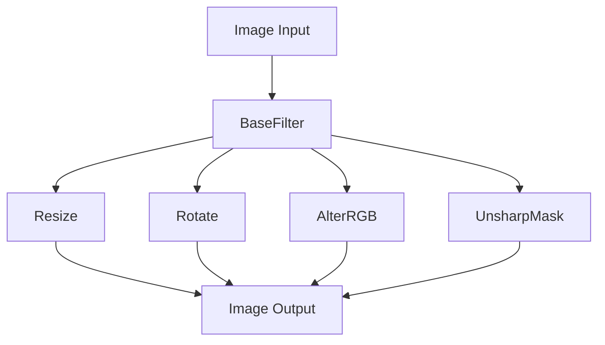

# Understanding Image Filter

Filters are components used to apply various image effects in a chain. They are part of the image processing pipeline and are used to modify images by applying operations such as resizing, rotating, altering colors, and sharpening. Each filter performs a specific operation on the image, and multiple filters can be chained together to achieve complex image transformations.

# <SwmToken path="admin/broadleaf-open-admin-platform/src/main/java/org/broadleafcommerce/openadmin/server/service/artifact/image/effects/chain/filter/BaseFilter.java" pos="31:6:6" line-data="public abstract class BaseFilter implements BufferedImageOp, OperationBuilder {">`BaseFilter`</SwmToken> Class

The <SwmToken path="admin/broadleaf-open-admin-platform/src/main/java/org/broadleafcommerce/openadmin/server/service/artifact/image/effects/chain/filter/BaseFilter.java" pos="31:6:6" line-data="public abstract class BaseFilter implements BufferedImageOp, OperationBuilder {">`BaseFilter`</SwmToken> class provides common functionality for all filters, including methods to check if specific filter parameters are present. This class is essential for ensuring that all filters have a consistent interface and can be easily managed within the image processing pipeline.

# Filter Implementations

Filters like `Resize`, `Rotate`, `AlterRGB`, and `UnsharpMask` are implemented to handle different types of image modifications. Each of these filters performs a specific transformation on the image, allowing for a wide range of effects to be applied.

# Filter Package

Filters are defined in the package <SwmToken path="admin/broadleaf-open-admin-platform/src/main/java/org/broadleafcommerce/openadmin/server/service/artifact/image/effects/chain/filter/BaseFilter.java" pos="18:2:20" line-data="package org.broadleafcommerce.openadmin.server.service.artifact.image.effects.chain.filter;">`org.broadleafcommerce.openadmin.server.service.artifact.image.effects.chain.filter`</SwmToken>. This package contains all the classes and interfaces necessary for implementing and managing image filters.

# Main Functions

There are several main functions in this folder. Some of them are <SwmToken path="admin/broadleaf-open-admin-platform/src/main/java/org/broadleafcommerce/openadmin/server/service/artifact/image/effects/chain/filter/BaseFilter.java" pos="40:5:5" line-data="    public BufferedImage createCompatibleDestImage(BufferedImage src,">`createCompatibleDestImage`</SwmToken>, <SwmToken path="admin/broadleaf-open-admin-platform/src/main/java/org/broadleafcommerce/openadmin/server/service/artifact/image/effects/chain/filter/BaseFilter.java" pos="78:14:14" line-data="     * @see java.awt.image.BufferedImageOp#getBounds2D(java.awt.image.BufferedImage)">`getBounds2D`</SwmToken>, <SwmToken path="admin/broadleaf-open-admin-platform/src/main/java/org/broadleafcommerce/openadmin/server/service/artifact/image/effects/chain/filter/BaseFilter.java" pos="85:14:14" line-data="     * @see java.awt.image.BufferedImageOp#getPoint2D(java.awt.geom.Point2D, java.awt.geom.Point2D)">`getPoint2D`</SwmToken>, <SwmToken path="admin/broadleaf-open-admin-platform/src/main/java/org/broadleafcommerce/openadmin/server/service/artifact/image/effects/chain/filter/AutoLevelsRGB.java" pos="72:5:5" line-data="    public BufferedImage filter(BufferedImage src, BufferedImage dst) {">`filter`</SwmToken>, and <SwmToken path="admin/broadleaf-open-admin-platform/src/main/java/org/broadleafcommerce/openadmin/server/service/artifact/image/effects/chain/filter/AutoLevelsRGB.java" pos="56:5:5" line-data="    public Operation buildOperation(Map&lt;String, String&gt; parameterMap, InputStream artifactStream, String mimeType) {">`buildOperation`</SwmToken>. We will dive a little into <SwmToken path="admin/broadleaf-open-admin-platform/src/main/java/org/broadleafcommerce/openadmin/server/service/artifact/image/effects/chain/filter/BaseFilter.java" pos="40:5:5" line-data="    public BufferedImage createCompatibleDestImage(BufferedImage src,">`createCompatibleDestImage`</SwmToken> and <SwmToken path="admin/broadleaf-open-admin-platform/src/main/java/org/broadleafcommerce/openadmin/server/service/artifact/image/effects/chain/filter/AutoLevelsRGB.java" pos="72:5:5" line-data="    public BufferedImage filter(BufferedImage src, BufferedImage dst) {">`filter`</SwmToken>.

## <SwmToken path="admin/broadleaf-open-admin-platform/src/main/java/org/broadleafcommerce/openadmin/server/service/artifact/image/effects/chain/filter/BaseFilter.java" pos="40:5:5" line-data="    public BufferedImage createCompatibleDestImage(BufferedImage src,">`createCompatibleDestImage`</SwmToken>

The <SwmToken path="admin/broadleaf-open-admin-platform/src/main/java/org/broadleafcommerce/openadmin/server/service/artifact/image/effects/chain/filter/BaseFilter.java" pos="40:5:5" line-data="    public BufferedImage createCompatibleDestImage(BufferedImage src,">`createCompatibleDestImage`</SwmToken> function creates a destination image that is compatible with the source image. It ensures that the destination image has the same color model and properties as the source image, which is essential for consistent image processing.

<SwmSnippet path="/admin/broadleaf-open-admin-platform/src/main/java/org/broadleafcommerce/openadmin/server/service/artifact/image/effects/chain/filter/BaseFilter.java" line="40">

---

The <SwmToken path="admin/broadleaf-open-admin-platform/src/main/java/org/broadleafcommerce/openadmin/server/service/artifact/image/effects/chain/filter/BaseFilter.java" pos="40:5:5" line-data="    public BufferedImage createCompatibleDestImage(BufferedImage src,">`createCompatibleDestImage`</SwmToken> function ensures that the destination image has the same color model and properties as the source image, which is essential for consistent image processing.

```java
    public BufferedImage createCompatibleDestImage(BufferedImage src,
            ColorModel destCM) {
        BufferedImage image;
        if (destCM == null) {
            destCM = src.getColorModel();
            // Not much support for ICM
            if (destCM instanceof IndexColorModel) {
                destCM = ColorModel.getRGBdefault();
            }
        }

        int w = src.getWidth();
        int h = src.getHeight();
        image = new BufferedImage (destCM,
                                   destCM.createCompatibleWritableRaster(w, h),
                                   destCM.isAlphaPremultiplied(), null);

        return image;
    }
```

---

</SwmSnippet>

## filter

The <SwmToken path="admin/broadleaf-open-admin-platform/src/main/java/org/broadleafcommerce/openadmin/server/service/artifact/image/effects/chain/filter/AutoLevelsRGB.java" pos="72:5:5" line-data="    public BufferedImage filter(BufferedImage src, BufferedImage dst) {">`filter`</SwmToken> function applies the specific image processing operation defined by the filter. In the case of <SwmToken path="admin/broadleaf-open-admin-platform/src/main/java/org/broadleafcommerce/openadmin/server/service/artifact/image/effects/chain/filter/AutoLevelsRGB.java" pos="40:4:4" line-data="public class AutoLevelsRGB extends BaseFilter {">`AutoLevelsRGB`</SwmToken>, it adjusts the tonal range of the image to ensure that the tones are equally distributed from black to white, similar to the <SwmToken path="admin/broadleaf-open-admin-platform/src/main/java/org/broadleafcommerce/openadmin/server/service/artifact/image/effects/chain/filter/AutoLevelsRGB.java" pos="32:17:19" line-data=" * This filter is based conceptually on the auto-levels feature of Photoshop and functions in the same way.">`auto-levels`</SwmToken> feature in Photoshop.

<SwmSnippet path="/admin/broadleaf-open-admin-platform/src/main/java/org/broadleafcommerce/openadmin/server/service/artifact/image/effects/chain/filter/AutoLevelsRGB.java" line="72">

---

The <SwmToken path="admin/broadleaf-open-admin-platform/src/main/java/org/broadleafcommerce/openadmin/server/service/artifact/image/effects/chain/filter/AutoLevelsRGB.java" pos="72:5:5" line-data="    public BufferedImage filter(BufferedImage src, BufferedImage dst) {">`filter`</SwmToken> function in <SwmToken path="admin/broadleaf-open-admin-platform/src/main/java/org/broadleafcommerce/openadmin/server/service/artifact/image/effects/chain/filter/AutoLevelsRGB.java" pos="40:4:4" line-data="public class AutoLevelsRGB extends BaseFilter {">`AutoLevelsRGB`</SwmToken> adjusts the tonal range of the image to ensure that the tones are equally distributed from black to white.

```java
    public BufferedImage filter(BufferedImage src, BufferedImage dst) {
        if (src == null) {
            throw new NullPointerException("src image is null");
        }
        if (src == dst) {
            throw new IllegalArgumentException("src image cannot be the same as the dst image");
        }
        
        boolean needToConvert = false;
        ColorModel srcCM = src.getColorModel();
        ColorModel dstCM;
        BufferedImage origDst = dst;
        
        if (srcCM instanceof IndexColorModel) {
            IndexColorModel icm = (IndexColorModel) srcCM;
            src = icm.convertToIntDiscrete(src.getRaster(), false);
            srcCM = src.getColorModel();
```

---

</SwmSnippet>

&nbsp;

*This is an auto-generated document by Swimm AI 🌊 and has not yet been verified by a human*

<SwmMeta version="3.0.0" repo-id="Z2l0aHViJTNBJTNBQnJvYWRsZWFmQ29tbWVyY2UtZGVtby1uZXclM0ElM0FTd2ltbS1EZW1v" repo-name="BroadleafCommerce-demo-new" doc-type="overview"><sup>Powered by [Swimm](/)</sup></SwmMeta>
