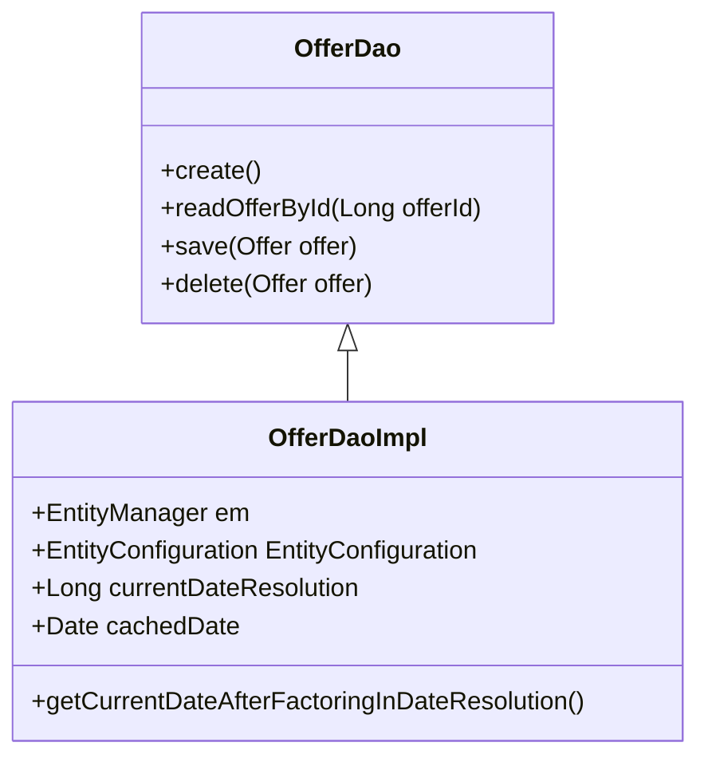

# Overview of Offer Data Access Object

The <SwmToken path="core/broadleaf-framework/src/main/java/org/broadleafcommerce/core/offer/dao/OfferDao.java" pos="33:4:4" line-data="public interface OfferDao {">`OfferDao`</SwmToken> interface defines the data access operations for managing <SwmToken path="core/broadleaf-framework/src/main/java/org/broadleafcommerce/core/offer/dao/OfferDao.java" pos="37:3:3" line-data="    List&lt;Offer&gt; readAllOffers();">`Offer`</SwmToken> entities and related objects. It includes methods for creating, reading, updating, and deleting <SwmToken path="core/broadleaf-framework/src/main/java/org/broadleafcommerce/core/offer/dao/OfferDao.java" pos="37:3:3" line-data="    List&lt;Offer&gt; readAllOffers();">`Offer`</SwmToken> entities, such as <SwmToken path="core/broadleaf-framework/src/main/java/org/broadleafcommerce/core/offer/dao/OfferDao.java" pos="47:3:3" line-data="    Offer create();">`create`</SwmToken>, <SwmToken path="core/broadleaf-framework/src/main/java/org/broadleafcommerce/core/offer/dao/OfferDao.java" pos="39:3:3" line-data="    Offer readOfferById(Long offerId);">`readOfferById`</SwmToken>, <SwmToken path="core/broadleaf-framework/src/main/java/org/broadleafcommerce/core/offer/dao/OfferDao.java" pos="35:3:3" line-data="    ProratedOrderItemAdjustment save(ProratedOrderItemAdjustment adjustment);">`save`</SwmToken>, and <SwmToken path="core/broadleaf-framework/src/main/java/org/broadleafcommerce/core/offer/dao/OfferDao.java" pos="45:3:3" line-data="    void delete(Offer offer);">`delete`</SwmToken>. The interface also provides methods for handling related entities like <SwmToken path="core/broadleaf-framework/src/main/java/org/broadleafcommerce/core/offer/dao/OfferDao.java" pos="25:12:12" line-data="import org.broadleafcommerce.core.offer.domain.OfferInfo;">`OfferInfo`</SwmToken>, <SwmToken path="core/broadleaf-framework/src/main/java/org/broadleafcommerce/core/offer/dao/OfferDao.java" pos="49:1:1" line-data="    CandidateOrderOffer createCandidateOrderOffer();">`CandidateOrderOffer`</SwmToken>, <SwmToken path="core/broadleaf-framework/src/main/java/org/broadleafcommerce/core/offer/dao/OfferDao.java" pos="51:1:1" line-data="    CandidateItemOffer createCandidateItemOffer();">`CandidateItemOffer`</SwmToken>, and various types of adjustments.

<SwmSnippet path="/core/broadleaf-framework/src/main/java/org/broadleafcommerce/core/offer/dao/OfferDao.java" line="33">

---

# <SwmToken path="core/broadleaf-framework/src/main/java/org/broadleafcommerce/core/offer/dao/OfferDao.java" pos="33:4:4" line-data="public interface OfferDao {">`OfferDao`</SwmToken> Interface

The <SwmToken path="core/broadleaf-framework/src/main/java/org/broadleafcommerce/core/offer/dao/OfferDao.java" pos="33:4:4" line-data="public interface OfferDao {">`OfferDao`</SwmToken> interface defines methods for creating, reading, updating, and deleting <SwmToken path="core/broadleaf-framework/src/main/java/org/broadleafcommerce/core/offer/dao/OfferDao.java" pos="37:3:3" line-data="    List&lt;Offer&gt; readAllOffers();">`Offer`</SwmToken> entities and related objects. It includes methods like <SwmToken path="core/broadleaf-framework/src/main/java/org/broadleafcommerce/core/offer/dao/OfferDao.java" pos="47:3:3" line-data="    Offer create();">`create`</SwmToken>, <SwmToken path="core/broadleaf-framework/src/main/java/org/broadleafcommerce/core/offer/dao/OfferDao.java" pos="39:3:3" line-data="    Offer readOfferById(Long offerId);">`readOfferById`</SwmToken>, <SwmToken path="core/broadleaf-framework/src/main/java/org/broadleafcommerce/core/offer/dao/OfferDao.java" pos="35:3:3" line-data="    ProratedOrderItemAdjustment save(ProratedOrderItemAdjustment adjustment);">`save`</SwmToken>, and <SwmToken path="core/broadleaf-framework/src/main/java/org/broadleafcommerce/core/offer/dao/OfferDao.java" pos="45:3:3" line-data="    void delete(Offer offer);">`delete`</SwmToken>.

```java
public interface OfferDao {

    ProratedOrderItemAdjustment save(ProratedOrderItemAdjustment adjustment);

    List<Offer> readAllOffers();

    Offer readOfferById(Long offerId);

    List<Offer> readOffersByAutomaticDeliveryType();

    Offer save(Offer offer);

    void delete(Offer offer);

    Offer create();

    CandidateOrderOffer createCandidateOrderOffer();
    
    CandidateItemOffer createCandidateItemOffer();

    CandidateFulfillmentGroupOffer createCandidateFulfillmentGroupOffer();
```

---

</SwmSnippet>

# <SwmToken path="core/broadleaf-framework/src/main/java/org/broadleafcommerce/core/offer/dao/OfferDao.java" pos="33:4:4" line-data="public interface OfferDao {">`OfferDao`</SwmToken> Implementation

The <SwmToken path="core/broadleaf-framework/src/main/java/org/broadleafcommerce/core/offer/dao/OfferDaoImpl.java" pos="54:4:4" line-data="public class OfferDaoImpl implements OfferDao {">`OfferDaoImpl`</SwmToken> class implements the <SwmToken path="core/broadleaf-framework/src/main/java/org/broadleafcommerce/core/offer/dao/OfferDao.java" pos="33:4:4" line-data="public interface OfferDao {">`OfferDao`</SwmToken> interface using JPA to interact with the database. It provides concrete implementations for the methods defined in <SwmToken path="core/broadleaf-framework/src/main/java/org/broadleafcommerce/core/offer/dao/OfferDao.java" pos="33:4:4" line-data="public interface OfferDao {">`OfferDao`</SwmToken>.

<SwmSnippet path="/core/broadleaf-framework/src/main/java/org/broadleafcommerce/core/offer/dao/OfferDaoImpl.java" line="53">

---

The <SwmToken path="core/broadleaf-framework/src/main/java/org/broadleafcommerce/core/offer/dao/OfferDaoImpl.java" pos="54:4:4" line-data="public class OfferDaoImpl implements OfferDao {">`OfferDaoImpl`</SwmToken> class uses JPA to interact with the database and implements the methods defined in the <SwmToken path="core/broadleaf-framework/src/main/java/org/broadleafcommerce/core/offer/dao/OfferDaoImpl.java" pos="54:8:8" line-data="public class OfferDaoImpl implements OfferDao {">`OfferDao`</SwmToken> interface.

```java
@Repository("blOfferDao")
public class OfferDaoImpl implements OfferDao {

    @PersistenceContext(unitName="blPU")
    protected EntityManager em;

    @Resource(name="blEntityConfiguration")
    protected EntityConfiguration entityConfiguration;

    @Value("${query.dateResolution.offer:10000}")
    protected Long currentDateResolution;

    protected Date cachedDate = SystemTime.asDate();

    protected Date getCurrentDateAfterFactoringInDateResolution() {
        Date returnDate = SystemTime.getCurrentDateWithinTimeResolution(cachedDate, getCurrentDateResolution());
        if (returnDate != cachedDate) {
            if (SystemTime.shouldCacheDate()) {
                cachedDate = returnDate;
            }
        }
```

---

</SwmSnippet>

# Usage in Services

The <SwmToken path="core/broadleaf-framework/src/main/java/org/broadleafcommerce/core/offer/dao/OfferDao.java" pos="33:4:4" line-data="public interface OfferDao {">`OfferDao`</SwmToken> is used in service classes like <SwmToken path="core/broadleaf-framework/src/main/java/org/broadleafcommerce/core/offer/service/OfferServiceImpl.java" pos="73:7:7" line-data=" * The Class OfferServiceImpl.">`OfferServiceImpl`</SwmToken> to perform database operations related to offers. It is injected as a dependency and used to call the methods defined in the <SwmToken path="core/broadleaf-framework/src/main/java/org/broadleafcommerce/core/offer/dao/OfferDao.java" pos="33:4:4" line-data="public interface OfferDao {">`OfferDao`</SwmToken> interface.

<SwmSnippet path="/core/broadleaf-framework/src/main/java/org/broadleafcommerce/core/offer/service/OfferServiceImpl.java" line="90">

---

The <SwmToken path="core/broadleaf-framework/src/main/java/org/broadleafcommerce/core/offer/service/OfferServiceImpl.java" pos="91:3:3" line-data="    protected OfferDao offerDao;">`OfferDao`</SwmToken> is injected into the <SwmToken path="core/broadleaf-framework/src/main/java/org/broadleafcommerce/core/offer/service/OfferServiceImpl.java" pos="73:7:7" line-data=" * The Class OfferServiceImpl.">`OfferServiceImpl`</SwmToken> class and used to perform database operations related to offers.

```java
    @Resource(name="blOfferDao")
    protected OfferDao offerDao;
    
    @Resource(name="blOrderOfferProcessor")
    protected OrderOfferProcessor orderOfferProcessor;
    
    @Resource(name="blItemOfferProcessor")
    protected ItemOfferProcessor itemOfferProcessor;
    
    @Resource(name="blFulfillmentGroupOfferProcessor")
    protected FulfillmentGroupOfferProcessor fulfillmentGroupOfferProcessor;
    
    @Resource(name="blPromotableItemFactory")
    protected PromotableItemFactory promotableItemFactory;

    @Resource(name = "blOfferServiceExtensionManager")
    protected OfferServiceExtensionManager extensionManager;

    @Resource(name = "blOrderService")
    protected OrderService orderService;
```

---

</SwmSnippet>

# Main Functions

The main functions of the <SwmToken path="core/broadleaf-framework/src/main/java/org/broadleafcommerce/core/offer/dao/OfferDao.java" pos="33:4:4" line-data="public interface OfferDao {">`OfferDao`</SwmToken> interface include <SwmToken path="core/broadleaf-framework/src/main/java/org/broadleafcommerce/core/offer/dao/OfferDao.java" pos="47:3:3" line-data="    Offer create();">`create`</SwmToken>, <SwmToken path="core/broadleaf-framework/src/main/java/org/broadleafcommerce/core/offer/dao/OfferDao.java" pos="39:3:3" line-data="    Offer readOfferById(Long offerId);">`readOfferById`</SwmToken>, <SwmToken path="core/broadleaf-framework/src/main/java/org/broadleafcommerce/core/offer/dao/OfferDao.java" pos="35:3:3" line-data="    ProratedOrderItemAdjustment save(ProratedOrderItemAdjustment adjustment);">`save`</SwmToken>, and <SwmToken path="core/broadleaf-framework/src/main/java/org/broadleafcommerce/core/offer/dao/OfferDao.java" pos="45:3:3" line-data="    void delete(Offer offer);">`delete`</SwmToken>. These functions are implemented in the <SwmToken path="core/broadleaf-framework/src/main/java/org/broadleafcommerce/core/offer/dao/OfferDaoImpl.java" pos="54:4:4" line-data="public class OfferDaoImpl implements OfferDao {">`OfferDaoImpl`</SwmToken> class.

<SwmSnippet path="/core/broadleaf-framework/src/main/java/org/broadleafcommerce/core/offer/dao/OfferDaoImpl.java" line="77">

---

## create

The <SwmToken path="core/broadleaf-framework/src/main/java/org/broadleafcommerce/core/offer/dao/OfferDaoImpl.java" pos="78:5:5" line-data="    public Offer create() {">`create`</SwmToken> function is used to create a new instance of the <SwmToken path="core/broadleaf-framework/src/main/java/org/broadleafcommerce/core/offer/dao/OfferDaoImpl.java" pos="78:3:3" line-data="    public Offer create() {">`Offer`</SwmToken> entity. It utilizes the <SwmToken path="core/broadleaf-framework/src/main/java/org/broadleafcommerce/core/offer/dao/OfferDaoImpl.java" pos="79:8:8" line-data="        return ((Offer) entityConfiguration.createEntityInstance(Offer.class.getName()));">`entityConfiguration`</SwmToken> to instantiate the <SwmToken path="core/broadleaf-framework/src/main/java/org/broadleafcommerce/core/offer/dao/OfferDaoImpl.java" pos="78:3:3" line-data="    public Offer create() {">`Offer`</SwmToken> class.

```java
    @Override
    public Offer create() {
        return ((Offer) entityConfiguration.createEntityInstance(Offer.class.getName()));
    }
```

---

</SwmSnippet>

<SwmSnippet path="/core/broadleaf-framework/src/main/java/org/broadleafcommerce/core/offer/dao/OfferDao.java" line="39">

---

## <SwmToken path="core/broadleaf-framework/src/main/java/org/broadleafcommerce/core/offer/dao/OfferDao.java" pos="39:3:3" line-data="    Offer readOfferById(Long offerId);">`readOfferById`</SwmToken>

The <SwmToken path="core/broadleaf-framework/src/main/java/org/broadleafcommerce/core/offer/dao/OfferDao.java" pos="39:3:3" line-data="    Offer readOfferById(Long offerId);">`readOfferById`</SwmToken> function retrieves an <SwmToken path="core/broadleaf-framework/src/main/java/org/broadleafcommerce/core/offer/dao/OfferDao.java" pos="39:1:1" line-data="    Offer readOfferById(Long offerId);">`Offer`</SwmToken> entity from the database using its unique identifier.

```java
    Offer readOfferById(Long offerId);
```

---

</SwmSnippet>

<SwmSnippet path="/core/broadleaf-framework/src/main/java/org/broadleafcommerce/core/offer/dao/OfferCodeDaoImpl.java" line="69">

---

## save

The <SwmToken path="core/broadleaf-framework/src/main/java/org/broadleafcommerce/core/offer/dao/OfferCodeDaoImpl.java" pos="70:5:5" line-data="    public OfferCode save(OfferCode offerCode) {">`save`</SwmToken> function merges the state of the given <SwmToken path="core/broadleaf-framework/src/main/java/org/broadleafcommerce/core/offer/dao/OfferCodeDaoImpl.java" pos="70:3:3" line-data="    public OfferCode save(OfferCode offerCode) {">`OfferCode`</SwmToken> entity into the current persistence context, effectively saving or updating it in the database.

```java
    @Override
    public OfferCode save(OfferCode offerCode) {
        return em.merge(offerCode);
    }
```

---

</SwmSnippet>

<SwmSnippet path="/core/broadleaf-framework/src/main/java/org/broadleafcommerce/core/offer/dao/OfferCodeDaoImpl.java" line="62">

---

## delete

The <SwmToken path="core/broadleaf-framework/src/main/java/org/broadleafcommerce/core/offer/dao/OfferCodeDaoImpl.java" pos="62:5:5" line-data="    public void delete(OfferCode offerCode) {">`delete`</SwmToken> function removes the specified <SwmToken path="core/broadleaf-framework/src/main/java/org/broadleafcommerce/core/offer/dao/OfferCodeDaoImpl.java" pos="62:7:7" line-data="    public void delete(OfferCode offerCode) {">`OfferCode`</SwmToken> entity from the database. If the entity is not already managed by the persistence context, it is first read by its ID.

```java
    public void delete(OfferCode offerCode) {
        if (!em.contains(offerCode)) {
            offerCode = readOfferCodeById(offerCode.getId());
        }
        em.remove(offerCode);
    }
```

---

</SwmSnippet>

&nbsp;

*This is an auto-generated document by Swimm AI 🌊 and has not yet been verified by a human*

<SwmMeta version="3.0.0" repo-id="Z2l0aHViJTNBJTNBQnJvYWRsZWFmQ29tbWVyY2UtZGVtby1uZXclM0ElM0FTd2ltbS1EZW1v" repo-name="BroadleafCommerce-demo-new" doc-type="overview"><sup>Powered by [Swimm](/)</sup></SwmMeta>
