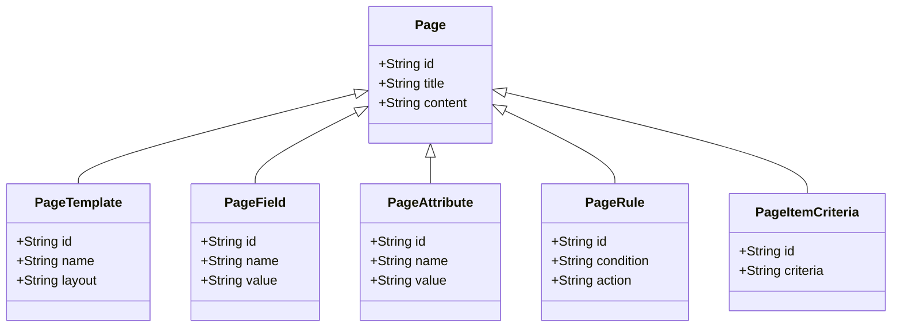

The <SwmToken path="admin/broadleaf-contentmanagement-module/src/main/java/org/broadleafcommerce/cms/page/domain/PageRule.java" pos="18:8:8" line-data="package org.broadleafcommerce.cms.page.domain;">`page`</SwmToken> class represents the main entity for a page, while `PageTemplate` defines the template structure that a page can use. Classes like `PageField` and `PageAttribute` are used to define specific fields and attributes that a page can have, allowing for flexible and customizable page content.

The domain also includes classes for managing rules and criteria, such as <SwmToken path="admin/broadleaf-contentmanagement-module/src/main/java/org/broadleafcommerce/cms/page/domain/PageRule.java" pos="39:4:4" line-data="public interface PageRule extends SimpleRule,MultiTenantCloneable&lt;PageRule&gt; {">`PageRule`</SwmToken> and `PageItemCriteria`, which help in defining conditions and filtering content for pages.

<SwmSnippet path="/admin/broadleaf-contentmanagement-module/src/main/java/org/broadleafcommerce/cms/page/domain/PageRule.java" line="18">

---

# <SwmToken path="admin/broadleaf-contentmanagement-module/src/main/java/org/broadleafcommerce/cms/page/domain/PageRule.java" pos="39:4:4" line-data="public interface PageRule extends SimpleRule,MultiTenantCloneable&lt;PageRule&gt; {">`PageRule`</SwmToken> Class

The <SwmToken path="admin/broadleaf-contentmanagement-module/src/main/java/org/broadleafcommerce/cms/page/domain/PageRule.java" pos="39:4:4" line-data="public interface PageRule extends SimpleRule,MultiTenantCloneable&lt;PageRule&gt; {">`PageRule`</SwmToken> class is part of the domain and is used to define rules and criteria for pages, helping in filtering and applying conditions to page content.

```java
package org.broadleafcommerce.cms.page.domain;

import org.broadleafcommerce.common.copy.MultiTenantCloneable;
```

---

</SwmSnippet>

# Main Functions

There are several main functions in this folder. Some of them are `getDocumentById`, `getPlaylistById`, `getDocumentById`, `getPlaylistByPath`, `getDocumentByPathAndBranch`, and `getPlaylistByPathAndBranch`. We will dive a little into `getDocumentById` and `getPlaylist`.

## getDocumentById

The `getDocumentById` function is used to retrieve a document by its ID. This function is essential for accessing specific documents within the system, allowing for precise data retrieval and manipulation.

## getPlaylist

The `getPlaylist` function is used to retrieve a playlist by its ID or path. This function is crucial for managing and accessing playlists, enabling users to organize and interact with collections of documents or media.

&nbsp;

*This is an auto-generated document by Swimm AI 🌊 and has not yet been verified by a human*

<SwmMeta version="3.0.0" repo-id="Z2l0aHViJTNBJTNBQnJvYWRsZWFmQ29tbWVyY2UtZGVtby1uZXclM0ElM0FTd2ltbS1EZW1v" repo-name="BroadleafCommerce-demo-new" doc-type="overview"><sup>Powered by [Swimm](/)</sup></SwmMeta>
