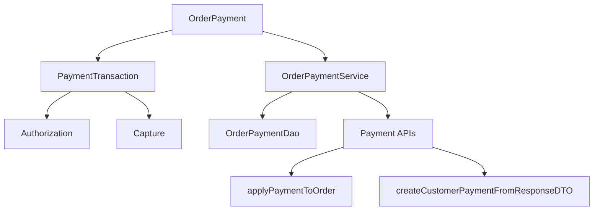

# Overview of Payment in Core Module

Payment refers to the handling of financial transactions related to an order. It involves various entities and services to manage the payment process.

<SwmSnippet path="/core/broadleaf-framework/src/main/java/org/broadleafcommerce/core/payment/domain/OrderPayment.java" line="36">

---

## <SwmToken path="core/broadleaf-framework/src/main/java/org/broadleafcommerce/core/payment/domain/OrderPayment.java" pos="43:14:14" line-data=" * &lt;p&gt;Once an {@link OrderPayment} is created, various {@link PaymentTransaction}s can be applied to this payment as">`OrderPayment`</SwmToken> Entity

The <SwmToken path="core/broadleaf-framework/src/main/java/org/broadleafcommerce/core/payment/domain/OrderPayment.java" pos="43:14:14" line-data=" * &lt;p&gt;Once an {@link OrderPayment} is created, various {@link PaymentTransaction}s can be applied to this payment as">`OrderPayment`</SwmToken> entity is designed to manage payments associated with an order. It is usually unique for a particular combination of amount, <SwmToken path="core/broadleaf-framework/src/main/java/org/broadleafcommerce/core/payment/domain/OrderPayment.java" pos="38:10:10" line-data=" * amount, {@link PaymentGatewayType} and {@link PaymentType} combination. This is immediately invalid for scenarios where multiple payments of the">`PaymentGatewayType`</SwmToken>, and <SwmToken path="core/broadleaf-framework/src/main/java/org/broadleafcommerce/core/payment/domain/OrderPayment.java" pos="38:19:19" line-data=" * amount, {@link PaymentGatewayType} and {@link PaymentType} combination. This is immediately invalid for scenarios where multiple payments of the">`PaymentType`</SwmToken>. Once an <SwmToken path="core/broadleaf-framework/src/main/java/org/broadleafcommerce/core/payment/domain/OrderPayment.java" pos="43:14:14" line-data=" * &lt;p&gt;Once an {@link OrderPayment} is created, various {@link PaymentTransaction}s can be applied to this payment as">`OrderPayment`</SwmToken> is created, various <SwmToken path="core/broadleaf-framework/src/main/java/org/broadleafcommerce/core/payment/domain/OrderPayment.java" pos="43:28:28" line-data=" * &lt;p&gt;Once an {@link OrderPayment} is created, various {@link PaymentTransaction}s can be applied to this payment as">`PaymentTransaction`</SwmToken>s can be applied to this payment. There should be at least one <SwmToken path="core/broadleaf-framework/src/main/java/org/broadleafcommerce/core/payment/domain/OrderPayment.java" pos="43:28:28" line-data=" * &lt;p&gt;Once an {@link OrderPayment} is created, various {@link PaymentTransaction}s can be applied to this payment as">`PaymentTransaction`</SwmToken> for every <SwmToken path="core/broadleaf-framework/src/main/java/org/broadleafcommerce/core/payment/domain/OrderPayment.java" pos="43:14:14" line-data=" * &lt;p&gt;Once an {@link OrderPayment} is created, various {@link PaymentTransaction}s can be applied to this payment as">`OrderPayment`</SwmToken> associated with an order that has gone through checkout.

```java
/**
 * <p>This entity is designed to deal with payments associated to an {@link Order} and is <i>usually</i> unique for a particular
 * amount, {@link PaymentGatewayType} and {@link PaymentType} combination. This is immediately invalid for scenarios where multiple payments of the
 * same {@link PaymentType} should be supported (like paying with 2 {@link PaymentType#CREDIT_CARD} or 2 {@link PaymentType#GIFT_CARD}).
 * That said, even though the use case might be uncommon in, Broadleaf does not actively prevent that situation from occurring
 * online payments it is very common in point of sale systems.</p>
 * 
 * <p>Once an {@link OrderPayment} is created, various {@link PaymentTransaction}s can be applied to this payment as
 * denoted by {@link PaymentTransactionType}. <b>There should be at least 1 {@link PaymentTransaction} for every
 * {@link OrderPayment} that is associated with an {@link Order} that has gone through checkout</b> (which means that
 * {@link Order#getStatus()} is {@link OrderStatus#SUBMITTED}).</p>
 * 
 * <p>{@link OrderPayment}s are not actually deleted from the database but rather are only soft-deleted (archived = true)</p>
 * 
 * @see {@link PaymentTransactionType}
 * @see {@link PaymentTransaction}
 * @see {@link PaymentType}
 * @author Phillip Verheyden (phillipuniverse)
```

---

</SwmSnippet>

<SwmSnippet path="/core/broadleaf-framework/src/main/java/org/broadleafcommerce/core/payment/domain/PaymentTransaction.java" line="33">

---

## <SwmToken path="core/broadleaf-framework/src/main/java/org/broadleafcommerce/core/payment/domain/PaymentTransaction.java" pos="35:49:49" line-data=" * user might be paying with and the total amount they will be paying (like credit card and $10), a {@link PaymentTransaction}">`PaymentTransaction`</SwmToken> Entity

The <SwmToken path="core/broadleaf-framework/src/main/java/org/broadleafcommerce/core/payment/domain/PaymentTransaction.java" pos="35:49:49" line-data=" * user might be paying with and the total amount they will be paying (like credit card and $10), a {@link PaymentTransaction}">`PaymentTransaction`</SwmToken> entity stores individual transactions about a particular payment. It holds data about what happens with that payment, such as authorization and capture transactions.

```java
/**
 * <p>Used to store individual transactions about a particular payment. While an {@link OrderPayment} holds data like what the
 * user might be paying with and the total amount they will be paying (like credit card and $10), a {@link PaymentTransaction}
 * is more about what happens with that particular payment. Thus, {@link PaymentTransaction}s do not make sense by
 * themselves and ONLY make sense in the context of an {@link OrderPayment}.</p>
```

---

</SwmSnippet>

<SwmSnippet path="/core/broadleaf-framework/src/main/java/org/broadleafcommerce/core/payment/service/OrderPaymentService.java" line="22">

---

## <SwmToken path="core/broadleaf-framework/src/main/java/org/broadleafcommerce/core/payment/service/OrderPaymentService.java" pos="30:4:4" line-data="public interface OrderPaymentService {">`OrderPaymentService`</SwmToken> Interface

The <SwmToken path="core/broadleaf-framework/src/main/java/org/broadleafcommerce/core/payment/service/OrderPaymentService.java" pos="30:4:4" line-data="public interface OrderPaymentService {">`OrderPaymentService`</SwmToken> interface provides methods to save and read <SwmToken path="core/broadleaf-framework/src/main/java/org/broadleafcommerce/core/payment/service/OrderPaymentService.java" pos="23:12:12" line-data="import org.broadleafcommerce.core.payment.domain.OrderPayment;">`OrderPayment`</SwmToken> and <SwmToken path="core/broadleaf-framework/src/main/java/org/broadleafcommerce/core/payment/service/OrderPaymentService.java" pos="25:12:12" line-data="import org.broadleafcommerce.core.payment.domain.PaymentTransaction;">`PaymentTransaction`</SwmToken> entities. It also includes methods to create new instances and delete payments.

```java
import org.broadleafcommerce.core.order.domain.Order;
import org.broadleafcommerce.core.payment.domain.OrderPayment;
import org.broadleafcommerce.core.payment.domain.PaymentLog;
import org.broadleafcommerce.core.payment.domain.PaymentTransaction;
import org.broadleafcommerce.profile.core.domain.CustomerPayment;

import java.util.List;

public interface OrderPaymentService {

    public OrderPayment save(OrderPayment payment);

    public PaymentTransaction save(PaymentTransaction transaction);

    public PaymentLog save(PaymentLog log);

    public OrderPayment readPaymentById(Long paymentId);

    public List<OrderPayment> readPaymentsForOrder(Order order);

    public OrderPayment create();
```

---

</SwmSnippet>

<SwmSnippet path="/core/broadleaf-framework/src/main/java/org/broadleafcommerce/core/payment/dao/OrderPaymentDao.java" line="20">

---

## <SwmToken path="core/broadleaf-framework/src/main/java/org/broadleafcommerce/core/payment/dao/OrderPaymentDao.java" pos="27:4:4" line-data="public interface OrderPaymentDao {">`OrderPaymentDao`</SwmToken> Interface

The <SwmToken path="core/broadleaf-framework/src/main/java/org/broadleafcommerce/core/payment/dao/OrderPaymentDao.java" pos="27:4:4" line-data="public interface OrderPaymentDao {">`OrderPaymentDao`</SwmToken> interface defines methods for interacting with the database to perform CRUD operations on <SwmToken path="core/broadleaf-framework/src/main/java/org/broadleafcommerce/core/payment/dao/OrderPaymentDao.java" pos="21:12:12" line-data="import org.broadleafcommerce.core.payment.domain.OrderPayment;">`OrderPayment`</SwmToken> and <SwmToken path="core/broadleaf-framework/src/main/java/org/broadleafcommerce/core/payment/dao/OrderPaymentDao.java" pos="23:12:12" line-data="import org.broadleafcommerce.core.payment.domain.PaymentTransaction;">`PaymentTransaction`</SwmToken> entities.

```java
import org.broadleafcommerce.core.order.domain.Order;
import org.broadleafcommerce.core.payment.domain.OrderPayment;
import org.broadleafcommerce.core.payment.domain.PaymentLog;
import org.broadleafcommerce.core.payment.domain.PaymentTransaction;

import java.util.List;

public interface OrderPaymentDao {

    public OrderPayment readPaymentById(Long paymentId);

    public OrderPayment save(OrderPayment payment);

    public PaymentTransaction save(PaymentTransaction transaction);

    public PaymentLog save(PaymentLog log);

    public List<OrderPayment> readPaymentsForOrder(Order order);

    public OrderPayment create();
```

---

</SwmSnippet>

<SwmSnippet path="/core/broadleaf-framework/src/main/java/org/broadleafcommerce/core/payment/service/DefaultPaymentGatewayCheckoutService.java" line="90">

---

### <SwmToken path="core/broadleaf-framework/src/main/java/org/broadleafcommerce/core/payment/service/DefaultPaymentGatewayCheckoutService.java" pos="91:5:5" line-data="    public Long applyPaymentToOrder(PaymentResponseDTO responseDTO, PaymentGatewayConfiguration config) {">`applyPaymentToOrder`</SwmToken>

The <SwmToken path="core/broadleaf-framework/src/main/java/org/broadleafcommerce/core/payment/service/DefaultPaymentGatewayCheckoutService.java" pos="91:5:5" line-data="    public Long applyPaymentToOrder(PaymentResponseDTO responseDTO, PaymentGatewayConfiguration config) {">`applyPaymentToOrder`</SwmToken> method in the <SwmToken path="core/broadleaf-framework/src/main/java/org/broadleafcommerce/core/payment/service/DefaultPaymentGatewayCheckoutService.java" pos="71:4:4" line-data="public class DefaultPaymentGatewayCheckoutService implements PaymentGatewayCheckoutService {">`DefaultPaymentGatewayCheckoutService`</SwmToken> class is responsible for applying a payment to an order. It validates the payment response, retrieves the order, and updates the order with the payment details. This method ensures that the payment is valid and processes it accordingly.

```java
    @Override
    public Long applyPaymentToOrder(PaymentResponseDTO responseDTO, PaymentGatewayConfiguration config) {
        
        //Payments can ONLY be parsed into Order Payments if they are 'valid'
        if (!responseDTO.isValid()) {
            throw new IllegalArgumentException("Invalid payment responses cannot be parsed into the order payment domain");
        }
        
        if (config == null) {
            throw new IllegalArgumentException("Config service cannot be null");
        }
        
        Long orderId = Long.parseLong(responseDTO.getOrderId());
        Order order = orderService.findOrderById(orderId);
        
        if (!OrderStatus.IN_PROCESS.equals(order.getStatus()) && !OrderStatus.CSR_OWNED.equals(order.getStatus()) && !OrderStatus.QUOTE.equals(order.getStatus())) {
            throw new IllegalArgumentException("Cannot apply another payment to an Order that is not IN_PROCESS or CSR_OWNED");
        }
        
        Customer customer = order.getCustomer();
        if (customer.isAnonymous()) {
```

---

</SwmSnippet>

<SwmSnippet path="/core/broadleaf-framework/src/main/java/org/broadleafcommerce/core/payment/service/DefaultCustomerPaymentGatewayService.java" line="62">

---

### <SwmToken path="core/broadleaf-framework/src/main/java/org/broadleafcommerce/core/payment/service/DefaultCustomerPaymentGatewayService.java" pos="63:5:5" line-data="    public Long createCustomerPaymentFromResponseDTO(PaymentResponseDTO responseDTO, PaymentGatewayConfiguration config)">`createCustomerPaymentFromResponseDTO`</SwmToken>

The <SwmToken path="core/broadleaf-framework/src/main/java/org/broadleafcommerce/core/payment/service/DefaultCustomerPaymentGatewayService.java" pos="63:5:5" line-data="    public Long createCustomerPaymentFromResponseDTO(PaymentResponseDTO responseDTO, PaymentGatewayConfiguration config)">`createCustomerPaymentFromResponseDTO`</SwmToken> method in the <SwmToken path="core/broadleaf-framework/src/main/java/org/broadleafcommerce/core/payment/service/DefaultCustomerPaymentGatewayService.java" pos="46:4:4" line-data="public class DefaultCustomerPaymentGatewayService implements CustomerPaymentGatewayService {">`DefaultCustomerPaymentGatewayService`</SwmToken> class creates a customer payment from a payment response DTO. It validates the response and configuration, retrieves the customer, and populates the customer payment details. This method is used to save a new customer payment based on the response from the payment gateway.

```java
    @Override
    public Long createCustomerPaymentFromResponseDTO(PaymentResponseDTO responseDTO, PaymentGatewayConfiguration config)
            throws IllegalArgumentException {
        validateResponseAndConfig(responseDTO, config);

        Long customerId = Long.parseLong(responseDTO.getCustomer().getCustomerId());
        Customer customer = customerService.readCustomerById(customerId);

        if (customer != null) {
            if (isNewDefaultPaymentMethod(responseDTO)) {
                customerPaymentService.clearDefaultPaymentStatus(customer);
            }

            CustomerPayment customerPayment = customerPaymentService.create();
            populateCustomerPayment(customerPayment, responseDTO, config);
            customerPayment.setCustomer(customer);

            customerPayment = customerPaymentService.saveCustomerPayment(customerPayment);
            customer.getCustomerPayments().add(customerPayment);
            return customerPayment.getId();
        }
```

---

</SwmSnippet>

&nbsp;

*This is an auto-generated document by Swimm AI 🌊 and has not yet been verified by a human*

<SwmMeta version="3.0.0" repo-id="Z2l0aHViJTNBJTNBQnJvYWRsZWFmQ29tbWVyY2UtZGVtby1uZXclM0ElM0FTd2ltbS1EZW1v" repo-name="BroadleafCommerce-demo-new" doc-type="overview"><sup>Powered by [Swimm](/)</sup></SwmMeta>
