```mermaid
classDiagram
    RatingService <|-- RatingSummary
    RatingService <|-- RatingType
    RatingService <|-- RatingDetail
    RatingService <|-- RatingSummaryDao
    class RatingService {
        +saveRatingSummary(RatingSummary rating)
        +deleteRatingSummary(RatingSummary rating)
        +readRatingSummary(String itemId, RatingType type)
        +readRatingSummaries(List<String> itemIds, RatingType type)
    }
    class RatingSummary {
        +setId(Long id)
        +getRatingType()
        +setRatingType(RatingType RatingType)
        +getItemId()
        +setItemId(String itemId)
        +getNumberOfRatings()
        +getNumberOfReviews()
        +getAverageRating()
        +resetAverageRating()
        +getReviews()
        +setReviews(List<ReviewDetail> reviews)
    }
    class RatingType {
        +RatingType()
    }
    class RatingDetail {
        +setId(Long id)
        +getRating()
        +setRating(Double newRating)
    }
    class RatingSummaryDao {
        +createRatingSummary(RatingSummary RatingSummary)
        +readRatingSummary(String itemId, RatingType type)
        +saveRatingSummary(RatingSummary RatingSummary)
        +deleteRatingSummary(RatingSummary RatingSummary)
    }

%% Swimm:
%% classDiagram
%%     <SwmToken path="core/broadleaf-framework/src/main/java/org/broadleafcommerce/core/rating/service/RatingService.java" pos="29:4:4" line-data="public interface RatingService {">`RatingService`</SwmToken> <|-- <SwmToken path="core/broadleaf-framework/src/main/java/org/broadleafcommerce/core/rating/service/RatingService.java" pos="31:3:3" line-data="    public RatingSummary saveRatingSummary(RatingSummary rating);">`RatingSummary`</SwmToken>
%%     <SwmToken path="core/broadleaf-framework/src/main/java/org/broadleafcommerce/core/rating/service/RatingService.java" pos="29:4:4" line-data="public interface RatingService {">`RatingService`</SwmToken> <|-- <SwmToken path="core/broadleaf-framework/src/main/java/org/broadleafcommerce/core/rating/service/RatingService.java" pos="33:12:12" line-data="    public RatingSummary readRatingSummary(String itemId, RatingType type);">`RatingType`</SwmToken>
%%     <SwmToken path="core/broadleaf-framework/src/main/java/org/broadleafcommerce/core/rating/service/RatingService.java" pos="29:4:4" line-data="public interface RatingService {">`RatingService`</SwmToken> <|-- <SwmToken path="core/broadleaf-framework/src/main/java/org/broadleafcommerce/core/rating/domain/RatingSummary.java" pos="50:5:5" line-data="    public List&lt;RatingDetail&gt; getRatings();">`RatingDetail`</SwmToken>
%%     <SwmToken path="core/broadleaf-framework/src/main/java/org/broadleafcommerce/core/rating/service/RatingService.java" pos="29:4:4" line-data="public interface RatingService {">`RatingService`</SwmToken> <|-- RatingSummaryDao
%%     class <SwmToken path="core/broadleaf-framework/src/main/java/org/broadleafcommerce/core/rating/service/RatingService.java" pos="29:4:4" line-data="public interface RatingService {">`RatingService`</SwmToken> {
%%         +saveRatingSummary(RatingSummary rating)
%%         +deleteRatingSummary(RatingSummary rating)
%%         +readRatingSummary(String <SwmToken path="core/broadleaf-framework/src/main/java/org/broadleafcommerce/core/rating/service/RatingService.java" pos="33:9:9" line-data="    public RatingSummary readRatingSummary(String itemId, RatingType type);">`itemId`</SwmToken>, <SwmToken path="core/broadleaf-framework/src/main/java/org/broadleafcommerce/core/rating/service/RatingService.java" pos="33:12:12" line-data="    public RatingSummary readRatingSummary(String itemId, RatingType type);">`RatingType`</SwmToken> type)
%%         +readRatingSummaries(List<String> <SwmToken path="core/broadleaf-framework/src/main/java/org/broadleafcommerce/core/rating/service/RatingService.java" pos="34:18:18" line-data="    public Map&lt;String, RatingSummary&gt; readRatingSummaries(List&lt;String&gt; itemIds, RatingType type);">`itemIds`</SwmToken>, <SwmToken path="core/broadleaf-framework/src/main/java/org/broadleafcommerce/core/rating/service/RatingService.java" pos="33:12:12" line-data="    public RatingSummary readRatingSummary(String itemId, RatingType type);">`RatingType`</SwmToken> type)
%%     }
%%     class <SwmToken path="core/broadleaf-framework/src/main/java/org/broadleafcommerce/core/rating/service/RatingService.java" pos="31:3:3" line-data="    public RatingSummary saveRatingSummary(RatingSummary rating);">`RatingSummary`</SwmToken> {
%%         +setId(Long id)
%%         +getRatingType()
%%         +setRatingType(RatingType <SwmToken path="core/broadleaf-framework/src/main/java/org/broadleafcommerce/core/rating/service/RatingService.java" pos="33:12:12" line-data="    public RatingSummary readRatingSummary(String itemId, RatingType type);">`RatingType`</SwmToken>)
%%         +getItemId()
%%         +setItemId(String <SwmToken path="core/broadleaf-framework/src/main/java/org/broadleafcommerce/core/rating/service/RatingService.java" pos="33:9:9" line-data="    public RatingSummary readRatingSummary(String itemId, RatingType type);">`itemId`</SwmToken>)
%%         +getNumberOfRatings()
%%         +getNumberOfReviews()
%%         +getAverageRating()
%%         +resetAverageRating()
%%         +getReviews()
%%         +setReviews(List<ReviewDetail> reviews)
%%     }
%%     class <SwmToken path="core/broadleaf-framework/src/main/java/org/broadleafcommerce/core/rating/service/RatingService.java" pos="33:12:12" line-data="    public RatingSummary readRatingSummary(String itemId, RatingType type);">`RatingType`</SwmToken> {
%%         +RatingType()
%%     }
%%     class <SwmToken path="core/broadleaf-framework/src/main/java/org/broadleafcommerce/core/rating/domain/RatingSummary.java" pos="50:5:5" line-data="    public List&lt;RatingDetail&gt; getRatings();">`RatingDetail`</SwmToken> {
%%         +setId(Long id)
%%         +getRating()
%%         +setRating(Double <SwmToken path="core/broadleaf-framework/src/main/java/org/broadleafcommerce/core/rating/domain/RatingDetail.java" pos="32:9:9" line-data="    public void setRating(Double newRating);">`newRating`</SwmToken>)
%%     }
%%     class RatingSummaryDao {
%%         +createRatingSummary(RatingSummary <SwmToken path="core/broadleaf-framework/src/main/java/org/broadleafcommerce/core/rating/service/RatingService.java" pos="31:3:3" line-data="    public RatingSummary saveRatingSummary(RatingSummary rating);">`RatingSummary`</SwmToken>)
%%         +readRatingSummary(String <SwmToken path="core/broadleaf-framework/src/main/java/org/broadleafcommerce/core/rating/service/RatingService.java" pos="33:9:9" line-data="    public RatingSummary readRatingSummary(String itemId, RatingType type);">`itemId`</SwmToken>, <SwmToken path="core/broadleaf-framework/src/main/java/org/broadleafcommerce/core/rating/service/RatingService.java" pos="33:12:12" line-data="    public RatingSummary readRatingSummary(String itemId, RatingType type);">`RatingType`</SwmToken> type)
%%         +saveRatingSummary(RatingSummary <SwmToken path="core/broadleaf-framework/src/main/java/org/broadleafcommerce/core/rating/service/RatingService.java" pos="31:3:3" line-data="    public RatingSummary saveRatingSummary(RatingSummary rating);">`RatingSummary`</SwmToken>)
%%         +deleteRatingSummary(RatingSummary <SwmToken path="core/broadleaf-framework/src/main/java/org/broadleafcommerce/core/rating/service/RatingService.java" pos="31:3:3" line-data="    public RatingSummary saveRatingSummary(RatingSummary rating);">`RatingSummary`</SwmToken>)
%%     }
```

# What is Rating in Core Module

Rating is a feature that allows customers to provide feedback on items by assigning a numerical value, typically representing their satisfaction or quality of the item.

<SwmSnippet path="/core/broadleaf-framework/src/main/java/org/broadleafcommerce/core/rating/service/RatingService.java" line="31">

---

# <SwmToken path="core/broadleaf-framework/src/main/java/org/broadleafcommerce/core/rating/service/RatingService.java" pos="29:4:4" line-data="public interface RatingService {">`RatingService`</SwmToken> Interface

The <SwmToken path="core/broadleaf-framework/src/main/java/org/broadleafcommerce/core/rating/service/RatingService.java" pos="29:4:4" line-data="public interface RatingService {">`RatingService`</SwmToken> interface defines methods for saving, deleting, and reading rating summaries, as well as for rating items and managing reviews.

```java
    public RatingSummary saveRatingSummary(RatingSummary rating);
    public void deleteRatingSummary(RatingSummary rating);
    public RatingSummary readRatingSummary(String itemId, RatingType type);
    public Map<String, RatingSummary> readRatingSummaries(List<String> itemIds, RatingType type);
```

---

</SwmSnippet>

<SwmSnippet path="/core/broadleaf-framework/src/main/java/org/broadleafcommerce/core/rating/domain/RatingSummary.java" line="28">

---

# <SwmToken path="core/broadleaf-framework/src/main/java/org/broadleafcommerce/core/rating/service/RatingService.java" pos="31:3:3" line-data="    public RatingSummary saveRatingSummary(RatingSummary rating);">`RatingSummary`</SwmToken> Interface

The <SwmToken path="core/broadleaf-framework/src/main/java/org/broadleafcommerce/core/rating/service/RatingService.java" pos="31:3:3" line-data="    public RatingSummary saveRatingSummary(RatingSummary rating);">`RatingSummary`</SwmToken> interface represents a summary of ratings for a particular item, including methods to get and set the item ID, rating type, number of ratings, number of reviews, and average rating.

```java
    public void setId(Long id);
    
    public RatingType getRatingType();
    
    public void setRatingType(RatingType ratingType);
    
    public String getItemId();
    
    public void setItemId(String itemId);
    
    public Integer getNumberOfRatings();
    
    public Integer getNumberOfReviews();
    
    public Double getAverageRating();
    
    public void resetAverageRating();

    public List<ReviewDetail> getReviews();
    
    public void setReviews(List<ReviewDetail> reviews);
```

---

</SwmSnippet>

<SwmSnippet path="/core/broadleaf-framework/src/main/java/org/broadleafcommerce/core/rating/service/type/RatingType.java" line="39">

---

# <SwmToken path="core/broadleaf-framework/src/main/java/org/broadleafcommerce/core/rating/service/type/RatingType.java" pos="39:3:3" line-data="    public RatingType() {">`RatingType`</SwmToken> Class

The <SwmToken path="core/broadleaf-framework/src/main/java/org/broadleafcommerce/core/rating/service/type/RatingType.java" pos="39:3:3" line-data="    public RatingType() {">`RatingType`</SwmToken> class defines different types of ratings, such as product ratings, and provides methods to get and set the type and its friendly name.

```java
    public RatingType() {
        //do nothing
    }
```

---

</SwmSnippet>

<SwmSnippet path="/core/broadleaf-framework/src/main/java/org/broadleafcommerce/core/rating/domain/RatingDetail.java" line="28">

---

# <SwmToken path="core/broadleaf-framework/src/main/java/org/broadleafcommerce/core/rating/domain/RatingSummary.java" pos="50:5:5" line-data="    public List&lt;RatingDetail&gt; getRatings();">`RatingDetail`</SwmToken> Interface

The <SwmToken path="core/broadleaf-framework/src/main/java/org/broadleafcommerce/core/rating/domain/RatingSummary.java" pos="50:5:5" line-data="    public List&lt;RatingDetail&gt; getRatings();">`RatingDetail`</SwmToken> interface represents individual rating details, including methods to get and set the rating value, customer, and the date the rating was submitted.

```java
    public void setId(Long id);
    
    public Double getRating();
    
    public void setRating(Double newRating);
```

---

</SwmSnippet>

# RatingSummaryDao Interface

The `RatingSummaryDao` interface provides methods for creating, reading, saving, and deleting rating summaries and details.

&nbsp;

*This is an auto-generated document by Swimm AI 🌊 and has not yet been verified by a human*

<SwmMeta version="3.0.0" repo-id="Z2l0aHViJTNBJTNBQnJvYWRsZWFmQ29tbWVyY2UtZGVtby1uZXclM0ElM0FTd2ltbS1EZW1v" repo-name="BroadleafCommerce-demo-new" doc-type="overview"><sup>Powered by [Swimm](/)</sup></SwmMeta>
