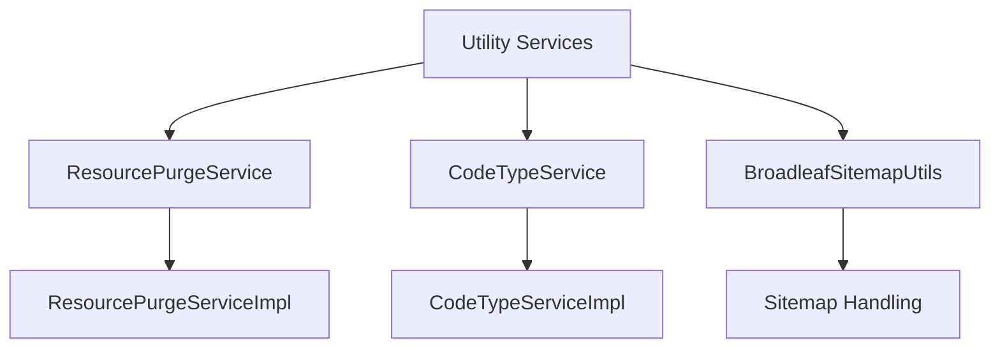

# Getting Started with Utility Services

The Service in the Util package refers to various utility services that provide supporting functionalities for the core operations of the Broadleaf Commerce framework. These services include operations such as purging resources, managing code types, and handling sitemap utilities.

## <SwmToken path="core/broadleaf-framework/src/main/java/org/broadleafcommerce/core/util/service/ResourcePurgeServiceImpl.java" pos="70:7:7" line-data=" * {@link ResourcePurgeService} for additional API documentation.">`ResourcePurgeService`</SwmToken>

The <SwmToken path="core/broadleaf-framework/src/main/java/org/broadleafcommerce/core/util/service/ResourcePurgeServiceImpl.java" pos="70:7:7" line-data=" * {@link ResourcePurgeService} for additional API documentation.">`ResourcePurgeService`</SwmToken> and its implementation <SwmToken path="core/broadleaf-framework/src/main/java/org/broadleafcommerce/core/util/service/ResourcePurgeServiceImpl.java" pos="103:4:4" line-data="public class ResourcePurgeServiceImpl implements ResourcePurgeService {">`ResourcePurgeServiceImpl`</SwmToken> are responsible for purging obsolete resources from the system. This service ensures that outdated or unnecessary resources are efficiently removed, maintaining the system's performance and cleanliness.

<SwmSnippet path="/core/broadleaf-framework/src/main/java/org/broadleafcommerce/core/util/service/ResourcePurgeServiceImpl.java" line="47">

---

The <SwmToken path="core/broadleaf-framework/src/main/java/org/broadleafcommerce/core/util/service/ResourcePurgeServiceImpl.java" pos="103:4:4" line-data="public class ResourcePurgeServiceImpl implements ResourcePurgeService {">`ResourcePurgeServiceImpl`</SwmToken> class imports necessary dependencies such as <SwmToken path="core/broadleaf-framework/src/main/java/org/broadleafcommerce/core/util/service/ResourcePurgeServiceImpl.java" pos="47:8:8" line-data="import org.broadleafcommerce.core.order.domain.Order;">`order`</SwmToken>, <SwmToken path="core/broadleaf-framework/src/main/java/org/broadleafcommerce/core/util/service/ResourcePurgeServiceImpl.java" pos="48:12:12" line-data="import org.broadleafcommerce.core.order.domain.OrderImpl;">`OrderImpl`</SwmToken>, <SwmToken path="core/broadleaf-framework/src/main/java/org/broadleafcommerce/core/util/service/ResourcePurgeServiceImpl.java" pos="49:12:12" line-data="import org.broadleafcommerce.core.order.service.OrderService;">`OrderService`</SwmToken>, <SwmToken path="core/broadleaf-framework/src/main/java/org/broadleafcommerce/core/util/service/ResourcePurgeServiceImpl.java" pos="50:14:14" line-data="import org.broadleafcommerce.core.order.service.type.OrderStatus;">`OrderStatus`</SwmToken>, and <SwmToken path="core/broadleaf-framework/src/main/java/org/broadleafcommerce/core/util/service/ResourcePurgeServiceImpl.java" pos="51:12:12" line-data="import org.broadleafcommerce.core.util.dao.ResourcePurgeDao;">`ResourcePurgeDao`</SwmToken> to perform its operations.

```java
import org.broadleafcommerce.core.order.domain.Order;
import org.broadleafcommerce.core.order.domain.OrderImpl;
import org.broadleafcommerce.core.order.service.OrderService;
import org.broadleafcommerce.core.order.service.type.OrderStatus;
import org.broadleafcommerce.core.util.dao.ResourcePurgeDao;
```

---

</SwmSnippet>

## CodeTypeService

The `CodeTypeService` and its implementation `CodeTypeServiceImpl` manage different types of codes used within the system. This service is essential for handling various code-related operations, ensuring that the system can efficiently manage and utilize different code types.

## BroadleafSitemapUtils

The `BroadleafSitemapUtils` provides utility functions for handling sitemaps. This service is crucial for generating and managing sitemaps, which are essential for search engine optimization (SEO) and improving the discoverability of the website's content.

## <SwmToken path="core/broadleaf-framework/src/main/java/org/broadleafcommerce/core/util/service/ResourcePurgeServiceImpl.java" pos="49:12:12" line-data="import org.broadleafcommerce.core.order.service.OrderService;">`OrderService`</SwmToken>

The <SwmToken path="core/broadleaf-framework/src/main/java/org/broadleafcommerce/core/util/service/ResourcePurgeServiceImpl.java" pos="49:12:12" line-data="import org.broadleafcommerce.core.order.service.OrderService;">`OrderService`</SwmToken> is an example of a service that provides operations related to orders, such as creating, updating, and retrieving orders. This service is integral to the e-commerce functionality of the Broadleaf Commerce framework.

## <SwmToken path="core/broadleaf-framework/src/main/java/org/broadleafcommerce/core/util/service/ResourcePurgeServiceImpl.java" pos="56:12:12" line-data="import org.broadleafcommerce.profile.core.service.CustomerService;">`CustomerService`</SwmToken>

The <SwmToken path="core/broadleaf-framework/src/main/java/org/broadleafcommerce/core/util/service/ResourcePurgeServiceImpl.java" pos="56:12:12" line-data="import org.broadleafcommerce.profile.core.service.CustomerService;">`CustomerService`</SwmToken> provides functionalities related to customer management. It is injected into the <SwmToken path="core/broadleaf-framework/src/main/java/org/broadleafcommerce/core/util/service/ResourcePurgeServiceImpl.java" pos="103:4:4" line-data="public class ResourcePurgeServiceImpl implements ResourcePurgeService {">`ResourcePurgeServiceImpl`</SwmToken> class using the <SwmToken path="core/broadleaf-framework/src/main/java/org/broadleafcommerce/core/util/service/ResourcePurgeServiceImpl.java" pos="113:1:2" line-data="    @Resource(name = &quot;blTransactionManager&quot;)">`@Resource`</SwmToken> annotation, demonstrating how different services can be integrated and utilized within the framework.

&nbsp;

*This is an auto-generated document by Swimm AI 🌊 and has not yet been verified by a human*

<SwmMeta version="3.0.0" repo-id="Z2l0aHViJTNBJTNBQnJvYWRsZWFmQ29tbWVyY2UtZGVtby1uZXclM0ElM0FTd2ltbS1EZW1v" repo-name="BroadleafCommerce-demo-new" doc-type="overview"><sup>Powered by [Swimm](/)</sup></SwmMeta>
