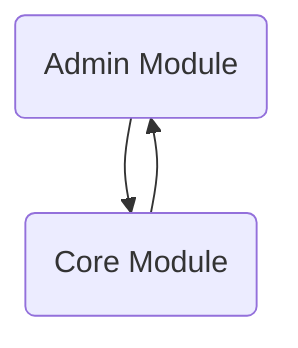

BroadleafCommerce-demo-new is a repository for Broadleaf Commerce Community Edition (CE), an open-source e-commerce framework written in Java and based on the Spring framework. It facilitates the development of enterprise-class, commerce-driven websites by providing a robust data model, services, and specialized tooling.

## Main Components

### Admin Module

The Admin Module is a core component that provides the infrastructure for managing administrative functionalities, organizing and displaying various sections within the admin interface.

- <SwmLink doc-title="Maven configuration in adminpomxml">[Maven configuration in adminpomxml](.swm/maven-configuration-in-adminpomxml.384v5feq.sw.md)</SwmLink>
- <SwmLink doc-title="Fetching data and applying criteria">[Fetching data and applying criteria](.swm/fetching-data-and-applying-criteria.515c93is.sw.md)</SwmLink>
- **Broadleaf open admin platform**
  - <SwmLink doc-title="Overview of entityform">[Overview of entityform](.swm/overview-of-entityform.w6rqkpuo.sw.md)</SwmLink>
  - <SwmLink doc-title="Data transfer objects in broadleaf open admin platform">[Data transfer objects in broadleaf open admin platform](.swm/data-transfer-objects-in-broadleaf-open-admin-platform.qwkzk1jd.sw.md)</SwmLink>
  - <SwmLink doc-title="Building the admin platform with maven">[Building the admin platform with maven](.swm/building-the-admin-platform-with-maven.orzgn195.sw.md)</SwmLink>
  - **Server**
    - <SwmLink doc-title="The custompersistencehandleradapter class">[The custompersistencehandleradapter class](.swm/the-custompersistencehandleradapter-class.elubf.sw.md)</SwmLink>
    - <SwmLink doc-title="Admin security service overview">[Admin security service overview](.swm/admin-security-service-overview.3fbbpsmb.sw.md)</SwmLink>
    - **Artifact**
      - <SwmLink doc-title="Getting started with artifact service">[Getting started with artifact service](.swm/getting-started-with-artifact-service.fed57d0s.sw.md)</SwmLink>
      - <SwmLink doc-title="Overview of image filter functionality">[Overview of image filter functionality](.swm/overview-of-image-filter-functionality.dz03hue5.sw.md)</SwmLink>
    - **Persistence**
      - <SwmLink doc-title="Introduction to persistence in service">[Introduction to persistence in service](.swm/introduction-to-persistence-in-service.nljo419q.sw.md)</SwmLink>
      - <SwmLink doc-title="Basic concepts of criteria">[Basic concepts of criteria](.swm/basic-concepts-of-criteria.qs6lp5ik.sw.md)</SwmLink>
      - <SwmLink doc-title="Initialization with postconstruct">[Initialization with postconstruct](.swm/initialization-with-postconstruct.vbuggg38.sw.md)</SwmLink>
      - **Validation**
        - <SwmLink doc-title="Exploring entity validation">[Exploring entity validation](.swm/exploring-entity-validation.b2iqw6gy.sw.md)</SwmLink>
        - <SwmLink doc-title="The validationconfigurationbasedpropertyvalidator class">[The validationconfigurationbasedpropertyvalidator class](.swm/the-validationconfigurationbasedpropertyvalidator-class.hmox0.sw.md)</SwmLink>
      - **Provider**
        - <SwmLink doc-title="Populating field values">[Populating field values](.swm/populating-field-values.7fnzuksn.sw.md)</SwmLink>
        - <SwmLink doc-title="The fieldpersistenceprovideradapter class">[The fieldpersistenceprovideradapter class](.swm/the-fieldpersistenceprovideradapter-class.l8wc5.sw.md)</SwmLink>
      - **Flows**
        - <SwmLink doc-title="Updating an entity in the adorned target list">[Updating an entity in the adorned target list](.swm/updating-an-entity-in-the-adorned-target-list.3ul3gb3b.sw.md)</SwmLink>
        - <SwmLink doc-title="Updating an entity in a map structure">[Updating an entity in a map structure](.swm/updating-an-entity-in-a-map-structure.5x5idhvu.sw.md)</SwmLink>
        - <SwmLink doc-title="Fetching and processing map records">[Fetching and processing map records](.swm/fetching-and-processing-map-records.hsfara0l.sw.md)</SwmLink>
        - <SwmLink doc-title="Updating merged properties flow">[Updating merged properties flow](.swm/updating-merged-properties-flow.nmbi00n7.sw.md)</SwmLink>
        - <SwmLink doc-title="Fetching records flow">[Fetching records flow](.swm/fetching-records-flow.qcsrfp6z.sw.md)</SwmLink>
        - <SwmLink doc-title="Populating media field values">[Populating media field values](.swm/populating-media-field-values.zpfhh4px.sw.md)</SwmLink>
        - <SwmLink doc-title="Data fetching process">[Data fetching process](.swm/data-fetching-process.f1vy5qzr.sw.md)</SwmLink>
    - **Dao**
      - <SwmLink doc-title="Introduction to data access object dao">[Introduction to data access object dao](.swm/introduction-to-data-access-object-dao.rjqw7gky.sw.md)</SwmLink>
      - <SwmLink doc-title="Introduction to metadata providers">[Introduction to metadata providers](.swm/introduction-to-metadata-providers.0o9uvf6a.sw.md)</SwmLink>
      - <SwmLink doc-title="Merging properties flow">[Merging properties flow](.swm/merging-properties-flow.huvfp7oz.sw.md)</SwmLink>
      - **Flows**
        - <SwmLink doc-title="Building basic metadata">[Building basic metadata](.swm/building-basic-metadata.0bp46lm5.sw.md)</SwmLink>
        - <SwmLink doc-title="Merging and adding metadata">[Merging and adding metadata](.swm/merging-and-adding-metadata.ysqb54lw.sw.md)</SwmLink>
    - **Flows**
      - <SwmLink doc-title="Retrieving records flow">[Retrieving records flow](.swm/retrieving-records-flow.57990inn.sw.md)</SwmLink>
      - <SwmLink doc-title="Retrieving all records for sub collections">[Retrieving all records for sub collections](.swm/retrieving-all-records-for-sub-collections.1ov4m6ro.sw.md)</SwmLink>
  - **Flows**
    - <SwmLink doc-title="Request handling process">[Request handling process](.swm/request-handling-process.pms8s41m.sw.md)</SwmLink>
    - <SwmLink doc-title="Populating an entity form">[Populating an entity form](.swm/populating-an-entity-form.cak7r368.sw.md)</SwmLink>
    - <SwmLink doc-title="Handling different rule types">[Handling different rule types](.swm/handling-different-rule-types.6phe8gdg.sw.md)</SwmLink>
    - <SwmLink doc-title="Adding an item to a collection">[Adding an item to a collection](.swm/adding-an-item-to-a-collection.xtbgo7fa.sw.md)</SwmLink>
    - <SwmLink doc-title="Displaying a modal dialog for selecting collection items">[Displaying a modal dialog for selecting collection items](.swm/displaying-a-modal-dialog-for-selecting-collection-items.8ndz535b.sw.md)</SwmLink>
    - <SwmLink doc-title="Retrieving and displaying collection field records">[Retrieving and displaying collection field records](.swm/retrieving-and-displaying-collection-field-records.w57q1pgz.sw.md)</SwmLink>
    - <SwmLink doc-title="Validation process overview">[Validation process overview](.swm/validation-process-overview.3fju0l7o.sw.md)</SwmLink>
  - **Flows**
    - <SwmLink doc-title="Field initialization flow">[Field initialization flow](.swm/field-initialization-flow.tj6k9r1b.sw.md)</SwmLink>
    - <SwmLink doc-title="Widget flow overview">[Widget flow overview](.swm/widget-flow-overview.laub7hj0.sw.md)</SwmLink>
    - <SwmLink doc-title="File upload submit process">[File upload submit process](.swm/file-upload-submit-process.rydghdxa.sw.md)</SwmLink>
    - <SwmLink doc-title="Datetimepicker functionality">[Datetimepicker functionality](.swm/datetimepicker-functionality.w2743eno.sw.md)</SwmLink>
    - <SwmLink doc-title="Handling file addition">[Handling file addition](.swm/handling-file-addition.gldbcuz6.sw.md)</SwmLink>
    - <SwmLink doc-title="Displaying an element as a modal">[Displaying an element as a modal](.swm/displaying-an-element-as-a-modal.03d74fdo.sw.md)</SwmLink>
    - <SwmLink doc-title="Initializing a date time picker">[Initializing a date time picker](.swm/initializing-a-date-time-picker.q6b3kuik.sw.md)</SwmLink>
    - <SwmLink doc-title="Refreshing collection data flow">[Refreshing collection data flow](.swm/refreshing-collection-data-flow.ribna7nz.sw.md)</SwmLink>
    - <SwmLink doc-title="Handling clickout events">[Handling clickout events](.swm/handling-clickout-events.gtlupjil.sw.md)</SwmLink>
    - <SwmLink doc-title="Initializing a list grid">[Initializing a list grid](.swm/initializing-a-list-grid.fqdkze10.sw.md)</SwmLink>
    - <SwmLink doc-title="Tooltip initialization flow">[Tooltip initialization flow](.swm/tooltip-initialization-flow.uu3wez4s.sw.md)</SwmLink>
    - <SwmLink doc-title="Drag start process">[Drag start process](.swm/drag-start-process.s2qyrrkz.sw.md)</SwmLink>
    - <SwmLink doc-title="Color picker option flow">[Color picker option flow](.swm/color-picker-option-flow.qkodtx99.sw.md)</SwmLink>
    - <SwmLink doc-title="Handling color palette clicks">[Handling color palette clicks](.swm/handling-color-palette-clicks.obgmaw38.sw.md)</SwmLink>
    - <SwmLink doc-title="Color picker positioning">[Color picker positioning](.swm/color-picker-positioning.26rjqj43.sw.md)</SwmLink>
    - <SwmLink doc-title="Handling existing filters flow">[Handling existing filters flow](.swm/handling-existing-filters-flow.1pxbz0gv.sw.md)</SwmLink>
    - <SwmLink doc-title="Initialization process">[Initialization process](.swm/initialization-process.t98kgk2e.sw.md)</SwmLink>
- **Broadleaf admin module**
  - <SwmLink doc-title="Basic concepts of data persistence">[Basic concepts of data persistence](.swm/basic-concepts-of-data-persistence.zdpur66a.sw.md)</SwmLink>
  - <SwmLink doc-title="Custom persistence handlers overview">[Custom persistence handlers overview](.swm/custom-persistence-handlers-overview.4hiaclbd.sw.md)</SwmLink>
  - <SwmLink doc-title="Maven configuration in adminbroadleaf admin module">[Maven configuration in adminbroadleaf admin module](.swm/maven-configuration-in-adminbroadleaf-admin-module.wfdom1kf.sw.md)</SwmLink>
- **Broadleaf contentmanagement module**
  - <SwmLink doc-title="Exploring admin functionality">[Exploring admin functionality](.swm/exploring-admin-functionality.yipdpqg0.sw.md)</SwmLink>
  - <SwmLink doc-title="Basic concepts of web functionality">[Basic concepts of web functionality](.swm/basic-concepts-of-web-functionality.k1doofag.sw.md)</SwmLink>
  - <SwmLink doc-title="Introduction to static asset management">[Introduction to static asset management](.swm/introduction-to-static-asset-management.p0zxga1h.sw.md)</SwmLink>
  - <SwmLink doc-title="Maven configuration in adminbroadleaf contentmanagement module">[Maven configuration in adminbroadleaf contentmanagement module](.swm/maven-configuration-in-adminbroadleaf-contentmanagement-module.27sosjip.sw.md)</SwmLink>
  - <SwmLink doc-title="Populating model variables flow">[Populating model variables flow](.swm/populating-model-variables-flow.51x7t0k9.sw.md)</SwmLink>
  - **Structure**
    - <SwmLink doc-title="Basic concepts of structured content">[Basic concepts of structured content](.swm/basic-concepts-of-structured-content.f34xhqao.sw.md)</SwmLink>
    - <SwmLink doc-title="Overview of domain structure">[Overview of domain structure](.swm/overview-of-domain-structure.tts6uogi.sw.md)</SwmLink>
  - **Flows**
    - <SwmLink doc-title="Fetching and processing entities">[Fetching and processing entities](.swm/fetching-and-processing-entities.84cv9l7p.sw.md)</SwmLink>
    - <SwmLink doc-title="Inspecting a persistencepackage">[Inspecting a persistencepackage](.swm/inspecting-a-persistencepackage.rxqete0y.sw.md)</SwmLink>
    - <SwmLink doc-title="Inspecting page templates">[Inspecting page templates](.swm/inspecting-page-templates.exmrhulk.sw.md)</SwmLink>
  - **Page**
    - <SwmLink doc-title="Basic concepts of page in broadleaf content management module">[Basic concepts of page in broadleaf content management module](.swm/basic-concepts-of-page-in-broadleaf-content-management-module.9c2otwgg.sw.md)</SwmLink>
    - <SwmLink doc-title="Overview of page domain">[Overview of page domain](.swm/overview-of-page-domain.i7dtun4e.sw.md)</SwmLink>
    - **Flows**
      - <SwmLink doc-title="Retrieving and processing robotstxt">[Retrieving and processing robotstxt](.swm/retrieving-and-processing-robotstxt.i7g2lxen.sw.md)</SwmLink>
      - <SwmLink doc-title="Handling http requests and displaying pages">[Handling http requests and displaying pages](.swm/handling-http-requests-and-displaying-pages.075q7mo5.sw.md)</SwmLink>

### Core Module

The core module is responsible for the primary business logic and services in Broadleaf Commerce, including pricing, workflow management, and search configurations. It contains key components like the pricing service modules, workflow activities, and Solr configuration, which are crucial for the operation and customization of e-commerce functionalities.

- <SwmLink doc-title="Store in core module">[Store in core module](.swm/store-in-core-module.11es90rj.sw.md)</SwmLink>
- <SwmLink doc-title="Overview of rating in core module">[Overview of rating in core module](.swm/overview-of-rating-in-core-module.wlqlldck.sw.md)</SwmLink>
- <SwmLink doc-title="Basic concepts of workflow in core module">[Basic concepts of workflow in core module](.swm/basic-concepts-of-workflow-in-core-module.ecxo0pbp.sw.md)</SwmLink>
- <SwmLink doc-title="Inventory management overview in core module">[Inventory management overview in core module](.swm/inventory-management-overview-in-core-module.cs5cppel.sw.md)</SwmLink>
- **Pricing**
  - <SwmLink doc-title="Introduction to pricing in core module">[Introduction to pricing in core module](.swm/introduction-to-pricing-in-core-module.0se0bk6e.sw.md)</SwmLink>
  - <SwmLink doc-title="Exploring pricing workflow">[Exploring pricing workflow](.swm/exploring-pricing-workflow.38adth0d.sw.md)</SwmLink>
- **Util**
  - <SwmLink doc-title="Getting started with utility services in core module">[Getting started with utility services in core module](.swm/getting-started-with-utility-services-in-core-module.vt9yfyqo.sw.md)</SwmLink>
  - <SwmLink doc-title="Overview of utility services">[Overview of utility services](.swm/overview-of-utility-services.00vw3suk.sw.md)</SwmLink>
  - **Flows**
    - <SwmLink doc-title="Queue management with isempty method">[Queue management with isempty method](.swm/queue-management-with-isempty-method.rj2of1tb.sw.md)</SwmLink>
    - <SwmLink doc-title="Adding elements to the queue">[Adding elements to the queue](.swm/adding-elements-to-the-queue.b1yl9yk4.sw.md)</SwmLink>
- **Offer**
  - <SwmLink doc-title="Exploring offer domain">[Exploring offer domain](.swm/exploring-offer-domain.t9kwtp78.sw.md)</SwmLink>
  - <SwmLink doc-title="Overview of offer data access object">[Overview of offer data access object](.swm/overview-of-offer-data-access-object.116b7vc8.sw.md)</SwmLink>
  - **Service**
    - <SwmLink doc-title="Understanding offer type">[Understanding offer type](.swm/understanding-offer-type.0bwdcuuc.sw.md)</SwmLink>
    - <SwmLink doc-title="Promotiondiscount overview">[Promotiondiscount overview](.swm/promotiondiscount-overview.0j736v5i.sw.md)</SwmLink>
    - <SwmLink doc-title="Getting started with offer processor">[Getting started with offer processor](.swm/getting-started-with-offer-processor.0l12ngot.sw.md)</SwmLink>
    - **Flows**
      - <SwmLink doc-title="Filtering offers process">[Filtering offers process](.swm/filtering-offers-process.xwlcus1a.sw.md)</SwmLink>
      - <SwmLink doc-title="Applying fulfillment group offers">[Applying fulfillment group offers](.swm/applying-fulfillment-group-offers.9np7e11b.sw.md)</SwmLink>
      - <SwmLink doc-title="Applying and comparing order and item offers">[Applying and comparing order and item offers](.swm/applying-and-comparing-order-and-item-offers.gc3s5bov.sw.md)</SwmLink>
- **Search**
  - <SwmLink doc-title="Exploring search domain">[Exploring search domain](.swm/exploring-search-domain.1kvopu2h.sw.md)</SwmLink>
  - <SwmLink doc-title="Introduction to search daos">[Introduction to search daos](.swm/introduction-to-search-daos.9eiqa4oh.sw.md)</SwmLink>
  - **Service**
    - <SwmLink doc-title="Basic concepts of indexing service">[Basic concepts of indexing service](.swm/basic-concepts-of-indexing-service.hpdakc0v.sw.md)</SwmLink>
    - <SwmLink doc-title="Configuring solr server for reindexing">[Configuring solr server for reindexing](.swm/configuring-solr-server-for-reindexing.yay6j9jh.sw.md)</SwmLink>
    - **Flows**
      - <SwmLink doc-title="Executing a command">[Executing a command](.swm/executing-a-command.g52ip4sk.sw.md)</SwmLink>
      - <SwmLink doc-title="Populating the solr index">[Populating the solr index](.swm/populating-the-solr-index.umpfgefw.sw.md)</SwmLink>
    - **Index**
      - <SwmLink doc-title="Exploring solr index service">[Exploring solr index service](.swm/exploring-solr-index-service.juzf0t91.sw.md)</SwmLink>
      - <SwmLink doc-title="Rebuilding the solr index">[Rebuilding the solr index](.swm/rebuilding-the-solr-index.91jj9mk6.sw.md)</SwmLink>
- **Order**
  - <SwmLink doc-title="Exploring order domain">[Exploring order domain](.swm/exploring-order-domain.1vf2m86s.sw.md)</SwmLink>
  - <SwmLink doc-title="Order data access object">[Order data access object](.swm/order-data-access-object.mfu0dg79.sw.md)</SwmLink>
  - **Service**
    - <SwmLink doc-title="Basic concepts of order service workflow">[Basic concepts of order service workflow](.swm/basic-concepts-of-order-service-workflow.fl17zatd.sw.md)</SwmLink>
    - <SwmLink doc-title="Order service call overview">[Order service call overview](.swm/order-service-call-overview.gryopn3l.sw.md)</SwmLink>
    - <SwmLink doc-title="Building an order item from dto">[Building an order item from dto](.swm/building-an-order-item-from-dto.3rwlzrjf.sw.md)</SwmLink>
- **Catalog**
  - <SwmLink doc-title="Introduction to catalog domain">[Introduction to catalog domain](.swm/introduction-to-catalog-domain.hlvkgztk.sw.md)</SwmLink>
  - <SwmLink doc-title="Overview of catalog service">[Overview of catalog service](.swm/overview-of-catalog-service.elt2nrje.sw.md)</SwmLink>
  - <SwmLink doc-title="Understanding catalog data access objects">[Understanding catalog data access objects](.swm/understanding-catalog-data-access-objects.pv6jv8jt.sw.md)</SwmLink>
- **Checkout**
  - <SwmLink doc-title="Checkout process overview">[Checkout process overview](.swm/checkout-process-overview.udcyow6k.sw.md)</SwmLink>
  - <SwmLink doc-title="Checkout workflow overview">[Checkout workflow overview](.swm/checkout-workflow-overview.xzi1rpre.sw.md)</SwmLink>
- **Payment**
  - <SwmLink doc-title="Overview of payment in core module">[Overview of payment in core module](.swm/overview-of-payment-in-core-module.kuicoqvi.sw.md)</SwmLink>
  - <SwmLink doc-title="Introduction to payment domain">[Introduction to payment domain](.swm/introduction-to-payment-domain.hiz6dlje.sw.md)</SwmLink>
  - **Service**
    - <SwmLink doc-title="Orderpaymentservice overview">[Orderpaymentservice overview](.swm/orderpaymentservice-overview.natzombu.sw.md)</SwmLink>
    - <SwmLink doc-title="Determining order payment status">[Determining order payment status](.swm/determining-order-payment-status.cbei6yu4.sw.md)</SwmLink>
- **Build tools**
  - <SwmLink doc-title="Maven configuration in corebroadleaf profile web">[Maven configuration in corebroadleaf profile web](.swm/maven-configuration-in-corebroadleaf-profile-web.zsntvtc3.sw.md)</SwmLink>
  - <SwmLink doc-title="Maven configuration in corebroadleaf profile">[Maven configuration in corebroadleaf profile](.swm/maven-configuration-in-corebroadleaf-profile.21pf0kkh.sw.md)</SwmLink>
  - <SwmLink doc-title="Maven configuration in core module">[Maven configuration in core module](.swm/maven-configuration-in-core-module.069qaa80.sw.md)</SwmLink>
  - <SwmLink doc-title="Maven configuration in corebroadleaf framework web">[Maven configuration in corebroadleaf framework web](.swm/maven-configuration-in-corebroadleaf-framework-web.oetpzmv5.sw.md)</SwmLink>
  - <SwmLink doc-title="Maven configuration in corebroadleaf framework">[Maven configuration in corebroadleaf framework](.swm/maven-configuration-in-corebroadleaf-framework.ggorgbhc.sw.md)</SwmLink>
- **Flows**
  - <SwmLink doc-title="Handling customer state">[Handling customer state](.swm/handling-customer-state.3snpu321.sw.md)</SwmLink>
  - <SwmLink doc-title="Populating model variables for checkout">[Populating model variables for checkout](.swm/populating-model-variables-for-checkout.odpnkj17.sw.md)</SwmLink>
  - <SwmLink doc-title="Handling request locking">[Handling request locking](.swm/handling-request-locking.4vmsk6xq.sw.md)</SwmLink>
  - <SwmLink doc-title="Executing the pricing workflow">[Executing the pricing workflow](.swm/executing-the-pricing-workflow.g5lcguyx.sw.md)</SwmLink>

### Flows

- <SwmLink doc-title="Calculating sku margin">[Calculating sku margin](.swm/calculating-sku-margin.nfq50pp2.sw.md)</SwmLink>
- <SwmLink doc-title="Handling foreign key lookup selection">[Handling foreign key lookup selection](.swm/handling-foreign-key-lookup-selection.hv943k00.sw.md)</SwmLink>
- <SwmLink doc-title="Handling asset selection in redactor">[Handling asset selection in redactor](.swm/handling-asset-selection-in-redactor.zmztyks1.sw.md)</SwmLink>
- <SwmLink doc-title="Updating a category entity">[Updating a category entity](.swm/updating-a-category-entity.6yvv3v23.sw.md)</SwmLink>
- <SwmLink doc-title="Rendering the main entity listing">[Rendering the main entity listing](.swm/rendering-the-main-entity-listing.v9egbyvt.sw.md)</SwmLink>

## Classes

- <SwmLink doc-title="The abstractextensionhandler class">[The abstractextensionhandler class](.swm/the-abstractextensionhandler-class.yyrj6.sw.md)</SwmLink>
- <SwmLink doc-title="The multitenantcloneable class">[The multitenantcloneable class](.swm/the-multitenantcloneable-class.mpj4t.sw.md)</SwmLink>
- <SwmLink doc-title="The broadleafvariableexpression class">[The broadleafvariableexpression class](.swm/the-broadleafvariableexpression-class.af26x.sw.md)</SwmLink>
- <SwmLink doc-title="The adminmainentity class">[The adminmainentity class](.swm/the-adminmainentity-class.1cd3s.sw.md)</SwmLink>
- <SwmLink doc-title="The status class">[The status class](.swm/the-status-class.08buh.sw.md)</SwmLink>
- <SwmLink doc-title="The broadleafabstractcontroller class">[The broadleafabstractcontroller class](.swm/the-broadleafabstractcontroller-class.1iw82.sw.md)</SwmLink>
- <SwmLink doc-title="The extensionmanager class">[The extensionmanager class](.swm/the-extensionmanager-class.1hem7.sw.md)</SwmLink>

&nbsp;

*This is an auto-generated document by Swimm AI 🌊 and has not yet been verified by a human*

<SwmMeta version="3.0.0" repo-id="Z2l0aHViJTNBJTNBQnJvYWRsZWFmQ29tbWVyY2UtZGVtby1uZXclM0ElM0FTd2ltbS1EZW1v" repo-name="BroadleafCommerce-demo-new" doc-type="other">Powered by [Swimm](/)</SwmMeta>
