This document explains the process of populating an entity form. The process involves setting various properties, organizing the form into tabs and groups, populating form fields, and handling dropdown fields.

The flow starts by initializing the entity form with basic properties like the class name and section key. Next, it organizes the form into tabs and groups to make it more structured. Then, it populates the form fields with the necessary data. Finally, it handles dropdown fields to ensure they have the correct options. This entire process ensures that the form is ready for use with all the necessary data and structure.

Here is a high level diagram of the flow, showing only the most important functions:

```mermaid
graph TD;
      subgraph admin/broadleaf-open-admin-platform/src/main/java/org/broadleafcommerce/openadmin/web
f9a00556d2b7e9fbd9388996eb6b04366676574c3fc901521d1b65c52ec1db15(populateEntityForm):::mainFlowStyle --> a637219f796645978cd5787fdc31c5d7419bac1b67a657272fbc97ed3ee767cc(populateDropdownToOneFields)
end

subgraph admin/broadleaf-open-admin-platform/src/main/java/org/broadleafcommerce/openadmin/web
f9a00556d2b7e9fbd9388996eb6b04366676574c3fc901521d1b65c52ec1db15(populateEntityForm):::mainFlowStyle --> c14b8eac63136b0410bb54736e40a406a2a194e6fec969f7b57455a12efca6d3(setEntityFormFields):::mainFlowStyle
end

subgraph admin/broadleaf-open-admin-platform/src/main/java/org/broadleafcommerce/openadmin/web
c14b8eac63136b0410bb54736e40a406a2a194e6fec969f7b57455a12efca6d3(setEntityFormFields):::mainFlowStyle --> baa5c41ea85c9801be82bb5c72f697527a5203c3b9848283d10a11eb6f4790bd(findAssociatedField):::mainFlowStyle
end

subgraph admin/broadleaf-open-admin-platform/src/main/java/org/broadleafcommerce/openadmin/web
baa5c41ea85c9801be82bb5c72f697527a5203c3b9848283d10a11eb6f4790bd(findAssociatedField):::mainFlowStyle --> 23cafd96398d07d3ed999edf152d3a088fb6c6438f3b9d2919f216112e34311f(findField):::mainFlowStyle
end

subgraph admin/broadleaf-open-admin-platform/src/main/java/org/broadleafcommerce/openadmin/web
23cafd96398d07d3ed999edf152d3a088fb6c6438f3b9d2919f216112e34311f(findField):::mainFlowStyle --> 1d1281da8c1d2e1ad9466d78de4bef5a5d20941aadd8b6db7bdd476f5fee1564(getFields):::mainFlowStyle
end


      classDef mainFlowStyle color:#000000,fill:#7CB9F4
classDef rootsStyle color:#000000,fill:#00FFF4
classDef Style1 color:#000000,fill:#00FFAA
classDef Style2 color:#000000,fill:#FFFF00
classDef Style3 color:#000000,fill:#AA7CB9

%% Swimm:
%% graph TD;
%%       subgraph <SwmPath>[admin/broadleaf-open-admin-platform/src/main/java/org/broadleafcommerce/openadmin/web/](admin/broadleaf-open-admin-platform/src/main/java/org/broadleafcommerce/openadmin/web/)</SwmPath>
%% f9a00556d2b7e9fbd9388996eb6b04366676574c3fc901521d1b65c52ec1db15(populateEntityForm):::mainFlowStyle --> a637219f796645978cd5787fdc31c5d7419bac1b67a657272fbc97ed3ee767cc(populateDropdownToOneFields)
%% end
%% 
%% subgraph <SwmPath>[admin/broadleaf-open-admin-platform/src/main/java/org/broadleafcommerce/openadmin/web/](admin/broadleaf-open-admin-platform/src/main/java/org/broadleafcommerce/openadmin/web/)</SwmPath>
%% f9a00556d2b7e9fbd9388996eb6b04366676574c3fc901521d1b65c52ec1db15(populateEntityForm):::mainFlowStyle --> c14b8eac63136b0410bb54736e40a406a2a194e6fec969f7b57455a12efca6d3(setEntityFormFields):::mainFlowStyle
%% end
%% 
%% subgraph <SwmPath>[admin/broadleaf-open-admin-platform/src/main/java/org/broadleafcommerce/openadmin/web/](admin/broadleaf-open-admin-platform/src/main/java/org/broadleafcommerce/openadmin/web/)</SwmPath>
%% c14b8eac63136b0410bb54736e40a406a2a194e6fec969f7b57455a12efca6d3(setEntityFormFields):::mainFlowStyle --> baa5c41ea85c9801be82bb5c72f697527a5203c3b9848283d10a11eb6f4790bd(findAssociatedField):::mainFlowStyle
%% end
%% 
%% subgraph <SwmPath>[admin/broadleaf-open-admin-platform/src/main/java/org/broadleafcommerce/openadmin/web/](admin/broadleaf-open-admin-platform/src/main/java/org/broadleafcommerce/openadmin/web/)</SwmPath>
%% baa5c41ea85c9801be82bb5c72f697527a5203c3b9848283d10a11eb6f4790bd(findAssociatedField):::mainFlowStyle --> 23cafd96398d07d3ed999edf152d3a088fb6c6438f3b9d2919f216112e34311f(findField):::mainFlowStyle
%% end
%% 
%% subgraph <SwmPath>[admin/broadleaf-open-admin-platform/src/main/java/org/broadleafcommerce/openadmin/web/](admin/broadleaf-open-admin-platform/src/main/java/org/broadleafcommerce/openadmin/web/)</SwmPath>
%% 23cafd96398d07d3ed999edf152d3a088fb6c6438f3b9d2919f216112e34311f(findField):::mainFlowStyle --> 1d1281da8c1d2e1ad9466d78de4bef5a5d20941aadd8b6db7bdd476f5fee1564(getFields):::mainFlowStyle
%% end
%% 
%% 
%%       classDef mainFlowStyle color:#000000,fill:#7CB9F4
%% classDef rootsStyle color:#000000,fill:#00FFF4
%% classDef Style1 color:#000000,fill:#00FFAA
%% classDef Style2 color:#000000,fill:#FFFF00
%% classDef Style3 color:#000000,fill:#AA7CB9
```



# Flow drill down

First, we'll zoom into this section of the flow:

```mermaid
graph TD;
      subgraph admin/broadleaf-open-admin-platform/src/main/java/org/broadleafcommerce/openadmin/web/service/FormBuilderServiceImpl.java
f9a00556d2b7e9fbd9388996eb6b04366676574c3fc901521d1b65c52ec1db15(populateEntityForm):::mainFlowStyle --> a637219f796645978cd5787fdc31c5d7419bac1b67a657272fbc97ed3ee767cc(populateDropdownToOneFields)
end

subgraph admin/broadleaf-open-admin-platform/src/main/java/org/broadleafcommerce/openadmin/web/service/FormBuilderServiceImpl.java
f9a00556d2b7e9fbd9388996eb6b04366676574c3fc901521d1b65c52ec1db15(populateEntityForm):::mainFlowStyle --> c14b8eac63136b0410bb54736e40a406a2a194e6fec969f7b57455a12efca6d3(setEntityFormFields):::mainFlowStyle
end

subgraph admin/broadleaf-open-admin-platform/src/main/java/org/broadleafcommerce/openadmin/web/service/FormBuilderServiceImpl.java
c14b8eac63136b0410bb54736e40a406a2a194e6fec969f7b57455a12efca6d3(setEntityFormFields):::mainFlowStyle --> sadii(...)
end


      classDef mainFlowStyle color:#000000,fill:#7CB9F4
classDef rootsStyle color:#000000,fill:#00FFF4
classDef Style1 color:#000000,fill:#00FFAA
classDef Style2 color:#000000,fill:#FFFF00
classDef Style3 color:#000000,fill:#AA7CB9

%% Swimm:
%% graph TD;
%%       subgraph <SwmPath>[admin/broadleaf-open-admin-platform/src/main/java/org/broadleafcommerce/openadmin/web/service/FormBuilderServiceImpl.java](admin/broadleaf-open-admin-platform/src/main/java/org/broadleafcommerce/openadmin/web/service/FormBuilderServiceImpl.java)</SwmPath>
%% f9a00556d2b7e9fbd9388996eb6b04366676574c3fc901521d1b65c52ec1db15(populateEntityForm):::mainFlowStyle --> a637219f796645978cd5787fdc31c5d7419bac1b67a657272fbc97ed3ee767cc(populateDropdownToOneFields)
%% end
%% 
%% subgraph <SwmPath>[admin/broadleaf-open-admin-platform/src/main/java/org/broadleafcommerce/openadmin/web/service/FormBuilderServiceImpl.java](admin/broadleaf-open-admin-platform/src/main/java/org/broadleafcommerce/openadmin/web/service/FormBuilderServiceImpl.java)</SwmPath>
%% f9a00556d2b7e9fbd9388996eb6b04366676574c3fc901521d1b65c52ec1db15(populateEntityForm):::mainFlowStyle --> c14b8eac63136b0410bb54736e40a406a2a194e6fec969f7b57455a12efca6d3(setEntityFormFields):::mainFlowStyle
%% end
%% 
%% subgraph <SwmPath>[admin/broadleaf-open-admin-platform/src/main/java/org/broadleafcommerce/openadmin/web/service/FormBuilderServiceImpl.java](admin/broadleaf-open-admin-platform/src/main/java/org/broadleafcommerce/openadmin/web/service/FormBuilderServiceImpl.java)</SwmPath>
%% c14b8eac63136b0410bb54736e40a406a2a194e6fec969f7b57455a12efca6d3(setEntityFormFields):::mainFlowStyle --> sadii(...)
%% end
%% 
%% 
%%       classDef mainFlowStyle color:#000000,fill:#7CB9F4
%% classDef rootsStyle color:#000000,fill:#00FFF4
%% classDef Style1 color:#000000,fill:#00FFAA
%% classDef Style2 color:#000000,fill:#FFFF00
%% classDef Style3 color:#000000,fill:#AA7CB9
```



<SwmSnippet path="/admin/broadleaf-open-admin-platform/src/main/java/org/broadleafcommerce/openadmin/web/service/FormBuilderServiceImpl.java" line="1417">

---

## Setting Entity Form Fields

The <SwmToken path="admin/broadleaf-open-admin-platform/src/main/java/org/broadleafcommerce/openadmin/web/service/FormBuilderServiceImpl.java" pos="1418:5:5" line-data="    public void populateEntityForm(ClassMetadata cmd, EntityForm ef, List&lt;SectionCrumb&gt; sectionCrumbs)">`populateEntityForm`</SwmToken> method initializes the entity form by setting various properties such as the ceiling entity class name, section key, and section crumbs. It then calls <SwmToken path="admin/broadleaf-open-admin-platform/src/main/java/org/broadleafcommerce/openadmin/web/service/FormBuilderServiceImpl.java" pos="1433:1:1" line-data="        setEntityFormTabsAndGroups(ef, cmd.getTabAndGroupMetadata());">`setEntityFormTabsAndGroups`</SwmToken> to organize the form into tabs and groups, and <SwmToken path="admin/broadleaf-open-admin-platform/src/main/java/org/broadleafcommerce/openadmin/web/service/FormBuilderServiceImpl.java" pos="1435:1:1" line-data="        setEntityFormFields(cmd, ef, Arrays.asList(cmd.getProperties()));">`setEntityFormFields`</SwmToken> to populate the form fields. Finally, it invokes <SwmToken path="admin/broadleaf-open-admin-platform/src/main/java/org/broadleafcommerce/openadmin/web/service/FormBuilderServiceImpl.java" pos="1437:1:1" line-data="        populateDropdownToOneFields(ef, cmd);">`populateDropdownToOneFields`</SwmToken> to handle dropdown fields and allows for further modifications via <SwmToken path="admin/broadleaf-open-admin-platform/src/main/java/org/broadleafcommerce/openadmin/web/service/FormBuilderServiceImpl.java" pos="155:5:5" line-data="    protected FormBuilderExtensionManager extensionManager;">`extensionManager`</SwmToken>.

```java
    @Override
    public void populateEntityForm(ClassMetadata cmd, EntityForm ef, List<SectionCrumb> sectionCrumbs)
            throws ServiceException {
        ef.setCeilingEntityClassname(cmd.getCeilingType());
        
        String sectionIdentifier = extractSectionIdentifierFromCrumb(sectionCrumbs);

        AdminSection section = navigationService.findAdminSectionByClassAndSectionId(cmd.getCeilingType(),
                sectionIdentifier);
        if (section != null) {
            ef.setSectionKey(section.getUrl());
        } else {
            ef.setSectionKey(cmd.getCeilingType());
        }
        ef.setSectionCrumbsImpl(sectionCrumbs);

        setEntityFormTabsAndGroups(ef, cmd.getTabAndGroupMetadata());

        setEntityFormFields(cmd, ef, Arrays.asList(cmd.getProperties()));
        
        populateDropdownToOneFields(ef, cmd);
```

---

</SwmSnippet>

<SwmSnippet path="/admin/broadleaf-open-admin-platform/src/main/java/org/broadleafcommerce/openadmin/web/service/FormBuilderServiceImpl.java" line="1600">

---

## Populating Dropdown Fields

The <SwmToken path="admin/broadleaf-open-admin-platform/src/main/java/org/broadleafcommerce/openadmin/web/service/FormBuilderServiceImpl.java" pos="1600:5:5" line-data="    protected void populateDropdownToOneFields(EntityForm ef, ClassMetadata cmd) ">`populateDropdownToOneFields`</SwmToken> method iterates over the properties of the class metadata to identify fields that require dropdown options. It fetches the records for these fields, determines the ID and display properties, and builds an options map. This map is then set on the corresponding combo field in the entity form, ensuring that the dropdown fields are populated with the correct options.

```java
    protected void populateDropdownToOneFields(EntityForm ef, ClassMetadata cmd) 
            throws ServiceException {
        for (Property p : cmd.getProperties()) {
            if (p.getMetadata() instanceof BasicFieldMetadata) {
                BasicFieldMetadata fmd = (BasicFieldMetadata) p.getMetadata();
                if (LookupType.DROPDOWN.equals(fmd.getLookupType())
                        && !ArrayUtils.contains(getFormHiddenVisibilities(), fmd.getVisibility())) {
                    // Get the records
                    PersistencePackageRequest toOnePpr = PersistencePackageRequest.standard()
                            .withCeilingEntityClassname(fmd.getForeignKeyClass());
                    Entity[] rows = adminEntityService.getRecords(toOnePpr).getDynamicResultSet().getRecords();
                    
                    // Determine the id field
                    String idProp = null;
                    ClassMetadata foreignClassMd = adminEntityService.getClassMetadata(toOnePpr).getDynamicResultSet().getClassMetaData();
                    for (Property foreignP : foreignClassMd.getProperties()) {
                        if (foreignP.getMetadata() instanceof BasicFieldMetadata) {
                            BasicFieldMetadata foreignFmd = (BasicFieldMetadata) foreignP.getMetadata();
                            if (SupportedFieldType.ID.equals(foreignFmd.getFieldType())) {
                                idProp = foreignP.getName();
                            }
```

---

</SwmSnippet>

Now, lets zoom into this section of the flow:

```mermaid
graph TD;
      subgraph admin/broadleaf-open-admin-platform/src/main/java/org/broadleafcommerce/openadmin/web
c14b8eac63136b0410bb54736e40a406a2a194e6fec969f7b57455a12efca6d3(setEntityFormFields):::mainFlowStyle --> baa5c41ea85c9801be82bb5c72f697527a5203c3b9848283d10a11eb6f4790bd(findAssociatedField):::mainFlowStyle
end

subgraph admin/broadleaf-open-admin-platform/src/main/java/org/broadleafcommerce/openadmin/web
baa5c41ea85c9801be82bb5c72f697527a5203c3b9848283d10a11eb6f4790bd(findAssociatedField):::mainFlowStyle --> 23cafd96398d07d3ed999edf152d3a088fb6c6438f3b9d2919f216112e34311f(findField):::mainFlowStyle
end

subgraph admin/broadleaf-open-admin-platform/src/main/java/org/broadleafcommerce/openadmin/web
23cafd96398d07d3ed999edf152d3a088fb6c6438f3b9d2919f216112e34311f(findField):::mainFlowStyle --> 1d1281da8c1d2e1ad9466d78de4bef5a5d20941aadd8b6db7bdd476f5fee1564(getFields):::mainFlowStyle
end


      classDef mainFlowStyle color:#000000,fill:#7CB9F4
classDef rootsStyle color:#000000,fill:#00FFF4
classDef Style1 color:#000000,fill:#00FFAA
classDef Style2 color:#000000,fill:#FFFF00
classDef Style3 color:#000000,fill:#AA7CB9

%% Swimm:
%% graph TD;
%%       subgraph <SwmPath>[admin/broadleaf-open-admin-platform/src/main/java/org/broadleafcommerce/openadmin/web/](admin/broadleaf-open-admin-platform/src/main/java/org/broadleafcommerce/openadmin/web/)</SwmPath>
%% c14b8eac63136b0410bb54736e40a406a2a194e6fec969f7b57455a12efca6d3(setEntityFormFields):::mainFlowStyle --> baa5c41ea85c9801be82bb5c72f697527a5203c3b9848283d10a11eb6f4790bd(findAssociatedField):::mainFlowStyle
%% end
%% 
%% subgraph <SwmPath>[admin/broadleaf-open-admin-platform/src/main/java/org/broadleafcommerce/openadmin/web/](admin/broadleaf-open-admin-platform/src/main/java/org/broadleafcommerce/openadmin/web/)</SwmPath>
%% baa5c41ea85c9801be82bb5c72f697527a5203c3b9848283d10a11eb6f4790bd(findAssociatedField):::mainFlowStyle --> 23cafd96398d07d3ed999edf152d3a088fb6c6438f3b9d2919f216112e34311f(findField):::mainFlowStyle
%% end
%% 
%% subgraph <SwmPath>[admin/broadleaf-open-admin-platform/src/main/java/org/broadleafcommerce/openadmin/web/](admin/broadleaf-open-admin-platform/src/main/java/org/broadleafcommerce/openadmin/web/)</SwmPath>
%% 23cafd96398d07d3ed999edf152d3a088fb6c6438f3b9d2919f216112e34311f(findField):::mainFlowStyle --> 1d1281da8c1d2e1ad9466d78de4bef5a5d20941aadd8b6db7bdd476f5fee1564(getFields):::mainFlowStyle
%% end
%% 
%% 
%%       classDef mainFlowStyle color:#000000,fill:#7CB9F4
%% classDef rootsStyle color:#000000,fill:#00FFF4
%% classDef Style1 color:#000000,fill:#00FFAA
%% classDef Style2 color:#000000,fill:#FFFF00
%% classDef Style3 color:#000000,fill:#AA7CB9
```



<SwmSnippet path="/admin/broadleaf-open-admin-platform/src/main/java/org/broadleafcommerce/openadmin/web/service/FormBuilderServiceImpl.java" line="1036">

---

## Setting Entity Form Fields

The <SwmToken path="admin/broadleaf-open-admin-platform/src/main/java/org/broadleafcommerce/openadmin/web/service/FormBuilderServiceImpl.java" pos="1036:5:5" line-data="    protected void setEntityFormFields(ClassMetadata cmd, EntityForm ef, List&lt;Property&gt; properties) {">`setEntityFormFields`</SwmToken> method is responsible for initializing and configuring the fields of an <SwmToken path="admin/broadleaf-open-admin-platform/src/main/java/org/broadleafcommerce/openadmin/web/service/FormBuilderServiceImpl.java" pos="1036:12:12" line-data="    protected void setEntityFormFields(ClassMetadata cmd, EntityForm ef, List&lt;Property&gt; properties) {">`EntityForm`</SwmToken> based on the provided metadata and properties. It iterates through the properties, determines the appropriate field type, and sets various attributes such as visibility, required status, and default values. This method ensures that each field is correctly added to the form, either as a standalone field or within a specific group, and handles special cases like enumerations and rule builders.

```java
    protected void setEntityFormFields(ClassMetadata cmd, EntityForm ef, List<Property> properties) {
        List<Field> homelessFields = new ArrayList<>();
        List<Field> fieldsWithAssociations = new ArrayList<>();

        for (Property property : properties) {
            if (property.getMetadata() instanceof BasicFieldMetadata) {
                BasicFieldMetadata fmd = (BasicFieldMetadata) property.getMetadata();


                if (!ArrayUtils.contains(getFormHiddenVisibilities(), fmd.getVisibility())) {
                    // Depending on visibility, field for the particular property is not created on the form
                    String fieldType = fmd.getFieldType() == null ? null : fmd.getFieldType().toString();
                    
                    // Create the field and set some basic attributes
                    Field f;
                    
                    if (fieldType.equals(SupportedFieldType.BROADLEAF_ENUMERATION.toString())
                            || fieldType.equals(SupportedFieldType.EXPLICIT_ENUMERATION.toString())
                            || fieldType.equals(SupportedFieldType.DATA_DRIVEN_ENUMERATION.toString())
                            || fieldType.equals(SupportedFieldType.EMPTY_ENUMERATION.toString())) {
                        // We're dealing with fields that should render as drop-downs, so set their possible values
```

---

</SwmSnippet>

<SwmSnippet path="/admin/broadleaf-open-admin-platform/src/main/java/org/broadleafcommerce/openadmin/web/service/FormBuilderServiceImpl.java" line="1218">

---

### Finding Associated Fields

The <SwmToken path="admin/broadleaf-open-admin-platform/src/main/java/org/broadleafcommerce/openadmin/web/service/FormBuilderServiceImpl.java" pos="1218:5:5" line-data="    private Field findAssociatedField(EntityForm ef, Field f) {">`findAssociatedField`</SwmToken> method searches for a field associated with another field within an <SwmToken path="admin/broadleaf-open-admin-platform/src/main/java/org/broadleafcommerce/openadmin/web/service/FormBuilderServiceImpl.java" pos="1218:7:7" line-data="    private Field findAssociatedField(EntityForm ef, Field f) {">`EntityForm`</SwmToken>. It first attempts to find the associated field directly on the parent object. If unsuccessful, it checks the field's path by iterating through its components and testing each path segment. This method is crucial for linking related fields and ensuring that they are rendered correctly in the form.

```java
    private Field findAssociatedField(EntityForm ef, Field f) {
        // Try on the parent object
        Field associatedField = ef.findField(f.getAssociatedFieldName());

        if (associatedField == null) {
            // Check the field's path
            String[] fieldPathParts = f.getName().split("\\.");
            String testPath = "";

            for (String path : fieldPathParts) {
                testPath += path + ".";

                associatedField = ef.findField(testPath + f.getAssociatedFieldName());
                if (associatedField != null) {
                    break;
                }
            }
        }
        return associatedField;
    }
```

---

</SwmSnippet>

<SwmSnippet path="/admin/broadleaf-open-admin-platform/src/main/java/org/broadleafcommerce/openadmin/web/form/entity/EntityForm.java" line="225">

---

### Finding Fields

The <SwmToken path="admin/broadleaf-open-admin-platform/src/main/java/org/broadleafcommerce/openadmin/web/form/entity/EntityForm.java" pos="225:5:5" line-data="    public Field findField(String fieldName) {">`findField`</SwmToken> method retrieves a field from the <SwmToken path="admin/broadleaf-open-admin-platform/src/main/java/org/broadleafcommerce/openadmin/web/service/FormBuilderServiceImpl.java" pos="1036:12:12" line-data="    protected void setEntityFormFields(ClassMetadata cmd, EntityForm ef, List&lt;Property&gt; properties) {">`EntityForm`</SwmToken> based on its name. It sanitizes the field name and looks it up in the form's field map. This method is essential for accessing specific fields within the form, especially when dynamically modifying or querying form data.

```java
    public Field findField(String fieldName) {
        fieldName = sanitizeFieldName(fieldName);
        Map<String, Field> fields = getFields();

        return fields.get(fieldName);
    }
```

---

</SwmSnippet>

<SwmSnippet path="/admin/broadleaf-open-admin-platform/src/main/java/org/broadleafcommerce/openadmin/web/form/entity/EntityForm.java" line="113">

---

### Getting Fields

The <SwmToken path="admin/broadleaf-open-admin-platform/src/main/java/org/broadleafcommerce/openadmin/web/form/entity/EntityForm.java" pos="122:11:11" line-data="     * @see {@link #getFields(boolean)}">`getFields`</SwmToken> method returns a flattened map of all fields in the <SwmToken path="admin/broadleaf-open-admin-platform/src/main/java/org/broadleafcommerce/openadmin/web/service/FormBuilderServiceImpl.java" pos="1036:12:12" line-data="    protected void setEntityFormFields(ClassMetadata cmd, EntityForm ef, List&lt;Property&gt; properties) {">`EntityForm`</SwmToken>, including those in dynamic forms. It iterates through the tabs and field groups to collect fields, ensuring that dynamic form fields do not collide with existing fields. This method provides a comprehensive view of all fields in the form, facilitating operations that require access to the entire field set.

```java
    /**
     * @return a flattened, field name keyed representation of all of
     * the fields in all of the groups for this form. This set will also includes all of the dynamic form
     * fields.
     *
     * Note that if there collisions between the dynamic form fields and the fields on this form (meaning that they
     * have the same name), then the dynamic form field will be excluded from the map and the preference will be given
     * to first-level entities
     *
     * @see {@link #getFields(boolean)}
     */
    public Map<String, Field> getFields() {
        if (fields == null) {
            Map<String, Field> map = new LinkedHashMap<String, Field>();
            for (Tab tab : tabs) {
                for (FieldGroup group : tab.getFieldGroups()) {
                    for (Field field : group.getFields()) {
                        map.put(field.getName(), field);
                    }
                }
            }
```

---

</SwmSnippet>

# Where is this flow used?

This flow is used multiple times in the codebase as represented in the following diagram:

```mermaid
graph TD;
      subgraph admin/broadleaf-open-admin-platform/src/main/java/org/broadleafcommerce/openadmin/web/controller
0bf35b61ec19757593910cb10826bbf2984195378fbb9b5d84ba152c3a0ddcc5(addTranslation):::rootsStyle --> d3b0820b4c313f89ab2ccec9d61988b82975e06755702a205194299761d424eb(addEntity)
end

subgraph admin/broadleaf-open-admin-platform/src/main/java/org/broadleafcommerce/openadmin/web/controller
d3b0820b4c313f89ab2ccec9d61988b82975e06755702a205194299761d424eb(addEntity) --> 0b3bd8ca0d1bdaa28bfc751e9ad8047ab1ce0ed95f3ade306027dd11b19bebb9(extractDynamicFormFields)
end

subgraph admin/broadleaf-open-admin-platform/src/main/java/org/broadleafcommerce/openadmin/web/controller
0b3bd8ca0d1bdaa28bfc751e9ad8047ab1ce0ed95f3ade306027dd11b19bebb9(extractDynamicFormFields) --> 18a3459348ef6cb810dbbc33d1aac2e2209898f41a01911007fedbe4ce18d760(getDynamicForm)
end

subgraph admin/broadleaf-open-admin-platform/src/main/java/org/broadleafcommerce/openadmin/web/controller
18a3459348ef6cb810dbbc33d1aac2e2209898f41a01911007fedbe4ce18d760(getDynamicForm) --> 41ee61e48c829a44861b46d067e98a3405ed20bde3e37497c9d69f6925e2905d(getEntityForm)
end

subgraph admin/broadleaf-open-admin-platform/src/main/java/org/broadleafcommerce/openadmin/web/service/FormBuilderServiceImpl.java
41ee61e48c829a44861b46d067e98a3405ed20bde3e37497c9d69f6925e2905d(getEntityForm) --> d7c551ff374ec1c69ca7567dc371296b4b1898d164b9dc73347e88bc657672ec(createEntityForm)
end

subgraph admin/broadleaf-open-admin-platform/src/main/java/org/broadleafcommerce/openadmin/web/service/FormBuilderServiceImpl.java
d7c551ff374ec1c69ca7567dc371296b4b1898d164b9dc73347e88bc657672ec(createEntityForm) --> f9a00556d2b7e9fbd9388996eb6b04366676574c3fc901521d1b65c52ec1db15(populateEntityForm):::mainFlowStyle
end

subgraph admin/broadleaf-open-admin-platform/src/main/java/org/broadleafcommerce/openadmin/web/controller
6f5792fc260271650058bee10e909ced57308998ac9d5f9fa969bbef8d0e1aec(viewCollectionItemDetails):::rootsStyle --> 8aec9f3b0a683a0f8ef87480319e65d9c28d3ecf9fd55423a97e2df436372b47(viewEntityForm)
end

subgraph admin/broadleaf-open-admin-platform/src/main/java/org/broadleafcommerce/openadmin/web/service/FormBuilderServiceImpl.java
8aec9f3b0a683a0f8ef87480319e65d9c28d3ecf9fd55423a97e2df436372b47(viewEntityForm) --> d7c551ff374ec1c69ca7567dc371296b4b1898d164b9dc73347e88bc657672ec(createEntityForm)
end

subgraph admin/broadleaf-open-admin-platform/src/main/java/org/broadleafcommerce/openadmin/web/controller
bfd137412350226b26ab12f2ba03dc6c68d97fb0b53a85e2ef073a0cfec6b602(populateModelVariables):::rootsStyle --> 18a3459348ef6cb810dbbc33d1aac2e2209898f41a01911007fedbe4ce18d760(getDynamicForm)
end

subgraph admin/broadleaf-open-admin-platform/src/main/java/org/broadleafcommerce/openadmin/web/service/FormBuilderServiceImpl.java
a8b8979dbae7f4ae494d483a09697720f5d3250e31687b2ef0f26f2a87c9c0cd(viewAddEntityForm):::rootsStyle --> d7c551ff374ec1c69ca7567dc371296b4b1898d164b9dc73347e88bc657672ec(createEntityForm)
end

subgraph admin/broadleaf-open-admin-platform/src/main/java/org/broadleafcommerce/openadmin/web/service/FormBuilderServiceImpl.java
d0a33f2e23d0800e5d32e29623ffa892ebf44b3c08a58cfe8efd21a61dcf23e1(viewEntityTab):::rootsStyle --> d7c551ff374ec1c69ca7567dc371296b4b1898d164b9dc73347e88bc657672ec(createEntityForm)
end


      classDef mainFlowStyle color:#000000,fill:#7CB9F4
classDef rootsStyle color:#000000,fill:#00FFF4
classDef Style1 color:#000000,fill:#00FFAA
classDef Style2 color:#000000,fill:#FFFF00
classDef Style3 color:#000000,fill:#AA7CB9

%% Swimm:
%% graph TD;
%%       subgraph <SwmPath>[admin/broadleaf-open-admin-platform/src/main/java/org/broadleafcommerce/openadmin/web/controller/](admin/broadleaf-open-admin-platform/src/main/java/org/broadleafcommerce/openadmin/web/controller/)</SwmPath>
%% 0bf35b61ec19757593910cb10826bbf2984195378fbb9b5d84ba152c3a0ddcc5(addTranslation):::rootsStyle --> d3b0820b4c313f89ab2ccec9d61988b82975e06755702a205194299761d424eb(addEntity)
%% end
%% 
%% subgraph <SwmPath>[admin/broadleaf-open-admin-platform/src/main/java/org/broadleafcommerce/openadmin/web/controller/](admin/broadleaf-open-admin-platform/src/main/java/org/broadleafcommerce/openadmin/web/controller/)</SwmPath>
%% d3b0820b4c313f89ab2ccec9d61988b82975e06755702a205194299761d424eb(addEntity) --> 0b3bd8ca0d1bdaa28bfc751e9ad8047ab1ce0ed95f3ade306027dd11b19bebb9(extractDynamicFormFields)
%% end
%% 
%% subgraph <SwmPath>[admin/broadleaf-open-admin-platform/src/main/java/org/broadleafcommerce/openadmin/web/controller/](admin/broadleaf-open-admin-platform/src/main/java/org/broadleafcommerce/openadmin/web/controller/)</SwmPath>
%% 0b3bd8ca0d1bdaa28bfc751e9ad8047ab1ce0ed95f3ade306027dd11b19bebb9(extractDynamicFormFields) --> 18a3459348ef6cb810dbbc33d1aac2e2209898f41a01911007fedbe4ce18d760(getDynamicForm)
%% end
%% 
%% subgraph <SwmPath>[admin/broadleaf-open-admin-platform/src/main/java/org/broadleafcommerce/openadmin/web/controller/](admin/broadleaf-open-admin-platform/src/main/java/org/broadleafcommerce/openadmin/web/controller/)</SwmPath>
%% 18a3459348ef6cb810dbbc33d1aac2e2209898f41a01911007fedbe4ce18d760(getDynamicForm) --> 41ee61e48c829a44861b46d067e98a3405ed20bde3e37497c9d69f6925e2905d(getEntityForm)
%% end
%% 
%% subgraph <SwmPath>[admin/broadleaf-open-admin-platform/src/main/java/org/broadleafcommerce/openadmin/web/service/FormBuilderServiceImpl.java](admin/broadleaf-open-admin-platform/src/main/java/org/broadleafcommerce/openadmin/web/service/FormBuilderServiceImpl.java)</SwmPath>
%% 41ee61e48c829a44861b46d067e98a3405ed20bde3e37497c9d69f6925e2905d(getEntityForm) --> d7c551ff374ec1c69ca7567dc371296b4b1898d164b9dc73347e88bc657672ec(createEntityForm)
%% end
%% 
%% subgraph <SwmPath>[admin/broadleaf-open-admin-platform/src/main/java/org/broadleafcommerce/openadmin/web/service/FormBuilderServiceImpl.java](admin/broadleaf-open-admin-platform/src/main/java/org/broadleafcommerce/openadmin/web/service/FormBuilderServiceImpl.java)</SwmPath>
%% d7c551ff374ec1c69ca7567dc371296b4b1898d164b9dc73347e88bc657672ec(createEntityForm) --> f9a00556d2b7e9fbd9388996eb6b04366676574c3fc901521d1b65c52ec1db15(populateEntityForm):::mainFlowStyle
%% end
%% 
%% subgraph <SwmPath>[admin/broadleaf-open-admin-platform/src/main/java/org/broadleafcommerce/openadmin/web/controller/](admin/broadleaf-open-admin-platform/src/main/java/org/broadleafcommerce/openadmin/web/controller/)</SwmPath>
%% 6f5792fc260271650058bee10e909ced57308998ac9d5f9fa969bbef8d0e1aec(viewCollectionItemDetails):::rootsStyle --> 8aec9f3b0a683a0f8ef87480319e65d9c28d3ecf9fd55423a97e2df436372b47(viewEntityForm)
%% end
%% 
%% subgraph <SwmPath>[admin/broadleaf-open-admin-platform/src/main/java/org/broadleafcommerce/openadmin/web/service/FormBuilderServiceImpl.java](admin/broadleaf-open-admin-platform/src/main/java/org/broadleafcommerce/openadmin/web/service/FormBuilderServiceImpl.java)</SwmPath>
%% 8aec9f3b0a683a0f8ef87480319e65d9c28d3ecf9fd55423a97e2df436372b47(viewEntityForm) --> d7c551ff374ec1c69ca7567dc371296b4b1898d164b9dc73347e88bc657672ec(createEntityForm)
%% end
%% 
%% subgraph <SwmPath>[admin/broadleaf-open-admin-platform/src/main/java/org/broadleafcommerce/openadmin/web/controller/](admin/broadleaf-open-admin-platform/src/main/java/org/broadleafcommerce/openadmin/web/controller/)</SwmPath>
%% bfd137412350226b26ab12f2ba03dc6c68d97fb0b53a85e2ef073a0cfec6b602(populateModelVariables):::rootsStyle --> 18a3459348ef6cb810dbbc33d1aac2e2209898f41a01911007fedbe4ce18d760(getDynamicForm)
%% end
%% 
%% subgraph <SwmPath>[admin/broadleaf-open-admin-platform/src/main/java/org/broadleafcommerce/openadmin/web/service/FormBuilderServiceImpl.java](admin/broadleaf-open-admin-platform/src/main/java/org/broadleafcommerce/openadmin/web/service/FormBuilderServiceImpl.java)</SwmPath>
%% a8b8979dbae7f4ae494d483a09697720f5d3250e31687b2ef0f26f2a87c9c0cd(viewAddEntityForm):::rootsStyle --> d7c551ff374ec1c69ca7567dc371296b4b1898d164b9dc73347e88bc657672ec(createEntityForm)
%% end
%% 
%% subgraph <SwmPath>[admin/broadleaf-open-admin-platform/src/main/java/org/broadleafcommerce/openadmin/web/service/FormBuilderServiceImpl.java](admin/broadleaf-open-admin-platform/src/main/java/org/broadleafcommerce/openadmin/web/service/FormBuilderServiceImpl.java)</SwmPath>
%% d0a33f2e23d0800e5d32e29623ffa892ebf44b3c08a58cfe8efd21a61dcf23e1(viewEntityTab):::rootsStyle --> d7c551ff374ec1c69ca7567dc371296b4b1898d164b9dc73347e88bc657672ec(createEntityForm)
%% end
%% 
%% 
%%       classDef mainFlowStyle color:#000000,fill:#7CB9F4
%% classDef rootsStyle color:#000000,fill:#00FFF4
%% classDef Style1 color:#000000,fill:#00FFAA
%% classDef Style2 color:#000000,fill:#FFFF00
%% classDef Style3 color:#000000,fill:#AA7CB9
```



&nbsp;

*This is an auto-generated document by Swimm AI 🌊 and has not yet been verified by a human*

<SwmMeta version="3.0.0" repo-id="Z2l0aHViJTNBJTNBQnJvYWRsZWFmQ29tbWVyY2UtZGVtby1uZXclM0ElM0FTd2ltbS1EZW1v" repo-name="BroadleafCommerce-demo-new" doc-type="flows"><sup>Powered by [Swimm](/)</sup></SwmMeta>
