This document explains the process of populating values in fields. It covers how different field types are handled, how values are set, and the checks performed to ensure the correct values are populated.

The flow starts with identifying the type of field that needs to be populated. Depending on the field type, the appropriate value is retrieved and checked to see if it differs from the current value. If it does, the new value is set. This process involves several steps, including checking if the field can be handled, detecting the basic field type, setting the field value, and handling map fields if necessary.

# Flow drill down

```mermaid
graph TD;
      subgraph admin/broadleaf-open-admin-platform/src/main/java/org/broadleafcommerce/openadmin/server/service/persistence/module
ae438d452ffc124724aa47a0f88345db7ffb19ecb859a9ad3cceaed4961a10d0(populateValue):::mainFlowStyle --> e397e7a4073e60a59abecd2977d6860cc7361ba3dde7b0c462c898d8d9e01241(setFieldValue)
end

subgraph admin/broadleaf-open-admin-platform/src/main/java/org/broadleafcommerce/openadmin/server/service/persistence/module
ae438d452ffc124724aa47a0f88345db7ffb19ecb859a9ad3cceaed4961a10d0(populateValue):::mainFlowStyle --> 4d3ac778c35a8baeb88ccddbdf6e0c695f441277edf646cef30aeee8148fb250(canHandlePersistence):::mainFlowStyle
end

subgraph admin/broadleaf-open-admin-platform/src/main/java/org/broadleafcommerce/openadmin/server/service/persistence/module
4d3ac778c35a8baeb88ccddbdf6e0c695f441277edf646cef30aeee8148fb250(canHandlePersistence):::mainFlowStyle --> 255ae53f03535cccb8c9d0d3ed671ac3d88407e093bebdfd0a1d1832d445c4f7(detectBasicType):::mainFlowStyle
end

subgraph admin/broadleaf-open-admin-platform/src/main/java/org/broadleafcommerce/openadmin/server/service/persistence/module
e397e7a4073e60a59abecd2977d6860cc7361ba3dde7b0c462c898d8d9e01241(setFieldValue) --> 0bedcb6fc5b0541a21e076c36dbcea3ce1044fc2ea5ec78cdb1939e6d4032399(handleMapFieldPopulation)
end

subgraph admin/broadleaf-open-admin-platform/src/main/java/org/broadleafcommerce/openadmin/server/service/persistence/module
255ae53f03535cccb8c9d0d3ed671ac3d88407e093bebdfd0a1d1832d445c4f7(detectBasicType):::mainFlowStyle --> 0386a5886eb7028921340e0df06c06585662f594e1a2c586d0623cecd2c8b4a5(getFieldType):::mainFlowStyle
end


      classDef mainFlowStyle color:#000000,fill:#7CB9F4
classDef rootsStyle color:#000000,fill:#00FFF4
classDef Style1 color:#000000,fill:#00FFAA
classDef Style2 color:#000000,fill:#FFFF00
classDef Style3 color:#000000,fill:#AA7CB9

%% Swimm:
%% graph TD;
%%       subgraph <SwmPath>[admin/broadleaf-open-admin-platform/src/main/java/org/broadleafcommerce/openadmin/server/service/persistence/module/](admin/broadleaf-open-admin-platform/src/main/java/org/broadleafcommerce/openadmin/server/service/persistence/module/)</SwmPath>
%% ae438d452ffc124724aa47a0f88345db7ffb19ecb859a9ad3cceaed4961a10d0(populateValue):::mainFlowStyle --> e397e7a4073e60a59abecd2977d6860cc7361ba3dde7b0c462c898d8d9e01241(setFieldValue)
%% end
%% 
%% subgraph <SwmPath>[admin/broadleaf-open-admin-platform/src/main/java/org/broadleafcommerce/openadmin/server/service/persistence/module/](admin/broadleaf-open-admin-platform/src/main/java/org/broadleafcommerce/openadmin/server/service/persistence/module/)</SwmPath>
%% ae438d452ffc124724aa47a0f88345db7ffb19ecb859a9ad3cceaed4961a10d0(populateValue):::mainFlowStyle --> 4d3ac778c35a8baeb88ccddbdf6e0c695f441277edf646cef30aeee8148fb250(canHandlePersistence):::mainFlowStyle
%% end
%% 
%% subgraph <SwmPath>[admin/broadleaf-open-admin-platform/src/main/java/org/broadleafcommerce/openadmin/server/service/persistence/module/](admin/broadleaf-open-admin-platform/src/main/java/org/broadleafcommerce/openadmin/server/service/persistence/module/)</SwmPath>
%% 4d3ac778c35a8baeb88ccddbdf6e0c695f441277edf646cef30aeee8148fb250(canHandlePersistence):::mainFlowStyle --> 255ae53f03535cccb8c9d0d3ed671ac3d88407e093bebdfd0a1d1832d445c4f7(detectBasicType):::mainFlowStyle
%% end
%% 
%% subgraph <SwmPath>[admin/broadleaf-open-admin-platform/src/main/java/org/broadleafcommerce/openadmin/server/service/persistence/module/](admin/broadleaf-open-admin-platform/src/main/java/org/broadleafcommerce/openadmin/server/service/persistence/module/)</SwmPath>
%% e397e7a4073e60a59abecd2977d6860cc7361ba3dde7b0c462c898d8d9e01241(setFieldValue) --> 0bedcb6fc5b0541a21e076c36dbcea3ce1044fc2ea5ec78cdb1939e6d4032399(handleMapFieldPopulation)
%% end
%% 
%% subgraph <SwmPath>[admin/broadleaf-open-admin-platform/src/main/java/org/broadleafcommerce/openadmin/server/service/persistence/module/](admin/broadleaf-open-admin-platform/src/main/java/org/broadleafcommerce/openadmin/server/service/persistence/module/)</SwmPath>
%% 255ae53f03535cccb8c9d0d3ed671ac3d88407e093bebdfd0a1d1832d445c4f7(detectBasicType):::mainFlowStyle --> 0386a5886eb7028921340e0df06c06585662f594e1a2c586d0623cecd2c8b4a5(getFieldType):::mainFlowStyle
%% end
%% 
%% 
%%       classDef mainFlowStyle color:#000000,fill:#7CB9F4
%% classDef rootsStyle color:#000000,fill:#00FFF4
%% classDef Style1 color:#000000,fill:#00FFAA
%% classDef Style2 color:#000000,fill:#FFFF00
%% classDef Style3 color:#000000,fill:#AA7CB9
```



<SwmSnippet path="/admin/broadleaf-open-admin-platform/src/main/java/org/broadleafcommerce/openadmin/server/service/persistence/module/provider/BasicFieldPersistenceProvider.java" line="157">

---

## Handling Different Field Types

The <SwmToken path="admin/broadleaf-open-admin-platform/src/main/java/org/broadleafcommerce/openadmin/server/service/persistence/module/provider/BasicFieldPersistenceProvider.java" pos="149:5:5" line-data="    public MetadataProviderResponse populateValue(PopulateValueRequest populateValueRequest, Serializable instance) {">`populateValue`</SwmToken> method handles various field types such as BOOLEAN, DATE, DECIMAL, MONEY, INTEGER, and STRING. It retrieves the original value, checks if the new value is different, and sets the new value accordingly.

```java
            switch (populateValueRequest.getMetadata().getFieldType()) {
                case BOOLEAN:
                    boolean v = Boolean.valueOf(populateValueRequest.getRequestedValue());
                    prop.setOriginalValue(String.valueOf(origInstanceValue));
                    prop.setOriginalDisplayValue(prop.getOriginalValue());
                    try {
                        dirty = checkDirtyState(populateValueRequest, instance, v);
                        populateValueRequest.getFieldManager().setFieldValue(instance,
                                populateValueRequest.getProperty().getName(), v);
                    } catch (IllegalArgumentException e) {
                        boolean isChar = populateValueRequest.getRequestedValue().toCharArray().length > 1 ? false : true;
                        char c;
                        if (isChar) {
                            c = populateValueRequest.getRequestedValue().toCharArray()[0];
                        } else {
                            c = Boolean.valueOf(populateValueRequest.getRequestedValue()) ? 'Y' : 'N';
                        }
                        dirty = checkDirtyState(populateValueRequest, instance, c);
                        populateValueRequest.getFieldManager().setFieldValue(instance,
                                populateValueRequest.getProperty().getName(), c);
                    }
```

---

</SwmSnippet>

<SwmSnippet path="/admin/broadleaf-open-admin-platform/src/main/java/org/broadleafcommerce/openadmin/server/service/persistence/module/FieldManager.java" line="121">

---

### Setting Field Values

The <SwmToken path="admin/broadleaf-open-admin-platform/src/main/java/org/broadleafcommerce/openadmin/server/service/persistence/module/FieldManager.java" pos="121:5:5" line-data="    public Object setFieldValue(Object bean, String fieldName, Object newValue) throws IllegalAccessException, InstantiationException {">`setFieldValue`</SwmToken> method in <SwmToken path="admin/broadleaf-open-admin-platform/src/main/java/org/broadleafcommerce/openadmin/server/service/persistence/module/FieldManager.java" pos="135:8:8" line-data="            if (fieldNamePart.contains(FieldManager.MAPFIELDSEPARATOR)) {">`FieldManager`</SwmToken> is responsible for setting the value of a field on a given bean. It handles nested fields and map fields, ensuring the correct value is set.

```java
    public Object setFieldValue(Object bean, String fieldName, Object newValue) throws IllegalAccessException, InstantiationException {
        StringTokenizer tokens = new StringTokenizer(fieldName, ".");
        Class<?> componentClass = bean.getClass();
        Field field;
        bean = HibernateUtils.deproxy(bean);
        Object value = bean;

        int count = tokens.countTokens();
        int j=0;
        StringBuilder sb = new StringBuilder();
        while (tokens.hasMoreTokens()) {
            String fieldNamePart = tokens.nextToken();
            sb.append(fieldNamePart);
            String mapKey = null;
            if (fieldNamePart.contains(FieldManager.MAPFIELDSEPARATOR)) {
                mapKey = fieldNamePart.substring(fieldNamePart.indexOf(FieldManager.MAPFIELDSEPARATOR) + FieldManager.MAPFIELDSEPARATOR.length(), fieldNamePart.length());
                fieldNamePart = fieldNamePart.substring(0, fieldNamePart.indexOf(FieldManager.MAPFIELDSEPARATOR));
            }

            field = getSingleField(componentClass, fieldNamePart);
            field.setAccessible(true);
```

---

</SwmSnippet>

<SwmSnippet path="/admin/broadleaf-open-admin-platform/src/main/java/org/broadleafcommerce/openadmin/server/service/persistence/module/provider/BasicFieldPersistenceProvider.java" line="85">

---

## Checking Persistence Capability

The <SwmToken path="admin/broadleaf-open-admin-platform/src/main/java/org/broadleafcommerce/openadmin/server/service/persistence/module/provider/BasicFieldPersistenceProvider.java" pos="85:5:5" line-data="    protected boolean canHandlePersistence(PopulateValueRequest populateValueRequest, Serializable instance) {">`canHandlePersistence`</SwmToken> method checks if the current field can be handled by this provider. It uses the <SwmToken path="admin/broadleaf-open-admin-platform/src/main/java/org/broadleafcommerce/openadmin/server/service/persistence/module/provider/BasicFieldPersistenceProvider.java" pos="89:7:7" line-data="        boolean response = detectBasicType(metadata, property);">`detectBasicType`</SwmToken> method to determine if the field type is supported.

```java
    protected boolean canHandlePersistence(PopulateValueRequest populateValueRequest, Serializable instance) {
        BasicFieldMetadata metadata = populateValueRequest.getMetadata();
        Property property = populateValueRequest.getProperty();
        //don't handle map fields here - we'll get them in a separate provider
        boolean response = detectBasicType(metadata, property);
        if (!response) {
            //we'll allow this provider to handle money filter mapping for persistence
            response = metadata.getFieldType() == SupportedFieldType.MONEY;
        }
        return response;
    }
```

---

</SwmSnippet>

<SwmSnippet path="/admin/broadleaf-open-admin-platform/src/main/java/org/broadleafcommerce/openadmin/server/service/persistence/module/provider/BasicFieldPersistenceProvider.java" line="97">

---

### Detecting Basic Field Types

The <SwmToken path="admin/broadleaf-open-admin-platform/src/main/java/org/broadleafcommerce/openadmin/server/service/persistence/module/provider/BasicFieldPersistenceProvider.java" pos="97:5:5" line-data="    protected boolean detectBasicType(FieldMetadata md, Property property) {">`detectBasicType`</SwmToken> method identifies if the field type is one of the basic supported types such as BOOLEAN, DATE, INTEGER, etc. It ensures that map fields are not handled here.

```java
    protected boolean detectBasicType(FieldMetadata md, Property property) {
        if (!(md instanceof BasicFieldMetadata)) {
            return false;
        }
        BasicFieldMetadata metadata = (BasicFieldMetadata) md;
        return (metadata.getFieldType() == SupportedFieldType.BOOLEAN ||
                metadata.getFieldType() == SupportedFieldType.DATE ||
                metadata.getFieldType() == SupportedFieldType.INTEGER ||
                metadata.getFieldType() == SupportedFieldType.DECIMAL ||
                metadata.getFieldType() == SupportedFieldType.EMAIL ||
                metadata.getFieldType() == SupportedFieldType.FOREIGN_KEY ||
                metadata.getFieldType() == SupportedFieldType.ADDITIONAL_FOREIGN_KEY ||
                metadata.getFieldType() == SupportedFieldType.STRING ||
                metadata.getFieldType() == SupportedFieldType.CODE ||
                metadata.getFieldType() == SupportedFieldType.HTML ||
                metadata.getFieldType() == SupportedFieldType.HTML_BASIC ||
                metadata.getFieldType() == SupportedFieldType.MONEY ||
                metadata.getFieldType() == SupportedFieldType.ASSET_URL ||
                metadata.getFieldType() == SupportedFieldType.ID) &&
                (property == null ||
                !property.getName().contains(FieldManager.MAPFIELDSEPARATOR));
```

---

</SwmSnippet>

<SwmSnippet path="/admin/broadleaf-open-admin-platform/src/main/java/org/broadleafcommerce/openadmin/server/service/persistence/module/FieldManager.java" line="313">

---

### Handling Map Field Population

The <SwmToken path="admin/broadleaf-open-admin-platform/src/main/java/org/broadleafcommerce/openadmin/server/service/persistence/module/FieldManager.java" pos="313:5:5" line-data="    protected void handleMapFieldPopulation(Object bean, String fieldName, Object newValue, Class&lt;?&gt; componentClass,">`handleMapFieldPopulation`</SwmToken> method deals with fields that are maps. It sets the new value for the specified key in the map, ensuring the correct field is updated.

```java
    protected void handleMapFieldPopulation(Object bean, String fieldName, Object newValue, Class<?> componentClass,
                                            Field field, Object value, String fieldNamePart, String mapKey) throws IllegalAccessException {
        String fieldNamePrefix = fieldName.substring(0, fieldName.indexOf(fieldNamePart));
        String multiValueMapFullFieldName = fieldNamePrefix + "multiValue" + fieldNamePart.substring(0, 1).toUpperCase() + fieldNamePart.substring(1);
        String standardMapFullFieldName = null;
        if (!StringUtils.isEmpty(fieldNamePrefix)) {
            standardMapFullFieldName = fieldNamePrefix + fieldNamePart.substring(0, 1).toUpperCase() + fieldNamePart.substring(1);
        }

        Map<String, Object> map = null;
        Object fieldValue = field.get(value);
        if (fieldValue instanceof List) {
            try {
                map = (Map<String, Object>) PropertyUtils.getProperty(bean, multiValueMapFullFieldName);
            } catch (InvocationTargetException |NoSuchMethodException e) {
                if (!StringUtils.isEmpty(standardMapFullFieldName)) {
                    try {
                        map = (Map<String, Object>) PropertyUtils.getProperty(bean, standardMapFullFieldName);
                    } catch (InvocationTargetException | NoSuchMethodException n) {
                        LOG.info("Unable to find a reference to (" + field.getType().getName() + ") in the EntityConfigurationManager. " +
                                "Using the type of this class.");
```

---

</SwmSnippet>

<SwmSnippet path="/admin/broadleaf-open-admin-platform/src/main/java/org/broadleafcommerce/openadmin/server/service/persistence/module/FieldManager.java" line="200">

---

### Getting Field Type

The <SwmToken path="admin/broadleaf-open-admin-platform/src/main/java/org/broadleafcommerce/openadmin/server/service/persistence/module/FieldManager.java" pos="200:6:6" line-data="    public Class&lt;?&gt; getFieldType(Field field) {">`getFieldType`</SwmToken> method retrieves the type of a given field. It consults the entity configuration manager and uses the most extended type if necessary.

```java
    public Class<?> getFieldType(Field field) {
        //consult the entity configuration manager to see if there is a user
        //configured entity for this class
        Class<?> response;
        try {
            response = entityConfiguration.lookupEntityClass(field.getType().getName());
        } catch (Exception e) {
            //Use the most extended type based on the field type
            PersistenceManager persistenceManager = getPersistenceManager(field.getType());
            Class<?>[] entities = persistenceManager.getUpDownInheritance(field.getType());
            if (!ArrayUtils.isEmpty(entities)) {
                response = entities[entities.length-1];
                LOG.info("Unable to find a reference to ("+field.getType().getName()+") in the EntityConfigurationManager. " +
                        "Using the most extended form of this class identified as ("+entities[0].getName()+")");
            } else {
                //Just use the field type
                response = field.getType();
                LOG.debug("Unable to find a reference to ("+field.getType().getName()+") in the EntityConfigurationManager. " +
                        "Using the type of this class.");
            }
        }
```

---

</SwmSnippet>

&nbsp;

*This is an auto-generated document by Swimm AI 🌊 and has not yet been verified by a human*

<SwmMeta version="3.0.0" repo-id="Z2l0aHViJTNBJTNBQnJvYWRsZWFmQ29tbWVyY2UtZGVtby1uZXclM0ElM0FTd2ltbS1EZW1v" repo-name="BroadleafCommerce-demo-new" doc-type="flows"><sup>Powered by [Swimm](/)</sup></SwmMeta>
