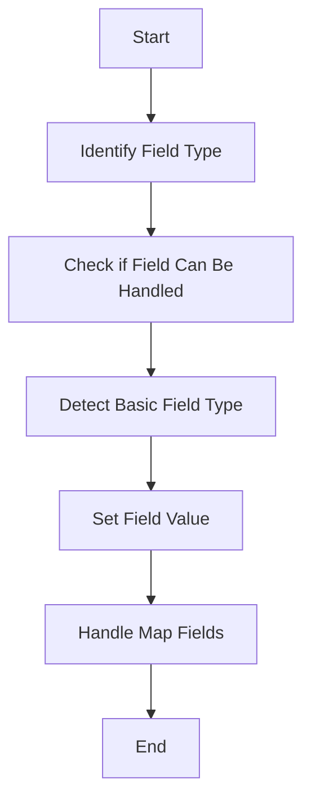

This document will cover the process of populating field values, which includes:

1. Identifying the field type
2. Checking if the field can be handled
3. Detecting the basic field type
4. Setting the field value
5. Handling map fields.

Technical document: <SwmLink doc-title="Populating Field Values">[Populating Field Values](/.swm/populating-field-values.7fnzuksn.sw.md)</SwmLink>

# [Identifying the Field Type](https://app.swimm.io/repos/Z2l0aHViJTNBJTNBQnJvYWRsZWFmQ29tbWVyY2UtZGVtby1uZXclM0ElM0FTd2ltbS1EZW1v/docs/7fnzuksn#flow-drill-down)

The process begins by identifying the type of field that needs to be populated. This is crucial because different field types require different handling methods. For example, a BOOLEAN field will be treated differently from a DATE or STRING field. Identifying the field type ensures that the correct value is retrieved and set.

# [Checking if the Field Can Be Handled](https://app.swimm.io/repos/Z2l0aHViJTNBJTNBQnJvYWRsZWFmQ29tbWVyY2UtZGVtby1uZXclM0ElM0FTd2ltbS1EZW1v/docs/7fnzuksn#checking-persistence-capability)

Once the field type is identified, the next step is to check if the field can be handled by the current provider. This involves verifying if the field type is supported. If the field type is not supported, it will not be processed further. This step ensures that only compatible fields are processed, preventing errors and ensuring data integrity.

# [Detecting the Basic Field Type](https://app.swimm.io/repos/Z2l0aHViJTNBJTNBQnJvYWRsZWFmQ29tbWVyY2UtZGVtby1uZXclM0ElM0FTd2ltbS1EZW1v/docs/7fnzuksn#detecting-basic-field-types)

After confirming that the field can be handled, the next step is to detect the basic field type. This step identifies if the field type is one of the basic supported types such as BOOLEAN, DATE, INTEGER, etc. This classification helps in determining the appropriate method for setting the field value.

# [Setting the Field Value](https://app.swimm.io/repos/Z2l0aHViJTNBJTNBQnJvYWRsZWFmQ29tbWVyY2UtZGVtby1uZXclM0ElM0FTd2ltbS1EZW1v/docs/7fnzuksn#setting-field-values)

Once the basic field type is detected, the field value is set. This involves retrieving the original value, checking if the new value is different, and then setting the new value accordingly. If the new value is different from the current value, it is updated to ensure that the field reflects the most recent data.

# [Handling Map Fields](https://app.swimm.io/repos/Z2l0aHViJTNBJTNBQnJvYWRsZWFmQ29tbWVyY2UtZGVtby1uZXclM0ElM0FTd2ltbS1EZW1v/docs/7fnzuksn#handling-map-field-population)

The final step involves handling map fields, if necessary. Map fields are special types of fields that store key-value pairs. This step ensures that the new value for the specified key in the map is set correctly. Handling map fields is essential for maintaining the integrity of complex data structures.

&nbsp;

*This is an auto-generated document by Swimm AI 🌊 and has not yet been verified by a human*

<SwmMeta version="3.0.0" repo-id="Z2l0aHViJTNBJTNBQnJvYWRsZWFmQ29tbWVyY2UtZGVtby1uZXclM0ElM0FTd2ltbS1EZW1v" repo-name="BroadleafCommerce-demo-new" doc-type="product-flows">Powered by [Swimm](/)</SwmMeta>
