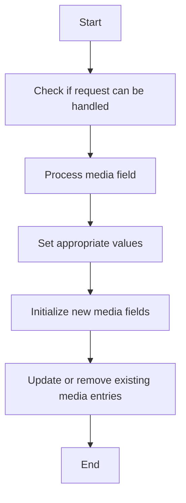

This document will cover the process of populating media field values, which includes:

1. Checking if the request can be handled
2. Processing the media field
3. Setting the appropriate values
4. Initializing new media fields
5. Updating or removing existing media entries.

Technical document: <SwmLink doc-title="Populating Media Field Values">[Populating Media Field Values](/.swm/populating-media-field-values.zpfhh4px.sw.md)</SwmLink>

# [Checking if the request can be handled](https://app.swimm.io/repos/Z2l0aHViJTNBJTNBQnJvYWRsZWFmQ29tbWVyY2UtZGVtby1uZXclM0ElM0FTd2ltbS1EZW1v/docs/zpfhh4px#handling-media-fields)

The process begins by determining if the request to populate media field values can be handled. This involves verifying that the request and the instance are compatible with the media field persistence logic. If the request cannot be handled, the process is terminated at this step.

# [Processing the media field](https://app.swimm.io/repos/Z2l0aHViJTNBJTNBQnJvYWRsZWFmQ29tbWVyY2UtZGVtby1uZXclM0ElM0FTd2ltbS1EZW1v/docs/zpfhh4px#handling-media-fields)

Once it is confirmed that the request can be handled, the next step is to process the media field. This involves converting the JSON data received in the request into a Media object. This conversion is essential to ensure that the media data is in a format that can be manipulated and stored within the system.

# [Setting the appropriate values](https://app.swimm.io/repos/Z2l0aHViJTNBJTNBQnJvYWRsZWFmQ29tbWVyY2UtZGVtby1uZXclM0ElM0FTd2ltbS1EZW1v/docs/zpfhh4px#setting-field-values)

After processing the media field, the appropriate values need to be set. This involves assigning the converted Media object to the relevant field in the instance. If the field name contains a map field separator, special handling is required to ensure the field is correctly annotated and the values are set appropriately.

# [Initializing new media fields](https://app.swimm.io/repos/Z2l0aHViJTNBJTNBQnJvYWRsZWFmQ29tbWVyY2UtZGVtby1uZXclM0ElM0FTd2ltbS1EZW1v/docs/zpfhh4px#handling-media-fields)

If the media being processed is new, it is necessary to initialize the media fields. This includes setting the parent and map key values to establish the correct relationships and references within the data model. Initializing new media fields ensures that the new media entries are correctly integrated into the system.

# [Updating or removing existing media entries](https://app.swimm.io/repos/Z2l0aHViJTNBJTNBQnJvYWRsZWFmQ29tbWVyY2UtZGVtby1uZXclM0ElM0FTd2ltbS1EZW1v/docs/zpfhh4px#handling-map-field-population)

The final step in the process is to update or remove existing media entries as needed. If the new value for a media field is null, the corresponding entry is removed from the map. Otherwise, the map is updated with the new value. This step ensures that the media fields are accurately maintained and reflect the latest data.

&nbsp;

*This is an auto-generated document by Swimm AI 🌊 and has not yet been verified by a human*

<SwmMeta version="3.0.0" repo-id="Z2l0aHViJTNBJTNBQnJvYWRsZWFmQ29tbWVyY2UtZGVtby1uZXclM0ElM0FTd2ltbS1EZW1v" repo-name="BroadleafCommerce-demo-new" doc-type="product-flows">Powered by [Swimm](/)</SwmMeta>
