In this document, we will explain the process of populating values in media fields. The process involves checking if the persistence can be handled, processing the media field, and setting the appropriate values.

The flow starts by checking if the request can be handled. If it can, the method processes the media field by converting JSON data into a Media object. It then sets the appropriate values for the media field. If the media is new, it initializes the media fields and sets the parent and map key values. The method also updates or removes existing media entries as needed.

# Flow drill down

```mermaid
graph TD;
      subgraph admin/broadleaf-open-admin-platform/src/main/java/org/broadleafcommerce/openadmin/server/service/persistence/module
64dbec3e3649f9649b484da4c798ad6c7657314f25f960e53310bdb82632e170(populateValue):::mainFlowStyle --> e397e7a4073e60a59abecd2977d6860cc7361ba3dde7b0c462c898d8d9e01241(setFieldValue):::mainFlowStyle
end

subgraph admin/broadleaf-open-admin-platform/src/main/java/org/broadleafcommerce/openadmin/server/service/persistence/module
e397e7a4073e60a59abecd2977d6860cc7361ba3dde7b0c462c898d8d9e01241(setFieldValue):::mainFlowStyle --> 0bedcb6fc5b0541a21e076c36dbcea3ce1044fc2ea5ec78cdb1939e6d4032399(handleMapFieldPopulation):::mainFlowStyle
end


      classDef mainFlowStyle color:#000000,fill:#7CB9F4
classDef rootsStyle color:#000000,fill:#00FFF4
classDef Style1 color:#000000,fill:#00FFAA
classDef Style2 color:#000000,fill:#FFFF00
classDef Style3 color:#000000,fill:#AA7CB9

%% Swimm:
%% graph TD;
%%       subgraph <SwmPath>[admin/broadleaf-open-admin-platform/src/main/java/org/broadleafcommerce/openadmin/server/service/persistence/module/](admin/broadleaf-open-admin-platform/src/main/java/org/broadleafcommerce/openadmin/server/service/persistence/module/)</SwmPath>
%% 64dbec3e3649f9649b484da4c798ad6c7657314f25f960e53310bdb82632e170(populateValue):::mainFlowStyle --> e397e7a4073e60a59abecd2977d6860cc7361ba3dde7b0c462c898d8d9e01241(setFieldValue):::mainFlowStyle
%% end
%% 
%% subgraph <SwmPath>[admin/broadleaf-open-admin-platform/src/main/java/org/broadleafcommerce/openadmin/server/service/persistence/module/](admin/broadleaf-open-admin-platform/src/main/java/org/broadleafcommerce/openadmin/server/service/persistence/module/)</SwmPath>
%% e397e7a4073e60a59abecd2977d6860cc7361ba3dde7b0c462c898d8d9e01241(setFieldValue):::mainFlowStyle --> 0bedcb6fc5b0541a21e076c36dbcea3ce1044fc2ea5ec78cdb1939e6d4032399(handleMapFieldPopulation):::mainFlowStyle
%% end
%% 
%% 
%%       classDef mainFlowStyle color:#000000,fill:#7CB9F4
%% classDef rootsStyle color:#000000,fill:#00FFF4
%% classDef Style1 color:#000000,fill:#00FFAA
%% classDef Style2 color:#000000,fill:#FFFF00
%% classDef Style3 color:#000000,fill:#AA7CB9
```



<SwmSnippet path="/admin/broadleaf-open-admin-platform/src/main/java/org/broadleafcommerce/openadmin/server/service/persistence/module/provider/MediaFieldPersistenceProvider.java" line="89">

---

## Handling Media Fields

The <SwmToken path="admin/broadleaf-open-admin-platform/src/main/java/org/broadleafcommerce/openadmin/server/service/persistence/module/provider/MediaFieldPersistenceProvider.java" pos="90:5:5" line-data="    public MetadataProviderResponse populateValue(PopulateValueRequest populateValueRequest, Serializable instance) throws PersistenceException {">`populateValue`</SwmToken> method is responsible for handling the population of media fields. It first checks if the persistence can be handled for the given request and instance. If the property name contains a map field separator, it ensures that the field is annotated with <SwmToken path="admin/broadleaf-open-admin-platform/src/main/java/org/broadleafcommerce/openadmin/server/service/persistence/module/provider/MediaFieldPersistenceProvider.java" pos="98:30:31" line-data="                throw new UnsupportedOperationException(&quot;MediaFieldPersistenceProvider is currently only compatible with map fields when modelled using @OneToMany&quot;);">`@OneToMany`</SwmToken>. The method then processes the media field, converting JSON to a Media object, and sets the appropriate values. If the media is new, it instantiates the media fields and sets the parent and map key values. The method also handles updating or removing existing media entries.

```java
    @Override
    public MetadataProviderResponse populateValue(PopulateValueRequest populateValueRequest, Serializable instance) throws PersistenceException {
        if (!canHandlePersistence(populateValueRequest, instance)) {
            return MetadataProviderResponse.NOT_HANDLED;
        }
        String prop = populateValueRequest.getProperty().getName();
        if (prop.contains(FieldManager.MAPFIELDSEPARATOR)) {
            Field field = populateValueRequest.getFieldManager().getField(instance.getClass(), prop.substring(0, prop.indexOf(FieldManager.MAPFIELDSEPARATOR)));
            if (field.getAnnotation(OneToMany.class) == null) {
                throw new UnsupportedOperationException("MediaFieldPersistenceProvider is currently only compatible with map fields when modelled using @OneToMany");
            }
        }
        MetadataProviderResponse response = MetadataProviderResponse.HANDLED;
        boolean dirty = false;
        try {
            setNonDisplayableValues(populateValueRequest);
            Class<?> valueType = getStartingValueType(populateValueRequest);
        
            if (Media.class.isAssignableFrom(valueType)) {
                Media newMedia = mediaBuilderService.convertJsonToMedia(populateValueRequest
                        .getProperty().getUnHtmlEncodedValue(), valueType);
```

---

</SwmSnippet>

<SwmSnippet path="/admin/broadleaf-open-admin-platform/src/main/java/org/broadleafcommerce/openadmin/server/service/persistence/module/FieldManager.java" line="121">

---

### Setting Field Values

The <SwmToken path="admin/broadleaf-open-admin-platform/src/main/java/org/broadleafcommerce/openadmin/server/service/persistence/module/FieldManager.java" pos="121:5:5" line-data="    public Object setFieldValue(Object bean, String fieldName, Object newValue) throws IllegalAccessException, InstantiationException {">`setFieldValue`</SwmToken> method sets the value of a specified field on a given bean. It tokenizes the field name to handle nested properties and map fields. If the field name contains a map field separator, it delegates to the <SwmToken path="admin/broadleaf-open-admin-platform/src/main/java/org/broadleafcommerce/openadmin/server/service/persistence/module/FieldManager.java" pos="313:5:5" line-data="    protected void handleMapFieldPopulation(Object bean, String fieldName, Object newValue, Class&lt;?&gt; componentClass,">`handleMapFieldPopulation`</SwmToken> method. Otherwise, it sets the field value directly, potentially using a field modifier manager to modify the value before setting it.

```java
    public Object setFieldValue(Object bean, String fieldName, Object newValue) throws IllegalAccessException, InstantiationException {
        StringTokenizer tokens = new StringTokenizer(fieldName, ".");
        Class<?> componentClass = bean.getClass();
        Field field;
        bean = HibernateUtils.deproxy(bean);
        Object value = bean;

        int count = tokens.countTokens();
        int j=0;
        StringBuilder sb = new StringBuilder();
        while (tokens.hasMoreTokens()) {
            String fieldNamePart = tokens.nextToken();
            sb.append(fieldNamePart);
            String mapKey = null;
            if (fieldNamePart.contains(FieldManager.MAPFIELDSEPARATOR)) {
                mapKey = fieldNamePart.substring(fieldNamePart.indexOf(FieldManager.MAPFIELDSEPARATOR) + FieldManager.MAPFIELDSEPARATOR.length(), fieldNamePart.length());
                fieldNamePart = fieldNamePart.substring(0, fieldNamePart.indexOf(FieldManager.MAPFIELDSEPARATOR));
            }

            field = getSingleField(componentClass, fieldNamePart);
            field.setAccessible(true);
```

---

</SwmSnippet>

<SwmSnippet path="/admin/broadleaf-open-admin-platform/src/main/java/org/broadleafcommerce/openadmin/server/service/persistence/module/FieldManager.java" line="313">

---

### Handling Map Field Population

The <SwmToken path="admin/broadleaf-open-admin-platform/src/main/java/org/broadleafcommerce/openadmin/server/service/persistence/module/FieldManager.java" pos="313:5:5" line-data="    protected void handleMapFieldPopulation(Object bean, String fieldName, Object newValue, Class&lt;?&gt; componentClass,">`handleMapFieldPopulation`</SwmToken> method deals with setting values in map fields. It determines the appropriate map field name and retrieves the map from the bean. If the new value is null, it removes the entry from the map. Otherwise, it updates the map with the new value. This method ensures that map fields are correctly populated and maintained.

```java
    protected void handleMapFieldPopulation(Object bean, String fieldName, Object newValue, Class<?> componentClass,
                                            Field field, Object value, String fieldNamePart, String mapKey) throws IllegalAccessException {
        String fieldNamePrefix = fieldName.substring(0, fieldName.indexOf(fieldNamePart));
        String multiValueMapFullFieldName = fieldNamePrefix + "multiValue" + fieldNamePart.substring(0, 1).toUpperCase() + fieldNamePart.substring(1);
        String standardMapFullFieldName = null;
        if (!StringUtils.isEmpty(fieldNamePrefix)) {
            standardMapFullFieldName = fieldNamePrefix + fieldNamePart.substring(0, 1).toUpperCase() + fieldNamePart.substring(1);
        }

        Map<String, Object> map = null;
        Object fieldValue = field.get(value);
        if (fieldValue instanceof List) {
            try {
                map = (Map<String, Object>) PropertyUtils.getProperty(bean, multiValueMapFullFieldName);
            } catch (InvocationTargetException |NoSuchMethodException e) {
                if (!StringUtils.isEmpty(standardMapFullFieldName)) {
                    try {
                        map = (Map<String, Object>) PropertyUtils.getProperty(bean, standardMapFullFieldName);
                    } catch (InvocationTargetException | NoSuchMethodException n) {
                        LOG.info("Unable to find a reference to (" + field.getType().getName() + ") in the EntityConfigurationManager. " +
                                "Using the type of this class.");
```

---

</SwmSnippet>

&nbsp;

*This is an auto-generated document by Swimm AI 🌊 and has not yet been verified by a human*

<SwmMeta version="3.0.0" repo-id="Z2l0aHViJTNBJTNBQnJvYWRsZWFmQ29tbWVyY2UtZGVtby1uZXclM0ElM0FTd2ltbS1EZW1v" repo-name="BroadleafCommerce-demo-new" doc-type="flows"><sup>Powered by [Swimm](/)</sup></SwmMeta>
