In this document, we will explain the process of populating model variables with content items. The process involves validating tag attributes, retrieving content items, filtering and sorting them, and finally adding them to the model variables.

The flow starts by checking if the necessary tag attributes are present. Then, it retrieves the content items based on these attributes. After that, it filters and sorts the content items as needed. Finally, it adds the processed content items to the model variables.

Here is a high level diagram of the flow, showing only the most important functions:

```mermaid
graph TD;
      subgraph admin/broadleaf-contentmanagement-module/src/main/java/org/broadleafcommerce/cms
cc58175500ad63383c39108036c3cbc3facde6dde578a55f978e6a91156af50b(populateModelVariables):::mainFlowStyle --> 43848311a198d4b7a61a27e9624092138a9388d0984db626bbb176d4942d4606(getContentItems):::mainFlowStyle
end

subgraph admin/broadleaf-contentmanagement-module/src/main/java/org/broadleafcommerce/cms
43848311a198d4b7a61a27e9624092138a9388d0984db626bbb176d4942d4606(getContentItems):::mainFlowStyle --> c94a140b531bfc14e9862de6b09a5da0664af9f6fb0e47b15fcdd5ffe38688d2(lookupStructuredContentItemsByName)
end

subgraph admin/broadleaf-contentmanagement-module/src/main/java/org/broadleafcommerce/cms
43848311a198d4b7a61a27e9624092138a9388d0984db626bbb176d4942d4606(getContentItems):::mainFlowStyle --> 04bd9854461d7aaf2d7f1f1442b558c00bda1dc360ce2b2bd2038ad0e0b17bd1(lookupStructuredContentItemsByType):::mainFlowStyle
end

subgraph admin/broadleaf-contentmanagement-module/src/main/java/org/broadleafcommerce/cms
04bd9854461d7aaf2d7f1f1442b558c00bda1dc360ce2b2bd2038ad0e0b17bd1(lookupStructuredContentItemsByType):::mainFlowStyle --> 46c3a79d47ba8515dc523d582e1752e512e1affe5cf66c15ed69a1658e3858d0(evaluateAndPriortizeContent)
end

subgraph admin/broadleaf-contentmanagement-module/src/main/java/org/broadleafcommerce/cms
04bd9854461d7aaf2d7f1f1442b558c00bda1dc360ce2b2bd2038ad0e0b17bd1(lookupStructuredContentItemsByType):::mainFlowStyle --> 3cccd5356309b5708fb346cb7ef0f8a3816b5833812f7b3db059838108eb1eb0(buildStructuredContentDTOList):::mainFlowStyle
end

subgraph admin/broadleaf-contentmanagement-module/src/main/java/org/broadleafcommerce/cms
3cccd5356309b5708fb346cb7ef0f8a3816b5833812f7b3db059838108eb1eb0(buildStructuredContentDTOList):::mainFlowStyle --> 44d23b8db56e4ec597777384c3602acaad15d42fcc5166ba8554b9d352435c30(buildStructuredContentDTO):::mainFlowStyle
end

subgraph admin/broadleaf-contentmanagement-module/src/main/java/org/broadleafcommerce/cms
44d23b8db56e4ec597777384c3602acaad15d42fcc5166ba8554b9d352435c30(buildStructuredContentDTO):::mainFlowStyle --> 060f226a662e8eddc91e41835facf868138ef4d3a09c0d92aae7fa7051ee0274(buildFieldValues):::mainFlowStyle
end


      classDef mainFlowStyle color:#000000,fill:#7CB9F4
classDef rootsStyle color:#000000,fill:#00FFF4
classDef Style1 color:#000000,fill:#00FFAA
classDef Style2 color:#000000,fill:#FFFF00
classDef Style3 color:#000000,fill:#AA7CB9

%% Swimm:
%% graph TD;
%%       subgraph <SwmPath>[admin/broadleaf-contentmanagement-module/src/main/java/org/broadleafcommerce/cms/](admin/broadleaf-contentmanagement-module/src/main/java/org/broadleafcommerce/cms/)</SwmPath>
%% cc58175500ad63383c39108036c3cbc3facde6dde578a55f978e6a91156af50b(populateModelVariables):::mainFlowStyle --> 43848311a198d4b7a61a27e9624092138a9388d0984db626bbb176d4942d4606(getContentItems):::mainFlowStyle
%% end
%% 
%% subgraph <SwmPath>[admin/broadleaf-contentmanagement-module/src/main/java/org/broadleafcommerce/cms/](admin/broadleaf-contentmanagement-module/src/main/java/org/broadleafcommerce/cms/)</SwmPath>
%% 43848311a198d4b7a61a27e9624092138a9388d0984db626bbb176d4942d4606(getContentItems):::mainFlowStyle --> c94a140b531bfc14e9862de6b09a5da0664af9f6fb0e47b15fcdd5ffe38688d2(lookupStructuredContentItemsByName)
%% end
%% 
%% subgraph <SwmPath>[admin/broadleaf-contentmanagement-module/src/main/java/org/broadleafcommerce/cms/](admin/broadleaf-contentmanagement-module/src/main/java/org/broadleafcommerce/cms/)</SwmPath>
%% 43848311a198d4b7a61a27e9624092138a9388d0984db626bbb176d4942d4606(getContentItems):::mainFlowStyle --> 04bd9854461d7aaf2d7f1f1442b558c00bda1dc360ce2b2bd2038ad0e0b17bd1(lookupStructuredContentItemsByType):::mainFlowStyle
%% end
%% 
%% subgraph <SwmPath>[admin/broadleaf-contentmanagement-module/src/main/java/org/broadleafcommerce/cms/](admin/broadleaf-contentmanagement-module/src/main/java/org/broadleafcommerce/cms/)</SwmPath>
%% 04bd9854461d7aaf2d7f1f1442b558c00bda1dc360ce2b2bd2038ad0e0b17bd1(lookupStructuredContentItemsByType):::mainFlowStyle --> 46c3a79d47ba8515dc523d582e1752e512e1affe5cf66c15ed69a1658e3858d0(evaluateAndPriortizeContent)
%% end
%% 
%% subgraph <SwmPath>[admin/broadleaf-contentmanagement-module/src/main/java/org/broadleafcommerce/cms/](admin/broadleaf-contentmanagement-module/src/main/java/org/broadleafcommerce/cms/)</SwmPath>
%% 04bd9854461d7aaf2d7f1f1442b558c00bda1dc360ce2b2bd2038ad0e0b17bd1(lookupStructuredContentItemsByType):::mainFlowStyle --> 3cccd5356309b5708fb346cb7ef0f8a3816b5833812f7b3db059838108eb1eb0(buildStructuredContentDTOList):::mainFlowStyle
%% end
%% 
%% subgraph <SwmPath>[admin/broadleaf-contentmanagement-module/src/main/java/org/broadleafcommerce/cms/](admin/broadleaf-contentmanagement-module/src/main/java/org/broadleafcommerce/cms/)</SwmPath>
%% 3cccd5356309b5708fb346cb7ef0f8a3816b5833812f7b3db059838108eb1eb0(buildStructuredContentDTOList):::mainFlowStyle --> 44d23b8db56e4ec597777384c3602acaad15d42fcc5166ba8554b9d352435c30(buildStructuredContentDTO):::mainFlowStyle
%% end
%% 
%% subgraph <SwmPath>[admin/broadleaf-contentmanagement-module/src/main/java/org/broadleafcommerce/cms/](admin/broadleaf-contentmanagement-module/src/main/java/org/broadleafcommerce/cms/)</SwmPath>
%% 44d23b8db56e4ec597777384c3602acaad15d42fcc5166ba8554b9d352435c30(buildStructuredContentDTO):::mainFlowStyle --> 060f226a662e8eddc91e41835facf868138ef4d3a09c0d92aae7fa7051ee0274(buildFieldValues):::mainFlowStyle
%% end
%% 
%% 
%%       classDef mainFlowStyle color:#000000,fill:#7CB9F4
%% classDef rootsStyle color:#000000,fill:#00FFF4
%% classDef Style1 color:#000000,fill:#00FFAA
%% classDef Style2 color:#000000,fill:#FFFF00
%% classDef Style3 color:#000000,fill:#AA7CB9
```



# Flow drill down

First, we'll zoom into this section of the flow:

```mermaid
graph TD;
      subgraph admin/broadleaf-contentmanagement-module/src/main/java/org/broadleafcommerce/cms
cc58175500ad63383c39108036c3cbc3facde6dde578a55f978e6a91156af50b(populateModelVariables):::mainFlowStyle --> 43848311a198d4b7a61a27e9624092138a9388d0984db626bbb176d4942d4606(getContentItems):::mainFlowStyle
end

subgraph admin/broadleaf-contentmanagement-module/src/main/java/org/broadleafcommerce/cms
43848311a198d4b7a61a27e9624092138a9388d0984db626bbb176d4942d4606(getContentItems):::mainFlowStyle --> c94a140b531bfc14e9862de6b09a5da0664af9f6fb0e47b15fcdd5ffe38688d2(lookupStructuredContentItemsByName)
end

subgraph admin/broadleaf-contentmanagement-module/src/main/java/org/broadleafcommerce/cms
43848311a198d4b7a61a27e9624092138a9388d0984db626bbb176d4942d4606(getContentItems):::mainFlowStyle --> 04bd9854461d7aaf2d7f1f1442b558c00bda1dc360ce2b2bd2038ad0e0b17bd1(lookupStructuredContentItemsByType):::mainFlowStyle
end

subgraph admin/broadleaf-contentmanagement-module/src/main/java/org/broadleafcommerce/cms
04bd9854461d7aaf2d7f1f1442b558c00bda1dc360ce2b2bd2038ad0e0b17bd1(lookupStructuredContentItemsByType):::mainFlowStyle --> k32yy(...)
end

subgraph admin/broadleaf-contentmanagement-module/src/main/java/org/broadleafcommerce/cms
c94a140b531bfc14e9862de6b09a5da0664af9f6fb0e47b15fcdd5ffe38688d2(lookupStructuredContentItemsByName) --> 46c3a79d47ba8515dc523d582e1752e512e1affe5cf66c15ed69a1658e3858d0(evaluateAndPriortizeContent)
end


      classDef mainFlowStyle color:#000000,fill:#7CB9F4
classDef rootsStyle color:#000000,fill:#00FFF4
classDef Style1 color:#000000,fill:#00FFAA
classDef Style2 color:#000000,fill:#FFFF00
classDef Style3 color:#000000,fill:#AA7CB9

%% Swimm:
%% graph TD;
%%       subgraph <SwmPath>[admin/broadleaf-contentmanagement-module/src/main/java/org/broadleafcommerce/cms/](admin/broadleaf-contentmanagement-module/src/main/java/org/broadleafcommerce/cms/)</SwmPath>
%% cc58175500ad63383c39108036c3cbc3facde6dde578a55f978e6a91156af50b(populateModelVariables):::mainFlowStyle --> 43848311a198d4b7a61a27e9624092138a9388d0984db626bbb176d4942d4606(getContentItems):::mainFlowStyle
%% end
%% 
%% subgraph <SwmPath>[admin/broadleaf-contentmanagement-module/src/main/java/org/broadleafcommerce/cms/](admin/broadleaf-contentmanagement-module/src/main/java/org/broadleafcommerce/cms/)</SwmPath>
%% 43848311a198d4b7a61a27e9624092138a9388d0984db626bbb176d4942d4606(getContentItems):::mainFlowStyle --> c94a140b531bfc14e9862de6b09a5da0664af9f6fb0e47b15fcdd5ffe38688d2(lookupStructuredContentItemsByName)
%% end
%% 
%% subgraph <SwmPath>[admin/broadleaf-contentmanagement-module/src/main/java/org/broadleafcommerce/cms/](admin/broadleaf-contentmanagement-module/src/main/java/org/broadleafcommerce/cms/)</SwmPath>
%% 43848311a198d4b7a61a27e9624092138a9388d0984db626bbb176d4942d4606(getContentItems):::mainFlowStyle --> 04bd9854461d7aaf2d7f1f1442b558c00bda1dc360ce2b2bd2038ad0e0b17bd1(lookupStructuredContentItemsByType):::mainFlowStyle
%% end
%% 
%% subgraph <SwmPath>[admin/broadleaf-contentmanagement-module/src/main/java/org/broadleafcommerce/cms/](admin/broadleaf-contentmanagement-module/src/main/java/org/broadleafcommerce/cms/)</SwmPath>
%% 04bd9854461d7aaf2d7f1f1442b558c00bda1dc360ce2b2bd2038ad0e0b17bd1(lookupStructuredContentItemsByType):::mainFlowStyle --> k32yy(...)
%% end
%% 
%% subgraph <SwmPath>[admin/broadleaf-contentmanagement-module/src/main/java/org/broadleafcommerce/cms/](admin/broadleaf-contentmanagement-module/src/main/java/org/broadleafcommerce/cms/)</SwmPath>
%% c94a140b531bfc14e9862de6b09a5da0664af9f6fb0e47b15fcdd5ffe38688d2(lookupStructuredContentItemsByName) --> 46c3a79d47ba8515dc523d582e1752e512e1affe5cf66c15ed69a1658e3858d0(evaluateAndPriortizeContent)
%% end
%% 
%% 
%%       classDef mainFlowStyle color:#000000,fill:#7CB9F4
%% classDef rootsStyle color:#000000,fill:#00FFF4
%% classDef Style1 color:#000000,fill:#00FFAA
%% classDef Style2 color:#000000,fill:#FFFF00
%% classDef Style3 color:#000000,fill:#AA7CB9
```



<SwmSnippet path="/admin/broadleaf-contentmanagement-module/src/main/java/org/broadleafcommerce/cms/web/processor/ContentProcessor.java" line="140">

---

## <SwmToken path="admin/broadleaf-contentmanagement-module/src/main/java/org/broadleafcommerce/cms/web/processor/ContentProcessor.java" pos="140:11:11" line-data="    public Map&lt;String, Object&gt; populateModelVariables(String tagName, Map&lt;String, String&gt; tagAttributes, BroadleafTemplateContext context) {">`populateModelVariables`</SwmToken>

The <SwmToken path="admin/broadleaf-contentmanagement-module/src/main/java/org/broadleafcommerce/cms/web/processor/ContentProcessor.java" pos="140:11:11" line-data="    public Map&lt;String, Object&gt; populateModelVariables(String tagName, Map&lt;String, String&gt; tagAttributes, BroadleafTemplateContext context) {">`populateModelVariables`</SwmToken> method is responsible for populating the model with content items based on the provided tag attributes. It first validates the presence of either <SwmToken path="admin/broadleaf-contentmanagement-module/src/main/java/org/broadleafcommerce/cms/web/processor/ContentProcessor.java" pos="141:3:3" line-data="        String contentType = tagAttributes.get(&quot;contentType&quot;);">`contentType`</SwmToken> or <SwmToken path="admin/broadleaf-contentmanagement-module/src/main/java/org/broadleafcommerce/cms/web/processor/ContentProcessor.java" pos="142:3:3" line-data="        String contentName = tagAttributes.get(&quot;contentName&quot;);">`contentName`</SwmToken> and sets default values for various parameters. It then retrieves content items using the <SwmToken path="admin/broadleaf-contentmanagement-module/src/main/java/org/broadleafcommerce/cms/web/processor/ContentProcessor.java" pos="271:8:8" line-data="    protected List&lt;StructuredContentDTO&gt; getContentItems(String contentName, Integer maxResults, HttpServletRequest request,">`getContentItems`</SwmToken> method and sorts them if necessary. The method also filters the content items based on field filters and adds them to the model variables. Additionally, it handles deep links if specified in the tag attributes.

```java
    public Map<String, Object> populateModelVariables(String tagName, Map<String, String> tagAttributes, BroadleafTemplateContext context) {
        String contentType = tagAttributes.get("contentType");
        String contentName = tagAttributes.get("contentName");
        String maxResultsStr = tagAttributes.get("maxResults");

        if (StringUtils.isEmpty(contentType) && StringUtils.isEmpty(contentName)) {
            throw new IllegalArgumentException("The content processor must have a non-empty attribute value for 'contentType' or 'contentName'");
        }

        Integer maxResults = null;
        if (maxResultsStr != null) {
            maxResults = Ints.tryParse(maxResultsStr);
        }
        if (maxResults == null) {
            maxResults = Integer.MAX_VALUE;
        }

        String contentListVar = getAttributeValue(tagAttributes, "contentListVar", "contentList");
        String contentItemVar = getAttributeValue(tagAttributes, "contentItemVar", "contentItem");
        String numResultsVar = getAttributeValue(tagAttributes, "numResultsVar", "numResults");

```

---

</SwmSnippet>

<SwmSnippet path="/admin/broadleaf-contentmanagement-module/src/main/java/org/broadleafcommerce/cms/web/processor/ContentProcessor.java" line="271">

---

### <SwmToken path="admin/broadleaf-contentmanagement-module/src/main/java/org/broadleafcommerce/cms/web/processor/ContentProcessor.java" pos="271:8:8" line-data="    protected List&lt;StructuredContentDTO&gt; getContentItems(String contentName, Integer maxResults, HttpServletRequest request,">`getContentItems`</SwmToken>

The <SwmToken path="admin/broadleaf-contentmanagement-module/src/main/java/org/broadleafcommerce/cms/web/processor/ContentProcessor.java" pos="271:8:8" line-data="    protected List&lt;StructuredContentDTO&gt; getContentItems(String contentName, Integer maxResults, HttpServletRequest request,">`getContentItems`</SwmToken> method retrieves content items based on the content name or type. It uses the <SwmToken path="admin/broadleaf-contentmanagement-module/src/main/java/org/broadleafcommerce/cms/web/processor/ContentProcessor.java" pos="279:7:7" line-data="            contentItems = structuredContentService.lookupStructuredContentItemsByName(contentName, locale, maxResults, mvelParameters, isSecure(request));">`lookupStructuredContentItemsByName`</SwmToken> or <SwmToken path="admin/broadleaf-contentmanagement-module/src/main/java/org/broadleafcommerce/cms/web/processor/ContentProcessor.java" pos="282:7:7" line-data="                contentItems = structuredContentService.lookupStructuredContentItemsByType(structuredContentType, locale, maxResults, mvelParameters, isSecure(request));">`lookupStructuredContentItemsByType`</SwmToken> methods from the <SwmToken path="admin/broadleaf-contentmanagement-module/src/main/java/org/broadleafcommerce/cms/web/processor/ContentProcessor.java" pos="279:5:5" line-data="            contentItems = structuredContentService.lookupStructuredContentItemsByName(contentName, locale, maxResults, mvelParameters, isSecure(request));">`structuredContentService`</SwmToken> to fetch the content items. The method also adds additional fields to the model using the <SwmToken path="admin/broadleaf-contentmanagement-module/src/main/java/org/broadleafcommerce/cms/web/processor/ContentProcessor.java" pos="289:1:1" line-data="        extensionManager.getProxy().addAdditionalFieldsToModel(tagName, tagAttributes, newModelVars, context);">`extensionManager`</SwmToken>.

```java
    protected List<StructuredContentDTO> getContentItems(String contentName, Integer maxResults, HttpServletRequest request,
                                                         Map<String, Object> mvelParameters,
                                                         SandBox currentSandbox,
                                                         StructuredContentType structuredContentType,
                                                         Locale locale, String tagName, Map<String, String> tagAttributes,
                                                         Map<String, Object> newModelVars, BroadleafTemplateContext context) {
        List<StructuredContentDTO> contentItems;
        if (structuredContentType == null) {
            contentItems = structuredContentService.lookupStructuredContentItemsByName(contentName, locale, maxResults, mvelParameters, isSecure(request));
        } else {
            if (contentName == null || "".equals(contentName)) {
                contentItems = structuredContentService.lookupStructuredContentItemsByType(structuredContentType, locale, maxResults, mvelParameters, isSecure(request));
            } else {
                contentItems = structuredContentService.lookupStructuredContentItemsByName(structuredContentType, contentName, locale, maxResults, mvelParameters, isSecure(request));
            }
        }

        //add additional fields to the model
        extensionManager.getProxy().addAdditionalFieldsToModel(tagName, tagAttributes, newModelVars, context);

        return contentItems;
```

---

</SwmSnippet>

<SwmSnippet path="/admin/broadleaf-contentmanagement-module/src/main/java/org/broadleafcommerce/cms/structure/service/StructuredContentServiceImpl.java" line="294">

---

### <SwmToken path="admin/broadleaf-contentmanagement-module/src/main/java/org/broadleafcommerce/cms/structure/service/StructuredContentServiceImpl.java" pos="295:8:8" line-data="    public List&lt;StructuredContentDTO&gt; lookupStructuredContentItemsByName(StructuredContentType contentType, String contentName,">`lookupStructuredContentItemsByName`</SwmToken>

The <SwmToken path="admin/broadleaf-contentmanagement-module/src/main/java/org/broadleafcommerce/cms/structure/service/StructuredContentServiceImpl.java" pos="295:8:8" line-data="    public List&lt;StructuredContentDTO&gt; lookupStructuredContentItemsByName(StructuredContentType contentType, String contentName,">`lookupStructuredContentItemsByName`</SwmToken> method retrieves structured content items by their name and type. It first checks the cache for the content items and, if not found, queries the database. The method then builds a list of <SwmToken path="admin/broadleaf-contentmanagement-module/src/main/java/org/broadleafcommerce/cms/structure/service/StructuredContentServiceImpl.java" pos="295:5:5" line-data="    public List&lt;StructuredContentDTO&gt; lookupStructuredContentItemsByName(StructuredContentType contentType, String contentName,">`StructuredContentDTO`</SwmToken> objects and evaluates and prioritizes the content using the <SwmToken path="admin/broadleaf-contentmanagement-module/src/main/java/org/broadleafcommerce/cms/structure/service/StructuredContentServiceImpl.java" pos="176:8:8" line-data="    public List&lt;StructuredContentDTO&gt; evaluateAndPriortizeContent(List&lt;StructuredContentDTO&gt; structuredContentList, int count, Map&lt;String, Object&gt; ruleDTOs) {">`evaluateAndPriortizeContent`</SwmToken> method.

```java
    @Override
    public List<StructuredContentDTO> lookupStructuredContentItemsByName(StructuredContentType contentType, String contentName,
                                                                         Locale locale, Integer count, Map<String, Object> ruleDTOs,
                                                                         boolean secure) {
        List<StructuredContentDTO> contentDTOList = null;
        Locale languageOnlyLocale = findLanguageOnlyLocale(locale);
        BroadleafRequestContext context = BroadleafRequestContext.getBroadleafRequestContext();
        Long site = (context.getNonPersistentSite() != null) ? context.getNonPersistentSite().getId() : null;
        String cacheKey = buildNameKey(context.getSandBox(), site, languageOnlyLocale, contentType.getName(), contentName, secure);

        if (context.isProductionSandBox()) {
            contentDTOList = getStructuredContentListFromCache(cacheKey);
        }

        if (contentDTOList == null) {
            List<StructuredContent> productionContentList = structuredContentDao.findActiveStructuredContentByNameAndType(
                    contentType, contentName, locale, languageOnlyLocale);
            contentDTOList = buildStructuredContentDTOList(productionContentList, secure);

            if (context.isProductionSandBox()) {
                addStructuredContentListToCache(cacheKey, contentDTOList);
```

---

</SwmSnippet>

<SwmSnippet path="/admin/broadleaf-contentmanagement-module/src/main/java/org/broadleafcommerce/cms/structure/service/StructuredContentServiceImpl.java" line="176">

---

### <SwmToken path="admin/broadleaf-contentmanagement-module/src/main/java/org/broadleafcommerce/cms/structure/service/StructuredContentServiceImpl.java" pos="176:8:8" line-data="    public List&lt;StructuredContentDTO&gt; evaluateAndPriortizeContent(List&lt;StructuredContentDTO&gt; structuredContentList, int count, Map&lt;String, Object&gt; ruleDTOs) {">`evaluateAndPriortizeContent`</SwmToken>

The <SwmToken path="admin/broadleaf-contentmanagement-module/src/main/java/org/broadleafcommerce/cms/structure/service/StructuredContentServiceImpl.java" pos="176:8:8" line-data="    public List&lt;StructuredContentDTO&gt; evaluateAndPriortizeContent(List&lt;StructuredContentDTO&gt; structuredContentList, int count, Map&lt;String, Object&gt; ruleDTOs) {">`evaluateAndPriortizeContent`</SwmToken> method evaluates and prioritizes a list of structured content items based on their priority and rules. It processes the content rules and shuffles items with the same priority before adding them to the return list. The method ensures that the number of returned items does not exceed the specified count.

```java
    public List<StructuredContentDTO> evaluateAndPriortizeContent(List<StructuredContentDTO> structuredContentList, int count, Map<String, Object> ruleDTOs) {
        // some optimization for single item lists which don't require prioritization
        if (structuredContentList.size() == 1) {
            return processUnprioritizedContent(structuredContentList, ruleDTOs);
        }

        structuredContentList = modifyStructuredContentDtoList(structuredContentList);

        Iterator<StructuredContentDTO> structuredContentIterator = structuredContentList.iterator();
        List<StructuredContentDTO> returnList = new ArrayList<>();
        List<StructuredContentDTO> tmpList = new ArrayList<>();
        Integer lastPriority = Integer.MIN_VALUE;

        while (structuredContentIterator.hasNext()) {
            StructuredContentDTO sc = structuredContentIterator.next();

            if (!lastPriority.equals(sc.getPriority())) {
                // If we've moved to another priority, then shuffle all of the items
                // with the previous priority and add them to the return list.
                if (tmpList.size() > 1) {
                    Collections.shuffle(tmpList);
```

---

</SwmSnippet>

Now, lets zoom into this section of the flow:

```mermaid
graph TD;
      subgraph admin/broadleaf-contentmanagement-module/src/main/java/org/broadleafcommerce/cms/structure/service/StructuredContentServiceImpl.java
04bd9854461d7aaf2d7f1f1442b558c00bda1dc360ce2b2bd2038ad0e0b17bd1(lookupStructuredContentItemsByType):::mainFlowStyle --> 46c3a79d47ba8515dc523d582e1752e512e1affe5cf66c15ed69a1658e3858d0(evaluateAndPriortizeContent)
end

subgraph admin/broadleaf-contentmanagement-module/src/main/java/org/broadleafcommerce/cms/structure/service/StructuredContentServiceImpl.java
04bd9854461d7aaf2d7f1f1442b558c00bda1dc360ce2b2bd2038ad0e0b17bd1(lookupStructuredContentItemsByType):::mainFlowStyle --> 3cccd5356309b5708fb346cb7ef0f8a3816b5833812f7b3db059838108eb1eb0(buildStructuredContentDTOList):::mainFlowStyle
end

subgraph admin/broadleaf-contentmanagement-module/src/main/java/org/broadleafcommerce/cms/structure/service/StructuredContentServiceImpl.java
3cccd5356309b5708fb346cb7ef0f8a3816b5833812f7b3db059838108eb1eb0(buildStructuredContentDTOList):::mainFlowStyle --> 44d23b8db56e4ec597777384c3602acaad15d42fcc5166ba8554b9d352435c30(buildStructuredContentDTO):::mainFlowStyle
end

subgraph admin/broadleaf-contentmanagement-module/src/main/java/org/broadleafcommerce/cms/structure/service/StructuredContentServiceImpl.java
44d23b8db56e4ec597777384c3602acaad15d42fcc5166ba8554b9d352435c30(buildStructuredContentDTO):::mainFlowStyle --> 060f226a662e8eddc91e41835facf868138ef4d3a09c0d92aae7fa7051ee0274(buildFieldValues):::mainFlowStyle
end


      classDef mainFlowStyle color:#000000,fill:#7CB9F4
classDef rootsStyle color:#000000,fill:#00FFF4
classDef Style1 color:#000000,fill:#00FFAA
classDef Style2 color:#000000,fill:#FFFF00
classDef Style3 color:#000000,fill:#AA7CB9

%% Swimm:
%% graph TD;
%%       subgraph <SwmPath>[admin/broadleaf-contentmanagement-module/src/main/java/org/broadleafcommerce/cms/structure/service/StructuredContentServiceImpl.java](admin/broadleaf-contentmanagement-module/src/main/java/org/broadleafcommerce/cms/structure/service/StructuredContentServiceImpl.java)</SwmPath>
%% 04bd9854461d7aaf2d7f1f1442b558c00bda1dc360ce2b2bd2038ad0e0b17bd1(lookupStructuredContentItemsByType):::mainFlowStyle --> 46c3a79d47ba8515dc523d582e1752e512e1affe5cf66c15ed69a1658e3858d0(evaluateAndPriortizeContent)
%% end
%% 
%% subgraph <SwmPath>[admin/broadleaf-contentmanagement-module/src/main/java/org/broadleafcommerce/cms/structure/service/StructuredContentServiceImpl.java](admin/broadleaf-contentmanagement-module/src/main/java/org/broadleafcommerce/cms/structure/service/StructuredContentServiceImpl.java)</SwmPath>
%% 04bd9854461d7aaf2d7f1f1442b558c00bda1dc360ce2b2bd2038ad0e0b17bd1(lookupStructuredContentItemsByType):::mainFlowStyle --> 3cccd5356309b5708fb346cb7ef0f8a3816b5833812f7b3db059838108eb1eb0(buildStructuredContentDTOList):::mainFlowStyle
%% end
%% 
%% subgraph <SwmPath>[admin/broadleaf-contentmanagement-module/src/main/java/org/broadleafcommerce/cms/structure/service/StructuredContentServiceImpl.java](admin/broadleaf-contentmanagement-module/src/main/java/org/broadleafcommerce/cms/structure/service/StructuredContentServiceImpl.java)</SwmPath>
%% 3cccd5356309b5708fb346cb7ef0f8a3816b5833812f7b3db059838108eb1eb0(buildStructuredContentDTOList):::mainFlowStyle --> 44d23b8db56e4ec597777384c3602acaad15d42fcc5166ba8554b9d352435c30(buildStructuredContentDTO):::mainFlowStyle
%% end
%% 
%% subgraph <SwmPath>[admin/broadleaf-contentmanagement-module/src/main/java/org/broadleafcommerce/cms/structure/service/StructuredContentServiceImpl.java](admin/broadleaf-contentmanagement-module/src/main/java/org/broadleafcommerce/cms/structure/service/StructuredContentServiceImpl.java)</SwmPath>
%% 44d23b8db56e4ec597777384c3602acaad15d42fcc5166ba8554b9d352435c30(buildStructuredContentDTO):::mainFlowStyle --> 060f226a662e8eddc91e41835facf868138ef4d3a09c0d92aae7fa7051ee0274(buildFieldValues):::mainFlowStyle
%% end
%% 
%% 
%%       classDef mainFlowStyle color:#000000,fill:#7CB9F4
%% classDef rootsStyle color:#000000,fill:#00FFF4
%% classDef Style1 color:#000000,fill:#00FFAA
%% classDef Style2 color:#000000,fill:#FFFF00
%% classDef Style3 color:#000000,fill:#AA7CB9
```



<SwmSnippet path="/admin/broadleaf-contentmanagement-module/src/main/java/org/broadleafcommerce/cms/structure/service/StructuredContentServiceImpl.java" line="268">

---

## <SwmToken path="admin/broadleaf-contentmanagement-module/src/main/java/org/broadleafcommerce/cms/structure/service/StructuredContentServiceImpl.java" pos="269:8:8" line-data="    public List&lt;StructuredContentDTO&gt; lookupStructuredContentItemsByType(StructuredContentType contentType, Locale locale,">`lookupStructuredContentItemsByType`</SwmToken>

The <SwmToken path="admin/broadleaf-contentmanagement-module/src/main/java/org/broadleafcommerce/cms/structure/service/StructuredContentServiceImpl.java" pos="269:8:8" line-data="    public List&lt;StructuredContentDTO&gt; lookupStructuredContentItemsByType(StructuredContentType contentType, Locale locale,">`lookupStructuredContentItemsByType`</SwmToken> method is responsible for retrieving a list of structured content items based on the specified content type and locale. It first attempts to fetch the content from the cache if the context is in a production sandbox. If the content is not found in the cache, it queries the database for active structured content items of the specified type and locale. The retrieved content is then converted into a list of <SwmToken path="admin/broadleaf-contentmanagement-module/src/main/java/org/broadleafcommerce/cms/structure/service/StructuredContentServiceImpl.java" pos="269:5:5" line-data="    public List&lt;StructuredContentDTO&gt; lookupStructuredContentItemsByType(StructuredContentType contentType, Locale locale,">`StructuredContentDTO`</SwmToken> objects using the <SwmToken path="admin/broadleaf-contentmanagement-module/src/main/java/org/broadleafcommerce/cms/structure/service/StructuredContentServiceImpl.java" pos="284:5:5" line-data="            contentDTOList = buildStructuredContentDTOList(contentList, secure);">`buildStructuredContentDTOList`</SwmToken> method. If the context is in a production sandbox, the content list is added to the cache. Finally, the method evaluates and prioritizes the content based on the provided rules and returns the prioritized list.

```java
    @Override
    public List<StructuredContentDTO> lookupStructuredContentItemsByType(StructuredContentType contentType, Locale locale,
                                                                         Integer count, Map<String, Object> ruleDTOs, boolean secure) {
        List<StructuredContentDTO> contentDTOList = null;
        Locale languageOnlyLocale = findLanguageOnlyLocale(locale);
        BroadleafRequestContext context = BroadleafRequestContext.getBroadleafRequestContext();
        Long site = (context.getNonPersistentSite() != null) ? context.getNonPersistentSite().getId() : null;
        String cacheKey = buildTypeKeyWithSecure(context.getSandBox(), site, languageOnlyLocale, contentType.getName(), secure);

        if (context.isProductionSandBox()) {
            contentDTOList = getStructuredContentListFromCache(cacheKey);
        }

        if (contentDTOList == null) {
            List<StructuredContent> contentList = structuredContentDao.findActiveStructuredContentByType(contentType,
                    locale, languageOnlyLocale);
            contentDTOList = buildStructuredContentDTOList(contentList, secure);

            if (context.isProductionSandBox()) {
                addStructuredContentListToCache(cacheKey, contentDTOList);
            }
```

---

</SwmSnippet>

<SwmSnippet path="/admin/broadleaf-contentmanagement-module/src/main/java/org/broadleafcommerce/cms/structure/service/StructuredContentServiceImpl.java" line="154">

---

### <SwmToken path="admin/broadleaf-contentmanagement-module/src/main/java/org/broadleafcommerce/cms/structure/service/StructuredContentServiceImpl.java" pos="164:8:8" line-data="    public List&lt;StructuredContentDTO&gt; buildStructuredContentDTOList(List&lt;StructuredContent&gt; structuredContentList, boolean secure) {">`buildStructuredContentDTOList`</SwmToken>

The <SwmToken path="admin/broadleaf-contentmanagement-module/src/main/java/org/broadleafcommerce/cms/structure/service/StructuredContentServiceImpl.java" pos="164:8:8" line-data="    public List&lt;StructuredContentDTO&gt; buildStructuredContentDTOList(List&lt;StructuredContent&gt; structuredContentList, boolean secure) {">`buildStructuredContentDTOList`</SwmToken> method converts a list of <SwmToken path="admin/broadleaf-contentmanagement-module/src/main/java/org/broadleafcommerce/cms/structure/service/StructuredContentServiceImpl.java" pos="161:13:13" line-data="     * @see {@link #buildStructuredContentDTO(StructuredContent, boolean)}">`StructuredContent`</SwmToken> items into a list of <SwmToken path="admin/broadleaf-contentmanagement-module/src/main/java/org/broadleafcommerce/cms/structure/service/StructuredContentServiceImpl.java" pos="164:5:5" line-data="    public List&lt;StructuredContentDTO&gt; buildStructuredContentDTOList(List&lt;StructuredContent&gt; structuredContentList, boolean secure) {">`StructuredContentDTO`</SwmToken> objects. It iterates over each <SwmToken path="admin/broadleaf-contentmanagement-module/src/main/java/org/broadleafcommerce/cms/structure/service/StructuredContentServiceImpl.java" pos="161:13:13" line-data="     * @see {@link #buildStructuredContentDTO(StructuredContent, boolean)}">`StructuredContent`</SwmToken> item in the provided list and calls the <SwmToken path="admin/broadleaf-contentmanagement-module/src/main/java/org/broadleafcommerce/cms/structure/service/StructuredContentServiceImpl.java" pos="156:7:7" line-data="     * Internally calls buildStructuredContentDTO(...).">`buildStructuredContentDTO`</SwmToken> method to perform the conversion. This method ensures that each structured content item is properly transformed into its corresponding DTO representation.

```java
    /**
     * Converts a list of structured content items to a list of structured content DTOs.<br>
     * Internally calls buildStructuredContentDTO(...).
     *
     * @param structuredContentList
     * @param secure
     * @return
     * @see {@link #buildStructuredContentDTO(StructuredContent, boolean)}
     */
    @Override
    public List<StructuredContentDTO> buildStructuredContentDTOList(List<StructuredContent> structuredContentList, boolean secure) {
        List<StructuredContentDTO> dtoList = new ArrayList<>();
        structuredContentList = ListUtils.emptyIfNull(structuredContentList);

        for (StructuredContent sc : structuredContentList) {
            dtoList.add(buildStructuredContentDTO(sc, secure));
        }

        return dtoList;
```

---

</SwmSnippet>

<SwmSnippet path="/admin/broadleaf-contentmanagement-module/src/main/java/org/broadleafcommerce/cms/structure/service/StructuredContentServiceImpl.java" line="577">

---

### <SwmToken path="admin/broadleaf-contentmanagement-module/src/main/java/org/broadleafcommerce/cms/structure/service/StructuredContentServiceImpl.java" pos="589:5:5" line-data="    public StructuredContentDTO buildStructuredContentDTO(StructuredContent sc, boolean secure) {">`buildStructuredContentDTO`</SwmToken>

The <SwmToken path="admin/broadleaf-contentmanagement-module/src/main/java/org/broadleafcommerce/cms/structure/service/StructuredContentServiceImpl.java" pos="589:5:5" line-data="    public StructuredContentDTO buildStructuredContentDTO(StructuredContent sc, boolean secure) {">`buildStructuredContentDTO`</SwmToken> method converts a single <SwmToken path="admin/broadleaf-contentmanagement-module/src/main/java/org/broadleafcommerce/cms/structure/service/StructuredContentServiceImpl.java" pos="578:7:7" line-data="     * Converts a StructuredContent into a StructuredContentDTO.   If the item contains fields with">`StructuredContent`</SwmToken> item into a <SwmToken path="admin/broadleaf-contentmanagement-module/src/main/java/org/broadleafcommerce/cms/structure/service/StructuredContentServiceImpl.java" pos="578:13:13" line-data="     * Converts a StructuredContent into a StructuredContentDTO.   If the item contains fields with">`StructuredContentDTO`</SwmToken> object. It sets various properties of the DTO, such as content name, content type, ID, priority, and locale code. It also builds the rule expression and field values for the DTO. If the structured content item has qualifying item criteria, the method includes these criteria in the DTO as well.

```java
    /**
     * Converts a StructuredContent into a StructuredContentDTO.   If the item contains fields with
     * broadleaf cms urls, the urls are converted to utilize the domain.
     * <p/>
     * The StructuredContentDTO is built via the {@link EntityConfiguration}. To override the actual type that is returned,
     * include an override in an applicationContext like any other entity override.
     *
     * @param sc
     * @param secure
     * @return
     */
    @Override
    public StructuredContentDTO buildStructuredContentDTO(StructuredContent sc, boolean secure) {
        StructuredContentDTO scDTO = entityConfiguration.createEntityInstance(StructuredContentDTO.class.getName(), StructuredContentDTO.class);
        Set<StructuredContentItemCriteria> qualifyingItemCriteria = SetUtils.emptyIfNull(sc.getQualifyingItemCriteria());
        scDTO.setContentName(sc.getContentName());
        scDTO.setContentType(sc.getStructuredContentType().getName());
        scDTO.setId(sc.getId());
        scDTO.setPriority(sc.getPriority());

        if (sc.getLocale() != null) {
```

---

</SwmSnippet>

<SwmSnippet path="/admin/broadleaf-contentmanagement-module/src/main/java/org/broadleafcommerce/cms/structure/service/StructuredContentServiceImpl.java" line="472">

---

### <SwmToken path="admin/broadleaf-contentmanagement-module/src/main/java/org/broadleafcommerce/cms/structure/service/StructuredContentServiceImpl.java" pos="493:5:5" line-data="    protected void buildFieldValues(StructuredContent sc, StructuredContentDTO scDTO, boolean secure) {">`buildFieldValues`</SwmToken>

The <SwmToken path="admin/broadleaf-contentmanagement-module/src/main/java/org/broadleafcommerce/cms/structure/service/StructuredContentServiceImpl.java" pos="493:5:5" line-data="    protected void buildFieldValues(StructuredContent sc, StructuredContentDTO scDTO, boolean secure) {">`buildFieldValues`</SwmToken> method parses the given <SwmToken path="admin/broadleaf-contentmanagement-module/src/main/java/org/broadleafcommerce/cms/structure/service/StructuredContentServiceImpl.java" pos="473:13:13" line-data="     * Parses the given {@link StructuredContent} into its {@link StructuredContentDTO} representation. This will also">`StructuredContent`</SwmToken> item into its <SwmToken path="admin/broadleaf-contentmanagement-module/src/main/java/org/broadleafcommerce/cms/structure/service/StructuredContentServiceImpl.java" pos="473:24:24" line-data="     * Parses the given {@link StructuredContent} into its {@link StructuredContentDTO} representation. This will also">`StructuredContentDTO`</SwmToken> representation. It formats the values from the DTO's values map into their actual data types, such as <SwmToken path="admin/broadleaf-contentmanagement-module/src/main/java/org/broadleafcommerce/cms/structure/service/StructuredContentServiceImpl.java" pos="475:16:16" line-data="     * given {@link StructuredContent} has a DATE field, then this method will ensure that the resulting object in the values">`DATE`</SwmToken>, <SwmToken path="admin/broadleaf-contentmanagement-module/src/main/java/org/broadleafcommerce/cms/structure/service/StructuredContentServiceImpl.java" pos="480:3:3" line-data="     * BOOLEAN - {@link Boolean}">`BOOLEAN`</SwmToken>, <SwmToken path="admin/broadleaf-contentmanagement-module/src/main/java/org/broadleafcommerce/cms/structure/service/StructuredContentServiceImpl.java" pos="481:11:11" line-data="     * DECIMAL - {@link BigDecimal}">`BigDecimal`</SwmToken>, <SwmToken path="admin/broadleaf-contentmanagement-module/src/main/java/org/broadleafcommerce/cms/structure/service/StructuredContentServiceImpl.java" pos="482:3:3" line-data="     * INTEGER - {@link Integer}">`INTEGER`</SwmToken>, and <SwmToken path="admin/broadleaf-contentmanagement-module/src/main/java/org/broadleafcommerce/cms/structure/service/StructuredContentServiceImpl.java" pos="483:3:3" line-data="     * MONEY - {@link Money}">`MONEY`</SwmToken>. The method also handles URL strings with the CMS prefix by prepending the standard CMS prefix with the environment prefix. Additionally, it allows modules to contribute to the fields of the DTO by populating additional structured content fields.

```java
    /**
     * Parses the given {@link StructuredContent} into its {@link StructuredContentDTO} representation. This will also
     * format the values from {@link StructuredContentDTO#getValues()} into their actual data types. For instance, if the
     * given {@link StructuredContent} has a DATE field, then this method will ensure that the resulting object in the values
     * map of the DTO is a {@link Date} rather than just a String representing a date.
     * <p/>
     * Current support of parsing field types is:
     * DATE - {@link Date}
     * BOOLEAN - {@link Boolean}
     * DECIMAL - {@link BigDecimal}
     * INTEGER - {@link Integer}
     * MONEY - {@link Money}
     * <p/>
     * All other fields are treated as strings. This will also fix URL strings that have the CMS prefix (like images) by
     * prepending the standard CMS prefix with the particular environment prefix
     *
     * @param sc
     * @param scDTO
     * @param secure
     * @see {@link StaticAssetService#getStaticAssetEnvironmentUrlPrefix()}
     */
```

---

</SwmSnippet>

&nbsp;

*This is an auto-generated document by Swimm AI 🌊 and has not yet been verified by a human*

<SwmMeta version="3.0.0" repo-id="Z2l0aHViJTNBJTNBQnJvYWRsZWFmQ29tbWVyY2UtZGVtby1uZXclM0ElM0FTd2ltbS1EZW1v" repo-name="BroadleafCommerce-demo-new" doc-type="flows"><sup>Powered by [Swimm](/)</sup></SwmMeta>
