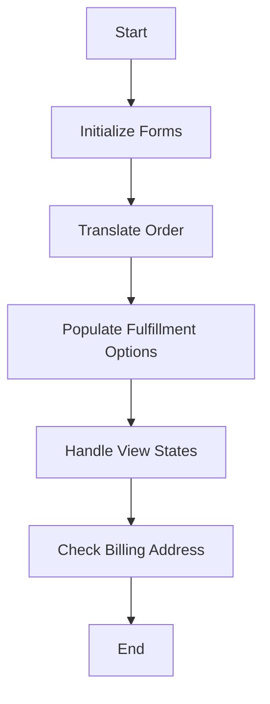

This document will cover the process of populating model variables for the checkout page, which includes:

1. Initializing forms
2. Translating the order
3. Populating fulfillment options
4. Handling view states
5. Checking the billing address.

Technical document: <SwmLink doc-title="Populating Model Variables for Checkout">[Populating Model Variables for Checkout](/.swm/populating-model-variables-for-checkout.odpnkj17.sw.md)</SwmLink>

# [Initializing Forms](https://app.swimm.io/repos/Z2l0aHViJTNBJTNBQnJvYWRsZWFmQ29tbWVyY2UtZGVtby1uZXclM0ElM0FTd2ltbS1EZW1v/docs/odpnkj17#populatemodelvariables)

The process begins by initializing various forms required for the checkout page. These forms include the Order Information Form, Shipping Information Form, and Billing Information Form. These forms are pre-populated with data from the current cart to ensure that the user sees their existing information, which enhances the user experience by reducing the need for repetitive data entry.

# [Translating the Order](https://app.swimm.io/repos/Z2l0aHViJTNBJTNBQnJvYWRsZWFmQ29tbWVyY2UtZGVtby1uZXclM0ElM0FTd2ltbS1EZW1v/docs/odpnkj17#translateorder)

Next, the order is translated into a Payment Request. This involves converting the order details into a format that can be used for payment processing. The Payment Request includes information such as the order ID, currency, customer details, shipping and billing addresses, totals, and line items. This step ensures that all necessary payment information is accurately captured and ready for processing.

# [Populating Fulfillment Options](https://app.swimm.io/repos/Z2l0aHViJTNBJTNBQnJvYWRsZWFmQ29tbWVyY2UtZGVtby1uZXclM0ElM0FTd2ltbS1EZW1v/docs/odpnkj17#populatefulfillmentoptionsandestimationonmodel)

The next step involves retrieving and estimating fulfillment options for the order. This includes gathering all available fulfillment options and estimating the cost of applying these options to the order. This information is then added to the model variables, allowing the user to see and select their preferred fulfillment option during checkout.

# [Handling View States](https://app.swimm.io/repos/Z2l0aHViJTNBJTNBQnJvYWRsZWFmQ29tbWVyY2UtZGVtby1uZXclM0ElM0FTd2ltbS1EZW1v/docs/odpnkj17#populatesectionviewstates)

The view states for different sections of the checkout page are then populated. This involves determining the state of various sections (order info, billing, shipping, payment) based on the current cart state. The visibility and state transitions of these sections are managed to ensure a smooth and intuitive user experience. For example, the billing section may be hidden if the order payment does not require an address.

# [Checking the Billing Address](https://app.swimm.io/repos/Z2l0aHViJTNBJTNBQnJvYWRsZWFmQ29tbWVyY2UtZGVtby1uZXclM0ElM0FTd2ltbS1EZW1v/docs/odpnkj17#haspopulatedbillingaddress)

Finally, the system checks if the billing address is populated. This step ensures that the order has a valid billing address before proceeding with payment processing. If the billing address is missing or incomplete, the user will be prompted to provide the necessary information.

&nbsp;

*This is an auto-generated document by Swimm AI 🌊 and has not yet been verified by a human*

<SwmMeta version="3.0.0" repo-id="Z2l0aHViJTNBJTNBQnJvYWRsZWFmQ29tbWVyY2UtZGVtby1uZXclM0ElM0FTd2ltbS1EZW1v" repo-name="BroadleafCommerce-demo-new" doc-type="product-flows">Powered by [Swimm](/)</SwmMeta>
