In this document, we will explain the process of populating model variables required for rendering the checkout page. This involves initializing various forms, translating the order, populating fulfillment options, and handling view states.

The flow starts by initializing forms like order, shipping, and billing information. Then, it translates the order into a payment request. After that, it retrieves and estimates fulfillment options. Finally, it populates the view states for different sections of the checkout page and checks if the billing address is populated.

# Flow drill down

```mermaid
graph TD;
      subgraph core/broadleaf-framework-web/src/main/java/org/broadleafcommerce/core/web
a290391198fbf5ec9cf5b7dbef3027e3977675cad65ab6be859d5be30bbd03a9(populateModelVariables):::mainFlowStyle --> 4947c7d268006872e462ab8358234597f1d8e5cc6089a0d09cb110361bdc80e8(populateFulfillmentOptionsAndEstimationOnModel)
end

subgraph core/broadleaf-framework/src/main/java/org/broadleafcommerce/core
a290391198fbf5ec9cf5b7dbef3027e3977675cad65ab6be859d5be30bbd03a9(populateModelVariables):::mainFlowStyle --> 28013cf276395b82b6a372cd971a81f096296e53bf7518d50aad12696fc34ce0(translateOrder)
end

subgraph core/broadleaf-framework-web/src/main/java/org/broadleafcommerce/core/web
a290391198fbf5ec9cf5b7dbef3027e3977675cad65ab6be859d5be30bbd03a9(populateModelVariables):::mainFlowStyle --> 72186cbd844fc532c239a7cc0601b9de0a44f46f80f5c4c6f983f6ac16929f42(populateSectionViewStates):::mainFlowStyle
end

subgraph core/broadleaf-framework-web/src/main/java/org/broadleafcommerce/core/web
72186cbd844fc532c239a7cc0601b9de0a44f46f80f5c4c6f983f6ac16929f42(populateSectionViewStates):::mainFlowStyle --> b830bb0bbd5cb093b9b57d25a10647301e955f7ed09f8c9eafb71b460ddd85b5(hasPopulatedBillingAddress):::mainFlowStyle
end

subgraph core/broadleaf-framework/src/main/java/org/broadleafcommerce/core
4947c7d268006872e462ab8358234597f1d8e5cc6089a0d09cb110361bdc80e8(populateFulfillmentOptionsAndEstimationOnModel) --> c122da6a7a916809e76f4e9908f55f7a5195ff3b457f93f1b241a989a20fa9ac(addAll)
end

subgraph core/broadleaf-framework-web/src/main/java/org/broadleafcommerce/core/web
b830bb0bbd5cb093b9b57d25a10647301e955f7ed09f8c9eafb71b460ddd85b5(hasPopulatedBillingAddress):::mainFlowStyle --> 9bda6f0e0ca2a5adc75dfe8da8bef6467536c9b07fce34017d89668d1aae755f(cartHasPopulatedBillingAddress):::mainFlowStyle
end


      classDef mainFlowStyle color:#000000,fill:#7CB9F4
classDef rootsStyle color:#000000,fill:#00FFF4
classDef Style1 color:#000000,fill:#00FFAA
classDef Style2 color:#000000,fill:#FFFF00
classDef Style3 color:#000000,fill:#AA7CB9

%% Swimm:
%% graph TD;
%%       subgraph <SwmPath>[core/broadleaf-framework-web/src/main/java/org/broadleafcommerce/core/web/](core/broadleaf-framework-web/src/main/java/org/broadleafcommerce/core/web/)</SwmPath>
%% a290391198fbf5ec9cf5b7dbef3027e3977675cad65ab6be859d5be30bbd03a9(populateModelVariables):::mainFlowStyle --> 4947c7d268006872e462ab8358234597f1d8e5cc6089a0d09cb110361bdc80e8(populateFulfillmentOptionsAndEstimationOnModel)
%% end
%% 
%% subgraph <SwmPath>[core/broadleaf-framework/src/main/java/org/broadleafcommerce/core/](core/broadleaf-framework/src/main/java/org/broadleafcommerce/core/)</SwmPath>
%% a290391198fbf5ec9cf5b7dbef3027e3977675cad65ab6be859d5be30bbd03a9(populateModelVariables):::mainFlowStyle --> 28013cf276395b82b6a372cd971a81f096296e53bf7518d50aad12696fc34ce0(translateOrder)
%% end
%% 
%% subgraph <SwmPath>[core/broadleaf-framework-web/src/main/java/org/broadleafcommerce/core/web/](core/broadleaf-framework-web/src/main/java/org/broadleafcommerce/core/web/)</SwmPath>
%% a290391198fbf5ec9cf5b7dbef3027e3977675cad65ab6be859d5be30bbd03a9(populateModelVariables):::mainFlowStyle --> 72186cbd844fc532c239a7cc0601b9de0a44f46f80f5c4c6f983f6ac16929f42(populateSectionViewStates):::mainFlowStyle
%% end
%% 
%% subgraph <SwmPath>[core/broadleaf-framework-web/src/main/java/org/broadleafcommerce/core/web/](core/broadleaf-framework-web/src/main/java/org/broadleafcommerce/core/web/)</SwmPath>
%% 72186cbd844fc532c239a7cc0601b9de0a44f46f80f5c4c6f983f6ac16929f42(populateSectionViewStates):::mainFlowStyle --> b830bb0bbd5cb093b9b57d25a10647301e955f7ed09f8c9eafb71b460ddd85b5(hasPopulatedBillingAddress):::mainFlowStyle
%% end
%% 
%% subgraph <SwmPath>[core/broadleaf-framework/src/main/java/org/broadleafcommerce/core/](core/broadleaf-framework/src/main/java/org/broadleafcommerce/core/)</SwmPath>
%% 4947c7d268006872e462ab8358234597f1d8e5cc6089a0d09cb110361bdc80e8(populateFulfillmentOptionsAndEstimationOnModel) --> c122da6a7a916809e76f4e9908f55f7a5195ff3b457f93f1b241a989a20fa9ac(addAll)
%% end
%% 
%% subgraph <SwmPath>[core/broadleaf-framework-web/src/main/java/org/broadleafcommerce/core/web/](core/broadleaf-framework-web/src/main/java/org/broadleafcommerce/core/web/)</SwmPath>
%% b830bb0bbd5cb093b9b57d25a10647301e955f7ed09f8c9eafb71b460ddd85b5(hasPopulatedBillingAddress):::mainFlowStyle --> 9bda6f0e0ca2a5adc75dfe8da8bef6467536c9b07fce34017d89668d1aae755f(cartHasPopulatedBillingAddress):::mainFlowStyle
%% end
%% 
%% 
%%       classDef mainFlowStyle color:#000000,fill:#7CB9F4
%% classDef rootsStyle color:#000000,fill:#00FFF4
%% classDef Style1 color:#000000,fill:#00FFAA
%% classDef Style2 color:#000000,fill:#FFFF00
%% classDef Style3 color:#000000,fill:#AA7CB9
```



<SwmSnippet path="/core/broadleaf-framework-web/src/main/java/org/broadleafcommerce/core/web/processor/OnePageCheckoutProcessor.java" line="135">

---

## <SwmToken path="core/broadleaf-framework-web/src/main/java/org/broadleafcommerce/core/web/processor/OnePageCheckoutProcessor.java" pos="136:11:11" line-data="    public Map&lt;String, Object&gt; populateModelVariables(String tagName, Map&lt;String, String&gt; tagAttributes, BroadleafTemplateContext context) {">`populateModelVariables`</SwmToken>

The <SwmToken path="core/broadleaf-framework-web/src/main/java/org/broadleafcommerce/core/web/processor/OnePageCheckoutProcessor.java" pos="136:11:11" line-data="    public Map&lt;String, Object&gt; populateModelVariables(String tagName, Map&lt;String, String&gt; tagAttributes, BroadleafTemplateContext context) {">`populateModelVariables`</SwmToken> method is responsible for initializing and populating various model attributes required for rendering the checkout page. It starts by pre-populating command objects such as <SwmToken path="core/broadleaf-framework-web/src/main/java/org/broadleafcommerce/core/web/processor/OnePageCheckoutProcessor.java" pos="138:1:1" line-data="        OrderInfoForm orderInfoForm = context.parseExpression(tagAttributes.get(&quot;orderInfoForm&quot;));">`OrderInfoForm`</SwmToken>, <SwmToken path="core/broadleaf-framework-web/src/main/java/org/broadleafcommerce/core/web/processor/OnePageCheckoutProcessor.java" pos="140:1:1" line-data="        ShippingInfoForm shippingInfoForm = context.parseExpression(tagAttributes.get(&quot;shippingInfoForm&quot;));">`ShippingInfoForm`</SwmToken>, and <SwmToken path="core/broadleaf-framework-web/src/main/java/org/broadleafcommerce/core/web/processor/OnePageCheckoutProcessor.java" pos="142:1:1" line-data="        BillingInfoForm billingInfoForm = context.parseExpression(tagAttributes.get(&quot;billingInfoForm&quot;));">`BillingInfoForm`</SwmToken> using the <SwmToken path="core/broadleaf-framework-web/src/main/java/org/broadleafcommerce/core/web/processor/OnePageCheckoutProcessor.java" pos="138:7:9" line-data="        OrderInfoForm orderInfoForm = context.parseExpression(tagAttributes.get(&quot;orderInfoForm&quot;));">`context.parseExpression`</SwmToken> method. It then calls <SwmToken path="core/broadleaf-framework-web/src/main/java/org/broadleafcommerce/core/web/processor/OnePageCheckoutProcessor.java" pos="150:1:1" line-data="        prepopulateCheckoutForms(CartState.getCart(), orderInfoForm, shippingInfoForm, billingInfoForm);">`prepopulateCheckoutForms`</SwmToken> to fill these forms with data from the current cart. The method also translates the order into a <SwmToken path="core/broadleaf-framework-web/src/main/java/org/broadleafcommerce/core/web/processor/OnePageCheckoutProcessor.java" pos="152:4:4" line-data="        //Add PaymentRequestDTO to the model in the case of errors or other cases">`PaymentRequestDTO`</SwmToken> if the cart is not null, initializes fulfillment group variables, and populates view states and dropdown lists for states, countries, expiration months, and years. Finally, it handles any payment processing errors and returns the populated model variables.

```java
    @Override
    public Map<String, Object> populateModelVariables(String tagName, Map<String, String> tagAttributes, BroadleafTemplateContext context) {
        //Pre-populate the command objects
        OrderInfoForm orderInfoForm = context.parseExpression(tagAttributes.get("orderInfoForm"));

        ShippingInfoForm shippingInfoForm = context.parseExpression(tagAttributes.get("shippingInfoForm"));

        BillingInfoForm billingInfoForm = context.parseExpression(tagAttributes.get("billingInfoForm"));

        String orderInfoHelpMessage = context.parseExpression(tagAttributes.get("orderInfoHelpMessage"));

        String billingInfoHelpMessage = context.parseExpression(tagAttributes.get("billingInfoHelpMessage"));

        String shippingInfoHelpMessage = context.parseExpression(tagAttributes.get("shippingInfoHelpMessage"));

        prepopulateCheckoutForms(CartState.getCart(), orderInfoForm, shippingInfoForm, billingInfoForm);

        //Add PaymentRequestDTO to the model in the case of errors or other cases
        Map<String, Object> newModelVars = new HashMap<>();
        Order cart = CartState.getCart();
        if (cart != null && !(cart instanceof NullOrderImpl)) {
```

---

</SwmSnippet>

<SwmSnippet path="/core/broadleaf-framework-web/src/main/java/org/broadleafcommerce/core/web/processor/OnePageCheckoutProcessor.java" line="379">

---

### <SwmToken path="core/broadleaf-framework-web/src/main/java/org/broadleafcommerce/core/web/processor/OnePageCheckoutProcessor.java" pos="384:5:5" line-data="    protected void populateFulfillmentOptionsAndEstimationOnModel(Map&lt;String, Object&gt; localVars) {">`populateFulfillmentOptionsAndEstimationOnModel`</SwmToken>

The <SwmToken path="core/broadleaf-framework-web/src/main/java/org/broadleafcommerce/core/web/processor/OnePageCheckoutProcessor.java" pos="384:5:5" line-data="    protected void populateFulfillmentOptionsAndEstimationOnModel(Map&lt;String, Object&gt; localVars) {">`populateFulfillmentOptionsAndEstimationOnModel`</SwmToken> method retrieves all fulfillment options for the cart and estimates the cost of applying these options to the first shippable fulfillment group. It adds the fulfillment options and the estimation response to the local variables map.

```java
    /**
     * A helper method to retrieve all fulfillment options for the cart and estimate the cost of applying
     * fulfillment options on the first shippable fulfillment group.
     *
     */
    protected void populateFulfillmentOptionsAndEstimationOnModel(Map<String, Object> localVars) {
        List<FulfillmentOption> fulfillmentOptions = fulfillmentOptionService.readAllFulfillmentOptions();
        Order cart = CartState.getCart();

        if (!(cart instanceof NullOrderImpl) && cart.getFulfillmentGroups().size() > 0 && hasPopulatedShippingAddress(cart)) {
            Set<FulfillmentOption> options = new HashSet<>();
            options.addAll(fulfillmentOptions);
            FulfillmentEstimationResponse estimateResponse = null;
            try {
                estimateResponse = fulfillmentPricingService.estimateCostForFulfillmentGroup(fulfillmentGroupService.getFirstShippableFulfillmentGroup(cart), options);
            } catch (FulfillmentPriceException e) {

            }

            localVars.put("estimateResponse", estimateResponse);
        }
```

---

</SwmSnippet>

<SwmSnippet path="/core/broadleaf-framework/src/main/java/org/broadleafcommerce/core/payment/service/OrderToPaymentRequestDTOServiceImpl.java" line="72">

---

### <SwmToken path="core/broadleaf-framework/src/main/java/org/broadleafcommerce/core/payment/service/OrderToPaymentRequestDTOServiceImpl.java" pos="73:5:5" line-data="    public PaymentRequestDTO translateOrder(Order order) {">`translateOrder`</SwmToken>

The <SwmToken path="core/broadleaf-framework/src/main/java/org/broadleafcommerce/core/payment/service/OrderToPaymentRequestDTOServiceImpl.java" pos="73:5:5" line-data="    public PaymentRequestDTO translateOrder(Order order) {">`translateOrder`</SwmToken> method converts an <SwmToken path="core/broadleaf-framework/src/main/java/org/broadleafcommerce/core/payment/service/OrderToPaymentRequestDTOServiceImpl.java" pos="73:7:7" line-data="    public PaymentRequestDTO translateOrder(Order order) {">`Order`</SwmToken> object into a <SwmToken path="core/broadleaf-framework/src/main/java/org/broadleafcommerce/core/payment/service/OrderToPaymentRequestDTOServiceImpl.java" pos="73:3:3" line-data="    public PaymentRequestDTO translateOrder(Order order) {">`PaymentRequestDTO`</SwmToken>. It populates the DTO with order details such as ID, currency, customer info, shipping and billing addresses, totals, and line items.

```java
    @Override
    public PaymentRequestDTO translateOrder(Order order) {
        if (order != null && !(order instanceof NullOrderImpl)) {
            final Long id = order.getId();
            final BroadleafCurrency currency = order.getCurrency();
            PaymentRequestDTO requestDTO = new PaymentRequestDTO().orderId(id.toString());
            
            if (LOG.isTraceEnabled()) {
                LOG.trace(String.format("Translating Order (ID:%s) into a PaymentRequestDTO for the configured " + 
                                        "gateway.", id));
            }
            
            if (currency != null) {
                requestDTO.orderCurrencyCode(currency.getCurrencyCode());
            }

            populateCustomerInfo(order, requestDTO);
            populateShipTo(order, requestDTO);
            populateBillTo(order, requestDTO);
            populateTotals(order, requestDTO);
            populateDefaultLineItemsAndSubtotal(order, requestDTO);
```

---

</SwmSnippet>

<SwmSnippet path="/core/broadleaf-framework-web/src/main/java/org/broadleafcommerce/core/web/processor/OnePageCheckoutProcessor.java" line="215">

---

### <SwmToken path="core/broadleaf-framework-web/src/main/java/org/broadleafcommerce/core/web/processor/OnePageCheckoutProcessor.java" pos="222:5:5" line-data="    protected void populateSectionViewStates(Map&lt;String, Object&gt; localVars) {">`populateSectionViewStates`</SwmToken>

The <SwmToken path="core/broadleaf-framework-web/src/main/java/org/broadleafcommerce/core/web/processor/OnePageCheckoutProcessor.java" pos="222:5:5" line-data="    protected void populateSectionViewStates(Map&lt;String, Object&gt; localVars) {">`populateSectionViewStates`</SwmToken> method populates variables necessary for rendering the checkout page sections. It determines the state of various sections (order info, billing, shipping, payment) based on the current cart state and adds these states to the local variables map. It also handles the visibility and state transitions of these sections based on the order's details and any errors encountered during payment processing.

```java
    /**
     * This method is responsible of populating the variables necessary to draw the checkout page.
     * This logic is highly dependent on your layout. If your layout does not follow the same flow
     * as the HeatClinic demo, you will need to override with your own custom layout implementation
     *
     * @param localVars
     */
    protected void populateSectionViewStates(Map<String, Object> localVars) {
        boolean orderInfoPopulated = hasPopulatedOrderInfo(CartState.getCart());
        boolean billingPopulated = hasPopulatedBillingAddress(CartState.getCart());
        boolean shippingPopulated = hasPopulatedShippingAddress(CartState.getCart());

        localVars.put("orderInfoPopulated", orderInfoPopulated);
        localVars.put("billingPopulated", billingPopulated);
        localVars.put("shippingPopulated", shippingPopulated);

        //Logic to show/hide sections based on state of the order
        // show all sections including header unless specifically hidden
        // (e.g. hide shipping if no shippable items in order or hide billing section if the order payment doesn't need
        // an address i.e. PayPal Express)
        boolean showBillingInfoSection = true;
```

---

</SwmSnippet>

<SwmSnippet path="/core/broadleaf-framework-web/src/main/java/org/broadleafcommerce/core/web/processor/OnePageCheckoutProcessor.java" line="414">

---

### <SwmToken path="core/broadleaf-framework-web/src/main/java/org/broadleafcommerce/core/web/processor/OnePageCheckoutProcessor.java" pos="420:5:5" line-data="    protected boolean hasPopulatedBillingAddress(Order cart) {">`hasPopulatedBillingAddress`</SwmToken>

The <SwmToken path="core/broadleaf-framework-web/src/main/java/org/broadleafcommerce/core/web/processor/OnePageCheckoutProcessor.java" pos="420:5:5" line-data="    protected boolean hasPopulatedBillingAddress(Order cart) {">`hasPopulatedBillingAddress`</SwmToken> method checks if the current cart has a populated billing address by delegating to the <SwmToken path="core/broadleaf-framework-web/src/main/java/org/broadleafcommerce/core/web/processor/OnePageCheckoutProcessor.java" pos="421:5:5" line-data="        return cartStateService.cartHasPopulatedBillingAddress();">`cartHasPopulatedBillingAddress`</SwmToken> method of the <SwmToken path="core/broadleaf-framework-web/src/main/java/org/broadleafcommerce/core/web/processor/OnePageCheckoutProcessor.java" pos="421:3:3" line-data="        return cartStateService.cartHasPopulatedBillingAddress();">`cartStateService`</SwmToken>.

```java
    /**
     * A helper method used to determine the validity of the payments on the Order
     *
     * @param cart
     * @return boolean indicating whether or not the CREDIT_CARD order payment on the order has an address
     */
    protected boolean hasPopulatedBillingAddress(Order cart) {
        return cartStateService.cartHasPopulatedBillingAddress();
    }
```

---

</SwmSnippet>

<SwmSnippet path="/core/broadleaf-framework/src/main/java/org/broadleafcommerce/core/util/queue/ZookeeperDistributedQueue.java" line="307">

---

### <SwmToken path="core/broadleaf-framework/src/main/java/org/broadleafcommerce/core/util/queue/ZookeeperDistributedQueue.java" pos="308:5:5" line-data="    public boolean addAll(Collection&lt;? extends T&gt; c) {">`addAll`</SwmToken>

The <SwmToken path="core/broadleaf-framework/src/main/java/org/broadleafcommerce/core/util/queue/ZookeeperDistributedQueue.java" pos="308:5:5" line-data="    public boolean addAll(Collection&lt;? extends T&gt; c) {">`addAll`</SwmToken> method adds a collection of items to the Zookeeper distributed queue. It returns true if all items were successfully added, and false otherwise.

```java
    @Override
    public boolean addAll(Collection<? extends T> c) {
        if (c == null || c.isEmpty()) {
            return false;
        }
        try {
            int count = writeToQueue(new ArrayList<>(c), -1L);
            return count == c.size();
        } catch (InterruptedException e) {
            return false;
        }
        
    }
```

---

</SwmSnippet>

<SwmSnippet path="/core/broadleaf-framework-web/src/main/java/org/broadleafcommerce/core/web/order/service/CartStateServiceImpl.java" line="57">

---

### <SwmToken path="core/broadleaf-framework-web/src/main/java/org/broadleafcommerce/core/web/order/service/CartStateServiceImpl.java" pos="58:5:5" line-data="    public boolean cartHasPopulatedBillingAddress() {">`cartHasPopulatedBillingAddress`</SwmToken>

The <SwmToken path="core/broadleaf-framework-web/src/main/java/org/broadleafcommerce/core/web/order/service/CartStateServiceImpl.java" pos="58:5:5" line-data="    public boolean cartHasPopulatedBillingAddress() {">`cartHasPopulatedBillingAddress`</SwmToken> method checks if the current cart has any active credit card payments with a populated billing address. It iterates through the cart's payments and returns true if such a payment is found, and false otherwise.

```java
    @Override
    public boolean cartHasPopulatedBillingAddress() {
        Order cart = CartState.getCart();

        List<OrderPayment> orderPayments = orderPaymentService.readPaymentsForOrder(cart);
        for (OrderPayment payment : CollectionUtils.emptyIfNull(orderPayments)) {
            boolean isCreditCardPayment = payment.getType().isCreditCardType();
            boolean paymentHasBillingAddress = (payment.getBillingAddress() != null);

            if (payment.isActive() && isCreditCardPayment && paymentHasBillingAddress) {
                return true;
            }
        }
        return false;
    }
```

---

</SwmSnippet>

&nbsp;

*This is an auto-generated document by Swimm AI 🌊 and has not yet been verified by a human*

<SwmMeta version="3.0.0" repo-id="Z2l0aHViJTNBJTNBQnJvYWRsZWFmQ29tbWVyY2UtZGVtby1uZXclM0ElM0FTd2ltbS1EZW1v" repo-name="BroadleafCommerce-demo-new" doc-type="flows"><sup>Powered by [Swimm](/)</sup></SwmMeta>
