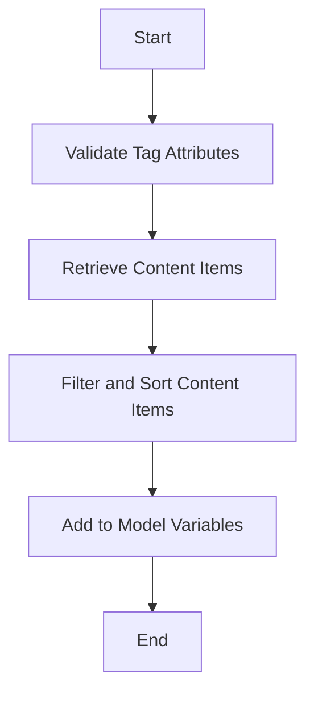

This document will cover the process of populating model variables with content items. We'll cover:

1. Validating tag attributes
2. Retrieving content items
3. Filtering and sorting content items
4. Adding content items to model variables.

Technical document: <SwmLink doc-title="Populating Model Variables Flow">[Populating Model Variables Flow](/.swm/populating-model-variables-flow.51x7t0k9.sw.md)</SwmLink>

# [Validating Tag Attributes](https://app.swimm.io/repos/Z2l0aHViJTNBJTNBQnJvYWRsZWFmQ29tbWVyY2UtZGVtby1uZXclM0ElM0FTd2ltbS1EZW1v/docs/51x7t0k9#populatemodelvariables)

The process begins by ensuring that the necessary tag attributes are present. Specifically, it checks for the presence of either 'contentType' or 'contentName'. If neither is provided, an error is raised. This step ensures that the system has enough information to proceed with retrieving the appropriate content items.

# [Retrieving Content Items](https://app.swimm.io/repos/Z2l0aHViJTNBJTNBQnJvYWRsZWFmQ29tbWVyY2UtZGVtby1uZXclM0ElM0FTd2ltbS1EZW1v/docs/51x7t0k9#getcontentitems)

Once the tag attributes are validated, the system retrieves the content items based on the provided 'contentType' or 'contentName'. This involves querying the content management system to fetch the relevant items. The retrieval process ensures that the content items are fetched according to the specified criteria, such as locale and security settings.

# [Filtering and Sorting Content Items](https://app.swimm.io/repos/Z2l0aHViJTNBJTNBQnJvYWRsZWFmQ29tbWVyY2UtZGVtby1uZXclM0ElM0FTd2ltbS1EZW1v/docs/51x7t0k9#evaluateandpriortizecontent)

After retrieving the content items, the system filters and sorts them based on predefined rules and priorities. This step ensures that only the most relevant content items are selected and that they are ordered according to their priority. The filtering process may involve evaluating content rules and shuffling items with the same priority to ensure a diverse selection.

# [Adding Content Items to Model Variables](https://app.swimm.io/repos/Z2l0aHViJTNBJTNBQnJvYWRsZWFmQ29tbWVyY2UtZGVtby1uZXclM0ElM0FTd2ltbS1EZW1v/docs/51x7t0k9#populatemodelvariables)

Finally, the filtered and sorted content items are added to the model variables. This step involves mapping the content items to the appropriate model variables, which are then used to render the content on the website. The system also handles any additional fields or deep links specified in the tag attributes, ensuring that the model variables are fully populated with all necessary information.

&nbsp;

*This is an auto-generated document by Swimm AI 🌊 and has not yet been verified by a human*

<SwmMeta version="3.0.0" repo-id="Z2l0aHViJTNBJTNBQnJvYWRsZWFmQ29tbWVyY2UtZGVtby1uZXclM0ElM0FTd2ltbS1EZW1v" repo-name="BroadleafCommerce-demo-new" doc-type="product-flows">Powered by [Swimm](/)</SwmMeta>
