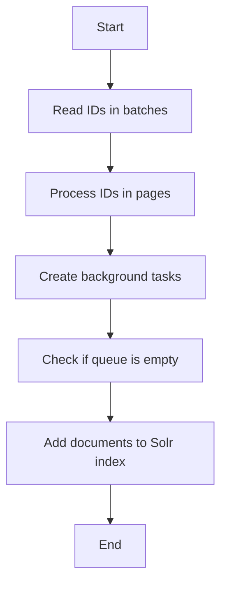

This document will cover the process of populating the Solr index, which includes:

1. Reading IDs in batches
2. Processing IDs in pages
3. Creating background tasks for indexing
4. Checking if the queue is empty
5. Adding documents to the Solr index incrementally.

Technical document: <SwmLink doc-title="Populating the Solr Index">[Populating the Solr Index](/.swm/populating-the-solr-index.umpfgefw.sw.md)</SwmLink>

# [Reading IDs in batches](https://app.swimm.io/repos/Z2l0aHViJTNBJTNBQnJvYWRsZWFmQ29tbWVyY2UtZGVtby1uZXclM0ElM0FTd2ltbS1EZW1v/docs/umpfgefw#reading-ids-in-batches)

The process begins by reading IDs in batches. This approach helps in managing large datasets by breaking them into smaller, more manageable chunks. For example, if there are 10,000 products to index, they might be read in batches of 1,000 IDs at a time. This ensures that the system does not get overwhelmed by trying to process too many items at once.

# [Processing IDs in pages](https://app.swimm.io/repos/Z2l0aHViJTNBJTNBQnJvYWRsZWFmQ29tbWVyY2UtZGVtby1uZXclM0ElM0FTd2ltbS1EZW1v/docs/umpfgefw#processing-ids-in-pages)

Once the IDs are read in batches, they are further processed in smaller pages. This step involves dividing each batch into even smaller subsets, known as pages. For instance, a batch of 1,000 IDs might be divided into pages of 100 IDs each. This further breakdown helps in efficiently managing the indexing process and ensures that each page can be processed independently.

# [Creating background tasks for indexing](https://app.swimm.io/repos/Z2l0aHViJTNBJTNBQnJvYWRsZWFmQ29tbWVyY2UtZGVtby1uZXclM0ElM0FTd2ltbS1EZW1v/docs/umpfgefw#creating-background-tasks)

To handle the indexing process concurrently, background tasks are created for each page of IDs. These tasks are executed by a background operation executor, allowing multiple pages to be indexed simultaneously. This concurrent processing significantly speeds up the indexing process and ensures that the system can handle large volumes of data efficiently.

# [Checking if the queue is empty](https://app.swimm.io/repos/Z2l0aHViJTNBJTNBQnJvYWRsZWFmQ29tbWVyY2UtZGVtby1uZXclM0ElM0FTd2ltbS1EZW1v/docs/umpfgefw#checking-if-the-queue-is-empty)

During the indexing process, it is essential to check if the queue is empty. The queue holds the tasks that need to be processed, and checking its status ensures that the system can manage the flow of tasks effectively. If the queue is empty, it indicates that all tasks have been processed, and the system can proceed to the next steps.

# [Adding documents to the Solr index incrementally](https://app.swimm.io/repos/Z2l0aHViJTNBJTNBQnJvYWRsZWFmQ29tbWVyY2UtZGVtby1uZXclM0ElM0FTd2ltbS1EZW1v/docs/umpfgefw#adding-documents-to-the-index)

Finally, the documents are added to the Solr index incrementally. This means that the documents are added in small batches rather than all at once. This approach allows for incremental updates to the index, ensuring that the system remains responsive and can handle updates efficiently. By not issuing a commit immediately, the system can continue to add documents without interrupting the indexing process.

&nbsp;

*This is an auto-generated document by Swimm AI 🌊 and has not yet been verified by a human*

<SwmMeta version="3.0.0" repo-id="Z2l0aHViJTNBJTNBQnJvYWRsZWFmQ29tbWVyY2UtZGVtby1uZXclM0ElM0FTd2ltbS1EZW1v" repo-name="BroadleafCommerce-demo-new" doc-type="product-flows">Powered by [Swimm](/)</SwmMeta>
