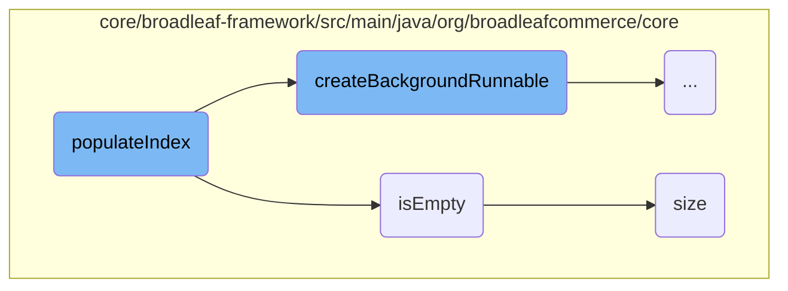
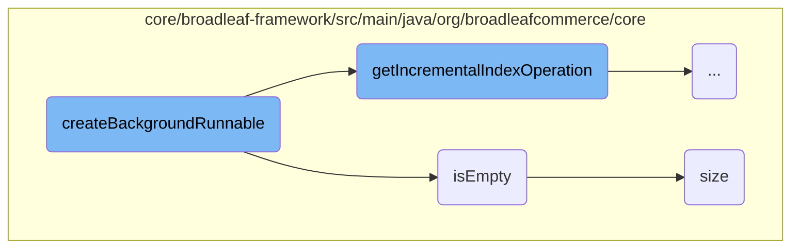
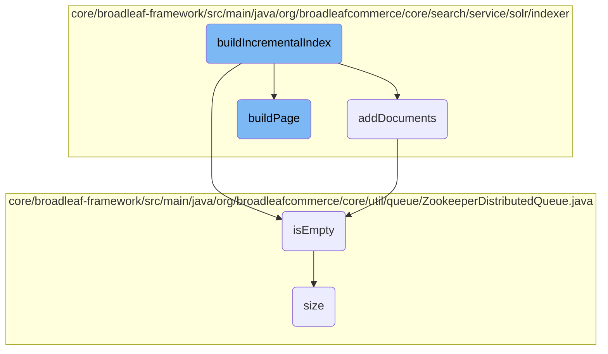

```mermaid
graph TD;
      subgraph core/broadleaf-framework/src/main/java/org/broadleafcommerce/core
afc6651ff84e8eed07182d713adc0ed928dac3c5bf5f589b5465c929cec8f9fa(getIncrementalIndexOperation):::mainFlowStyle --> 7b25f3f85ecff3ef4c477d55bdaf6245f932b99dac9240a6ca0e082156c7b5ab(readProductsByIds)
end

subgraph core/broadleaf-framework/src/main/java/org/broadleafcommerce/core
afc6651ff84e8eed07182d713adc0ed928dac3c5bf5f589b5465c929cec8f9fa(getIncrementalIndexOperation):::mainFlowStyle --> 4331fd01dfb4a22e213f494a8c577e2dd8377d94c2e1f2743e89a93b225e3a1a(buildIncrementalIndex):::mainFlowStyle
end

subgraph core/broadleaf-framework/src/main/java/org/broadleafcommerce/core
4331fd01dfb4a22e213f494a8c577e2dd8377d94c2e1f2743e89a93b225e3a1a(buildIncrementalIndex):::mainFlowStyle --> sx8ik(...)
end

subgraph core/broadleaf-framework/src/main/java/org/broadleafcommerce/core
7b25f3f85ecff3ef4c477d55bdaf6245f932b99dac9240a6ca0e082156c7b5ab(readProductsByIds) --> aa8cdbe4a9d4c527322ee913c1e765a2f4378a597904b96c93633a5c88b90652(isEmpty)
end

subgraph core/broadleaf-framework/src/main/java/org/broadleafcommerce/core
aa8cdbe4a9d4c527322ee913c1e765a2f4378a597904b96c93633a5c88b90652(isEmpty) --> 119ea4bdd418642aef64f4a0f0ef8ac202542484f7b9e99f671004c0887e4e26(size)
end


      classDef mainFlowStyle color:#000000,fill:#7CB9F4
classDef rootsStyle color:#000000,fill:#00FFF4
classDef Style1 color:#000000,fill:#00FFAA
classDef Style2 color:#000000,fill:#FFFF00
classDef Style3 color:#000000,fill:#AA7CB9

%% Swimm:
%% graph TD;
%%       subgraph <SwmPath>[core/broadleaf-framework/src/main/java/org/broadleafcommerce/core/](core/broadleaf-framework/src/main/java/org/broadleafcommerce/core/)</SwmPath>
%% afc6651ff84e8eed07182d713adc0ed928dac3c5bf5f589b5465c929cec8f9fa(getIncrementalIndexOperation):::mainFlowStyle --> 7b25f3f85ecff3ef4c477d55bdaf6245f932b99dac9240a6ca0e082156c7b5ab(readProductsByIds)
%% end
%% 
%% subgraph <SwmPath>[core/broadleaf-framework/src/main/java/org/broadleafcommerce/core/](core/broadleaf-framework/src/main/java/org/broadleafcommerce/core/)</SwmPath>
%% afc6651ff84e8eed07182d713adc0ed928dac3c5bf5f589b5465c929cec8f9fa(getIncrementalIndexOperation):::mainFlowStyle --> 4331fd01dfb4a22e213f494a8c577e2dd8377d94c2e1f2743e89a93b225e3a1a(buildIncrementalIndex):::mainFlowStyle
%% end
%% 
%% subgraph <SwmPath>[core/broadleaf-framework/src/main/java/org/broadleafcommerce/core/](core/broadleaf-framework/src/main/java/org/broadleafcommerce/core/)</SwmPath>
%% 4331fd01dfb4a22e213f494a8c577e2dd8377d94c2e1f2743e89a93b225e3a1a(buildIncrementalIndex):::mainFlowStyle --> sx8ik(...)
%% end
%% 
%% subgraph <SwmPath>[core/broadleaf-framework/src/main/java/org/broadleafcommerce/core/](core/broadleaf-framework/src/main/java/org/broadleafcommerce/core/)</SwmPath>
%% 7b25f3f85ecff3ef4c477d55bdaf6245f932b99dac9240a6ca0e082156c7b5ab(readProductsByIds) --> aa8cdbe4a9d4c527322ee913c1e765a2f4378a597904b96c93633a5c88b90652(isEmpty)
%% end
%% 
%% subgraph <SwmPath>[core/broadleaf-framework/src/main/java/org/broadleafcommerce/core/](core/broadleaf-framework/src/main/java/org/broadleafcommerce/core/)</SwmPath>
%% aa8cdbe4a9d4c527322ee913c1e765a2f4378a597904b96c93633a5c88b90652(isEmpty) --> 119ea4bdd418642aef64f4a0f0ef8ac202542484f7b9e99f671004c0887e4e26(size)
%% end
%% 
%% 
%%       classDef mainFlowStyle color:#000000,fill:#7CB9F4
%% classDef rootsStyle color:#000000,fill:#00FFF4
%% classDef Style1 color:#000000,fill:#00FFAA
%% classDef Style2 color:#000000,fill:#FFFF00
%% classDef Style3 color:#000000,fill:#AA7CB9
```

This document explains the process of populating the Solr index. The <SwmToken path="core/broadleaf-framework/src/main/java/org/broadleafcommerce/core/search/service/solr/indexer/CatalogSolrIndexUpdateCommandHandlerImpl.java" pos="267:5:5" line-data="    protected void populateIndex(final ReindexStateHolder holder, final Long catalogId, final Long siteId, final SandBox sandbox) throws ServiceException {">`populateIndex`</SwmToken> method is responsible for efficiently managing and delegating tasks to ensure the Solr index is populated correctly. It involves reading <SwmToken path="core/broadleaf-framework/src/main/java/org/broadleafcommerce/core/search/service/solr/indexer/CatalogSolrIndexUpdateCommandHandlerImpl.java" pos="279:27:27" line-data="                //fewer round trips to the DB, especially since we&#39;re only reading IDs here.">`IDs`</SwmToken> in batches, processing them in pages, and creating background tasks to handle the indexing concurrently.

The process starts by reading <SwmToken path="core/broadleaf-framework/src/main/java/org/broadleafcommerce/core/search/service/solr/indexer/CatalogSolrIndexUpdateCommandHandlerImpl.java" pos="279:27:27" line-data="                //fewer round trips to the DB, especially since we&#39;re only reading IDs here.">`IDs`</SwmToken> in batches. These <SwmToken path="core/broadleaf-framework/src/main/java/org/broadleafcommerce/core/search/service/solr/indexer/CatalogSolrIndexUpdateCommandHandlerImpl.java" pos="279:27:27" line-data="                //fewer round trips to the DB, especially since we&#39;re only reading IDs here.">`IDs`</SwmToken> are then processed in smaller pages to make the task more manageable. Background tasks are created to handle the indexing of these pages concurrently, ensuring the process runs efficiently. The method also checks if the queue is empty and manages the size of the queue to ensure smooth operation. Finally, the documents are added to the Solr index without issuing a commit, allowing for incremental updates.

Here is a high level diagram of the flow, showing only the most important functions:

```mermaid
graph TD;
      subgraph core/broadleaf-framework/src/main/java/org/broadleafcommerce/core/util/queue/ZookeeperDistributedQueue.java
990718fcb7df7b20f3e4cc64dcd93fc0e9423bc9bb1b104da25dface064a49bc(populateIndex):::mainFlowStyle --> aa8cdbe4a9d4c527322ee913c1e765a2f4378a597904b96c93633a5c88b90652(isEmpty)
end

subgraph core/broadleaf-framework/src/main/java/org/broadleafcommerce/core/search/service/solr/indexer
990718fcb7df7b20f3e4cc64dcd93fc0e9423bc9bb1b104da25dface064a49bc(populateIndex):::mainFlowStyle --> 5c9d09b05f15ba3eec9b8f89a5af2c7a570c54ce4f82ea07014b00a88153f174(createBackgroundRunnable):::mainFlowStyle
end

subgraph core/broadleaf-framework/src/main/java/org/broadleafcommerce/core/util/queue/ZookeeperDistributedQueue.java
5c9d09b05f15ba3eec9b8f89a5af2c7a570c54ce4f82ea07014b00a88153f174(createBackgroundRunnable):::mainFlowStyle --> aa8cdbe4a9d4c527322ee913c1e765a2f4378a597904b96c93633a5c88b90652(isEmpty)
end

subgraph core/broadleaf-framework/src/main/java/org/broadleafcommerce/core/search/service/solr/indexer
5c9d09b05f15ba3eec9b8f89a5af2c7a570c54ce4f82ea07014b00a88153f174(createBackgroundRunnable):::mainFlowStyle --> afc6651ff84e8eed07182d713adc0ed928dac3c5bf5f589b5465c929cec8f9fa(getIncrementalIndexOperation):::mainFlowStyle
end

subgraph core/broadleaf-framework/src/main/java/org/broadleafcommerce/core/search/service/solr/indexer
afc6651ff84e8eed07182d713adc0ed928dac3c5bf5f589b5465c929cec8f9fa(getIncrementalIndexOperation):::mainFlowStyle --> 7b25f3f85ecff3ef4c477d55bdaf6245f932b99dac9240a6ca0e082156c7b5ab(readProductsByIds)
end

subgraph core/broadleaf-framework/src/main/java/org/broadleafcommerce/core/search/service/solr/indexer
afc6651ff84e8eed07182d713adc0ed928dac3c5bf5f589b5465c929cec8f9fa(getIncrementalIndexOperation):::mainFlowStyle --> 4331fd01dfb4a22e213f494a8c577e2dd8377d94c2e1f2743e89a93b225e3a1a(buildIncrementalIndex):::mainFlowStyle
end

subgraph core/broadleaf-framework/src/main/java/org/broadleafcommerce/core/search/service/solr/indexer
4331fd01dfb4a22e213f494a8c577e2dd8377d94c2e1f2743e89a93b225e3a1a(buildIncrementalIndex):::mainFlowStyle --> 22c20ec5d75059057c0c88edb471aac9a79972bf67cd157f6e088b6f0f2703ca(addDocuments)
end

subgraph core/broadleaf-framework/src/main/java/org/broadleafcommerce/core/util/queue/ZookeeperDistributedQueue.java
4331fd01dfb4a22e213f494a8c577e2dd8377d94c2e1f2743e89a93b225e3a1a(buildIncrementalIndex):::mainFlowStyle --> aa8cdbe4a9d4c527322ee913c1e765a2f4378a597904b96c93633a5c88b90652(isEmpty)
end

subgraph core/broadleaf-framework/src/main/java/org/broadleafcommerce/core/search/service/solr/indexer
4331fd01dfb4a22e213f494a8c577e2dd8377d94c2e1f2743e89a93b225e3a1a(buildIncrementalIndex):::mainFlowStyle --> 38dcee4123de2e835998e58620307f7dfb02466cd90544d5da8bd03ef16cfd8f(buildPage):::mainFlowStyle
end

subgraph core/broadleaf-framework/src/main/java/org/broadleafcommerce/core/util/queue/ZookeeperDistributedQueue.java
38dcee4123de2e835998e58620307f7dfb02466cd90544d5da8bd03ef16cfd8f(buildPage):::mainFlowStyle --> aa8cdbe4a9d4c527322ee913c1e765a2f4378a597904b96c93633a5c88b90652(isEmpty)
end


      classDef mainFlowStyle color:#000000,fill:#7CB9F4
classDef rootsStyle color:#000000,fill:#00FFF4
classDef Style1 color:#000000,fill:#00FFAA
classDef Style2 color:#000000,fill:#FFFF00
classDef Style3 color:#000000,fill:#AA7CB9

%% Swimm:
%% graph TD;
%%       subgraph <SwmPath>[core/broadleaf-framework/src/main/java/org/broadleafcommerce/core/util/queue/ZookeeperDistributedQueue.java](core/broadleaf-framework/src/main/java/org/broadleafcommerce/core/util/queue/ZookeeperDistributedQueue.java)</SwmPath>
%% 990718fcb7df7b20f3e4cc64dcd93fc0e9423bc9bb1b104da25dface064a49bc(populateIndex):::mainFlowStyle --> aa8cdbe4a9d4c527322ee913c1e765a2f4378a597904b96c93633a5c88b90652(isEmpty)
%% end
%% 
%% subgraph <SwmPath>[core/broadleaf-framework/src/main/java/org/broadleafcommerce/core/search/service/solr/indexer/](core/broadleaf-framework/src/main/java/org/broadleafcommerce/core/search/service/solr/indexer/)</SwmPath>
%% 990718fcb7df7b20f3e4cc64dcd93fc0e9423bc9bb1b104da25dface064a49bc(populateIndex):::mainFlowStyle --> 5c9d09b05f15ba3eec9b8f89a5af2c7a570c54ce4f82ea07014b00a88153f174(createBackgroundRunnable):::mainFlowStyle
%% end
%% 
%% subgraph <SwmPath>[core/broadleaf-framework/src/main/java/org/broadleafcommerce/core/util/queue/ZookeeperDistributedQueue.java](core/broadleaf-framework/src/main/java/org/broadleafcommerce/core/util/queue/ZookeeperDistributedQueue.java)</SwmPath>
%% 5c9d09b05f15ba3eec9b8f89a5af2c7a570c54ce4f82ea07014b00a88153f174(createBackgroundRunnable):::mainFlowStyle --> aa8cdbe4a9d4c527322ee913c1e765a2f4378a597904b96c93633a5c88b90652(isEmpty)
%% end
%% 
%% subgraph <SwmPath>[core/broadleaf-framework/src/main/java/org/broadleafcommerce/core/search/service/solr/indexer/](core/broadleaf-framework/src/main/java/org/broadleafcommerce/core/search/service/solr/indexer/)</SwmPath>
%% 5c9d09b05f15ba3eec9b8f89a5af2c7a570c54ce4f82ea07014b00a88153f174(createBackgroundRunnable):::mainFlowStyle --> afc6651ff84e8eed07182d713adc0ed928dac3c5bf5f589b5465c929cec8f9fa(getIncrementalIndexOperation):::mainFlowStyle
%% end
%% 
%% subgraph <SwmPath>[core/broadleaf-framework/src/main/java/org/broadleafcommerce/core/search/service/solr/indexer/](core/broadleaf-framework/src/main/java/org/broadleafcommerce/core/search/service/solr/indexer/)</SwmPath>
%% afc6651ff84e8eed07182d713adc0ed928dac3c5bf5f589b5465c929cec8f9fa(getIncrementalIndexOperation):::mainFlowStyle --> 7b25f3f85ecff3ef4c477d55bdaf6245f932b99dac9240a6ca0e082156c7b5ab(readProductsByIds)
%% end
%% 
%% subgraph <SwmPath>[core/broadleaf-framework/src/main/java/org/broadleafcommerce/core/search/service/solr/indexer/](core/broadleaf-framework/src/main/java/org/broadleafcommerce/core/search/service/solr/indexer/)</SwmPath>
%% afc6651ff84e8eed07182d713adc0ed928dac3c5bf5f589b5465c929cec8f9fa(getIncrementalIndexOperation):::mainFlowStyle --> 4331fd01dfb4a22e213f494a8c577e2dd8377d94c2e1f2743e89a93b225e3a1a(buildIncrementalIndex):::mainFlowStyle
%% end
%% 
%% subgraph <SwmPath>[core/broadleaf-framework/src/main/java/org/broadleafcommerce/core/search/service/solr/indexer/](core/broadleaf-framework/src/main/java/org/broadleafcommerce/core/search/service/solr/indexer/)</SwmPath>
%% 4331fd01dfb4a22e213f494a8c577e2dd8377d94c2e1f2743e89a93b225e3a1a(buildIncrementalIndex):::mainFlowStyle --> 22c20ec5d75059057c0c88edb471aac9a79972bf67cd157f6e088b6f0f2703ca(addDocuments)
%% end
%% 
%% subgraph <SwmPath>[core/broadleaf-framework/src/main/java/org/broadleafcommerce/core/util/queue/ZookeeperDistributedQueue.java](core/broadleaf-framework/src/main/java/org/broadleafcommerce/core/util/queue/ZookeeperDistributedQueue.java)</SwmPath>
%% 4331fd01dfb4a22e213f494a8c577e2dd8377d94c2e1f2743e89a93b225e3a1a(buildIncrementalIndex):::mainFlowStyle --> aa8cdbe4a9d4c527322ee913c1e765a2f4378a597904b96c93633a5c88b90652(isEmpty)
%% end
%% 
%% subgraph <SwmPath>[core/broadleaf-framework/src/main/java/org/broadleafcommerce/core/search/service/solr/indexer/](core/broadleaf-framework/src/main/java/org/broadleafcommerce/core/search/service/solr/indexer/)</SwmPath>
%% 4331fd01dfb4a22e213f494a8c577e2dd8377d94c2e1f2743e89a93b225e3a1a(buildIncrementalIndex):::mainFlowStyle --> 38dcee4123de2e835998e58620307f7dfb02466cd90544d5da8bd03ef16cfd8f(buildPage):::mainFlowStyle
%% end
%% 
%% subgraph <SwmPath>[core/broadleaf-framework/src/main/java/org/broadleafcommerce/core/util/queue/ZookeeperDistributedQueue.java](core/broadleaf-framework/src/main/java/org/broadleafcommerce/core/util/queue/ZookeeperDistributedQueue.java)</SwmPath>
%% 38dcee4123de2e835998e58620307f7dfb02466cd90544d5da8bd03ef16cfd8f(buildPage):::mainFlowStyle --> aa8cdbe4a9d4c527322ee913c1e765a2f4378a597904b96c93633a5c88b90652(isEmpty)
%% end
%% 
%% 
%%       classDef mainFlowStyle color:#000000,fill:#7CB9F4
%% classDef rootsStyle color:#000000,fill:#00FFF4
%% classDef Style1 color:#000000,fill:#00FFAA
%% classDef Style2 color:#000000,fill:#FFFF00
%% classDef Style3 color:#000000,fill:#AA7CB9
```



# Flow drill down

First, we'll zoom into this section of the flow:



<SwmSnippet path="/core/broadleaf-framework/src/main/java/org/broadleafcommerce/core/search/service/solr/indexer/CatalogSolrIndexUpdateCommandHandlerImpl.java" line="267">

---

## Populating the Index

The <SwmToken path="core/broadleaf-framework/src/main/java/org/broadleafcommerce/core/search/service/solr/indexer/CatalogSolrIndexUpdateCommandHandlerImpl.java" pos="267:5:5" line-data="    protected void populateIndex(final ReindexStateHolder holder, final Long catalogId, final Long siteId, final SandBox sandbox) throws ServiceException {">`populateIndex`</SwmToken> method is responsible for populating the Solr index. It coordinates and delegates tasks to other methods. It reads <SwmToken path="core/broadleaf-framework/src/main/java/org/broadleafcommerce/core/search/service/solr/indexer/CatalogSolrIndexUpdateCommandHandlerImpl.java" pos="279:27:27" line-data="                //fewer round trips to the DB, especially since we&#39;re only reading IDs here.">`IDs`</SwmToken> in batches, processes them in pages, and creates background tasks to handle the indexing. This method ensures that the index is populated efficiently by breaking down the tasks and managing them concurrently.

```java
    protected void populateIndex(final ReindexStateHolder holder, final Long catalogId, final Long siteId, final SandBox sandbox) throws ServiceException {
        try {
            final Semaphore sem = new Semaphore(0);
            try {
                final Catalog catalog = findCatalog(catalogId);
                final Site site = findSite(siteId);
                final BroadleafRequestContext brc = BroadleafRequestContext.getBroadleafRequestContext();
                brc.setSandBox(sandbox);

                int leases = 0;
                
                //We'll make the batch size 10 times the page size so that we can break up the results into pages for 
                //fewer round trips to the DB, especially since we're only reading IDs here.
                final int batchSize = pageSize * 10;
                final AtomicReference<Long> lastId = new AtomicReference<>();
                
                try {
                    while (true) {
                        if (holder.isFailed()) {
                            break;
                        }
```

---

</SwmSnippet>

<SwmSnippet path="/core/broadleaf-framework/src/main/java/org/broadleafcommerce/core/search/service/solr/indexer/CatalogSolrIndexUpdateCommandHandlerImpl.java" line="310">

---

### Creating Background Tasks

Within <SwmToken path="core/broadleaf-framework/src/main/java/org/broadleafcommerce/core/search/service/solr/indexer/CatalogSolrIndexUpdateCommandHandlerImpl.java" pos="267:5:5" line-data="    protected void populateIndex(final ReindexStateHolder holder, final Long catalogId, final Long siteId, final SandBox sandbox) throws ServiceException {">`populateIndex`</SwmToken>, background tasks are created using <SwmToken path="core/broadleaf-framework/src/main/java/org/broadleafcommerce/core/search/service/solr/indexer/CatalogSolrIndexUpdateCommandHandlerImpl.java" pos="311:7:7" line-data="                                getBackgroundOperationExecutor().execute(createBackgroundRunnable(holder, page, sem, catalogId, siteId, sandbox));">`createBackgroundRunnable`</SwmToken>. These tasks are executed by the background operation executor, allowing the indexing process to run concurrently and efficiently.

```java
                                final ArrayList<Long> page = new ArrayList<>(pageHolder);
                                getBackgroundOperationExecutor().execute(createBackgroundRunnable(holder, page, sem, catalogId, siteId, sandbox));
                                leases++;
                                pageHolder = new ArrayList<>(pageSize);
                            }
                        }
                        
                        if (!pageHolder.isEmpty()) {
                            getBackgroundOperationExecutor().execute(createBackgroundRunnable(holder, pageHolder, sem, catalogId, siteId, sandbox));
                            leases++;
                        }
```

---

</SwmSnippet>

<SwmSnippet path="/core/broadleaf-framework/src/main/java/org/broadleafcommerce/core/util/queue/ZookeeperDistributedQueue.java" line="263">

---

## Checking if the Queue is Empty

The <SwmToken path="core/broadleaf-framework/src/main/java/org/broadleafcommerce/core/util/queue/ZookeeperDistributedQueue.java" pos="263:5:5" line-data="    public boolean isEmpty() {">`isEmpty`</SwmToken> method checks if the distributed queue is empty. It synchronizes on <SwmToken path="core/broadleaf-framework/src/main/java/org/broadleafcommerce/core/util/queue/ZookeeperDistributedQueue.java" pos="264:4:4" line-data="        synchronized (QUEUE_MONITOR) {">`QUEUE_MONITOR`</SwmToken> and calls the <SwmToken path="core/broadleaf-framework/src/main/java/org/broadleafcommerce/core/util/queue/ZookeeperDistributedQueue.java" pos="265:3:3" line-data="            return size() == 0;">`size`</SwmToken> method to determine if the queue has any elements.

```java
    public boolean isEmpty() {
        synchronized (QUEUE_MONITOR) {
            return size() == 0;
        }
    }
```

---

</SwmSnippet>

<SwmSnippet path="/core/broadleaf-framework/src/main/java/org/broadleafcommerce/core/util/queue/ZookeeperDistributedQueue.java" line="239">

---

## Getting the Queue Size

The <SwmToken path="core/broadleaf-framework/src/main/java/org/broadleafcommerce/core/util/queue/ZookeeperDistributedQueue.java" pos="239:5:5" line-data="    public int size() {">`size`</SwmToken> method returns the number of elements in the distributed queue. It acquires a lock to ensure thread safety and then retrieves the number of children nodes in the Zookeeper queue entry folder, which represents the queue size.

```java
    public int size() {
        DistributedLock lock = getQueueAccessLock();
        try {
            lock.lockInterruptibly();
            try {
                return executeOperation(new GenericOperation<Integer>() {
                    @Override
                    public Integer execute() throws Exception {
                        final Stat stat = new Stat();
                        getZookeeperClient().getData(getQueueEntryFolder(), null, stat);
                        return stat.getNumChildren();
                    }
                });
                
            } finally {
                lock.unlock();
            }
        } catch (InterruptedException e) {
            Thread.currentThread().interrupt();
            throw new DistributedQueueException("Thread was interrupted while trying to determine queue size for distributed Zookeeper queue, " + getQueueFolderPath(), e);
        }
```

---

</SwmSnippet>

Now, lets zoom into this section of the flow:



<SwmSnippet path="/core/broadleaf-framework/src/main/java/org/broadleafcommerce/core/search/service/solr/indexer/CatalogSolrIndexUpdateCommandHandlerImpl.java" line="457">

---

## <SwmToken path="core/broadleaf-framework/src/main/java/org/broadleafcommerce/core/search/service/solr/indexer/CatalogSolrIndexUpdateCommandHandlerImpl.java" pos="466:5:5" line-data="    protected EntityManagerAwareRunnable createBackgroundRunnable(final ReindexStateHolder holder, final List&lt;Long&gt; ids, final Semaphore sem, final Long catalogId, final Long siteId, final SandBox sandBox) {">`createBackgroundRunnable`</SwmToken>

The <SwmToken path="core/broadleaf-framework/src/main/java/org/broadleafcommerce/core/search/service/solr/indexer/CatalogSolrIndexUpdateCommandHandlerImpl.java" pos="466:5:5" line-data="    protected EntityManagerAwareRunnable createBackgroundRunnable(final ReindexStateHolder holder, final List&lt;Long&gt; ids, final Semaphore sem, final Long catalogId, final Long siteId, final SandBox sandBox) {">`createBackgroundRunnable`</SwmToken> method is responsible for creating a background task that handles the reindexing process. This method sets up the necessary context and state for the reindexing operation, including the <SwmToken path="core/broadleaf-framework/src/main/java/org/broadleafcommerce/core/search/service/solr/indexer/CatalogSolrIndexUpdateCommandHandlerImpl.java" pos="474:4:4" line-data="                //The BroadleafRequestContext was created in the superclass.">`BroadleafRequestContext`</SwmToken>, <SwmToken path="core/broadleaf-framework/src/main/java/org/broadleafcommerce/core/search/service/solr/indexer/CatalogSolrIndexUpdateCommandHandlerImpl.java" pos="476:3:3" line-data="                final Catalog catalog = findCatalog(catalogId);">`Catalog`</SwmToken>, and <SwmToken path="core/broadleaf-framework/src/main/java/org/broadleafcommerce/core/search/service/solr/indexer/CatalogSolrIndexUpdateCommandHandlerImpl.java" pos="477:3:3" line-data="                final Site site = findSite(siteId);">`Site`</SwmToken>. It then retrieves the incremental index operation and executes it within the context of the provided <SwmToken path="core/broadleaf-framework/src/main/java/org/broadleafcommerce/core/search/service/solr/indexer/CatalogSolrIndexUpdateCommandHandlerImpl.java" pos="466:9:9" line-data="    protected EntityManagerAwareRunnable createBackgroundRunnable(final ReindexStateHolder holder, final List&lt;Long&gt; ids, final Semaphore sem, final Long catalogId, final Long siteId, final SandBox sandBox) {">`ReindexStateHolder`</SwmToken>. The method ensures that any errors encountered during the execution are properly registered and handled.

```java
    /**
     * This is where most of the heavy lifting happens.
     * 
     * @param collectionName
     * @param holder
     * @param sem
     * @param incrementalCommits
     * @return
     */
    protected EntityManagerAwareRunnable createBackgroundRunnable(final ReindexStateHolder holder, final List<Long> ids, final Semaphore sem, final Long catalogId, final Long siteId, final SandBox sandBox) {
        return new EntityManagerAwareRunnable(sem) {
            @Override
            protected void executeInternal() throws Exception {
                if (ids == null || ids.isEmpty() || holder.isFailed()) {
                    return;
                }
                
                //The BroadleafRequestContext was created in the superclass.
                final BroadleafRequestContext brc = BroadleafRequestContext.getBroadleafRequestContext();
                final Catalog catalog = findCatalog(catalogId);
                final Site site = findSite(siteId);
```

---

</SwmSnippet>

Now, lets zoom into this section of the flow:



<SwmSnippet path="/core/broadleaf-framework/src/main/java/org/broadleafcommerce/core/search/service/solr/indexer/CatalogSolrIndexUpdateCommandHandlerImpl.java" line="518">

---

## Incremental Index Operation

The <SwmToken path="core/broadleaf-framework/src/main/java/org/broadleafcommerce/core/search/service/solr/indexer/CatalogSolrIndexUpdateCommandHandlerImpl.java" pos="518:11:11" line-data="    protected IdentityOperation&lt;Void, Exception&gt; getIncrementalIndexOperation(final ReindexStateHolder holder, final Catalog catalog, final Site site, final List&lt;Long&gt; ids) {">`getIncrementalIndexOperation`</SwmToken> method is responsible for creating an <SwmToken path="core/broadleaf-framework/src/main/java/org/broadleafcommerce/core/search/service/solr/indexer/CatalogSolrIndexUpdateCommandHandlerImpl.java" pos="518:3:3" line-data="    protected IdentityOperation&lt;Void, Exception&gt; getIncrementalIndexOperation(final ReindexStateHolder holder, final Catalog catalog, final Site site, final List&lt;Long&gt; ids) {">`IdentityOperation`</SwmToken> that reads products by their <SwmToken path="core/broadleaf-framework/src/main/java/org/broadleafcommerce/core/search/service/solr/indexer/CatalogSolrIndexUpdateCommandHandlerImpl.java" pos="518:41:41" line-data="    protected IdentityOperation&lt;Void, Exception&gt; getIncrementalIndexOperation(final ReindexStateHolder holder, final Catalog catalog, final Site site, final List&lt;Long&gt; ids) {">`ids`</SwmToken> and then builds the index incrementally. This method ensures that the products are read and processed in a cached operation, which helps in optimizing performance. The method logs the number of products processed and handles any exceptions by marking the operation as failed.

```java
    protected IdentityOperation<Void, Exception> getIncrementalIndexOperation(final ReindexStateHolder holder, final Catalog catalog, final Site site, final List<Long> ids) {
        return new IdentityOperation<Void, Exception>() {

            @Override
            public Void execute() throws Exception {
                performCachedOperation(new SolrIndexCachedOperation.CacheOperation() {

                    @Override
                    public void execute() throws ServiceException {
                        try {
                            beforeReadProducts(holder, ids);
                            List<Product> products = null;
                            try {
                                products = readProductsByIds(holder, ids);
                            } finally {
                                afterReadProducts(holder, ids);
                            }
                            buildIncrementalIndex(ids, products, holder, catalog, site);
                            if (LOG.isInfoEnabled()) {
                                String catalogName = "N/A";
                                String catIdString = catalogName;
```

---

</SwmSnippet>

<SwmSnippet path="/core/broadleaf-framework/src/main/java/org/broadleafcommerce/core/search/service/solr/indexer/CatalogSolrIndexUpdateCommandHandlerImpl.java" line="615">

---

### Reading Products by <SwmToken path="core/broadleaf-framework/src/main/java/org/broadleafcommerce/core/search/service/solr/indexer/CatalogSolrIndexUpdateCommandHandlerImpl.java" pos="279:27:27" line-data="                //fewer round trips to the DB, especially since we&#39;re only reading IDs here.">`IDs`</SwmToken>

The <SwmToken path="core/broadleaf-framework/src/main/java/org/broadleafcommerce/core/search/service/solr/indexer/CatalogSolrIndexUpdateCommandHandlerImpl.java" pos="615:8:8" line-data="    protected List&lt;Product&gt; readProductsByIds(final ReindexStateHolder holder, final List&lt;Long&gt; productIds) throws Exception {">`readProductsByIds`</SwmToken> method reads a batch of products based on their <SwmToken path="core/broadleaf-framework/src/main/java/org/broadleafcommerce/core/search/service/solr/indexer/CatalogSolrIndexUpdateCommandHandlerImpl.java" pos="279:27:27" line-data="                //fewer round trips to the DB, especially since we&#39;re only reading IDs here.">`IDs`</SwmToken>. It checks if the provided list of product <SwmToken path="core/broadleaf-framework/src/main/java/org/broadleafcommerce/core/search/service/solr/indexer/CatalogSolrIndexUpdateCommandHandlerImpl.java" pos="279:27:27" line-data="                //fewer round trips to the DB, especially since we&#39;re only reading IDs here.">`IDs`</SwmToken> is null or empty and returns null in such cases. Otherwise, it executes a database operation to fetch the products without using the cache, ensuring that the latest data is retrieved.

```java
    protected List<Product> readProductsByIds(final ReindexStateHolder holder, final List<Long> productIds) throws Exception {
        if (productIds == null || productIds.isEmpty()) {
            return null;
        }
        return HibernateUtils.executeWithoutCache(new GenericOperation<List<Product>>() {
            @Override
            public List<Product> execute() throws Exception {
                return productDao.readProductsByIds(productIds);
            }
        });
    }
```

---

</SwmSnippet>

Now, lets zoom into this section of the flow:



<SwmSnippet path="/core/broadleaf-framework/src/main/java/org/broadleafcommerce/core/search/service/solr/indexer/CatalogSolrIndexUpdateCommandHandlerImpl.java" line="631">

---

## Building the Incremental Index

The <SwmToken path="core/broadleaf-framework/src/main/java/org/broadleafcommerce/core/search/service/solr/indexer/CatalogSolrIndexUpdateCommandHandlerImpl.java" pos="642:5:5" line-data="    protected void buildIncrementalIndex(">`buildIncrementalIndex`</SwmToken> method orchestrates the process of building an incremental or batch portion of the index. It reads locales and index fields, builds a page of documents, adds these documents to the index, and commits the changes incrementally.

```java
    /**
     * Builds an incremental or batch portion of the index.  Activities include reading {@link Locale}s and {@link IndexField}s, building a page, 
     * adding the documents to the index, and incrementally committing.  It is not recommended that you override this method.  Rather, consider overriding 
     * one of the other methods as this is largely responsible for orchestrating and delegating.
     * @param productIds
     * @param products
     * @param holder
     * @param catalog
     * @param site
     * @throws Exception
     */
    protected void buildIncrementalIndex(
            final List<Long> productIds,
            final List<Product> products,
            final ReindexStateHolder holder, 
            final Catalog catalog, 
            final Site site) throws Exception {
        
        if (products != null && ! products.isEmpty()) {
            List<Locale> locales = getAllLocales();
            List<IndexField> fields = getIndexFields();
```

---

</SwmSnippet>

<SwmSnippet path="/core/broadleaf-framework/src/main/java/org/broadleafcommerce/core/search/service/solr/indexer/AbstractSolrIndexUpdateCommandHandlerImpl.java" line="184">

---

### Adding Documents to the Index

The <SwmToken path="core/broadleaf-framework/src/main/java/org/broadleafcommerce/core/search/service/solr/indexer/AbstractSolrIndexUpdateCommandHandlerImpl.java" pos="192:5:5" line-data="    protected void addDocuments(final String collection, final List&lt;SolrInputDocument&gt; docs) throws Exception {">`addDocuments`</SwmToken> method is responsible for adding the generated documents to the specified Solr collection. It ensures that the documents are added without issuing a commit, allowing for incremental updates.

```java
    /**
     * Adds the documents to the specified collection but does not issue a commit.
     * 
     * @param collection
     * @param docs
     * @throws Exception
     * 
     */
    protected void addDocuments(final String collection, final List<SolrInputDocument> docs) throws Exception {
        GenericOperationUtil.executeRetryableOperation(new GenericOperation<Void>() {
            @Override
            public Void execute() throws Exception {
                if (docs != null && !docs.isEmpty()) {
                    getSolrConfiguration().getReindexServer().add(collection, docs);
                }
                return null;
            }
        });
    }
```

---

</SwmSnippet>

<SwmSnippet path="/core/broadleaf-framework/src/main/java/org/broadleafcommerce/core/search/service/solr/indexer/CatalogSolrIndexUpdateCommandHandlerImpl.java" line="560">

---

### Building a Page of Documents

The <SwmToken path="core/broadleaf-framework/src/main/java/org/broadleafcommerce/core/search/service/solr/indexer/CatalogSolrIndexUpdateCommandHandlerImpl.java" pos="571:8:8" line-data="    protected List&lt;SolrInputDocument&gt; buildPage(List&lt;Long&gt; productIds, List&lt;Product&gt; products, List&lt;Locale&gt; locales, List&lt;IndexField&gt; fields, ReindexStateHolder holder) throws Exception {">`buildPage`</SwmToken> method constructs a list of <SwmToken path="core/broadleaf-framework/src/main/java/org/broadleafcommerce/core/search/service/solr/indexer/CatalogSolrIndexUpdateCommandHandlerImpl.java" pos="561:24:24" line-data="     * Given the arguments, this builds a list of {@link SolrInputDocument}s.  This does not write them to Solr.">`SolrInputDocument`</SwmToken> objects based on the provided product <SwmToken path="core/broadleaf-framework/src/main/java/org/broadleafcommerce/core/search/service/solr/indexer/CatalogSolrIndexUpdateCommandHandlerImpl.java" pos="279:27:27" line-data="                //fewer round trips to the DB, especially since we&#39;re only reading IDs here.">`IDs`</SwmToken>, products, locales, and index fields. This method does not write the documents to Solr but prepares them for indexing.

```java
    /**
     * Given the arguments, this builds a list of {@link SolrInputDocument}s.  This does not write them to Solr.
     * 
     * @param productIds
     * @param products
     * @param locales
     * @param fields
     * @param holder
     * @return
     * @throws Exception
     */
    protected List<SolrInputDocument> buildPage(List<Long> productIds, List<Product> products, List<Locale> locales, List<IndexField> fields, ReindexStateHolder holder) throws Exception {
        final List<SolrInputDocument> docs = new ArrayList<>();
        
        if (products != null && !products.isEmpty()) {
            sandBoxHelper.ignoreCloneCache(true);
            try {
                BroadleafRequestContext brc = BroadleafRequestContext.getBroadleafRequestContext();
                brc.getAdditionalProperties().put("defaultLocale", localeService.findDefaultLocale());
                extensionManager.getProxy().startBatchEvent(products);
                solrIndexDao.populateProductCatalogStructure(productIds, SolrIndexCachedOperation.getCache());
```

---

</SwmSnippet>

&nbsp;

*This is an auto-generated document by Swimm AI 🌊 and has not yet been verified by a human*

<SwmMeta version="3.0.0" repo-id="Z2l0aHViJTNBJTNBQnJvYWRsZWFmQ29tbWVyY2UtZGVtby1uZXclM0ElM0FTd2ltbS1EZW1v" repo-name="BroadleafCommerce-demo-new" doc-type="flows"><sup>Powered by [Swimm](/)</sup></SwmMeta>
