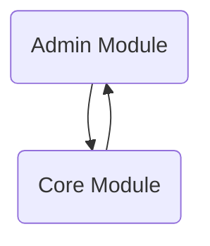

BroadleafCommerce-demo-new is a repository for Broadleaf Commerce Community Edition (CE), an open-source e-commerce framework written in Java and based on the Spring framework. It facilitates the development of enterprise-class, commerce-driven websites by providing a robust data model, services, and specialized tooling.

## Main Components

### Admin Module

The Admin Module is a core component that provides the infrastructure for managing administrative functionalities, organizing and displaying various sections within the admin interface.

- <SwmLink doc-title="Merging properties flow">[Merging properties flow](.swm/merging-properties-flow.erqrzcvt.sw.md)</SwmLink>
- <SwmLink doc-title="Populating model variables with content items">[Populating model variables with content items](.swm/populating-model-variables-with-content-items.l03dw49y.sw.md)</SwmLink>
- <SwmLink doc-title="Fetching data and applying criteria">[Fetching data and applying criteria](.swm/fetching-data-and-applying-criteria.j9uiriys.sw.md)</SwmLink>
- **Flows**
  - <SwmLink doc-title="Retrieving records flow">[Retrieving records flow](.swm/retrieving-records-flow.uje5cww5.sw.md)</SwmLink>
  - <SwmLink doc-title="Retrieving sub collection records">[Retrieving sub collection records](.swm/retrieving-sub-collection-records.s7qqnou4.sw.md)</SwmLink>
- **Flows**
  - <SwmLink doc-title="Field initialization flow">[Field initialization flow](.swm/field-initialization-flow.owgguzpr.sw.md)</SwmLink>
  - <SwmLink doc-title="Widget flow overview">[Widget flow overview](.swm/widget-flow-overview.3ez5nug4.sw.md)</SwmLink>
  - <SwmLink doc-title="File upload submit process">[File upload submit process](.swm/file-upload-submit-process.odmuykde.sw.md)</SwmLink>
  - <SwmLink doc-title="Datetimepicker functionality">[Datetimepicker functionality](.swm/datetimepicker-functionality.szb9rcbf.sw.md)</SwmLink>
  - <SwmLink doc-title="Handling file addition">[Handling file addition](.swm/handling-file-addition.0idpkzch.sw.md)</SwmLink>
  - <SwmLink doc-title="Displaying an element as a modal">[Displaying an element as a modal](.swm/displaying-an-element-as-a-modal.86ovkhex.sw.md)</SwmLink>
  - <SwmLink doc-title="Initializing a date time picker">[Initializing a date time picker](.swm/initializing-a-date-time-picker.v3mecmr7.sw.md)</SwmLink>
  - <SwmLink doc-title="Adding a new product">[Adding a new product](.swm/adding-a-new-product.9kggmetu.sw.md)</SwmLink>
  - <SwmLink doc-title="Adding a new product">[Adding a new product](.swm/adding-a-new-product.dk4744j2.sw.md)</SwmLink>
  - <SwmLink doc-title="Refreshing collection data flow">[Refreshing collection data flow](.swm/refreshing-collection-data-flow.p4dj9lu7.sw.md)</SwmLink>
  - <SwmLink doc-title="Handling clickout events">[Handling clickout events](.swm/handling-clickout-events.l21d5lzn.sw.md)</SwmLink>
  - <SwmLink doc-title="Adding a new product">[Adding a new product](.swm/adding-a-new-product.wrn96m4c.sw.md)</SwmLink>
  - <SwmLink doc-title="Initializing a list grid">[Initializing a list grid](.swm/initializing-a-list-grid.bdf1e8n2.sw.md)</SwmLink>
  - <SwmLink doc-title="Tooltip initialization and management">[Tooltip initialization and management](.swm/tooltip-initialization-and-management.iinjbqjh.sw.md)</SwmLink>
  - <SwmLink doc-title="Drag start process">[Drag start process](.swm/drag-start-process.e3bwzooo.sw.md)</SwmLink>
  - <SwmLink doc-title="Color picker configuration flow">[Color picker configuration flow](.swm/color-picker-configuration-flow.mpajpcv7.sw.md)</SwmLink>
  - <SwmLink doc-title="Handling color palette clicks">[Handling color palette clicks](.swm/handling-color-palette-clicks.njkh3vxj.sw.md)</SwmLink>
  - <SwmLink doc-title="Color picker positioning">[Color picker positioning](.swm/color-picker-positioning.iguhif9m.sw.md)</SwmLink>
  - <SwmLink doc-title="Handling existing filters">[Handling existing filters](.swm/handling-existing-filters.whx0lfza.sw.md)</SwmLink>
  - <SwmLink doc-title="Initialization process for joyride plugin">[Initialization process for joyride plugin](.swm/initialization-process-for-joyride-plugin.1vldr260.sw.md)</SwmLink>

### Core Module

The core module is responsible for the primary business logic and services in Broadleaf Commerce, including pricing, workflow management, and search configurations. It contains key components like the pricing service modules, workflow activities, and Solr configuration, which are crucial for the operation and customization of e-commerce functionalities.

- <SwmLink doc-title="Building an order item from dto">[Building an order item from dto](.swm/building-an-order-item-from-dto.zt8std0c.sw.md)</SwmLink>
- <SwmLink doc-title="Adding a new product">[Adding a new product](.swm/adding-a-new-product.yrn7byjq.sw.md)</SwmLink>
- <SwmLink doc-title="Determining order payment status">[Determining order payment status](.swm/determining-order-payment-status.779dhn1b.sw.md)</SwmLink>
- **Flows**
  - <SwmLink doc-title="Handling customer state">[Handling customer state](.swm/handling-customer-state.1kh0tfl1.sw.md)</SwmLink>
  - <SwmLink doc-title="Populating model variables for checkout">[Populating model variables for checkout](.swm/populating-model-variables-for-checkout.0hpsqkme.sw.md)</SwmLink>
  - <SwmLink doc-title="Handling request locking">[Handling request locking](.swm/handling-request-locking.f0puieog.sw.md)</SwmLink>
  - <SwmLink doc-title="Executing the pricing workflow">[Executing the pricing workflow](.swm/executing-the-pricing-workflow.rl1fn73e.sw.md)</SwmLink>

### Flows

- <SwmLink doc-title="Calculating sku margin">[Calculating sku margin](.swm/calculating-sku-margin.fnrkr3qr.sw.md)</SwmLink>
- <SwmLink doc-title="Handling foreign key lookup selection">[Handling foreign key lookup selection](.swm/handling-foreign-key-lookup-selection.7948p7rf.sw.md)</SwmLink>
- <SwmLink doc-title="Handling asset selection in redactor">[Handling asset selection in redactor](.swm/handling-asset-selection-in-redactor.rxntcsla.sw.md)</SwmLink>
- <SwmLink doc-title="Updating a category entity">[Updating a category entity](.swm/updating-a-category-entity.vtgjunrx.sw.md)</SwmLink>
- <SwmLink doc-title="Rendering the main entity listing">[Rendering the main entity listing](.swm/rendering-the-main-entity-listing.kwgsjn76.sw.md)</SwmLink>

&nbsp;

*This is an auto-generated document by Swimm AI 🌊 and has not yet been verified by a human*

<SwmMeta version="3.0.0" repo-id="Z2l0aHViJTNBJTNBQnJvYWRsZWFmQ29tbWVyY2UtZGVtby1uZXclM0ElM0FTd2ltbS1EZW1v" repo-name="BroadleafCommerce-demo-new" doc-type="other">Powered by [Swimm](https://app.swimm.io/)</SwmMeta>
