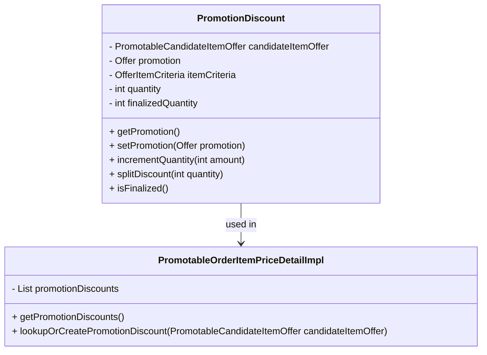

# Overview

The <SwmToken path="core/broadleaf-framework/src/main/java/org/broadleafcommerce/core/offer/service/discount/domain/PromotableOrderItemPriceDetailImpl.java" pos="244:5:5" line-data="    public List&lt;PromotionDiscount&gt; getPromotionDiscounts() {">`PromotionDiscount`</SwmToken> class is responsible for recording the usage of an item as a qualifier or target of a promotion. It manages discount details through fields such as `candidateItemOffer`, <SwmToken path="core/broadleaf-framework/src/main/java/org/broadleafcommerce/core/offer/service/discount/domain/PromotableOrderItemPriceDetailImpl.java" pos="288:3:3" line-data="        Offer promotion = itemOffer.getOffer();">`promotion`</SwmToken>, <SwmToken path="core/broadleaf-framework/src/main/java/org/broadleafcommerce/core/offer/service/discount/domain/PromotableOrderItemPriceDetailImpl.java" pos="370:14:14" line-data="    public PromotionQualifier addPromotionQualifier(PromotableCandidateItemOffer itemOffer, OfferItemCriteria itemCriteria, int qtyToMarkAsQualifier) {">`itemCriteria`</SwmToken>, <SwmToken path="core/broadleaf-framework/src/main/java/org/broadleafcommerce/core/offer/service/discount/domain/PromotableOrderItemPriceDetailImpl.java" pos="255:3:3" line-data="        return quantity;">`quantity`</SwmToken>, and `finalizedQuantity`. This class provides methods to get and set these fields, as well as methods to increment quantity, split discounts, and check if the discount is finalized.

# Applying Discounts

The <SwmToken path="core/broadleaf-framework/src/main/java/org/broadleafcommerce/core/offer/service/discount/domain/PromotableOrderItemPriceDetailImpl.java" pos="244:5:5" line-data="    public List&lt;PromotionDiscount&gt; getPromotionDiscounts() {">`PromotionDiscount`</SwmToken> class is used in various parts of the service layer to apply and manage discounts on order items. For example, in the <SwmToken path="core/broadleaf-framework/src/main/java/org/broadleafcommerce/core/offer/service/discount/domain/PromotableOrderItemPriceDetailImpl.java" pos="35:4:4" line-data="public class PromotableOrderItemPriceDetailImpl implements PromotableOrderItemPriceDetail {">`PromotableOrderItemPriceDetailImpl`</SwmToken> class, the <SwmToken path="core/broadleaf-framework/src/main/java/org/broadleafcommerce/core/offer/service/discount/domain/PromotableOrderItemPriceDetailImpl.java" pos="244:8:8" line-data="    public List&lt;PromotionDiscount&gt; getPromotionDiscounts() {">`getPromotionDiscounts`</SwmToken> method returns the list of promotion discounts applied to a detail object, and the <SwmToken path="core/broadleaf-framework/src/main/java/org/broadleafcommerce/core/offer/service/discount/domain/PromotableOrderItemPriceDetailImpl.java" pos="354:5:5" line-data="    public PromotionDiscount lookupOrCreatePromotionDiscount(PromotableCandidateItemOffer candidatePromotion) {">`lookupOrCreatePromotionDiscount`</SwmToken> method creates or retrieves a <SwmToken path="core/broadleaf-framework/src/main/java/org/broadleafcommerce/core/offer/service/discount/domain/PromotableOrderItemPriceDetailImpl.java" pos="244:5:5" line-data="    public List&lt;PromotionDiscount&gt; getPromotionDiscounts() {">`PromotionDiscount`</SwmToken> instance for a given candidate promotion.

<SwmSnippet path="/core/broadleaf-framework/src/main/java/org/broadleafcommerce/core/offer/service/discount/domain/PromotableOrderItemPriceDetailImpl.java" line="243">

---

The <SwmToken path="core/broadleaf-framework/src/main/java/org/broadleafcommerce/core/offer/service/discount/domain/PromotableOrderItemPriceDetailImpl.java" pos="35:4:4" line-data="public class PromotableOrderItemPriceDetailImpl implements PromotableOrderItemPriceDetail {">`PromotableOrderItemPriceDetailImpl`</SwmToken> class uses the <SwmToken path="core/broadleaf-framework/src/main/java/org/broadleafcommerce/core/offer/service/discount/domain/PromotableOrderItemPriceDetailImpl.java" pos="244:5:5" line-data="    public List&lt;PromotionDiscount&gt; getPromotionDiscounts() {">`PromotionDiscount`</SwmToken> class to manage discounts. The <SwmToken path="core/broadleaf-framework/src/main/java/org/broadleafcommerce/core/offer/service/discount/domain/PromotableOrderItemPriceDetailImpl.java" pos="244:8:8" line-data="    public List&lt;PromotionDiscount&gt; getPromotionDiscounts() {">`getPromotionDiscounts`</SwmToken> method returns the list of promotion discounts applied to a detail object, and the <SwmToken path="core/broadleaf-framework/src/main/java/org/broadleafcommerce/core/offer/service/discount/domain/PromotableOrderItemPriceDetailImpl.java" pos="354:5:5" line-data="    public PromotionDiscount lookupOrCreatePromotionDiscount(PromotableCandidateItemOffer candidatePromotion) {">`lookupOrCreatePromotionDiscount`</SwmToken> method creates or retrieves a <SwmToken path="core/broadleaf-framework/src/main/java/org/broadleafcommerce/core/offer/service/discount/domain/PromotableOrderItemPriceDetailImpl.java" pos="244:5:5" line-data="    public List&lt;PromotionDiscount&gt; getPromotionDiscounts() {">`PromotionDiscount`</SwmToken> instance for a given candidate promotion.

```java
    @Override
    public List<PromotionDiscount> getPromotionDiscounts() {
        return promotionDiscounts;
    }

    @Override
    public List<PromotionQualifier> getPromotionQualifiers() {
        return promotionQualifiers;
    }

    @Override
    public int getQuantity() {
        return quantity;
    }

    @Override
    public void setQuantity(int quantity) {
        this.quantity = quantity;
    }

    private boolean restrictTarget(Offer offer, boolean targetType) {
```

---

</SwmSnippet>

&nbsp;

*This is an auto-generated document by Swimm AI 🌊 and has not yet been verified by a human*

<SwmMeta version="3.0.0" repo-id="Z2l0aHViJTNBJTNBQnJvYWRsZWFmQ29tbWVyY2UtZGVtby1uZXclM0ElM0FTd2ltbS1EZW1v" repo-name="BroadleafCommerce-demo-new" doc-type="overview"><sup>Powered by [Swimm](/)</sup></SwmMeta>
