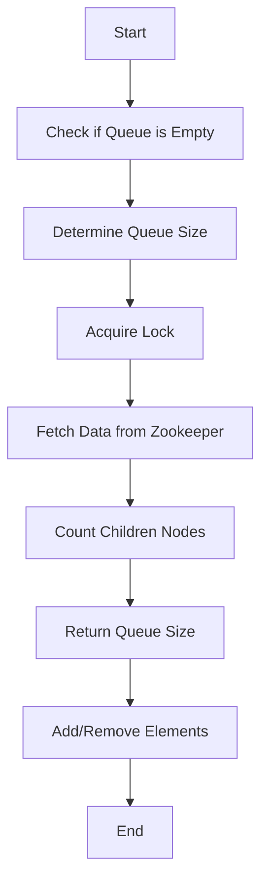

This document will cover the Queue Management feature with the isEmpty method, which includes:

1. Checking if the queue is empty
2. Determining the size of the queue
3. Locking mechanisms to ensure data consistency
4. Adding and removing elements from the queue.

Technical document: <SwmLink doc-title="Queue Management with isEmpty Method">[Queue Management with isEmpty Method](/.swm/queue-management-with-isempty-method.rj2of1tb.sw.md)</SwmLink>

# [Checking if the Queue is Empty](https://app.swimm.io/repos/Z2l0aHViJTNBJTNBQnJvYWRsZWFmQ29tbWVyY2UtZGVtby1uZXclM0ElM0FTd2ltbS1EZW1v/docs/rj2of1tb#isempty-method)

The isEmpty method is used to check if the queue is empty. This is done by synchronizing on a monitor and calling the size method. If the size is zero, it returns true, indicating the queue is empty. This ensures that the queue's state is accurately represented to the end user.

# [Determining the Size of the Queue](https://app.swimm.io/repos/Z2l0aHViJTNBJTNBQnJvYWRsZWFmQ29tbWVyY2UtZGVtby1uZXclM0ElM0FTd2ltbS1EZW1v/docs/rj2of1tb#size-method)

The size method determines the number of elements in the queue. It acquires a lock to ensure thread safety, fetches data from Zookeeper, and counts the children nodes. This method is crucial for providing accurate information about the queue's state to the end user.

# [Locking Mechanisms](https://app.swimm.io/repos/Z2l0aHViJTNBJTNBQnJvYWRsZWFmQ29tbWVyY2UtZGVtby1uZXclM0ElM0FTd2ltbS1EZW1v/docs/rj2of1tb#lockinterruptibly-method)

The lockInterruptibly method attempts to acquire a lock, ensuring that operations on the queue are thread-safe. This method is essential for maintaining data consistency and preventing race conditions, which could affect the end user's experience.

# [Adding and Removing Elements](https://app.swimm.io/repos/Z2l0aHViJTNBJTNBQnJvYWRsZWFmQ29tbWVyY2UtZGVtby1uZXclM0ElM0FTd2ltbS1EZW1v/docs/rj2of1tb#put-method)

The put method adds an element to the queue. It creates a list with the element and calls writeToQueue to write the element to the queue. This method ensures that new elements are correctly added to the queue, maintaining its integrity for the end user.

# [Removing Elements](https://app.swimm.io/repos/Z2l0aHViJTNBJTNBQnJvYWRsZWFmQ29tbWVyY2UtZGVtby1uZXclM0ElM0FTd2ltbS1EZW1v/docs/rj2of1tb#delete-method)

The delete method removes an element from the queue. It checks if the element is managed by the entity manager, finds it if necessary, and then removes it. This method ensures that elements are correctly removed from the queue, maintaining its integrity for the end user.

&nbsp;

*This is an auto-generated document by Swimm AI 🌊 and has not yet been verified by a human*

<SwmMeta version="3.0.0" repo-id="Z2l0aHViJTNBJTNBQnJvYWRsZWFmQ29tbWVyY2UtZGVtby1uZXclM0ElM0FTd2ltbS1EZW1v" repo-name="BroadleafCommerce-demo-new" doc-type="product-flows">Powered by [Swimm](/)</SwmMeta>
