In this document, we will explain the <SwmToken path="core/broadleaf-framework/src/main/java/org/broadleafcommerce/core/util/queue/ZookeeperDistributedQueue.java" pos="263:5:5" line-data="    public boolean isEmpty() {">`isEmpty`</SwmToken> method, which is used to check if a queue is empty. This method is part of a larger flow involving several other methods that manage queue operations, such as determining the size of the queue, locking mechanisms, and adding or removing elements.

The <SwmToken path="core/broadleaf-framework/src/main/java/org/broadleafcommerce/core/util/queue/ZookeeperDistributedQueue.java" pos="263:5:5" line-data="    public boolean isEmpty() {">`isEmpty`</SwmToken> method checks if a queue is empty by synchronizing on a monitor and calling the <SwmToken path="core/broadleaf-framework/src/main/java/org/broadleafcommerce/core/util/queue/ZookeeperDistributedQueue.java" pos="239:5:5" line-data="    public int size() {">`size`</SwmToken> method. If the size is zero, it returns true, indicating the queue is empty. The <SwmToken path="core/broadleaf-framework/src/main/java/org/broadleafcommerce/core/util/queue/ZookeeperDistributedQueue.java" pos="239:5:5" line-data="    public int size() {">`size`</SwmToken> method determines the number of elements in the queue by acquiring a lock, fetching data from Zookeeper, and counting the children nodes. The locking mechanism ensures that operations are thread-safe. Other related methods include adding elements to the queue, checking if specific elements are present, and removing elements. These methods work together to manage the queue's state and ensure data consistency.

# Flow drill down

```mermaid
graph TD;
      subgraph core/broadleaf-framework/src/main/java/org/broadleafcommerce/core/util
aa8cdbe4a9d4c527322ee913c1e765a2f4378a597904b96c93633a5c88b90652(isEmpty):::mainFlowStyle --> 119ea4bdd418642aef64f4a0f0ef8ac202542484f7b9e99f671004c0887e4e26(size):::mainFlowStyle
end

subgraph core/broadleaf-framework/src/main/java/org/broadleafcommerce/core/util
119ea4bdd418642aef64f4a0f0ef8ac202542484f7b9e99f671004c0887e4e26(size):::mainFlowStyle --> 9c2897679bf4571028570672c317850f4fcfa40ef7a885cdbbeaed6bc55fdef2(lockInterruptibly):::mainFlowStyle
end

subgraph core/broadleaf-framework/src/main/java/org/broadleafcommerce/core/util
9c2897679bf4571028570672c317850f4fcfa40ef7a885cdbbeaed6bc55fdef2(lockInterruptibly):::mainFlowStyle --> e0f16d7ab06c38c08c2391d8d964130511910485588b7b9dab194f61445bd15a(lockInternally):::mainFlowStyle
end

subgraph core/broadleaf-framework/src/main/java/org/broadleafcommerce/core/util
e0f16d7ab06c38c08c2391d8d964130511910485588b7b9dab194f61445bd15a(lockInternally):::mainFlowStyle --> c9cf59565b95335cceba0d6cc35b0e73a68c6cbfe63cd4f86a9b2ccc2646405b(delete):::mainFlowStyle
end

subgraph core/broadleaf-framework/src/main/java/org/broadleafcommerce/core/util
c9cf59565b95335cceba0d6cc35b0e73a68c6cbfe63cd4f86a9b2ccc2646405b(delete):::mainFlowStyle --> fafed2d65a93c8e997914f658afe91a3c2c3a41f56cfd6a3f1076580c45d4df6(contains):::mainFlowStyle
end

subgraph core/broadleaf-framework/src/main/java/org/broadleafcommerce/core/util
fafed2d65a93c8e997914f658afe91a3c2c3a41f56cfd6a3f1076580c45d4df6(contains):::mainFlowStyle --> a09baf134fc9727a6c623a659d3daab7807ddf5aee70daaaba9d9b8a5cdeaa98(containsAll):::mainFlowStyle
end

subgraph core/broadleaf-framework/src/main/java/org/broadleafcommerce/core/util
a09baf134fc9727a6c623a659d3daab7807ddf5aee70daaaba9d9b8a5cdeaa98(containsAll):::mainFlowStyle --> e25beeef189546f86224a6c61e8a2c6b4c651980865a3ad76b5574b73fc10ffb(readQueueInternal):::mainFlowStyle
end

subgraph core/broadleaf-framework/src/main/java/org/broadleafcommerce/core/util
e25beeef189546f86224a6c61e8a2c6b4c651980865a3ad76b5574b73fc10ffb(readQueueInternal):::mainFlowStyle --> 01b8e0535be1bfbac9cf9f49180dc99960aa78e1aa674113c727018a975b53b8(put):::mainFlowStyle
end

subgraph core/broadleaf-framework/src/main/java/org/broadleafcommerce/core/util
01b8e0535be1bfbac9cf9f49180dc99960aa78e1aa674113c727018a975b53b8(put):::mainFlowStyle --> 032d76a7712a118964a78521bc0d8db65dd8131d42a9803c34770bcca6b82438(add):::mainFlowStyle
end

subgraph core/broadleaf-framework/src/main/java/org/broadleafcommerce/core/util
032d76a7712a118964a78521bc0d8db65dd8131d42a9803c34770bcca6b82438(add):::mainFlowStyle --> 7540c94382d60dd5b1a4eb538f949cadd5a341ac4b39ae2be8dd55ab89222880(writeToQueue):::mainFlowStyle
end

subgraph core/broadleaf-framework/src/main/java/org/broadleafcommerce/core/util
7540c94382d60dd5b1a4eb538f949cadd5a341ac4b39ae2be8dd55ab89222880(writeToQueue):::mainFlowStyle --> 2304f84bf55ee27ff1cab215149b25b0ac27acd883082115e20f27945d8fc20b(unlock):::mainFlowStyle
end


      classDef mainFlowStyle color:#000000,fill:#7CB9F4
classDef rootsStyle color:#000000,fill:#00FFF4
classDef Style1 color:#000000,fill:#00FFAA
classDef Style2 color:#000000,fill:#FFFF00
classDef Style3 color:#000000,fill:#AA7CB9

%% Swimm:
%% graph TD;
%%       subgraph <SwmPath>[core/broadleaf-framework/src/main/java/org/broadleafcommerce/core/util/](core/broadleaf-framework/src/main/java/org/broadleafcommerce/core/util/)</SwmPath>
%% aa8cdbe4a9d4c527322ee913c1e765a2f4378a597904b96c93633a5c88b90652(isEmpty):::mainFlowStyle --> 119ea4bdd418642aef64f4a0f0ef8ac202542484f7b9e99f671004c0887e4e26(size):::mainFlowStyle
%% end
%% 
%% subgraph <SwmPath>[core/broadleaf-framework/src/main/java/org/broadleafcommerce/core/util/](core/broadleaf-framework/src/main/java/org/broadleafcommerce/core/util/)</SwmPath>
%% 119ea4bdd418642aef64f4a0f0ef8ac202542484f7b9e99f671004c0887e4e26(size):::mainFlowStyle --> 9c2897679bf4571028570672c317850f4fcfa40ef7a885cdbbeaed6bc55fdef2(lockInterruptibly):::mainFlowStyle
%% end
%% 
%% subgraph <SwmPath>[core/broadleaf-framework/src/main/java/org/broadleafcommerce/core/util/](core/broadleaf-framework/src/main/java/org/broadleafcommerce/core/util/)</SwmPath>
%% 9c2897679bf4571028570672c317850f4fcfa40ef7a885cdbbeaed6bc55fdef2(lockInterruptibly):::mainFlowStyle --> e0f16d7ab06c38c08c2391d8d964130511910485588b7b9dab194f61445bd15a(lockInternally):::mainFlowStyle
%% end
%% 
%% subgraph <SwmPath>[core/broadleaf-framework/src/main/java/org/broadleafcommerce/core/util/](core/broadleaf-framework/src/main/java/org/broadleafcommerce/core/util/)</SwmPath>
%% e0f16d7ab06c38c08c2391d8d964130511910485588b7b9dab194f61445bd15a(lockInternally):::mainFlowStyle --> c9cf59565b95335cceba0d6cc35b0e73a68c6cbfe63cd4f86a9b2ccc2646405b(delete):::mainFlowStyle
%% end
%% 
%% subgraph <SwmPath>[core/broadleaf-framework/src/main/java/org/broadleafcommerce/core/util/](core/broadleaf-framework/src/main/java/org/broadleafcommerce/core/util/)</SwmPath>
%% c9cf59565b95335cceba0d6cc35b0e73a68c6cbfe63cd4f86a9b2ccc2646405b(delete):::mainFlowStyle --> fafed2d65a93c8e997914f658afe91a3c2c3a41f56cfd6a3f1076580c45d4df6(contains):::mainFlowStyle
%% end
%% 
%% subgraph <SwmPath>[core/broadleaf-framework/src/main/java/org/broadleafcommerce/core/util/](core/broadleaf-framework/src/main/java/org/broadleafcommerce/core/util/)</SwmPath>
%% fafed2d65a93c8e997914f658afe91a3c2c3a41f56cfd6a3f1076580c45d4df6(contains):::mainFlowStyle --> a09baf134fc9727a6c623a659d3daab7807ddf5aee70daaaba9d9b8a5cdeaa98(containsAll):::mainFlowStyle
%% end
%% 
%% subgraph <SwmPath>[core/broadleaf-framework/src/main/java/org/broadleafcommerce/core/util/](core/broadleaf-framework/src/main/java/org/broadleafcommerce/core/util/)</SwmPath>
%% a09baf134fc9727a6c623a659d3daab7807ddf5aee70daaaba9d9b8a5cdeaa98(containsAll):::mainFlowStyle --> e25beeef189546f86224a6c61e8a2c6b4c651980865a3ad76b5574b73fc10ffb(readQueueInternal):::mainFlowStyle
%% end
%% 
%% subgraph <SwmPath>[core/broadleaf-framework/src/main/java/org/broadleafcommerce/core/util/](core/broadleaf-framework/src/main/java/org/broadleafcommerce/core/util/)</SwmPath>
%% e25beeef189546f86224a6c61e8a2c6b4c651980865a3ad76b5574b73fc10ffb(readQueueInternal):::mainFlowStyle --> 01b8e0535be1bfbac9cf9f49180dc99960aa78e1aa674113c727018a975b53b8(put):::mainFlowStyle
%% end
%% 
%% subgraph <SwmPath>[core/broadleaf-framework/src/main/java/org/broadleafcommerce/core/util/](core/broadleaf-framework/src/main/java/org/broadleafcommerce/core/util/)</SwmPath>
%% 01b8e0535be1bfbac9cf9f49180dc99960aa78e1aa674113c727018a975b53b8(put):::mainFlowStyle --> 032d76a7712a118964a78521bc0d8db65dd8131d42a9803c34770bcca6b82438(add):::mainFlowStyle
%% end
%% 
%% subgraph <SwmPath>[core/broadleaf-framework/src/main/java/org/broadleafcommerce/core/util/](core/broadleaf-framework/src/main/java/org/broadleafcommerce/core/util/)</SwmPath>
%% 032d76a7712a118964a78521bc0d8db65dd8131d42a9803c34770bcca6b82438(add):::mainFlowStyle --> 7540c94382d60dd5b1a4eb538f949cadd5a341ac4b39ae2be8dd55ab89222880(writeToQueue):::mainFlowStyle
%% end
%% 
%% subgraph <SwmPath>[core/broadleaf-framework/src/main/java/org/broadleafcommerce/core/util/](core/broadleaf-framework/src/main/java/org/broadleafcommerce/core/util/)</SwmPath>
%% 7540c94382d60dd5b1a4eb538f949cadd5a341ac4b39ae2be8dd55ab89222880(writeToQueue):::mainFlowStyle --> 2304f84bf55ee27ff1cab215149b25b0ac27acd883082115e20f27945d8fc20b(unlock):::mainFlowStyle
%% end
%% 
%% 
%%       classDef mainFlowStyle color:#000000,fill:#7CB9F4
%% classDef rootsStyle color:#000000,fill:#00FFF4
%% classDef Style1 color:#000000,fill:#00FFAA
%% classDef Style2 color:#000000,fill:#FFFF00
%% classDef Style3 color:#000000,fill:#AA7CB9
```



<SwmSnippet path="/core/broadleaf-framework/src/main/java/org/broadleafcommerce/core/util/queue/ZookeeperDistributedQueue.java" line="262">

---

## <SwmToken path="core/broadleaf-framework/src/main/java/org/broadleafcommerce/core/util/queue/ZookeeperDistributedQueue.java" pos="263:5:5" line-data="    public boolean isEmpty() {">`isEmpty`</SwmToken> Method

The <SwmToken path="core/broadleaf-framework/src/main/java/org/broadleafcommerce/core/util/queue/ZookeeperDistributedQueue.java" pos="263:5:5" line-data="    public boolean isEmpty() {">`isEmpty`</SwmToken> method checks if the queue is empty by synchronizing on <SwmToken path="core/broadleaf-framework/src/main/java/org/broadleafcommerce/core/util/queue/ZookeeperDistributedQueue.java" pos="264:4:4" line-data="        synchronized (QUEUE_MONITOR) {">`QUEUE_MONITOR`</SwmToken> and calling the <SwmToken path="core/broadleaf-framework/src/main/java/org/broadleafcommerce/core/util/queue/ZookeeperDistributedQueue.java" pos="265:3:3" line-data="            return size() == 0;">`size`</SwmToken> method. If the size is zero, it returns true, indicating the queue is empty.

```java
    @Override
    public boolean isEmpty() {
        synchronized (QUEUE_MONITOR) {
            return size() == 0;
        }
    }
```

---

</SwmSnippet>

<SwmSnippet path="/core/broadleaf-framework/src/main/java/org/broadleafcommerce/core/util/queue/ZookeeperDistributedQueue.java" line="238">

---

## size Method

The <SwmToken path="core/broadleaf-framework/src/main/java/org/broadleafcommerce/core/util/queue/ZookeeperDistributedQueue.java" pos="239:5:5" line-data="    public int size() {">`size`</SwmToken> method determines the number of children nodes in the Zookeeper queue. It acquires a lock using <SwmToken path="core/broadleaf-framework/src/main/java/org/broadleafcommerce/core/util/queue/ZookeeperDistributedQueue.java" pos="242:3:3" line-data="            lock.lockInterruptibly();">`lockInterruptibly`</SwmToken>, executes an operation to get the data from Zookeeper, and returns the number of children nodes.

```java
    @Override
    public int size() {
        DistributedLock lock = getQueueAccessLock();
        try {
            lock.lockInterruptibly();
            try {
                return executeOperation(new GenericOperation<Integer>() {
                    @Override
                    public Integer execute() throws Exception {
                        final Stat stat = new Stat();
                        getZookeeperClient().getData(getQueueEntryFolder(), null, stat);
                        return stat.getNumChildren();
                    }
                });
                
            } finally {
                lock.unlock();
            }
        } catch (InterruptedException e) {
            Thread.currentThread().interrupt();
            throw new DistributedQueueException("Thread was interrupted while trying to determine queue size for distributed Zookeeper queue, " + getQueueFolderPath(), e);
```

---

</SwmSnippet>

<SwmSnippet path="/core/broadleaf-framework/src/main/java/org/broadleafcommerce/core/util/lock/ReentrantDistributedZookeeperLock.java" line="335">

---

### <SwmToken path="core/broadleaf-framework/src/main/java/org/broadleafcommerce/core/util/lock/ReentrantDistributedZookeeperLock.java" pos="336:5:5" line-data="    public void lockInterruptibly() throws InterruptedException {">`lockInterruptibly`</SwmToken> Method

The <SwmToken path="core/broadleaf-framework/src/main/java/org/broadleafcommerce/core/util/lock/ReentrantDistributedZookeeperLock.java" pos="336:5:5" line-data="    public void lockInterruptibly() throws InterruptedException {">`lockInterruptibly`</SwmToken> method attempts to acquire the lock, throwing an <SwmToken path="core/broadleaf-framework/src/main/java/org/broadleafcommerce/core/util/lock/ReentrantDistributedZookeeperLock.java" pos="336:11:11" line-data="    public void lockInterruptibly() throws InterruptedException {">`InterruptedException`</SwmToken> if the thread is interrupted before acquiring the lock. It calls <SwmToken path="core/broadleaf-framework/src/main/java/org/broadleafcommerce/core/util/lock/ReentrantDistributedZookeeperLock.java" pos="341:1:1" line-data="        lockInternally(-1L);">`lockInternally`</SwmToken> to perform the actual locking.

```java
    @Override
    public void lockInterruptibly() throws InterruptedException {
        if (Thread.interrupted()) {
            throw new InterruptedException("Thread was interrupted prior to trying to acquire the lock.");
        }
        
        lockInternally(-1L);
    }
```

---

</SwmSnippet>

<SwmSnippet path="/core/broadleaf-framework/src/main/java/org/broadleafcommerce/core/util/lock/ReentrantDistributedZookeeperLock.java" line="380">

---

### <SwmToken path="core/broadleaf-framework/src/main/java/org/broadleafcommerce/core/util/lock/ReentrantDistributedZookeeperLock.java" pos="380:5:5" line-data="    protected boolean lockInternally(final long waitTime) throws InterruptedException {">`lockInternally`</SwmToken> Method

The <SwmToken path="core/broadleaf-framework/src/main/java/org/broadleafcommerce/core/util/lock/ReentrantDistributedZookeeperLock.java" pos="380:5:5" line-data="    protected boolean lockInternally(final long waitTime) throws InterruptedException {">`lockInternally`</SwmToken> method handles the internal logic for acquiring the lock. It interacts with Zookeeper to create and manage lock nodes, ensuring that the lock is properly acquired and released.

```java
    protected boolean lockInternally(final long waitTime) throws InterruptedException {
        if (!canParticipate()) {
            //No lock will be provided in this case, but we want to simulate the normal lock semantics.
            if (waitTime < 0L) {
                //Simulate normal lock semantics,where the lock is unavailable, but we've been asked to wait interruptably for it indefinitely.
                synchronized (NON_PARTICIPANT_LOCK_MONITOR) {
                    //This basically will cause this thread to block forever until the thread is interrupted, which is what we want.
                    NON_PARTICIPANT_LOCK_MONITOR.wait(); 
                }
            } else if (waitTime > 0L) {
                //Simulate normal lock semantics, where the lock is unavailable, but we've been asked to wait interruptably for it for a period of time.
                synchronized (NON_PARTICIPANT_LOCK_MONITOR) {
                    NON_PARTICIPANT_LOCK_MONITOR.wait(waitTime);
                }
            }
            
            return false;
        }
        
        //See if this thread already has a lock permit.  If so, just increment the count and return it.
        //No need to interact with Zookeeper.
```

---

</SwmSnippet>

<SwmSnippet path="/core/broadleaf-framework/src/main/java/org/broadleafcommerce/core/util/dao/CodeTypeDaoImpl.java" line="51">

---

## delete Method

The <SwmToken path="core/broadleaf-framework/src/main/java/org/broadleafcommerce/core/util/dao/CodeTypeDaoImpl.java" pos="51:5:5" line-data="    public void delete(CodeType codeType) {">`delete`</SwmToken> method removes a <SwmToken path="core/broadleaf-framework/src/main/java/org/broadleafcommerce/core/util/dao/CodeTypeDaoImpl.java" pos="51:7:7" line-data="    public void delete(CodeType codeType) {">`CodeType`</SwmToken> entity from the database. It checks if the entity is managed by the entity manager, finds it if necessary, and then removes it.

```java
    public void delete(CodeType codeType) {
        if (!em.contains(codeType)) {
            codeType = (CodeType) em.find(CodeTypeImpl.class, codeType.getId());
        }
        em.remove(codeType);
    }
```

---

</SwmSnippet>

<SwmSnippet path="/core/broadleaf-framework/src/main/java/org/broadleafcommerce/core/util/queue/ZookeeperDistributedQueue.java" line="474">

---

## contains Method

The <SwmToken path="core/broadleaf-framework/src/main/java/org/broadleafcommerce/core/util/queue/ZookeeperDistributedQueue.java" pos="475:5:5" line-data="    public boolean contains(Object o) {">`contains`</SwmToken> method checks if a specific object is present in the queue by calling <SwmToken path="core/broadleaf-framework/src/main/java/org/broadleafcommerce/core/util/queue/ZookeeperDistributedQueue.java" pos="476:3:3" line-data="        return containsAll(Collections.singletonList(o));">`containsAll`</SwmToken> with a singleton list containing the object.

```java
    @Override
    public boolean contains(Object o) {
        return containsAll(Collections.singletonList(o));
    }
```

---

</SwmSnippet>

<SwmSnippet path="/core/broadleaf-framework/src/main/java/org/broadleafcommerce/core/util/queue/ZookeeperDistributedQueue.java" line="285">

---

## <SwmToken path="core/broadleaf-framework/src/main/java/org/broadleafcommerce/core/util/queue/ZookeeperDistributedQueue.java" pos="286:5:5" line-data="    public boolean containsAll(Collection&lt;?&gt; c) {">`containsAll`</SwmToken> Method

The <SwmToken path="core/broadleaf-framework/src/main/java/org/broadleafcommerce/core/util/queue/ZookeeperDistributedQueue.java" pos="286:5:5" line-data="    public boolean containsAll(Collection&lt;?&gt; c) {">`containsAll`</SwmToken> method checks if all elements in a given collection are present in the queue. It acquires a lock, reads the queue, and checks if the queue's elements contain all the elements in the collection.

```java
    @Override
    public boolean containsAll(Collection<?> c) {
        DistributedLock lock = getQueueAccessLock();
        try {
            lock.lockInterruptibly();
            try {
                Map<String, T> elements = readQueueInternal(geMaxCapacity(), false, 0L);
                if (!elements.isEmpty()) {
                    return elements.values().containsAll(c);
                }
                
                return false;
                
            } finally {
                lock.unlock();
            }
        } catch (InterruptedException e) {
            Thread.currentThread().interrupt();
            throw new DistributedQueueException("The thread was interrupted while trying to determine if elements are contained in the Zookeeper queue, " + getQueueFolderPath(), e);
        }
    }
```

---

</SwmSnippet>

<SwmSnippet path="/core/broadleaf-framework/src/main/java/org/broadleafcommerce/core/util/queue/ZookeeperDistributedQueue.java" line="591">

---

## <SwmToken path="core/broadleaf-framework/src/main/java/org/broadleafcommerce/core/util/queue/ZookeeperDistributedQueue.java" pos="591:11:11" line-data="    protected Map&lt;String, T&gt; readQueueInternal(final int qty, final boolean remove, final long timeout) throws InterruptedException {">`readQueueInternal`</SwmToken> Method

The <SwmToken path="core/broadleaf-framework/src/main/java/org/broadleafcommerce/core/util/queue/ZookeeperDistributedQueue.java" pos="591:11:11" line-data="    protected Map&lt;String, T&gt; readQueueInternal(final int qty, final boolean remove, final long timeout) throws InterruptedException {">`readQueueInternal`</SwmToken> method reads the queue's entries from Zookeeper. It retrieves the children nodes and their data, returning a map of the entries.

```java
    protected Map<String, T> readQueueInternal(final int qty, final boolean remove, final long timeout) throws InterruptedException {
        final Map<String, T> out = new LinkedHashMap<>();
        long waitTime = timeout;
        synchronized (QUEUE_MONITOR) {
            while (true) {
                boolean locked;
                DistributedLock lock = getQueueAccessLock();
                if (timeout < 0L) {
                    lock.lockInterruptibly();
                    locked = true;
                } else if (timeout > 0L && waitTime > 0L) {
                    long start = System.currentTimeMillis();
                    locked = lock.tryLock(waitTime, TimeUnit.MILLISECONDS);
                    long end = System.currentTimeMillis();
                    waitTime -= (end - start);
                } else {
                    locked = lock.tryLock();
                    if (!locked) {
                        return out;
                    }
                }
```

---

</SwmSnippet>

<SwmSnippet path="/core/broadleaf-framework/src/main/java/org/broadleafcommerce/core/util/queue/ZookeeperDistributedQueue.java" line="393">

---

## put Method

The <SwmToken path="core/broadleaf-framework/src/main/java/org/broadleafcommerce/core/util/queue/ZookeeperDistributedQueue.java" pos="394:5:5" line-data="    public void put(T e) throws InterruptedException {">`put`</SwmToken> method adds an element to the queue. It creates a list with the element and calls <SwmToken path="core/broadleaf-framework/src/main/java/org/broadleafcommerce/core/util/queue/ZookeeperDistributedQueue.java" pos="397:1:1" line-data="        writeToQueue(elementsToAdd, -1L);">`writeToQueue`</SwmToken> to write the element to the queue.

```java
    @Override
    public void put(T e) throws InterruptedException {
        final ArrayList<T> elementsToAdd = new ArrayList<>();
        elementsToAdd.add(e);
        writeToQueue(elementsToAdd, -1L);
    }
```

---

</SwmSnippet>

<SwmSnippet path="/core/broadleaf-framework/src/main/java/org/broadleafcommerce/core/util/queue/ZookeeperDistributedQueue.java" line="359">

---

## add Method

The <SwmToken path="core/broadleaf-framework/src/main/java/org/broadleafcommerce/core/util/queue/ZookeeperDistributedQueue.java" pos="360:5:5" line-data="    public boolean add(T e) {">`add`</SwmToken> method attempts to add an element to the queue. It calls <SwmToken path="core/broadleaf-framework/src/main/java/org/broadleafcommerce/core/util/queue/ZookeeperDistributedQueue.java" pos="364:7:7" line-data="            int count = writeToQueue(lst, 0L);">`writeToQueue`</SwmToken> and checks if the element was successfully added, throwing an exception if the queue is full.

```java
    @Override
    public boolean add(T e) {
        try {
            final ArrayList<T> lst = new ArrayList<>();
            lst.add(e);
            int count = writeToQueue(lst, 0L);
            if (count != 1) {
                throw new IllegalStateException("The Zookeeper queue was full.");
            } else {
                return true;
            }
        } catch (InterruptedException ex) {
            Thread.currentThread().interrupt();
            return false;
        }
    }
```

---

</SwmSnippet>

<SwmSnippet path="/core/broadleaf-framework/src/main/java/org/broadleafcommerce/core/util/queue/ZookeeperDistributedQueue.java" line="503">

---

## <SwmToken path="core/broadleaf-framework/src/main/java/org/broadleafcommerce/core/util/queue/ZookeeperDistributedQueue.java" pos="503:5:5" line-data="    protected int writeToQueue(List&lt;? extends T&gt; entries, final long timeout) throws InterruptedException {">`writeToQueue`</SwmToken> Method

The <SwmToken path="core/broadleaf-framework/src/main/java/org/broadleafcommerce/core/util/queue/ZookeeperDistributedQueue.java" pos="503:5:5" line-data="    protected int writeToQueue(List&lt;? extends T&gt; entries, final long timeout) throws InterruptedException {">`writeToQueue`</SwmToken> method writes a list of entries to the queue. It handles locking, checks the remaining capacity, and serializes the entries to be stored in Zookeeper.

```java
    protected int writeToQueue(List<? extends T> entries, final long timeout) throws InterruptedException {
        if (entries == null || entries.isEmpty()) {
            return 0;
        }
        
        int entryCount = 0;
        long waitTime = timeout;
        synchronized (QUEUE_MONITOR) {
            while (true) {
                boolean locked = false;
                DistributedLock lock = getQueueAccessLock();
                if (timeout < 0L) {
                    lock.lockInterruptibly();
                    locked = true;
                } else if (timeout > 0L && waitTime > 0L) {
                    long start = System.currentTimeMillis();
                    locked = lock.tryLock(waitTime, TimeUnit.MILLISECONDS);
                    long end = System.currentTimeMillis();
                    waitTime -= (end - start);
                } else {
                    locked = lock.tryLock();
```

---

</SwmSnippet>

<SwmSnippet path="/core/broadleaf-framework/src/main/java/org/broadleafcommerce/core/util/lock/ReentrantDistributedZookeeperLock.java" line="288">

---

## unlock Method

The <SwmToken path="core/broadleaf-framework/src/main/java/org/broadleafcommerce/core/util/lock/ReentrantDistributedZookeeperLock.java" pos="289:5:5" line-data="    public void unlock() {">`unlock`</SwmToken> method releases the lock held by the current thread. It checks if the thread holds the lock, decrements the lock permits, and deletes the lock node from Zookeeper if necessary.

```java
    @Override
    public void unlock() {
        try {
            synchronized (LOCK_MONITOR) {
                if (!currentThreadHoldsLock()) {
                    throw new DistributedLockException("The current thread did not obtain this lock and thereforer cannot unlock it.");
                }
                
                if (THREAD_LOCK_PERMITS.get().get() > 1) {
                    //Decrement the lock access but don't eliminate the lock from Zookeeper.
                    //This allows it to be reentrant.
                    THREAD_LOCK_PERMITS.get().decrementAndGet();
                    return;
                }
                
                GenericOperationUtil.executeRetryableOperation(new GenericOperation<Void>() {
                    @Override
                    public Void execute() throws Exception {
                        getZookeeperClient().delete(currentlockPath, -1);
                        return null;
                    }
```

---

</SwmSnippet>

# Where is this flow used?

This flow is used multiple times in the codebase as represented in the following diagram:

(Note - these are only some of the entry points of this flow)

```mermaid
graph TD;
      subgraph core/broadleaf-framework-web/src/main/java/org/broadleafcommerce/core/web/expression/RelatedProductsVariableExpression.java
7a42b0d5d539bcca849cefc619095c5b0c3b37b44daf2bfc1d95e204bf9184d0(findByProduct):::rootsStyle --> f0b33cc9b804553f04f160e08a5cc027047074b55392dbef8a05db4d912ae072(getRelatedProducts)
end

subgraph core/broadleaf-framework/src/main/java/org/broadleafcommerce/core/catalog
f0b33cc9b804553f04f160e08a5cc027047074b55392dbef8a05db4d912ae072(getRelatedProducts) --> 06a0c7abfcb58c1534f78f963f8f6cf89a31d9aed98592b50bd18582a764455f(findRelatedProducts)
end

subgraph core/broadleaf-framework/src/main/java/org/broadleafcommerce/core/catalog
06a0c7abfcb58c1534f78f963f8f6cf89a31d9aed98592b50bd18582a764455f(findRelatedProducts) --> bc5835b7d5a1ba18c91f4c0945a2ea873983d1f54f9686b09272d29cd1b8b0a1(buildFeaturedProductsList)
end

subgraph core/broadleaf-framework/src/main/java/org/broadleafcommerce/core/catalog
bc5835b7d5a1ba18c91f4c0945a2ea873983d1f54f9686b09272d29cd1b8b0a1(buildFeaturedProductsList) --> d7d78795f7d9f46f72d2742b32f73f96b517192d8043891ea88daf6cd7378ce2(getCumulativeFeaturedProducts)
end

subgraph core/broadleaf-framework/src/main/java/org/broadleafcommerce/core
d7d78795f7d9f46f72d2742b32f73f96b517192d8043891ea88daf6cd7378ce2(getCumulativeFeaturedProducts) --> c122da6a7a916809e76f4e9908f55f7a5195ff3b457f93f1b241a989a20fa9ac(addAll)
end

subgraph core/broadleaf-framework/src/main/java/org/broadleafcommerce/core
c122da6a7a916809e76f4e9908f55f7a5195ff3b457f93f1b241a989a20fa9ac(addAll) --> aa8cdbe4a9d4c527322ee913c1e765a2f4378a597904b96c93633a5c88b90652(isEmpty):::mainFlowStyle
end

subgraph core/broadleaf-framework-web/src/main/java/org/broadleafcommerce/core/web/expression/RelatedProductsVariableExpression.java
08172a641b58a09556cf22516034f737daa79c3f8c6ac23306670163f72b99b8(findByCategory):::rootsStyle --> f0b33cc9b804553f04f160e08a5cc027047074b55392dbef8a05db4d912ae072(getRelatedProducts)
end

subgraph core/broadleaf-framework/src/main/java/org/broadleafcommerce/core/offer/service/processor
a68322f7a47a5cc72bde739d34ab6c9e2957b42c8b96b4eb7dc7d6b6e332591a(filterOffers):::rootsStyle --> 6c61bdf66bdd76ebfe468be7ff2d3831c493648fb99b98802861aa373a62174a(filterItemLevelOffer)
end

subgraph core/broadleaf-framework/src/main/java/org/broadleafcommerce/core/offer/service/processor
6c61bdf66bdd76ebfe468be7ff2d3831c493648fb99b98802861aa373a62174a(filterItemLevelOffer) --> dcb39c785c0783098cb9a4c693c424d2a1bed33c9b851694f101e57618f98a02(couldOfferApplyToOrderItems)
end

subgraph core/broadleaf-framework/src/main/java/org/broadleafcommerce/core/offer/service/processor
dcb39c785c0783098cb9a4c693c424d2a1bed33c9b851694f101e57618f98a02(couldOfferApplyToOrderItems) --> 7903879d51225eac59a830dc80d495ce23a7b424dd11fee311b6a2455575ca83(meetsItemQualifierSubtotal)
end

subgraph core/broadleaf-framework/src/main/java/org/broadleafcommerce/core/offer/service/discount/CandidatePromotionItems.java
7903879d51225eac59a830dc80d495ce23a7b424dd11fee311b6a2455575ca83(meetsItemQualifierSubtotal) --> 2cde66f7201fb6609247abfd32f516ae50a8a93c7d820b75320e68b8058a711a(getAllCandidateTargets)
end

subgraph core/broadleaf-framework/src/main/java/org/broadleafcommerce/core
2cde66f7201fb6609247abfd32f516ae50a8a93c7d820b75320e68b8058a711a(getAllCandidateTargets) --> c122da6a7a916809e76f4e9908f55f7a5195ff3b457f93f1b241a989a20fa9ac(addAll)
end

subgraph core/broadleaf-framework/src/main/java/org/broadleafcommerce/core
e8dcfda0d49396afe2825093c7324a03191846afc413810cf94d1246efab2b15(addAllItemsFromNamedOrder):::rootsStyle --> 98271203107c39e831fd77355eddd609873bba59a0662d4e46eb13f2a0452689(addItem)
end

subgraph core/broadleaf-framework/src/main/java/org/broadleafcommerce/core
98271203107c39e831fd77355eddd609873bba59a0662d4e46eb13f2a0452689(addItem) --> 5bab50bc6dd9f29c6a91232acbb44c9e1da4692315e877f8a5b1daccc17136c8(addItemWithPriceOverrides)
end

subgraph core/broadleaf-framework/src/main/java/org/broadleafcommerce/core
5bab50bc6dd9f29c6a91232acbb44c9e1da4692315e877f8a5b1daccc17136c8(addItemWithPriceOverrides) --> 7c1479f6f0023802c2fbe90974ef09316cdf44a964d35b61cf8b395dbce96131(updateItemQuantity)
end

subgraph core/broadleaf-framework/src/main/java/org/broadleafcommerce/core
7c1479f6f0023802c2fbe90974ef09316cdf44a964d35b61cf8b395dbce96131(updateItemQuantity) --> 6b14583043722a830c4f8e545861d79903192684a1aaeca2462c68e1b4b2e2a5(removeItem)
end

subgraph core/broadleaf-framework/src/main/java/org/broadleafcommerce/core
6b14583043722a830c4f8e545861d79903192684a1aaeca2462c68e1b4b2e2a5(removeItem) --> 6fb31ab0e2ffbf61574661bc2202623bfa82d26bd13c41b7c15b2dd164f7c002(removeItemInternal)
end

subgraph core/broadleaf-framework/src/main/java/org/broadleafcommerce/core
6fb31ab0e2ffbf61574661bc2202623bfa82d26bd13c41b7c15b2dd164f7c002(removeItemInternal) --> c122da6a7a916809e76f4e9908f55f7a5195ff3b457f93f1b241a989a20fa9ac(addAll)
end

subgraph core/broadleaf-framework/src/main/java/org/broadleafcommerce/core
0ccd70216bf5d27ff0d9c989c31bc53922d971c33b04b3eb6178cee09c3a89ed(addItemFromNamedOrder):::rootsStyle --> 98271203107c39e831fd77355eddd609873bba59a0662d4e46eb13f2a0452689(addItem)
end


      classDef mainFlowStyle color:#000000,fill:#7CB9F4
classDef rootsStyle color:#000000,fill:#00FFF4
classDef Style1 color:#000000,fill:#00FFAA
classDef Style2 color:#000000,fill:#FFFF00
classDef Style3 color:#000000,fill:#AA7CB9

%% Swimm:
%% graph TD;
%%       subgraph <SwmPath>[core/broadleaf-framework-web/src/main/java/org/broadleafcommerce/core/web/expression/RelatedProductsVariableExpression.java](core/broadleaf-framework-web/src/main/java/org/broadleafcommerce/core/web/expression/RelatedProductsVariableExpression.java)</SwmPath>
%% 7a42b0d5d539bcca849cefc619095c5b0c3b37b44daf2bfc1d95e204bf9184d0(findByProduct):::rootsStyle --> f0b33cc9b804553f04f160e08a5cc027047074b55392dbef8a05db4d912ae072(getRelatedProducts)
%% end
%% 
%% subgraph <SwmPath>[core/broadleaf-framework/src/main/java/org/broadleafcommerce/core/catalog/](core/broadleaf-framework/src/main/java/org/broadleafcommerce/core/catalog/)</SwmPath>
%% f0b33cc9b804553f04f160e08a5cc027047074b55392dbef8a05db4d912ae072(getRelatedProducts) --> 06a0c7abfcb58c1534f78f963f8f6cf89a31d9aed98592b50bd18582a764455f(findRelatedProducts)
%% end
%% 
%% subgraph <SwmPath>[core/broadleaf-framework/src/main/java/org/broadleafcommerce/core/catalog/](core/broadleaf-framework/src/main/java/org/broadleafcommerce/core/catalog/)</SwmPath>
%% 06a0c7abfcb58c1534f78f963f8f6cf89a31d9aed98592b50bd18582a764455f(findRelatedProducts) --> bc5835b7d5a1ba18c91f4c0945a2ea873983d1f54f9686b09272d29cd1b8b0a1(buildFeaturedProductsList)
%% end
%% 
%% subgraph <SwmPath>[core/broadleaf-framework/src/main/java/org/broadleafcommerce/core/catalog/](core/broadleaf-framework/src/main/java/org/broadleafcommerce/core/catalog/)</SwmPath>
%% bc5835b7d5a1ba18c91f4c0945a2ea873983d1f54f9686b09272d29cd1b8b0a1(buildFeaturedProductsList) --> d7d78795f7d9f46f72d2742b32f73f96b517192d8043891ea88daf6cd7378ce2(getCumulativeFeaturedProducts)
%% end
%% 
%% subgraph <SwmPath>[core/broadleaf-framework/src/main/java/org/broadleafcommerce/core/](core/broadleaf-framework/src/main/java/org/broadleafcommerce/core/)</SwmPath>
%% d7d78795f7d9f46f72d2742b32f73f96b517192d8043891ea88daf6cd7378ce2(getCumulativeFeaturedProducts) --> c122da6a7a916809e76f4e9908f55f7a5195ff3b457f93f1b241a989a20fa9ac(addAll)
%% end
%% 
%% subgraph <SwmPath>[core/broadleaf-framework/src/main/java/org/broadleafcommerce/core/](core/broadleaf-framework/src/main/java/org/broadleafcommerce/core/)</SwmPath>
%% c122da6a7a916809e76f4e9908f55f7a5195ff3b457f93f1b241a989a20fa9ac(addAll) --> aa8cdbe4a9d4c527322ee913c1e765a2f4378a597904b96c93633a5c88b90652(isEmpty):::mainFlowStyle
%% end
%% 
%% subgraph <SwmPath>[core/broadleaf-framework-web/src/main/java/org/broadleafcommerce/core/web/expression/RelatedProductsVariableExpression.java](core/broadleaf-framework-web/src/main/java/org/broadleafcommerce/core/web/expression/RelatedProductsVariableExpression.java)</SwmPath>
%% 08172a641b58a09556cf22516034f737daa79c3f8c6ac23306670163f72b99b8(findByCategory):::rootsStyle --> f0b33cc9b804553f04f160e08a5cc027047074b55392dbef8a05db4d912ae072(getRelatedProducts)
%% end
%% 
%% subgraph <SwmPath>[core/broadleaf-framework/src/main/java/org/broadleafcommerce/core/offer/service/processor/](core/broadleaf-framework/src/main/java/org/broadleafcommerce/core/offer/service/processor/)</SwmPath>
%% a68322f7a47a5cc72bde739d34ab6c9e2957b42c8b96b4eb7dc7d6b6e332591a(filterOffers):::rootsStyle --> 6c61bdf66bdd76ebfe468be7ff2d3831c493648fb99b98802861aa373a62174a(filterItemLevelOffer)
%% end
%% 
%% subgraph <SwmPath>[core/broadleaf-framework/src/main/java/org/broadleafcommerce/core/offer/service/processor/](core/broadleaf-framework/src/main/java/org/broadleafcommerce/core/offer/service/processor/)</SwmPath>
%% 6c61bdf66bdd76ebfe468be7ff2d3831c493648fb99b98802861aa373a62174a(filterItemLevelOffer) --> dcb39c785c0783098cb9a4c693c424d2a1bed33c9b851694f101e57618f98a02(couldOfferApplyToOrderItems)
%% end
%% 
%% subgraph <SwmPath>[core/broadleaf-framework/src/main/java/org/broadleafcommerce/core/offer/service/processor/](core/broadleaf-framework/src/main/java/org/broadleafcommerce/core/offer/service/processor/)</SwmPath>
%% dcb39c785c0783098cb9a4c693c424d2a1bed33c9b851694f101e57618f98a02(couldOfferApplyToOrderItems) --> 7903879d51225eac59a830dc80d495ce23a7b424dd11fee311b6a2455575ca83(meetsItemQualifierSubtotal)
%% end
%% 
%% subgraph <SwmPath>[core/broadleaf-framework/src/main/java/org/broadleafcommerce/core/offer/service/discount/CandidatePromotionItems.java](core/broadleaf-framework/src/main/java/org/broadleafcommerce/core/offer/service/discount/CandidatePromotionItems.java)</SwmPath>
%% 7903879d51225eac59a830dc80d495ce23a7b424dd11fee311b6a2455575ca83(meetsItemQualifierSubtotal) --> 2cde66f7201fb6609247abfd32f516ae50a8a93c7d820b75320e68b8058a711a(getAllCandidateTargets)
%% end
%% 
%% subgraph <SwmPath>[core/broadleaf-framework/src/main/java/org/broadleafcommerce/core/](core/broadleaf-framework/src/main/java/org/broadleafcommerce/core/)</SwmPath>
%% 2cde66f7201fb6609247abfd32f516ae50a8a93c7d820b75320e68b8058a711a(getAllCandidateTargets) --> c122da6a7a916809e76f4e9908f55f7a5195ff3b457f93f1b241a989a20fa9ac(addAll)
%% end
%% 
%% subgraph <SwmPath>[core/broadleaf-framework/src/main/java/org/broadleafcommerce/core/](core/broadleaf-framework/src/main/java/org/broadleafcommerce/core/)</SwmPath>
%% e8dcfda0d49396afe2825093c7324a03191846afc413810cf94d1246efab2b15(addAllItemsFromNamedOrder):::rootsStyle --> 98271203107c39e831fd77355eddd609873bba59a0662d4e46eb13f2a0452689(addItem)
%% end
%% 
%% subgraph <SwmPath>[core/broadleaf-framework/src/main/java/org/broadleafcommerce/core/](core/broadleaf-framework/src/main/java/org/broadleafcommerce/core/)</SwmPath>
%% 98271203107c39e831fd77355eddd609873bba59a0662d4e46eb13f2a0452689(addItem) --> 5bab50bc6dd9f29c6a91232acbb44c9e1da4692315e877f8a5b1daccc17136c8(addItemWithPriceOverrides)
%% end
%% 
%% subgraph <SwmPath>[core/broadleaf-framework/src/main/java/org/broadleafcommerce/core/](core/broadleaf-framework/src/main/java/org/broadleafcommerce/core/)</SwmPath>
%% 5bab50bc6dd9f29c6a91232acbb44c9e1da4692315e877f8a5b1daccc17136c8(addItemWithPriceOverrides) --> 7c1479f6f0023802c2fbe90974ef09316cdf44a964d35b61cf8b395dbce96131(updateItemQuantity)
%% end
%% 
%% subgraph <SwmPath>[core/broadleaf-framework/src/main/java/org/broadleafcommerce/core/](core/broadleaf-framework/src/main/java/org/broadleafcommerce/core/)</SwmPath>
%% 7c1479f6f0023802c2fbe90974ef09316cdf44a964d35b61cf8b395dbce96131(updateItemQuantity) --> 6b14583043722a830c4f8e545861d79903192684a1aaeca2462c68e1b4b2e2a5(removeItem)
%% end
%% 
%% subgraph <SwmPath>[core/broadleaf-framework/src/main/java/org/broadleafcommerce/core/](core/broadleaf-framework/src/main/java/org/broadleafcommerce/core/)</SwmPath>
%% 6b14583043722a830c4f8e545861d79903192684a1aaeca2462c68e1b4b2e2a5(removeItem) --> 6fb31ab0e2ffbf61574661bc2202623bfa82d26bd13c41b7c15b2dd164f7c002(removeItemInternal)
%% end
%% 
%% subgraph <SwmPath>[core/broadleaf-framework/src/main/java/org/broadleafcommerce/core/](core/broadleaf-framework/src/main/java/org/broadleafcommerce/core/)</SwmPath>
%% 6fb31ab0e2ffbf61574661bc2202623bfa82d26bd13c41b7c15b2dd164f7c002(removeItemInternal) --> c122da6a7a916809e76f4e9908f55f7a5195ff3b457f93f1b241a989a20fa9ac(addAll)
%% end
%% 
%% subgraph <SwmPath>[core/broadleaf-framework/src/main/java/org/broadleafcommerce/core/](core/broadleaf-framework/src/main/java/org/broadleafcommerce/core/)</SwmPath>
%% 0ccd70216bf5d27ff0d9c989c31bc53922d971c33b04b3eb6178cee09c3a89ed(addItemFromNamedOrder):::rootsStyle --> 98271203107c39e831fd77355eddd609873bba59a0662d4e46eb13f2a0452689(addItem)
%% end
%% 
%% 
%%       classDef mainFlowStyle color:#000000,fill:#7CB9F4
%% classDef rootsStyle color:#000000,fill:#00FFF4
%% classDef Style1 color:#000000,fill:#00FFAA
%% classDef Style2 color:#000000,fill:#FFFF00
%% classDef Style3 color:#000000,fill:#AA7CB9
```



&nbsp;

*This is an auto-generated document by Swimm AI 🌊 and has not yet been verified by a human*

<SwmMeta version="3.0.0" repo-id="Z2l0aHViJTNBJTNBQnJvYWRsZWFmQ29tbWVyY2UtZGVtby1uZXclM0ElM0FTd2ltbS1EZW1v" repo-name="BroadleafCommerce-demo-new" doc-type="flows"><sup>Powered by [Swimm](/)</sup></SwmMeta>
