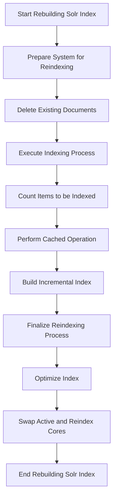

This document will cover the process of rebuilding the Solr index, which includes:

1. Preparing the system for reindexing
2. Executing the indexing process
3. Finalizing the reindexing process.

Technical document: <SwmLink doc-title="Rebuilding the Solr Index">[Rebuilding the Solr Index](/.swm/rebuilding-the-solr-index.91jj9mk6.sw.md)</SwmLink>

# [Preparing the System for Reindexing](https://app.swimm.io/repos/Z2l0aHViJTNBJTNBQnJvYWRsZWFmQ29tbWVyY2UtZGVtby1uZXclM0ElM0FTd2ltbS1EZW1v/docs/91jj9mk6#pre-build-index)

The first step in rebuilding the Solr index is to prepare the system. This involves deleting all existing documents in the reindex collection. This ensures that the new index starts from a clean state, preventing any old or irrelevant data from being included in the new index.

# [Executing the Indexing Process](https://app.swimm.io/repos/Z2l0aHViJTNBJTNBQnJvYWRsZWFmQ29tbWVyY2UtZGVtby1uZXclM0ElM0FTd2ltbS1EZW1v/docs/91jj9mk6#buildindex)

The next step is to execute the indexing process. This involves several sub-steps:

1. **Count Items to be Indexed**: The system counts the total number of items that need to be indexed. This helps in planning the indexing process and estimating the time required.

2. **Perform Cached Operation**: The indexing process is executed within a cached context to improve performance. This means that the system temporarily stores data in a cache to speed up the indexing process.

3. **Build Incremental Index**: The system processes the items to be indexed in manageable chunks or pages. For each page, it reads the items, indexes them, and then moves on to the next page. This ensures that the system can handle large volumes of data without running into memory issues.

# [Finalizing the Reindexing Process](https://app.swimm.io/repos/Z2l0aHViJTNBJTNBQnJvYWRsZWFmQ29tbWVyY2UtZGVtby1uZXclM0ElM0FTd2ltbS1EZW1v/docs/91jj9mk6#post-build-index)

The final step is to finalize the reindexing process. This involves two main actions:

1. **Optimize Index**: If optimization is enabled, the system optimizes the new index. This step improves the performance of search operations by reorganizing the index data.

2. **Swap Active and Reindex Cores**: The system swaps the active and reindex cores, making the new index live. This means that the new index will be used for all search operations, ensuring that users get the most up-to-date search results.

&nbsp;

*This is an auto-generated document by Swimm AI 🌊 and has not yet been verified by a human*

<SwmMeta version="3.0.0" repo-id="Z2l0aHViJTNBJTNBQnJvYWRsZWFmQ29tbWVyY2UtZGVtby1uZXclM0ElM0FTd2ltbS1EZW1v" repo-name="BroadleafCommerce-demo-new" doc-type="product-flows">Powered by [Swimm](/)</SwmMeta>
