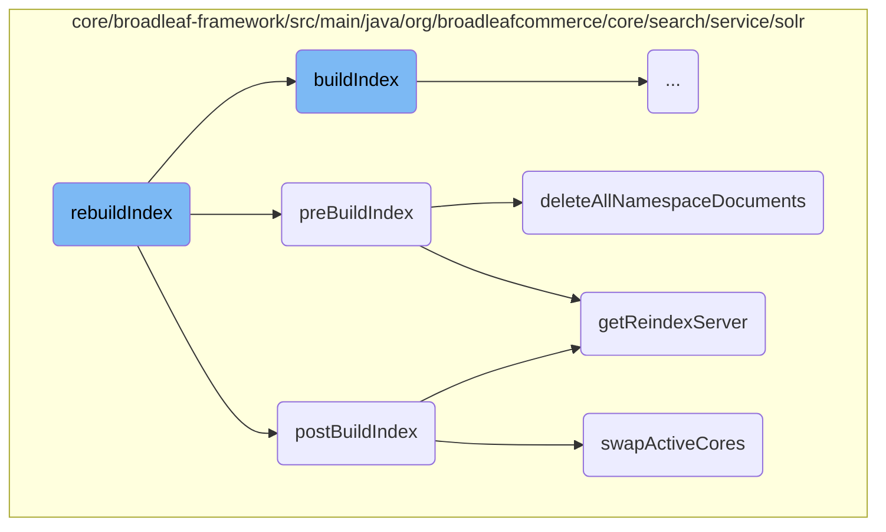
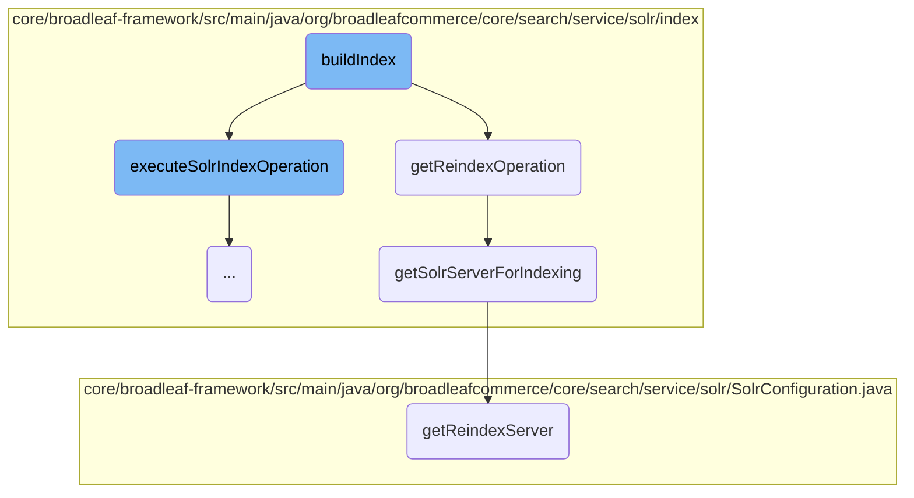

```mermaid
graph TD;
      subgraph core/broadleaf-framework/src/main/java/org/broadleafcommerce/core/search/service/solr/index/SolrIndexServiceImpl.java
40ae5eb80cbcc3fe1f38c3dd70bbc78b1cad0fb3ec918f52b1cf04e780ca4ad1(executeSolrIndexOperation):::mainFlowStyle --> f93a92d9be724c4fd9a215136ed4de8b0229ac5eee085abb3a266441ff7f9fad(performCachedOperation):::mainFlowStyle
end

subgraph core/broadleaf-framework/src/main/java/org/broadleafcommerce/core/search/service/solr/index/SolrIndexServiceImpl.java
f93a92d9be724c4fd9a215136ed4de8b0229ac5eee085abb3a266441ff7f9fad(performCachedOperation):::mainFlowStyle --> 6cbffdb9c9a49b248f18c6cb7f45973bced59067a215c925f371faeb98a7c846(execute):::mainFlowStyle
end

subgraph core/broadleaf-framework/src/main/java/org/broadleafcommerce/core/search/service/solr/index/SolrIndexServiceImpl.java
6cbffdb9c9a49b248f18c6cb7f45973bced59067a215c925f371faeb98a7c846(execute):::mainFlowStyle --> 9c12e46c8da913d06ec86bcbcf635bc1045678e008ac273f8a3cd8805a39f162(buildIncrementalIndex):::mainFlowStyle
end

subgraph core/broadleaf-framework/src/main/java/org/broadleafcommerce/core/search/service/solr/index/SolrIndexServiceImpl.java
9c12e46c8da913d06ec86bcbcf635bc1045678e008ac273f8a3cd8805a39f162(buildIncrementalIndex):::mainFlowStyle --> bdb1e9cb79c3b3fa875f2b16826fec06666c46b04d5a4e4572f2f2f0d28e31ab(buildPage):::mainFlowStyle
end


      classDef mainFlowStyle color:#000000,fill:#7CB9F4
classDef rootsStyle color:#000000,fill:#00FFF4
classDef Style1 color:#000000,fill:#00FFAA
classDef Style2 color:#000000,fill:#FFFF00
classDef Style3 color:#000000,fill:#AA7CB9

%% Swimm:
%% graph TD;
%%       subgraph <SwmPath>[core/broadleaf-framework/src/main/java/org/broadleafcommerce/core/search/service/solr/index/SolrIndexServiceImpl.java](core/broadleaf-framework/src/main/java/org/broadleafcommerce/core/search/service/solr/index/SolrIndexServiceImpl.java)</SwmPath>
%% 40ae5eb80cbcc3fe1f38c3dd70bbc78b1cad0fb3ec918f52b1cf04e780ca4ad1(executeSolrIndexOperation):::mainFlowStyle --> f93a92d9be724c4fd9a215136ed4de8b0229ac5eee085abb3a266441ff7f9fad(performCachedOperation):::mainFlowStyle
%% end
%% 
%% subgraph <SwmPath>[core/broadleaf-framework/src/main/java/org/broadleafcommerce/core/search/service/solr/index/SolrIndexServiceImpl.java](core/broadleaf-framework/src/main/java/org/broadleafcommerce/core/search/service/solr/index/SolrIndexServiceImpl.java)</SwmPath>
%% f93a92d9be724c4fd9a215136ed4de8b0229ac5eee085abb3a266441ff7f9fad(performCachedOperation):::mainFlowStyle --> 6cbffdb9c9a49b248f18c6cb7f45973bced59067a215c925f371faeb98a7c846(execute):::mainFlowStyle
%% end
%% 
%% subgraph <SwmPath>[core/broadleaf-framework/src/main/java/org/broadleafcommerce/core/search/service/solr/index/SolrIndexServiceImpl.java](core/broadleaf-framework/src/main/java/org/broadleafcommerce/core/search/service/solr/index/SolrIndexServiceImpl.java)</SwmPath>
%% 6cbffdb9c9a49b248f18c6cb7f45973bced59067a215c925f371faeb98a7c846(execute):::mainFlowStyle --> 9c12e46c8da913d06ec86bcbcf635bc1045678e008ac273f8a3cd8805a39f162(buildIncrementalIndex):::mainFlowStyle
%% end
%% 
%% subgraph <SwmPath>[core/broadleaf-framework/src/main/java/org/broadleafcommerce/core/search/service/solr/index/SolrIndexServiceImpl.java](core/broadleaf-framework/src/main/java/org/broadleafcommerce/core/search/service/solr/index/SolrIndexServiceImpl.java)</SwmPath>
%% 9c12e46c8da913d06ec86bcbcf635bc1045678e008ac273f8a3cd8805a39f162(buildIncrementalIndex):::mainFlowStyle --> bdb1e9cb79c3b3fa875f2b16826fec06666c46b04d5a4e4572f2f2f0d28e31ab(buildPage):::mainFlowStyle
%% end
%% 
%% 
%%       classDef mainFlowStyle color:#000000,fill:#7CB9F4
%% classDef rootsStyle color:#000000,fill:#00FFF4
%% classDef Style1 color:#000000,fill:#00FFAA
%% classDef Style2 color:#000000,fill:#FFFF00
%% classDef Style3 color:#000000,fill:#AA7CB9
```

In this document, we will explain the process of rebuilding the Solr index. The process involves several steps to ensure that the index is properly rebuilt and optimized for search operations.

The flow starts with the <SwmToken path="core/broadleaf-framework/src/main/java/org/broadleafcommerce/core/search/service/solr/index/SolrIndexServiceImpl.java" pos="180:5:5" line-data="    public void rebuildIndex() throws ServiceException, IOException {">`rebuildIndex`</SwmToken> method, which orchestrates the entire process. It begins by logging the start of the process and then calls the <SwmToken path="core/broadleaf-framework/src/main/java/org/broadleafcommerce/core/search/service/solr/index/SolrIndexServiceImpl.java" pos="184:1:1" line-data="        preBuildIndex();">`preBuildIndex`</SwmToken> method to prepare the system by deleting all documents in the reindex collection. Next, the <SwmToken path="core/broadleaf-framework/src/main/java/org/broadleafcommerce/core/search/service/solr/index/SolrIndexServiceImpl.java" pos="185:1:1" line-data="        buildIndex();">`buildIndex`</SwmToken> method is called to initiate the actual indexing process. This involves executing the Solr index operation, which includes obtaining a lock, counting the items to be indexed, and performing the indexing in a cached context. After the indexing is complete, the <SwmToken path="core/broadleaf-framework/src/main/java/org/broadleafcommerce/core/search/service/solr/index/SolrIndexServiceImpl.java" pos="186:1:1" line-data="        postBuildIndex();">`postBuildIndex`</SwmToken> method is called to finalize the process. This includes optimizing the index if enabled and swapping the active and reindex cores to make the new index live. Finally, the process logs the completion time.

Here is a high level diagram of the flow, showing only the most important functions:

```mermaid
graph TD;
      subgraph core/broadleaf-framework/src/main/java/org/broadleafcommerce/core/search/service/solr/index
34bd5e04a4a676fc8c32c1ca7d48b4545c96d395b3f5cf1191709cf1745a888c(rebuildIndex):::mainFlowStyle --> 130ea198fad176d0cc032e7d9951c92714dee1ecb7276ead541bf1e60752c468(postBuildIndex)
end

subgraph core/broadleaf-framework/src/main/java/org/broadleafcommerce/core/search/service/solr/index
34bd5e04a4a676fc8c32c1ca7d48b4545c96d395b3f5cf1191709cf1745a888c(rebuildIndex):::mainFlowStyle --> 2310a1743a641cc2d8caa6b5e27f13df743548b8c2a19989b41b8d5a06899d98(preBuildIndex)
end

subgraph core/broadleaf-framework/src/main/java/org/broadleafcommerce/core/search/service/solr/index
34bd5e04a4a676fc8c32c1ca7d48b4545c96d395b3f5cf1191709cf1745a888c(rebuildIndex):::mainFlowStyle --> 0aa7a3587c560d8eb0bd27bb42c3593226d289a4dbf08c9fefa0a9f2a427e1ef(buildIndex):::mainFlowStyle
end

subgraph core/broadleaf-framework/src/main/java/org/broadleafcommerce/core/search/service/solr/index
0aa7a3587c560d8eb0bd27bb42c3593226d289a4dbf08c9fefa0a9f2a427e1ef(buildIndex):::mainFlowStyle --> 158a030321f6aa06262c501d333612c1d6dd84e3f05e33e0204010fddf809982(getReindexOperation)
end

subgraph core/broadleaf-framework/src/main/java/org/broadleafcommerce/core/search/service/solr/index
0aa7a3587c560d8eb0bd27bb42c3593226d289a4dbf08c9fefa0a9f2a427e1ef(buildIndex):::mainFlowStyle --> 40ae5eb80cbcc3fe1f38c3dd70bbc78b1cad0fb3ec918f52b1cf04e780ca4ad1(executeSolrIndexOperation):::mainFlowStyle
end

subgraph core/broadleaf-framework/src/main/java/org/broadleafcommerce/core/search/service/solr/index
40ae5eb80cbcc3fe1f38c3dd70bbc78b1cad0fb3ec918f52b1cf04e780ca4ad1(executeSolrIndexOperation):::mainFlowStyle --> f93a92d9be724c4fd9a215136ed4de8b0229ac5eee085abb3a266441ff7f9fad(performCachedOperation):::mainFlowStyle
end

subgraph core/broadleaf-framework/src/main/java/org/broadleafcommerce/core/search/service/solr/index
f93a92d9be724c4fd9a215136ed4de8b0229ac5eee085abb3a266441ff7f9fad(performCachedOperation):::mainFlowStyle --> 6cbffdb9c9a49b248f18c6cb7f45973bced59067a215c925f371faeb98a7c846(execute):::mainFlowStyle
end

subgraph core/broadleaf-framework/src/main/java/org/broadleafcommerce/core/search/service/solr/index
6cbffdb9c9a49b248f18c6cb7f45973bced59067a215c925f371faeb98a7c846(execute):::mainFlowStyle --> 9c12e46c8da913d06ec86bcbcf635bc1045678e008ac273f8a3cd8805a39f162(buildIncrementalIndex):::mainFlowStyle
end

subgraph core/broadleaf-framework/src/main/java/org/broadleafcommerce/core/search/service/solr/index
9c12e46c8da913d06ec86bcbcf635bc1045678e008ac273f8a3cd8805a39f162(buildIncrementalIndex):::mainFlowStyle --> bdb1e9cb79c3b3fa875f2b16826fec06666c46b04d5a4e4572f2f2f0d28e31ab(buildPage):::mainFlowStyle
end

subgraph core/broadleaf-framework/src/main/java/org/broadleafcommerce/core/search/service/solr/index
bdb1e9cb79c3b3fa875f2b16826fec06666c46b04d5a4e4572f2f2f0d28e31ab(buildPage):::mainFlowStyle --> e17b63747fa7a2e8b6f620f7443255e6a4744d3744a8f788050e2b2a1050074e(getSolrServerForIndexing)
end


      classDef mainFlowStyle color:#000000,fill:#7CB9F4
classDef rootsStyle color:#000000,fill:#00FFF4
classDef Style1 color:#000000,fill:#00FFAA
classDef Style2 color:#000000,fill:#FFFF00
classDef Style3 color:#000000,fill:#AA7CB9

%% Swimm:
%% graph TD;
%%       subgraph <SwmPath>[core/broadleaf-framework/src/main/java/org/broadleafcommerce/core/search/service/solr/index/](core/broadleaf-framework/src/main/java/org/broadleafcommerce/core/search/service/solr/index/)</SwmPath>
%% 34bd5e04a4a676fc8c32c1ca7d48b4545c96d395b3f5cf1191709cf1745a888c(rebuildIndex):::mainFlowStyle --> 130ea198fad176d0cc032e7d9951c92714dee1ecb7276ead541bf1e60752c468(postBuildIndex)
%% end
%% 
%% subgraph <SwmPath>[core/broadleaf-framework/src/main/java/org/broadleafcommerce/core/search/service/solr/index/](core/broadleaf-framework/src/main/java/org/broadleafcommerce/core/search/service/solr/index/)</SwmPath>
%% 34bd5e04a4a676fc8c32c1ca7d48b4545c96d395b3f5cf1191709cf1745a888c(rebuildIndex):::mainFlowStyle --> 2310a1743a641cc2d8caa6b5e27f13df743548b8c2a19989b41b8d5a06899d98(preBuildIndex)
%% end
%% 
%% subgraph <SwmPath>[core/broadleaf-framework/src/main/java/org/broadleafcommerce/core/search/service/solr/index/](core/broadleaf-framework/src/main/java/org/broadleafcommerce/core/search/service/solr/index/)</SwmPath>
%% 34bd5e04a4a676fc8c32c1ca7d48b4545c96d395b3f5cf1191709cf1745a888c(rebuildIndex):::mainFlowStyle --> 0aa7a3587c560d8eb0bd27bb42c3593226d289a4dbf08c9fefa0a9f2a427e1ef(buildIndex):::mainFlowStyle
%% end
%% 
%% subgraph <SwmPath>[core/broadleaf-framework/src/main/java/org/broadleafcommerce/core/search/service/solr/index/](core/broadleaf-framework/src/main/java/org/broadleafcommerce/core/search/service/solr/index/)</SwmPath>
%% 0aa7a3587c560d8eb0bd27bb42c3593226d289a4dbf08c9fefa0a9f2a427e1ef(buildIndex):::mainFlowStyle --> 158a030321f6aa06262c501d333612c1d6dd84e3f05e33e0204010fddf809982(getReindexOperation)
%% end
%% 
%% subgraph <SwmPath>[core/broadleaf-framework/src/main/java/org/broadleafcommerce/core/search/service/solr/index/](core/broadleaf-framework/src/main/java/org/broadleafcommerce/core/search/service/solr/index/)</SwmPath>
%% 0aa7a3587c560d8eb0bd27bb42c3593226d289a4dbf08c9fefa0a9f2a427e1ef(buildIndex):::mainFlowStyle --> 40ae5eb80cbcc3fe1f38c3dd70bbc78b1cad0fb3ec918f52b1cf04e780ca4ad1(executeSolrIndexOperation):::mainFlowStyle
%% end
%% 
%% subgraph <SwmPath>[core/broadleaf-framework/src/main/java/org/broadleafcommerce/core/search/service/solr/index/](core/broadleaf-framework/src/main/java/org/broadleafcommerce/core/search/service/solr/index/)</SwmPath>
%% 40ae5eb80cbcc3fe1f38c3dd70bbc78b1cad0fb3ec918f52b1cf04e780ca4ad1(executeSolrIndexOperation):::mainFlowStyle --> f93a92d9be724c4fd9a215136ed4de8b0229ac5eee085abb3a266441ff7f9fad(performCachedOperation):::mainFlowStyle
%% end
%% 
%% subgraph <SwmPath>[core/broadleaf-framework/src/main/java/org/broadleafcommerce/core/search/service/solr/index/](core/broadleaf-framework/src/main/java/org/broadleafcommerce/core/search/service/solr/index/)</SwmPath>
%% f93a92d9be724c4fd9a215136ed4de8b0229ac5eee085abb3a266441ff7f9fad(performCachedOperation):::mainFlowStyle --> 6cbffdb9c9a49b248f18c6cb7f45973bced59067a215c925f371faeb98a7c846(execute):::mainFlowStyle
%% end
%% 
%% subgraph <SwmPath>[core/broadleaf-framework/src/main/java/org/broadleafcommerce/core/search/service/solr/index/](core/broadleaf-framework/src/main/java/org/broadleafcommerce/core/search/service/solr/index/)</SwmPath>
%% 6cbffdb9c9a49b248f18c6cb7f45973bced59067a215c925f371faeb98a7c846(execute):::mainFlowStyle --> 9c12e46c8da913d06ec86bcbcf635bc1045678e008ac273f8a3cd8805a39f162(buildIncrementalIndex):::mainFlowStyle
%% end
%% 
%% subgraph <SwmPath>[core/broadleaf-framework/src/main/java/org/broadleafcommerce/core/search/service/solr/index/](core/broadleaf-framework/src/main/java/org/broadleafcommerce/core/search/service/solr/index/)</SwmPath>
%% 9c12e46c8da913d06ec86bcbcf635bc1045678e008ac273f8a3cd8805a39f162(buildIncrementalIndex):::mainFlowStyle --> bdb1e9cb79c3b3fa875f2b16826fec06666c46b04d5a4e4572f2f2f0d28e31ab(buildPage):::mainFlowStyle
%% end
%% 
%% subgraph <SwmPath>[core/broadleaf-framework/src/main/java/org/broadleafcommerce/core/search/service/solr/index/](core/broadleaf-framework/src/main/java/org/broadleafcommerce/core/search/service/solr/index/)</SwmPath>
%% bdb1e9cb79c3b3fa875f2b16826fec06666c46b04d5a4e4572f2f2f0d28e31ab(buildPage):::mainFlowStyle --> e17b63747fa7a2e8b6f620f7443255e6a4744d3744a8f788050e2b2a1050074e(getSolrServerForIndexing)
%% end
%% 
%% 
%%       classDef mainFlowStyle color:#000000,fill:#7CB9F4
%% classDef rootsStyle color:#000000,fill:#00FFF4
%% classDef Style1 color:#000000,fill:#00FFAA
%% classDef Style2 color:#000000,fill:#FFFF00
%% classDef Style3 color:#000000,fill:#AA7CB9
```



# Flow drill down

First, we'll zoom into this section of the flow:



<SwmSnippet path="/core/broadleaf-framework/src/main/java/org/broadleafcommerce/core/search/service/solr/index/SolrIndexServiceImpl.java" line="180">

---

## The <SwmToken path="core/broadleaf-framework/src/main/java/org/broadleafcommerce/core/search/service/solr/index/SolrIndexServiceImpl.java" pos="180:5:5" line-data="    public void rebuildIndex() throws ServiceException, IOException {">`rebuildIndex`</SwmToken> Flow

The <SwmToken path="core/broadleaf-framework/src/main/java/org/broadleafcommerce/core/search/service/solr/index/SolrIndexServiceImpl.java" pos="180:5:5" line-data="    public void rebuildIndex() throws ServiceException, IOException {">`rebuildIndex`</SwmToken> method orchestrates the entire process of rebuilding the Solr index. It logs the start of the process, calls <SwmToken path="core/broadleaf-framework/src/main/java/org/broadleafcommerce/core/search/service/solr/index/SolrIndexServiceImpl.java" pos="184:1:1" line-data="        preBuildIndex();">`preBuildIndex`</SwmToken>, <SwmToken path="core/broadleaf-framework/src/main/java/org/broadleafcommerce/core/search/service/solr/index/SolrIndexServiceImpl.java" pos="185:1:1" line-data="        buildIndex();">`buildIndex`</SwmToken>, and <SwmToken path="core/broadleaf-framework/src/main/java/org/broadleafcommerce/core/search/service/solr/index/SolrIndexServiceImpl.java" pos="186:1:1" line-data="        postBuildIndex();">`postBuildIndex`</SwmToken> methods in sequence, and logs the completion time.

```java
    public void rebuildIndex() throws ServiceException, IOException {
        LOG.info("Rebuilding the entire Solr index...");
        StopWatch s = new StopWatch();

        preBuildIndex();
        buildIndex();
        postBuildIndex();

        LOG.info(String.format("Finished building entire Solr index in %s", s.toLapString()));
    }
```

---

</SwmSnippet>

<SwmSnippet path="/core/broadleaf-framework/src/main/java/org/broadleafcommerce/core/search/service/solr/index/SolrIndexServiceImpl.java" line="191">

---

### Pre-Build Index

The <SwmToken path="core/broadleaf-framework/src/main/java/org/broadleafcommerce/core/search/service/solr/index/SolrIndexServiceImpl.java" pos="192:5:5" line-data="    public void preBuildIndex() throws ServiceException {">`preBuildIndex`</SwmToken> method prepares the system for a new index build by deleting all documents in the reindex collection. This ensures that the new index starts from a clean state.

```java
    @Override
    public void preBuildIndex() throws ServiceException {
        deleteAllNamespaceDocuments(solrConfiguration.getReindexCollectionName(), solrConfiguration.getReindexServer());
    }
```

---

</SwmSnippet>

<SwmSnippet path="/core/broadleaf-framework/src/main/java/org/broadleafcommerce/core/search/service/solr/index/SolrIndexServiceImpl.java" line="334">

---

#### Deleting All Namespace Documents

The <SwmToken path="core/broadleaf-framework/src/main/java/org/broadleafcommerce/core/search/service/solr/index/SolrIndexServiceImpl.java" pos="334:5:5" line-data="    public void deleteAllNamespaceDocuments(String collection, SolrClient server) throws ServiceException {">`deleteAllNamespaceDocuments`</SwmToken> method constructs a delete query to remove all documents from the specified collection and commits the changes to ensure the deletion is applied.

```java
    public void deleteAllNamespaceDocuments(String collection, SolrClient server) throws ServiceException {
        try {
            String deleteQuery = StringUtil.sanitize(shs.getNamespaceFieldName()) + ":(\"" 
                    + StringUtil.sanitize(solrConfiguration.getNamespace()) + "\")";
            LOG.debug("Deleting by query: " + deleteQuery);
            server.deleteByQuery(collection, deleteQuery);

            //Explicitly do a hard commit here since we just deleted the entire index
            server.commit(collection);
        } catch (Exception e) {
            if (ServiceException.class.isAssignableFrom(e.getClass())) {
                throw (ServiceException) e;
            }
            throw new ServiceException("Could not delete documents", e);
        }
    }
```

---

</SwmSnippet>

<SwmSnippet path="/core/broadleaf-framework/src/main/java/org/broadleafcommerce/core/search/service/solr/index/SolrIndexServiceImpl.java" line="202">

---

### Post-Build Index

The <SwmToken path="core/broadleaf-framework/src/main/java/org/broadleafcommerce/core/search/service/solr/index/SolrIndexServiceImpl.java" pos="202:5:5" line-data="    public void postBuildIndex() throws IOException, ServiceException {">`postBuildIndex`</SwmToken> method finalizes the index build process. If optimization is enabled, it optimizes the index. It also swaps the active and reindex cores to make the new index live.

```java
    public void postBuildIndex() throws IOException, ServiceException {
        if(optimizeEnabled) {
            // this is required to be at the very very very end after rebuilding the whole index
            optimizeIndex(solrConfiguration.getReindexCollectionName(), solrConfiguration.getReindexServer());
        }
        // Swap the active and the reindex cores
        if (!solrConfiguration.isSingleCoreMode()) {
            shs.swapActiveCores(solrConfiguration);
        }
    }
```

---

</SwmSnippet>

<SwmSnippet path="/core/broadleaf-framework/src/main/java/org/broadleafcommerce/core/search/service/solr/SolrHelperServiceImpl.java" line="161">

---

#### Swapping Active Cores

The <SwmToken path="core/broadleaf-framework/src/main/java/org/broadleafcommerce/core/search/service/solr/SolrHelperServiceImpl.java" pos="161:7:7" line-data="    public synchronized void swapActiveCores(SolrConfiguration solrConfiguration) throws ServiceException {">`swapActiveCores`</SwmToken> method handles the core swapping process. It reassigns the aliases for the primary and reindex collections, effectively making the new index the active one.

```java
    public synchronized void swapActiveCores(SolrConfiguration solrConfiguration) throws ServiceException {
        if (!isSolrConfigured) {
            return;
        }
        if (CloudSolrClient.class.isAssignableFrom(solrConfiguration.getServer().getClass()) && CloudSolrClient.class.isAssignableFrom(solrConfiguration.getReindexServer().getClass())) {
            CloudSolrClient primaryCloudClient = (CloudSolrClient) solrConfiguration.getServer();
            CloudSolrClient reindexCloudClient = (CloudSolrClient) solrConfiguration.getReindexServer();
            try {
                String queryAlias = solrConfiguration.getQueryCollectionName();
                String reindexAlias = solrConfiguration.getReindexCollectionName();
                primaryCloudClient.connect();
                Aliases aliases = primaryCloudClient.getZkStateReader().getAliases();
                Map<String, String> aliasCollectionMap = aliases.getCollectionAliasMap();
                if (aliasCollectionMap == null || !aliasCollectionMap.containsKey(queryAlias)
                        || !aliasCollectionMap.containsKey(reindexAlias)) {
                    throw new IllegalStateException("Could not determine the PRIMARY or REINDEX "
                            + "collection or collections from the Solr aliases.");
                }

                String primaryCollectionName = aliasCollectionMap.get(queryAlias);
                //Do this just in case primary is aliased to more than one collection
```

---

</SwmSnippet>

<SwmSnippet path="/core/broadleaf-framework/src/main/java/org/broadleafcommerce/core/search/service/solr/SolrConfiguration.java" line="273">

---

### Getting Reindex Server

The <SwmToken path="core/broadleaf-framework/src/main/java/org/broadleafcommerce/core/search/service/solr/SolrConfiguration.java" pos="273:5:5" line-data="    public SolrClient getReindexServer() {">`getReindexServer`</SwmToken> method returns the appropriate Solr server for reindexing based on the configuration, ensuring that the correct server is used during the index rebuild process.

```java
    public SolrClient getReindexServer() {
        if (isSiteCollections() && isSolrCloudMode()) {
            return getSiteReindexServer();
        }
        
        return isSingleCoreMode() ? primaryServer : reindexServer;
    }
```

---

</SwmSnippet>

Now, lets zoom into this section of the flow:



<SwmSnippet path="/core/broadleaf-framework/src/main/java/org/broadleafcommerce/core/search/service/solr/index/SolrIndexServiceImpl.java" line="196">

---

## <SwmToken path="core/broadleaf-framework/src/main/java/org/broadleafcommerce/core/search/service/solr/index/SolrIndexServiceImpl.java" pos="197:5:5" line-data="    public void buildIndex() throws IOException, ServiceException {">`buildIndex`</SwmToken>

The <SwmToken path="core/broadleaf-framework/src/main/java/org/broadleafcommerce/core/search/service/solr/index/SolrIndexServiceImpl.java" pos="197:5:5" line-data="    public void buildIndex() throws IOException, ServiceException {">`buildIndex`</SwmToken> method initiates the process of rebuilding the Solr index. It calls the <SwmToken path="core/broadleaf-framework/src/main/java/org/broadleafcommerce/core/search/service/solr/index/SolrIndexServiceImpl.java" pos="198:1:1" line-data="        executeSolrIndexOperation(getReindexOperation());">`executeSolrIndexOperation`</SwmToken> method, passing the result of <SwmToken path="core/broadleaf-framework/src/main/java/org/broadleafcommerce/core/search/service/solr/index/SolrIndexServiceImpl.java" pos="198:3:3" line-data="        executeSolrIndexOperation(getReindexOperation());">`getReindexOperation`</SwmToken> as an argument. This sets the stage for the reindexing operation by preparing the necessary configurations and operations.

```java
    @Override
    public void buildIndex() throws IOException, ServiceException {
        executeSolrIndexOperation(getReindexOperation());
    }
```

---

</SwmSnippet>

<SwmSnippet path="/core/broadleaf-framework/src/main/java/org/broadleafcommerce/core/search/service/solr/index/SolrIndexServiceImpl.java" line="213">

---

## <SwmToken path="core/broadleaf-framework/src/main/java/org/broadleafcommerce/core/search/service/solr/index/SolrIndexServiceImpl.java" pos="214:5:5" line-data="    public SolrIndexOperation getReindexOperation() {">`getReindexOperation`</SwmToken>

The <SwmToken path="core/broadleaf-framework/src/main/java/org/broadleafcommerce/core/search/service/solr/index/SolrIndexServiceImpl.java" pos="214:5:5" line-data="    public SolrIndexOperation getReindexOperation() {">`getReindexOperation`</SwmToken> method returns an instance of <SwmToken path="core/broadleaf-framework/src/main/java/org/broadleafcommerce/core/search/service/solr/index/SolrIndexServiceImpl.java" pos="215:5:5" line-data="        return new GlobalSolrFullReIndexOperation(this, solrConfiguration, shs, errorOnConcurrentReIndex) {">`GlobalSolrFullReIndexOperation`</SwmToken>, which is responsible for the full reindexing process. This operation includes reading all active indexables, counting the indexable items, and building the incremental index. The method <SwmToken path="core/broadleaf-framework/src/main/java/org/broadleafcommerce/core/search/service/solr/index/SolrIndexServiceImpl.java" pos="228:5:5" line-data="            public void buildPage(List&lt;? extends Indexable&gt; indexables) throws ServiceException {">`buildPage`</SwmToken> within this operation calls <SwmToken path="core/broadleaf-framework/src/main/java/org/broadleafcommerce/core/search/service/solr/index/SolrIndexServiceImpl.java" pos="229:1:1" line-data="                buildIncrementalIndex(getSolrCollectionForIndexing(), indexables, getSolrServerForIndexing());">`buildIncrementalIndex`</SwmToken>, utilizing the Solr server obtained from <SwmToken path="core/broadleaf-framework/src/main/java/org/broadleafcommerce/core/search/service/solr/index/SolrIndexServiceImpl.java" pos="229:11:11" line-data="                buildIncrementalIndex(getSolrCollectionForIndexing(), indexables, getSolrServerForIndexing());">`getSolrServerForIndexing`</SwmToken>.

```java
    @Override
    public SolrIndexOperation getReindexOperation() {
        return new GlobalSolrFullReIndexOperation(this, solrConfiguration, shs, errorOnConcurrentReIndex) {

            @Override
            public List<? extends Indexable> readIndexables(int pageSize, Long lastId) {
                return readAllActiveIndexables(pageSize, lastId);
            }

            @Override
            public Long countIndexables() {
                return countIndexableItems();
            }

            @Override
            public void buildPage(List<? extends Indexable> indexables) throws ServiceException {
                buildIncrementalIndex(getSolrCollectionForIndexing(), indexables, getSolrServerForIndexing());
            }
        };
```

---

</SwmSnippet>

<SwmSnippet path="/core/broadleaf-framework/src/main/java/org/broadleafcommerce/core/search/service/solr/index/GlobalSolrFullReIndexOperation.java" line="82">

---

### <SwmToken path="core/broadleaf-framework/src/main/java/org/broadleafcommerce/core/search/service/solr/index/GlobalSolrFullReIndexOperation.java" pos="83:5:5" line-data="    public SolrClient getSolrServerForIndexing() {">`getSolrServerForIndexing`</SwmToken>

The <SwmToken path="core/broadleaf-framework/src/main/java/org/broadleafcommerce/core/search/service/solr/index/GlobalSolrFullReIndexOperation.java" pos="83:5:5" line-data="    public SolrClient getSolrServerForIndexing() {">`getSolrServerForIndexing`</SwmToken> method retrieves the Solr server configuration specifically for reindexing purposes. This ensures that the reindexing operation is performed on the correct Solr server instance.

```java
    @Override
    public SolrClient getSolrServerForIndexing() {
        return solrConfiguration.getReindexServer();
    }
```

---

</SwmSnippet>

Now, lets zoom into this section of the flow:



<SwmSnippet path="/core/broadleaf-framework/src/main/java/org/broadleafcommerce/core/search/service/solr/index/SolrIndexServiceImpl.java" line="234">

---

## <SwmToken path="core/broadleaf-framework/src/main/java/org/broadleafcommerce/core/search/service/solr/index/SolrIndexServiceImpl.java" pos="235:5:5" line-data="    public void executeSolrIndexOperation(final SolrIndexOperation operation) throws ServiceException, IOException {">`executeSolrIndexOperation`</SwmToken>

The <SwmToken path="core/broadleaf-framework/src/main/java/org/broadleafcommerce/core/search/service/solr/index/SolrIndexServiceImpl.java" pos="235:5:5" line-data="    public void executeSolrIndexOperation(final SolrIndexOperation operation) throws ServiceException, IOException {">`executeSolrIndexOperation`</SwmToken> method is responsible for orchestrating the entire Solr indexing process. It starts by obtaining a lock to ensure that the indexing operation is not performed concurrently. It then logs the start of the operation and saves the current state. The method calculates the number of items to be indexed and logs this information. It then calls <SwmToken path="core/broadleaf-framework/src/main/java/org/broadleafcommerce/core/search/service/solr/index/SolrIndexServiceImpl.java" pos="169:5:5" line-data="    public void performCachedOperation(SolrIndexCachedOperation.CacheOperation cacheOperation) throws ServiceException {">`performCachedOperation`</SwmToken> to execute the indexing in a cached context, ensuring better performance. Inside this cached operation, it iterates through the items to be indexed, calling <SwmToken path="core/broadleaf-framework/src/main/java/org/broadleafcommerce/core/search/service/solr/index/SolrIndexServiceImpl.java" pos="229:1:1" line-data="                buildIncrementalIndex(getSolrCollectionForIndexing(), indexables, getSolrServerForIndexing());">`buildIncrementalIndex`</SwmToken> to process each page of items. Finally, it restores the state and releases the lock.

```java
    @Override
    public void executeSolrIndexOperation(final SolrIndexOperation operation) throws ServiceException, IOException {
        operation.obtainLock();

        try {
            LOG.info("Executing Indexing operation");
            StopWatch s = new StopWatch();

            Object[] pack = saveState();
            try {
                final Long numItemsToIndex;
                try {
                    operation.beforeCountIndexables();

                    numItemsToIndex = operation.countIndexables();
                } finally {
                    operation.afterCountIndexables();
                }

                if (LOG.isDebugEnabled()) {
                    LOG.debug("There are at most " + numItemsToIndex + " items to index");
```

---

</SwmSnippet>

<SwmSnippet path="/core/broadleaf-framework/src/main/java/org/broadleafcommerce/core/search/service/solr/index/SolrIndexServiceImpl.java" line="168">

---

### <SwmToken path="core/broadleaf-framework/src/main/java/org/broadleafcommerce/core/search/service/solr/index/SolrIndexServiceImpl.java" pos="169:5:5" line-data="    public void performCachedOperation(SolrIndexCachedOperation.CacheOperation cacheOperation) throws ServiceException {">`performCachedOperation`</SwmToken>

The <SwmToken path="core/broadleaf-framework/src/main/java/org/broadleafcommerce/core/search/service/solr/index/SolrIndexServiceImpl.java" pos="169:5:5" line-data="    public void performCachedOperation(SolrIndexCachedOperation.CacheOperation cacheOperation) throws ServiceException {">`performCachedOperation`</SwmToken> method sets up a caching context for the indexing operation. It initializes a new <SwmToken path="core/broadleaf-framework/src/main/java/org/broadleafcommerce/core/search/service/solr/index/SolrIndexServiceImpl.java" pos="171:1:1" line-data="            CatalogStructure cache = new CatalogStructure();">`CatalogStructure`</SwmToken> cache and sets it in the <SwmToken path="core/broadleaf-framework/src/main/java/org/broadleafcommerce/core/search/service/solr/index/SolrIndexServiceImpl.java" pos="169:7:7" line-data="    public void performCachedOperation(SolrIndexCachedOperation.CacheOperation cacheOperation) throws ServiceException {">`SolrIndexCachedOperation`</SwmToken>. The provided <SwmToken path="core/broadleaf-framework/src/main/java/org/broadleafcommerce/core/search/service/solr/index/SolrIndexServiceImpl.java" pos="169:9:9" line-data="    public void performCachedOperation(SolrIndexCachedOperation.CacheOperation cacheOperation) throws ServiceException {">`CacheOperation`</SwmToken> is then executed within this cached context. After the operation is complete, the cache is cleared to free up resources.

```java
    @Override
    public void performCachedOperation(SolrIndexCachedOperation.CacheOperation cacheOperation) throws ServiceException {
        try {
            CatalogStructure cache = new CatalogStructure();
            SolrIndexCachedOperation.setCache(cache);
            cacheOperation.execute();
        } finally {
            SolrIndexCachedOperation.clearCache();
        }
    }
```

---

</SwmSnippet>

<SwmSnippet path="/core/broadleaf-framework/src/main/java/org/broadleafcommerce/core/search/service/solr/index/SolrIndexServiceImpl.java" line="258">

---

### execute

The <SwmToken path="core/broadleaf-framework/src/main/java/org/broadleafcommerce/core/search/service/solr/index/SolrIndexServiceImpl.java" pos="259:5:5" line-data="                    public void execute() throws ServiceException {">`execute`</SwmToken> method is called within the <SwmToken path="core/broadleaf-framework/src/main/java/org/broadleafcommerce/core/search/service/solr/index/SolrIndexServiceImpl.java" pos="169:5:5" line-data="    public void performCachedOperation(SolrIndexCachedOperation.CacheOperation cacheOperation) throws ServiceException {">`performCachedOperation`</SwmToken> to handle the actual indexing logic. It iterates through the items to be indexed, processing them in pages. For each page, it logs the progress and calls <SwmToken path="core/broadleaf-framework/src/main/java/org/broadleafcommerce/core/search/service/solr/index/SolrIndexServiceImpl.java" pos="269:5:5" line-data="                            lastId = buildIncrementalIndex(pageSize, lastId, operation);">`buildIncrementalIndex`</SwmToken> to index the items in that page. This method ensures that the entire set of items is indexed in manageable chunks.

```java
                    @Override
                    public void execute() throws ServiceException {
                        int page = 1;
                        Long lastId = null;
                        Long remainingNumItemsToIndex = numItemsToIndex;
                        Long totalPages = getTotalPageCount(numItemsToIndex);

                        while (remainingNumItemsToIndex > 0) {
                            String pageNumberMessage = buildPageNumberMessage(page, totalPages);
                            LOG.info(pageNumberMessage);

                            lastId = buildIncrementalIndex(pageSize, lastId, operation);
                            remainingNumItemsToIndex -= pageSize;
                            page++;
                        }
                    }
```

---

</SwmSnippet>

<SwmSnippet path="/core/broadleaf-framework/src/main/java/org/broadleafcommerce/core/search/service/solr/index/SolrIndexServiceImpl.java" line="363">

---

### <SwmToken path="core/broadleaf-framework/src/main/java/org/broadleafcommerce/core/search/service/solr/index/SolrIndexServiceImpl.java" pos="363:5:5" line-data="    protected Long buildIncrementalIndex(int pageSize, Long lastId, SolrIndexOperation operation) throws ServiceException {">`buildIncrementalIndex`</SwmToken>

The <SwmToken path="core/broadleaf-framework/src/main/java/org/broadleafcommerce/core/search/service/solr/index/SolrIndexServiceImpl.java" pos="363:5:5" line-data="    protected Long buildIncrementalIndex(int pageSize, Long lastId, SolrIndexOperation operation) throws ServiceException {">`buildIncrementalIndex`</SwmToken> method handles the indexing of a single page of items. It starts a new transaction and reads the items to be indexed for the current page. It then calls <SwmToken path="core/broadleaf-framework/src/main/java/org/broadleafcommerce/core/search/service/solr/index/SolrIndexServiceImpl.java" pos="228:5:5" line-data="            public void buildPage(List&lt;? extends Indexable&gt; indexables) throws ServiceException {">`buildPage`</SwmToken> to index these items. The method ensures that the transaction is properly finalized, committing the changes if successful or rolling back in case of an error. It returns the ID of the last indexed item to keep track of progress.

```java
    protected Long buildIncrementalIndex(int pageSize, Long lastId, SolrIndexOperation operation) throws ServiceException {
        TransactionStatus status = TransactionUtils.createTransaction("readItemsToIndex",
            TransactionDefinition.PROPAGATION_REQUIRED, transactionManager, true);
        if (SolrIndexCachedOperation.getCache() == null) {
            LOG.warn("Consider using SolrIndexService.performCachedOperation() in combination with " +
                    "SolrIndexService.buildIncrementalIndex() for better caching performance during solr indexing");
        }
        Long response = null;
        try {
            List<? extends Indexable> indexables;
            try {
                operation.beforeReadIndexables();
                indexables = operation.readIndexables(pageSize, lastId);
                if (CollectionUtils.isNotEmpty(indexables)) {
                    response = indexables.get(indexables.size()-1).getId();
                }
            } finally {
                operation.afterReadIndexables();
            }

            try {
```

---

</SwmSnippet>

<SwmSnippet path="/core/broadleaf-framework/src/main/java/org/broadleafcommerce/core/search/service/solr/index/SolrIndexServiceImpl.java" line="227">

---

### <SwmToken path="core/broadleaf-framework/src/main/java/org/broadleafcommerce/core/search/service/solr/index/SolrIndexServiceImpl.java" pos="228:5:5" line-data="            public void buildPage(List&lt;? extends Indexable&gt; indexables) throws ServiceException {">`buildPage`</SwmToken>

The <SwmToken path="core/broadleaf-framework/src/main/java/org/broadleafcommerce/core/search/service/solr/index/SolrIndexServiceImpl.java" pos="228:5:5" line-data="            public void buildPage(List&lt;? extends Indexable&gt; indexables) throws ServiceException {">`buildPage`</SwmToken> method is responsible for indexing a list of <SwmToken path="core/broadleaf-framework/src/main/java/org/broadleafcommerce/core/search/service/solr/index/SolrIndexServiceImpl.java" pos="228:12:12" line-data="            public void buildPage(List&lt;? extends Indexable&gt; indexables) throws ServiceException {">`Indexable`</SwmToken> items. It delegates the actual indexing to the <SwmToken path="core/broadleaf-framework/src/main/java/org/broadleafcommerce/core/search/service/solr/index/SolrIndexServiceImpl.java" pos="229:1:1" line-data="                buildIncrementalIndex(getSolrCollectionForIndexing(), indexables, getSolrServerForIndexing());">`buildIncrementalIndex`</SwmToken> method, passing the necessary parameters for the Solr collection and server. This method ensures that the items are properly indexed in Solr.

```java
            @Override
            public void buildPage(List<? extends Indexable> indexables) throws ServiceException {
                buildIncrementalIndex(getSolrCollectionForIndexing(), indexables, getSolrServerForIndexing());
            }
```

---

</SwmSnippet>

&nbsp;

*This is an auto-generated document by Swimm AI 🌊 and has not yet been verified by a human*

<SwmMeta version="3.0.0" repo-id="Z2l0aHViJTNBJTNBQnJvYWRsZWFmQ29tbWVyY2UtZGVtby1uZXclM0ElM0FTd2ltbS1EZW1v" repo-name="BroadleafCommerce-demo-new" doc-type="flows"><sup>Powered by [Swimm](/)</sup></SwmMeta>
