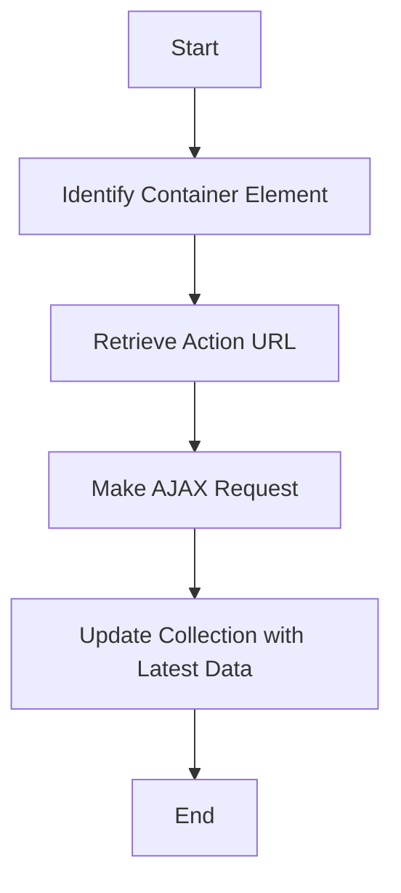

This document will cover the process of refreshing collection data, which includes:

1. Identifying the container element
2. Retrieving the action URL
3. Making an AJAX request to update the collection.

Technical document: <SwmLink doc-title="Refreshing Collection Data Flow">[Refreshing Collection Data Flow](/.swm/refreshing-collection-data-flow.ribna7nz.sw.md)</SwmLink>

# [Identifying the Container Element](https://app.swimm.io/repos/Z2l0aHViJTNBJTNBQnJvYWRsZWFmQ29tbWVyY2UtZGVtby1uZXclM0ElM0FTd2ltbS1EZW1v/docs/ribna7nz#refreshing-the-collection-data)

The first step in refreshing the collection data is to identify the container element that holds the collection. This is done by locating the closest `.listgrid-container` element relative to the refresh button that was clicked. This container element is crucial as it defines the scope of the data that needs to be refreshed.

# [Retrieving the Action URL](https://app.swimm.io/repos/Z2l0aHViJTNBJTNBQnJvYWRsZWFmQ29tbWVyY2UtZGVtby1uZXclM0ElM0FTd2ltbS1EZW1v/docs/ribna7nz#refreshing-the-collection-data)

Once the container element is identified, the next step is to retrieve the action URL. This URL is associated with the refresh button and is used to fetch the latest data for the collection. The action URL is stored as a data attribute on the refresh button, and it specifies the endpoint that will return the updated collection data.

# [Making an AJAX Request](https://app.swimm.io/repos/Z2l0aHViJTNBJTNBQnJvYWRsZWFmQ29tbWVyY2UtZGVtby1uZXclM0ElM0FTd2ltbS1EZW1v/docs/ribna7nz#refreshing-the-collection-data)

After retrieving the action URL, an AJAX request is made to fetch the latest data for the collection. This request is a GET request that includes any necessary parameters to filter or sort the data. Upon successful retrieval of the data, the existing collection is replaced with the new data. If a callback function is provided, it is executed after the data is updated. This ensures that the collection displayed to the user is always up-to-date with the latest information.

&nbsp;

*This is an auto-generated document by Swimm AI 🌊 and has not yet been verified by a human*

<SwmMeta version="3.0.0" repo-id="Z2l0aHViJTNBJTNBQnJvYWRsZWFmQ29tbWVyY2UtZGVtby1uZXclM0ElM0FTd2ltbS1EZW1v" repo-name="BroadleafCommerce-demo-new" doc-type="product-flows">Powered by [Swimm](/)</SwmMeta>
