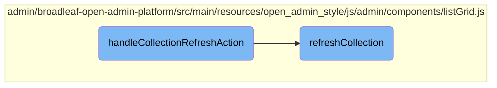

In this document, we will explain the process of refreshing a collection's data. The process involves identifying the relevant container, retrieving the action URL, and updating the data through an AJAX request.

The flow is straightforward and involves three main steps: identifying the container element that holds the collection, retrieving the URL for the data refresh action, and making an AJAX request to fetch and update the collection with the latest data.

# Flow drill down



<SwmSnippet path="/admin/broadleaf-open-admin-platform/src/main/resources/open_admin_style/js/admin/components/listGrid.js" line="146">

---

## Refreshing the collection data

The <SwmToken path="admin/broadleaf-open-admin-platform/src/main/resources/open_admin_style/js/admin/components/listGrid.js" pos="151:1:1" line-data="        handleCollectionRefreshAction: function ($actionButton) {">`handleCollectionRefreshAction`</SwmToken> function is responsible for initiating the refresh of a collection's data. It retrieves the closest <SwmToken path="admin/broadleaf-open-admin-platform/src/main/resources/open_admin_style/js/admin/components/listGrid.js" pos="152:14:17" line-data="            var $listGridContainer = $actionButton.closest(&quot;.listgrid-container&quot;);">`.listgrid-container`</SwmToken> element and the <SwmToken path="admin/broadleaf-open-admin-platform/src/main/resources/open_admin_style/js/admin/components/listGrid.js" pos="147:32:32" line-data="         * Refreshes the collection to have the latest available data according to the collection&#39;s &#39;actionurl&#39;">`actionurl`</SwmToken> from the refresh button, then calls <SwmToken path="admin/broadleaf-open-admin-platform/src/main/resources/open_admin_style/js/admin/components/listGrid.js" pos="155:5:5" line-data="            BLCAdmin.listGrid.refreshCollection($listGridContainer, actionUrl);">`refreshCollection`</SwmToken> to update the data.

```javascript
        /**
         * Refreshes the collection to have the latest available data according to the collection's 'actionurl'
         *
         * @param {element} $actionButton - the refresh button
         */
        handleCollectionRefreshAction: function ($actionButton) {
            var $listGridContainer = $actionButton.closest(".listgrid-container");
            var actionUrl = $actionButton.data('actionurl');

            BLCAdmin.listGrid.refreshCollection($listGridContainer, actionUrl);
        },
```

---

</SwmSnippet>

<SwmSnippet path="/admin/broadleaf-open-admin-platform/src/main/resources/open_admin_style/js/admin/components/listGrid.js" line="158">

---

The <SwmToken path="admin/broadleaf-open-admin-platform/src/main/resources/open_admin_style/js/admin/components/listGrid.js" pos="169:1:1" line-data="        refreshCollection: function ($listGridContainer, url, callBack, callBackParams) {">`refreshCollection`</SwmToken> function performs the actual data refresh. It constructs the URL with necessary parameters and makes an AJAX GET request to fetch the latest data. Upon successful retrieval, it replaces the existing collection with the new data and executes any provided callback function.

```javascript
        /**
         * Refreshes the collection to have the latest available data according to the provided url
         *
         * Note: this is expecting to hit a Spring controller with the given url that returns
         *  a rendered collection using "views/standaloneListGrid"
         *
         * @param {element} $listGridContainer - the ListGrid collection's container element
         * @param {String} url - the url that will return the latest collection data
         * @param {function} callBack - callback to execute after AJAX call.
         * @param {element} callBackParams - Data to pass to callback function.
         */
        refreshCollection: function ($listGridContainer, url, callBack, callBackParams) {
            var params = BLCAdmin.filterBuilders.getListGridFiltersAsURLParams($listGridContainer);

            BLC.ajax({
                url: BLC.buildUrlWithParams(url, params),
                type: "GET"
            }, function (data) {
                BLCAdmin.listGrid.replaceRelatedCollection($(data));
                if(callBack) callBack(callBackParams);
            });
```

---

</SwmSnippet>

&nbsp;

*This is an auto-generated document by Swimm AI 🌊 and has not yet been verified by a human*

<SwmMeta version="3.0.0" repo-id="Z2l0aHViJTNBJTNBQnJvYWRsZWFmQ29tbWVyY2UtZGVtby1uZXclM0ElM0FTd2ltbS1EZW1v" repo-name="BroadleafCommerce-demo-new" doc-type="flows"><sup>Powered by [Swimm](/)</sup></SwmMeta>
