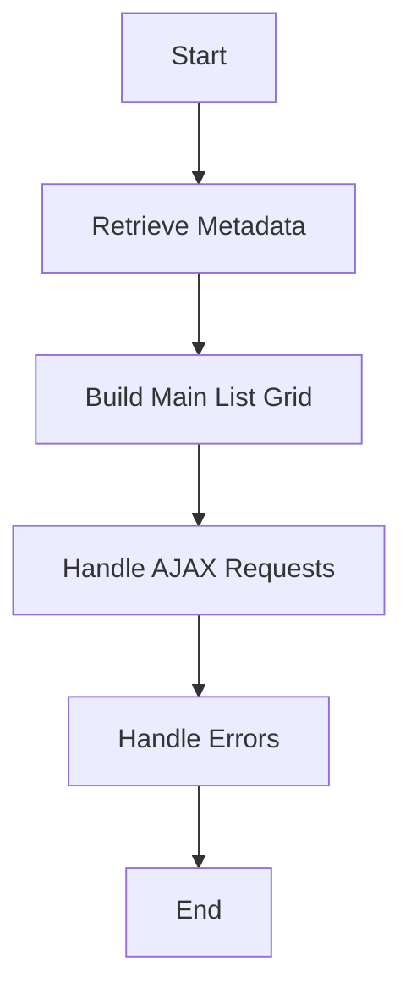

This document will cover the process of rendering the main entity listing, which includes:

1. Retrieving necessary metadata
2. Building the main list grid
3. Handling AJAX requests and errors.

Technical document: <SwmLink doc-title="Rendering the Main Entity Listing">[Rendering the Main Entity Listing](/.swm/rendering-the-main-entity-listing.v9egbyvt.sw.md)</SwmLink>

# [Retrieving Metadata](https://app.swimm.io/repos/Z2l0aHViJTNBJTNBQnJvYWRsZWFmQ29tbWVyY2UtZGVtby1uZXclM0ElM0FTd2ltbS1EZW1v/docs/v9egbyvt#viewentitylist)

The process begins with retrieving the necessary metadata for the main entity listing. This involves identifying the section key and class name, which are essential for fetching the correct data. The section key helps in determining the specific part of the application we are dealing with, while the class name identifies the type of entity we are working with. This step ensures that we have all the relevant information needed to display the main entity listing accurately.

# [Building the Main List Grid](https://app.swimm.io/repos/Z2l0aHViJTNBJTNBQnJvYWRsZWFmQ29tbWVyY2UtZGVtby1uZXclM0ElM0FTd2ltbS1EZW1v/docs/v9egbyvt#buildmainlistgrid)

Once the metadata is retrieved, the next step is to build the main list grid. This grid is a structured representation of the data, displaying it in a tabular format. The grid is constructed by iterating over the properties of the class metadata, creating header fields, and setting up the grid's attributes. The first column of the grid is configured to link to the main entity, allowing users to easily navigate to detailed views. Additionally, the grid's filter builder parameters are set up to enable users to filter the data based on various criteria. This step is crucial for presenting the data in an organized and user-friendly manner.

# [Handling AJAX Requests](https://app.swimm.io/repos/Z2l0aHViJTNBJTNBQnJvYWRsZWFmQ29tbWVyY2UtZGVtby1uZXclM0ElM0FTd2ltbS1EZW1v/docs/v9egbyvt#ajax)

AJAX requests are used to fetch data and ensure secure and consistent communication between the client and server. These requests are essential for dynamically updating the main entity listing without requiring a full page reload. The AJAX function sets default options, appends necessary parameters like CSRF tokens, and defines success and error handlers. This ensures that data is fetched efficiently and securely, providing a seamless user experience.

# [Handling Errors](https://app.swimm.io/repos/Z2l0aHViJTNBJTNBQnJvYWRsZWFmQ29tbWVyY2UtZGVtby1uZXclM0ElM0FTd2ltbS1EZW1v/docs/v9egbyvt#error)

In case of any errors during the AJAX requests, an error handling function is in place. This function is responsible for managing any issues that arise, ensuring that the user is informed of the error and that appropriate actions are taken to resolve it. Effective error handling is vital for maintaining the reliability and usability of the application.

&nbsp;

*This is an auto-generated document by Swimm AI 🌊 and has not yet been verified by a human*

<SwmMeta version="3.0.0" repo-id="Z2l0aHViJTNBJTNBQnJvYWRsZWFmQ29tbWVyY2UtZGVtby1uZXclM0ElM0FTd2ltbS1EZW1v" repo-name="BroadleafCommerce-demo-new" doc-type="product-flows">Powered by [Swimm](/)</SwmMeta>
