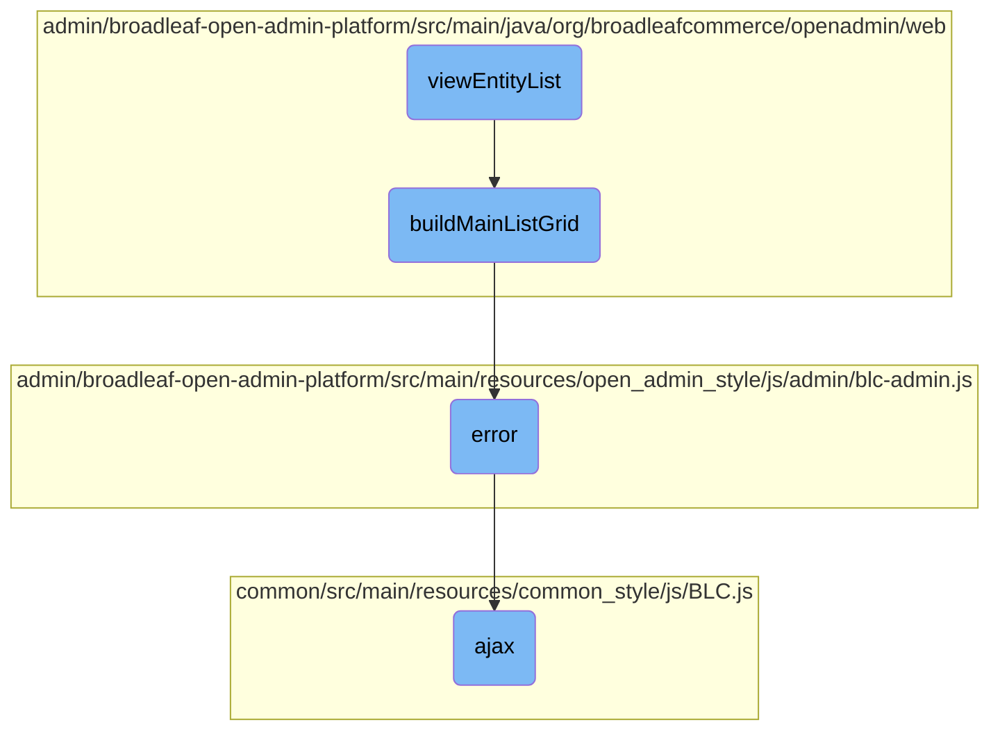

In this document, we will explain the process of rendering the main entity listing using the <SwmToken path="admin/broadleaf-open-admin-platform/src/main/java/org/broadleafcommerce/openadmin/web/controller/entity/AdminBasicEntityController.java" pos="172:5:5" line-data="    public String viewEntityList(HttpServletRequest request, HttpServletResponse response, Model model,">`viewEntityList`</SwmToken> method. This involves retrieving necessary metadata, building the main list grid, and handling AJAX requests and errors.

The flow starts with the <SwmToken path="admin/broadleaf-open-admin-platform/src/main/java/org/broadleafcommerce/openadmin/web/controller/entity/AdminBasicEntityController.java" pos="172:5:5" line-data="    public String viewEntityList(HttpServletRequest request, HttpServletResponse response, Model model,">`viewEntityList`</SwmToken> method, which retrieves the section key and class name, fetches metadata and records, and builds the main list grid. This grid is constructed by iterating over the class metadata properties and setting up the grid's attributes. If there are any errors during this process, they are handled by a predefined error function. AJAX requests are used to fetch data and ensure secure and consistent communication.

# Flow drill down



<SwmSnippet path="/admin/broadleaf-open-admin-platform/src/main/java/org/broadleafcommerce/openadmin/web/controller/entity/AdminBasicEntityController.java" line="171">

---

## Rendering the Main Entity Listing

The <SwmToken path="admin/broadleaf-open-admin-platform/src/main/java/org/broadleafcommerce/openadmin/web/controller/entity/AdminBasicEntityController.java" pos="172:5:5" line-data="    public String viewEntityList(HttpServletRequest request, HttpServletResponse response, Model model,">`viewEntityList`</SwmToken> method is responsible for rendering the main entity listing for a specified class. It retrieves the section key and class name, fetches metadata and records, and builds the main list grid using the <SwmToken path="admin/broadleaf-open-admin-platform/src/main/java/org/broadleafcommerce/openadmin/web/controller/entity/AdminBasicEntityController.java" pos="182:9:9" line-data="        ListGrid listGrid = formService.buildMainListGrid(drs, cmd, sectionKey, crumbs);">`buildMainListGrid`</SwmToken> method. It also sets up the model attributes required for the view.

```java
    @RequestMapping(value = "", method = RequestMethod.GET)
    public String viewEntityList(HttpServletRequest request, HttpServletResponse response, Model model,
            @PathVariable Map<String, String> pathVars,
            @RequestParam MultiValueMap<String, String> requestParams) throws Exception {
        String sectionKey = getSectionKey(pathVars);
        String sectionClassName = getClassNameForSection(sectionKey);
        List<SectionCrumb> crumbs = getSectionCrumbs(request, null, null);
        PersistencePackageRequest ppr = getSectionPersistencePackageRequest(sectionClassName, requestParams, crumbs, pathVars);
        ClassMetadata cmd = service.getClassMetadata(ppr).getDynamicResultSet().getClassMetaData();
        DynamicResultSet drs =  service.getRecords(ppr).getDynamicResultSet();

        ListGrid listGrid = formService.buildMainListGrid(drs, cmd, sectionKey, crumbs);
        listGrid.setSelectType(ListGrid.SelectType.NONE);

        Set<Field> headerFields = listGrid.getHeaderFields();
        if (CollectionUtils.isNotEmpty(headerFields)) {
            Field firstField = headerFields.iterator().next();
            if (requestParams.containsKey(firstField.getName())) {
                model.addAttribute("mainSearchTerm", requestParams.get(firstField.getName()).get(0));
            }
        }
```

---

</SwmSnippet>

<SwmSnippet path="/admin/broadleaf-open-admin-platform/src/main/java/org/broadleafcommerce/openadmin/web/service/FormBuilderServiceImpl.java" line="204">

---

## Building the Main List Grid

The <SwmToken path="admin/broadleaf-open-admin-platform/src/main/java/org/broadleafcommerce/openadmin/web/service/FormBuilderServiceImpl.java" pos="205:5:5" line-data="    public ListGrid buildMainListGrid(DynamicResultSet drs, ClassMetadata cmd, String sectionKey, List&lt;SectionCrumb&gt; sectionCrumbs)">`buildMainListGrid`</SwmToken> method constructs the main list grid by iterating over the properties of the class metadata, creating header fields, and setting up the list grid's attributes. It ensures that the first column can link to the main entity and configures the grid's filter builder parameters.

```java
    @Override
    public ListGrid buildMainListGrid(DynamicResultSet drs, ClassMetadata cmd, String sectionKey, List<SectionCrumb> sectionCrumbs)
            throws ServiceException {

        List<Field> headerFields = new ArrayList<>();
        ListGrid.Type type = ListGrid.Type.MAIN;
        String idProperty = "id";

        FieldWrapper wrapper = new FieldWrapper();
        ArrayList<FieldDTO> defaultWrapperFields = new ArrayList<>();
        for (Property p : cmd.getProperties()) {
            if (p.getMetadata() instanceof BasicFieldMetadata) {
                BasicFieldMetadata fmd = (BasicFieldMetadata) p.getMetadata();
                
                if (SupportedFieldType.ID.equals(fmd.getFieldType())) {
                    idProperty = fmd.getName();
                }
                
                if (fmd.isProminent() != null && fmd.isProminent() 
                        && !ArrayUtils.contains(getGridHiddenVisibilities(), fmd.getVisibility())) {
                    Field hf = createHeaderField(p, fmd);
```

---

</SwmSnippet>

<SwmSnippet path="/admin/broadleaf-open-admin-platform/src/main/resources/open_admin_style/js/admin/blc-admin.js" line="1180">

---

## Handling Errors

The <SwmToken path="admin/broadleaf-open-admin-platform/src/main/resources/open_admin_style/js/admin/blc-admin.js" pos="1180:1:1" line-data="                error: function (error) {">`error`</SwmToken> function is a placeholder for handling errors during AJAX requests. It is defined but not implemented in this snippet.

```javascript
                error: function (error) {
                }
```

---

</SwmSnippet>

<SwmSnippet path="/common/src/main/resources/common_style/js/BLC.js" line="135">

---

## Making AJAX Requests

The <SwmToken path="common/src/main/resources/common_style/js/BLC.js" pos="135:3:3" line-data="    function ajax(options, callback) {">`ajax`</SwmToken> function is a utility for making AJAX requests. It sets default options, appends necessary parameters like CSRF tokens, and defines success and error handlers. This function ensures that AJAX requests are made consistently and securely across the application.

```javascript
    function ajax(options, callback) {
        if (options.type == null) {
            options.type = 'GET';
        }

        var baseUrl = window.location.href;
        if (baseUrl.indexOf('isPostAdd') != -1) {
            if (options.url.indexOf('isPostAdd') < 0) {
                if (options.url.indexOf('?') > 0) {
                    options.url += "&";
                } else {
                    options.url += "?";
                }
                options.url += "isPostAdd=true";
            }
        }
        var savedCatalogElement = $('input[name ="catalogEntityCatalogDiscriminatorId"]');
        var savedCatalog=null;

        if(savedCatalogElement.length){
            //0 should be the one we need, other can be from the modal form
```

---

</SwmSnippet>

&nbsp;

*This is an auto-generated document by Swimm AI 🌊 and has not yet been verified by a human*

<SwmMeta version="3.0.0" repo-id="Z2l0aHViJTNBJTNBQnJvYWRsZWFmQ29tbWVyY2UtZGVtby1uZXclM0ElM0FTd2ltbS1EZW1v" repo-name="BroadleafCommerce-demo-new" doc-type="flows"><sup>Powered by [Swimm](/)</sup></SwmMeta>
